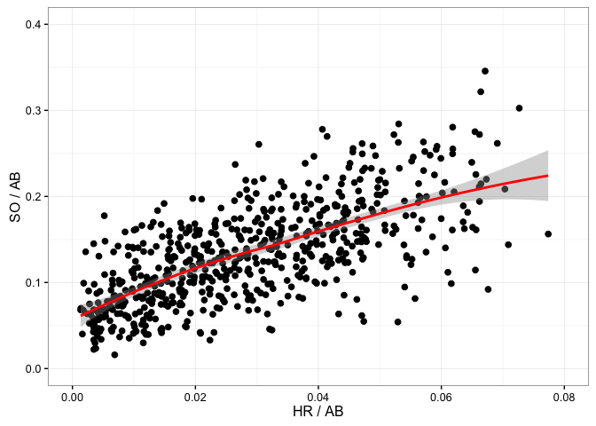
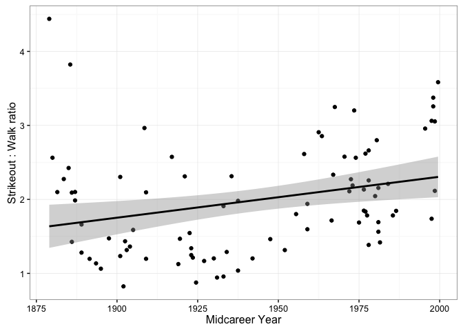

# tidy Baseball Chapter 2
C. A. Hamm  
`r format(Sys.Date())`  


### Beginning with Chapter 2, because Chapter 1 doesn't have much for us. 


### Load packages, set seed, and note which package versions we will use.

```r
library("Lahman")
library("dplyr"); options(dplyr.width = Inf)
```

```
## 
## Attaching package: 'dplyr'
```

```
## The following objects are masked from 'package:stats':
## 
##     filter, lag
```

```
## The following objects are masked from 'package:base':
## 
##     intersect, setdiff, setequal, union
```

```r
library("ggplot2")
library("devtools")
library("readr")

set.seed(8761825)
session_info()
```

```
## Session info --------------------------------------------------------------
```

```
##  setting  value                       
##  version  R version 3.3.1 (2016-06-21)
##  system   x86_64, darwin13.4.0        
##  ui       X11                         
##  language (EN)                        
##  collate  en_US.UTF-8                 
##  tz       America/Los_Angeles         
##  date     2016-09-24
```

```
## Packages ------------------------------------------------------------------
```

```
##  package    * version date       source        
##  assertthat   0.1     2013-12-06 CRAN (R 3.3.0)
##  colorspace   1.2-6   2015-03-11 CRAN (R 3.3.0)
##  DBI          0.5-1   2016-09-10 CRAN (R 3.3.0)
##  devtools   * 1.12.0  2016-06-24 CRAN (R 3.3.0)
##  digest       0.6.10  2016-08-02 CRAN (R 3.3.1)
##  dplyr      * 0.5.0   2016-06-24 CRAN (R 3.3.0)
##  evaluate     0.9     2016-04-29 CRAN (R 3.3.0)
##  formatR      1.4     2016-05-09 CRAN (R 3.3.0)
##  ggplot2    * 2.1.0   2016-03-01 CRAN (R 3.3.0)
##  gtable       0.2.0   2016-02-26 CRAN (R 3.3.0)
##  htmltools    0.3.5   2016-03-21 CRAN (R 3.3.0)
##  knitr        1.14    2016-08-13 CRAN (R 3.3.0)
##  Lahman     * 5.0-0   2016-08-27 CRAN (R 3.3.0)
##  magrittr     1.5     2014-11-22 CRAN (R 3.3.0)
##  memoise      1.0.0   2016-01-29 CRAN (R 3.3.0)
##  munsell      0.4.3   2016-02-13 CRAN (R 3.3.0)
##  plyr         1.8.4   2016-06-08 CRAN (R 3.3.0)
##  R6           2.1.3   2016-08-19 CRAN (R 3.3.0)
##  Rcpp         0.12.7  2016-09-05 CRAN (R 3.3.0)
##  readr      * 1.0.0   2016-08-03 CRAN (R 3.3.0)
##  rmarkdown    1.0     2016-07-08 CRAN (R 3.3.0)
##  scales       0.4.0   2016-02-26 CRAN (R 3.3.0)
##  stringi      1.1.1   2016-05-27 CRAN (R 3.3.0)
##  stringr      1.1.0   2016-08-19 CRAN (R 3.3.0)
##  tibble       1.2     2016-08-26 CRAN (R 3.3.0)
##  withr        1.0.2   2016-06-20 CRAN (R 3.3.0)
##  yaml         2.1.13  2014-06-12 CRAN (R 3.3.0)
```


```r
Spahn <- read_csv("https://raw.githubusercontent.com/maxtoki/baseball_R/master/data/spahn.csv", col_names = TRUE) # Note the "raw." to get the unformatted .csv
```

```
## Parsed with column specification:
## cols(
##   .default = col_integer(),
##   Tm = col_character(),
##   Lg = col_character(),
##   `W-L` = col_double(),
##   ERA = col_double(),
##   IP = col_double(),
##   WHIP = col_double(),
##   `H/9` = col_double(),
##   `HR/9` = col_double(),
##   `BB/9` = col_double(),
##   `SO/9` = col_double(),
##   `SO/BB` = col_double(),
##   Awards = col_character()
## )
```

```
## See spec(...) for full column specifications.
```

```r
# create the FIP stat
Spahn <- Spahn %>% 
  mutate(FIP = ((13 * HR) + (3 * BB) -2 * SO) / IP)
head(Spahn)
```

```
## # A tibble: 6 × 35
##    Year   Age    Tm    Lg     W     L `W-L`   ERA     G    GS    GF    CG
##   <int> <int> <chr> <chr> <int> <int> <dbl> <dbl> <int> <int> <int> <int>
## 1  1942    21   BSN    NL     0     0    NA  5.74     4     2     0     1
## 2  1946    25   BSN    NL     8     5 0.615  2.94    24    16     7     8
## 3  1947    26   BSN    NL    21    10 0.677  2.33    40    35     4    22
## 4  1948    27   BSN    NL    15    12 0.556  3.71    36    35     1    16
## 5  1949    28   BSN    NL    21    14 0.600  3.07    38    38     0    25
## 6  1950    29   BSN    NL    21    17 0.553  3.16    41    39     2    25
##     SHO    SV    IP     H     R    ER    HR    BB   IBB    SO   HBP    BK
##   <int> <int> <dbl> <int> <int> <int> <int> <int> <int> <int> <int> <int>
## 1     0     0  15.2    25    15    10     0    11    NA     7     0     0
## 2     0     1 125.2   107    46    41     6    36    NA    67     1     0
## 3     7     3 289.2   245    87    75    15    84    NA   123     1     0
## 4     3     1 257.0   237   115   106    19    77    NA   114     1     0
## 5     4     0 302.1   283   125   103    27    86    NA   151     3     0
## 6     1     1 293.0   248   123   103    22   111    NA   191     1     0
##      WP    BF `ERA+`  WHIP `H/9` `HR/9` `BB/9` `SO/9` `SO/BB`   Awards
##   <int> <int>  <int> <dbl> <dbl>  <dbl>  <dbl>  <dbl>   <dbl>    <chr>
## 1     0    79     59 2.298  14.4    0.0    6.3    4.0    0.64     <NA>
## 2     4   514    118 1.138   7.7    0.4    2.6    4.8    1.86     <NA>
## 3     5  1174    170 1.136   7.6    0.5    2.6    3.8    1.46 ASMVP-15
## 4     4  1064    105 1.222   8.3    0.7    2.7    4.0    1.48   MVP-14
## 5     4  1258    124 1.221   8.4    0.8    2.6    4.5    1.76  ASMVP-7
## 6     8  1217    122 1.225   7.6    0.7    3.4    5.9    1.72 ASMVP-18
##         FIP
##       <dbl>
## 1 1.2500000
## 2 0.4153355
## 3 0.6950207
## 4 0.9727626
## 5 1.0162198
## 6 0.8088737
```

```r
pos <- order(Spahn$FIP)
head(Spahn[pos, c("Year", "Age", "W", "L", "ERA", "FIP")])
```

```
## # A tibble: 6 × 6
##    Year   Age     W     L   ERA       FIP
##   <int> <int> <int> <int> <dbl>     <dbl>
## 1  1952    31    14    19  2.98 0.3448276
## 2  1953    32    23     7  2.10 0.3619910
## 3  1946    25     8     5  2.94 0.4153355
## 4  1959    38    21    15  2.96 0.6746575
## 5  1947    26    21    10  2.33 0.6950207
## 6  1956    35    20    11  2.78 0.8004269
```

```r
Spahn1 <- Spahn %>% filter(Tm == "BSN" | Tm == "MLN") %>% mutate(Tm = factor(Tm, levels = c("BSN", "MLN")))
head(Spahn1)
```

```
## # A tibble: 6 × 35
##    Year   Age     Tm    Lg     W     L `W-L`   ERA     G    GS    GF    CG
##   <int> <int> <fctr> <chr> <int> <int> <dbl> <dbl> <int> <int> <int> <int>
## 1  1942    21    BSN    NL     0     0    NA  5.74     4     2     0     1
## 2  1946    25    BSN    NL     8     5 0.615  2.94    24    16     7     8
## 3  1947    26    BSN    NL    21    10 0.677  2.33    40    35     4    22
## 4  1948    27    BSN    NL    15    12 0.556  3.71    36    35     1    16
## 5  1949    28    BSN    NL    21    14 0.600  3.07    38    38     0    25
## 6  1950    29    BSN    NL    21    17 0.553  3.16    41    39     2    25
##     SHO    SV    IP     H     R    ER    HR    BB   IBB    SO   HBP    BK
##   <int> <int> <dbl> <int> <int> <int> <int> <int> <int> <int> <int> <int>
## 1     0     0  15.2    25    15    10     0    11    NA     7     0     0
## 2     0     1 125.2   107    46    41     6    36    NA    67     1     0
## 3     7     3 289.2   245    87    75    15    84    NA   123     1     0
## 4     3     1 257.0   237   115   106    19    77    NA   114     1     0
## 5     4     0 302.1   283   125   103    27    86    NA   151     3     0
## 6     1     1 293.0   248   123   103    22   111    NA   191     1     0
##      WP    BF `ERA+`  WHIP `H/9` `HR/9` `BB/9` `SO/9` `SO/BB`   Awards
##   <int> <int>  <int> <dbl> <dbl>  <dbl>  <dbl>  <dbl>   <dbl>    <chr>
## 1     0    79     59 2.298  14.4    0.0    6.3    4.0    0.64     <NA>
## 2     4   514    118 1.138   7.7    0.4    2.6    4.8    1.86     <NA>
## 3     5  1174    170 1.136   7.6    0.5    2.6    3.8    1.46 ASMVP-15
## 4     4  1064    105 1.222   8.3    0.7    2.7    4.0    1.48   MVP-14
## 5     4  1258    124 1.221   8.4    0.8    2.6    4.5    1.76  ASMVP-7
## 6     8  1217    122 1.225   7.6    0.7    3.4    5.9    1.72 ASMVP-18
##         FIP
##       <dbl>
## 1 1.2500000
## 2 0.4153355
## 3 0.6950207
## 4 0.9727626
## 5 1.0162198
## 6 0.8088737
```

```r
by(Spahn1[, c("W-L", "ERA", "WHIP", "FIP")], Spahn1$Tm, summary)
```

```
## Spahn1$Tm: BSN
##       W-L              ERA             WHIP            FIP        
##  Min.   :0.4240   Min.   :2.330   Min.   :1.136   Min.   :0.3448  
##  1st Qu.:0.5545   1st Qu.:2.970   1st Qu.:1.154   1st Qu.:0.6251  
##  Median :0.6000   Median :3.025   Median :1.222   Median :0.8219  
##  Mean   :0.5766   Mean   :3.364   Mean   :1.331   Mean   :0.7922  
##  3rd Qu.:0.6130   3rd Qu.:3.297   3rd Qu.:1.230   3rd Qu.:0.9836  
##  Max.   :0.6770   Max.   :5.740   Max.   :2.298   Max.   :1.2500  
##  NA's   :1                                                        
## -------------------------------------------------------- 
## Spahn1$Tm: MLN
##       W-L              ERA             WHIP            FIP        
##  Min.   :0.3160   Min.   :2.100   Min.   :1.058   Min.   :0.3620  
##  1st Qu.:0.5780   1st Qu.:2.757   1st Qu.:1.123   1st Qu.:0.8345  
##  Median :0.6405   Median :3.030   Median :1.163   Median :0.9944  
##  Mean   :0.6202   Mean   :3.121   Mean   :1.187   Mean   :0.9839  
##  3rd Qu.:0.6695   3rd Qu.:3.170   3rd Qu.:1.226   3rd Qu.:1.0764  
##  Max.   :0.7670   Max.   :5.290   Max.   :1.474   Max.   :1.7263
```


```r
# Note, by loading the "Lahman" package we don't need to import the raw data. I have included the code to download the external file in case you want it
# Batting <- read_csv("https://raw.githubusercontent.com/maxtoki/baseball_R/master/data/Batting.csv", col_names = TRUE)
head(Batting)
```

```
##    playerID yearID stint teamID lgID  G  AB  R  H X2B X3B HR RBI SB CS BB
## 1 abercda01   1871     1    TRO   NA  1   4  0  0   0   0  0   0  0  0  0
## 2  addybo01   1871     1    RC1   NA 25 118 30 32   6   0  0  13  8  1  4
## 3 allisar01   1871     1    CL1   NA 29 137 28 40   4   5  0  19  3  1  2
## 4 allisdo01   1871     1    WS3   NA 27 133 28 44  10   2  2  27  1  1  0
## 5 ansonca01   1871     1    RC1   NA 25 120 29 39  11   3  0  16  6  2  2
## 6 armstbo01   1871     1    FW1   NA 12  49  9 11   2   1  0   5  0  1  0
##   SO IBB HBP SH SF GIDP
## 1  0  NA  NA NA NA   NA
## 2  0  NA  NA NA NA   NA
## 3  5  NA  NA NA NA   NA
## 4  2  NA  NA NA NA   NA
## 5  1  NA  NA NA NA   NA
## 6  1  NA  NA NA NA   NA
```

```r
dim(Batting)
```

```
## [1] 101332     22
```

```r
Batting.60 <- Batting %>% 
  filter(yearID >= 1960 & yearID <= 1969)
head(Batting.60)
```

```
##    playerID yearID stint teamID lgID   G  AB   R   H X2B X3B HR RBI SB CS
## 1 aaronha01   1960     1    ML1   NL 153 590 102 172  20  11 40 126 16  7
## 2 abernte02   1960     1    WS1   AL   2   1   1   1   0   0  0   0  0  0
## 3 adairje01   1960     1    BAL   AL   3   5   1   1   0   0  1   1  0  0
## 4 adcocjo01   1960     1    ML1   NL 138 514  55 153  21   4 25  91  2  2
## 5 aguirha01   1960     1    DET   AL  37  28   0   1   0   0  0   0  0  0
## 6 allisbo01   1960     1    WS1   AL 144 501  79 126  30   3 15  69 11  9
##   BB SO IBB HBP SH SF GIDP
## 1 60 63  13   2  0 12    8
## 2  0  0   0   0  0  0    0
## 3  0  0   0   0  0  0    0
## 4 46 86   7   1  5  4   13
## 5  0 19   0   0  2  0    0
## 6 92 94   4   2  5  4   14
```

```r
dim(Batting.60)
```

```
## [1] 7559   22
```

```r
max(Batting.60$yearID)
```

```
## [1] 1969
```

```r
min(Batting.60$yearID)
```

```
## [1] 1960
```

```r
compute.hr <- function(pid){
	d <- Batting.60 %>% 
	  filter(playerID == pid)
	sum(d$HR)
}

# The book way with multiple steps and a function:
players <- unique(Batting.60$playerID)
system.time(S <- sapply(players, compute.hr))
```

```
##    user  system elapsed 
##   2.036   0.009   2.045
```

```r
head(S)
```

```
## aaronha01 abernte02 adairje01 adcocjo01 aguirha01 allisbo01 
##       375         0        57       155         0       225
```

```r
length(S) #1786 players had home runs in the 1960's
```

```
## [1] 1786
```

```r
# The tidy way, one line of code, really fast:
system.time(S1 <- Batting.60 %>% 
              group_by(playerID) %>% 
              summarize(sum(HR)))
```

```
##    user  system elapsed 
##   0.012   0.000   0.012
```

```r
head(S1)
```

```
## # A tibble: 6 × 2
##    playerID `sum(HR)`
##       <chr>     <int>
## 1 aaronha01       375
## 2 aaronto01        11
## 3 abernte02         0
## 4 acklefr01         0
## 5 adairje01        57
## 6 adamsdo01         0
```

```r
dim(S1)
```

```
## [1] 1786    2
```

```r
# create a data frame 
dataframe.AB <- Batting %>% 
  select(playerID, AB, HR, SO) %>% 
  group_by(playerID) %>% 
  filter(!is.na(AB)) %>% 
  summarize(AB = sum(AB), HR = sum(HR), SO = sum(SO))

head(dataframe.AB)
```

```
## # A tibble: 6 × 4
##    playerID    AB    HR    SO
##       <chr> <int> <int> <int>
## 1 aardsda01     4     0     2
## 2 aaronha01 12364   755  1383
## 3 aaronto01   944    13   145
## 4  aasedo01     5     0     3
## 5  abadan01    21     0     5
## 6  abadfe01     8     0     4
```

```r
dim(dataframe.AB)
```

```
## [1] 18232     4
```

```r
# Note here that merging as described in the book makes no sense. Why add repeared rows of summarized data back to the original data frame "Batting"

Batting2 <- dplyr::full_join(Batting, dataframe.AB, by = "playerID")
head(Batting2)
```

```
##    playerID yearID stint teamID lgID  G AB.x  R  H X2B X3B HR.x RBI SB CS
## 1 abercda01   1871     1    TRO   NA  1    4  0  0   0   0    0   0  0  0
## 2  addybo01   1871     1    RC1   NA 25  118 30 32   6   0    0  13  8  1
## 3 allisar01   1871     1    CL1   NA 29  137 28 40   4   5    0  19  3  1
## 4 allisdo01   1871     1    WS3   NA 27  133 28 44  10   2    2  27  1  1
## 5 ansonca01   1871     1    RC1   NA 25  120 29 39  11   3    0  16  6  2
## 6 armstbo01   1871     1    FW1   NA 12   49  9 11   2   1    0   5  0  1
##   BB SO.x IBB HBP SH SF GIDP  AB.y HR.y SO.y
## 1  0    0  NA  NA NA NA   NA     4    0    0
## 2  4    0  NA  NA NA NA   NA  1231    1    7
## 3  2    5  NA  NA NA NA   NA   740    1   18
## 4  0    2  NA  NA NA NA   NA  1407    2   NA
## 5  2    1  NA  NA NA NA   NA 10277   97   NA
## 6  0    1  NA  NA NA NA   NA    49    0    1
```

```r
dim(Batting2)
```

```
## [1] 101332     25
```

```r
Batting.5000 <- dataframe.AB %>% filter(AB >= 5000)
dim(Batting.5000)
```

```
## [1] 758   4
```

```r
head(Batting.5000)
```

```
## # A tibble: 6 × 4
##    playerID    AB    HR    SO
##       <chr> <int> <int> <int>
## 1 aaronha01 12364   755  1383
## 2 abreubo01  8480   288  1840
## 3 adamssp01  5557     9   223
## 4 adcocjo01  6606   336  1059
## 5 alfoned01  5385   146   617
## 6 allendi01  6332   351  1556
```

```r
# This function "compute.hr" is now unnecessary, as we have already calculated the relevent statistics. See how, with one line of dplyr code, we can replace a function and other awkward subsetting.
Batting.5000 %>% filter(playerID == "aaronha01") %>% 
  summarize(AB = sum(AB, na.rm = TRUE), 
            HR = sum(HR, na.rm = TRUE), 
            SO = sum(AB, na.rm = TRUE))
```

```
## # A tibble: 1 × 3
##      AB    HR    SO
##   <int> <int> <int>
## 1 12364   755 12364
```


```r
# Figure 2.8, where we want to plot the SO/AB (Y) against the HR/AB (X)
ggplot(Batting.5000, aes(x = HR / AB, y = SO / AB)) + 
  theme_bw() + 
  xlim(0, 0.08) + 
  ylim(0, 0.4) + 
  geom_point(cex = 2) + 
  stat_smooth(method = "loess", col = "red") + 
  ylab("SO / AB") + 
  xlab("HR / AB")
```

```
## Warning: Removed 123 rows containing non-finite values (stat_smooth).
```

```
## Warning: Removed 123 rows containing missing values (geom_point).
```



### Chapter 2 exercises
1. Question 1
+ In R, place the stolen base, caught stealing, and game counts in the vectors SB, CS, and G.

```r
# Import the Hall of Fame data set from the repo:
hof <- read_csv("https://raw.githubusercontent.com/maxtoki/baseball_R/master/data/hofbatting.csv", col_names = TRUE)
```

```
## Warning: Missing column names filled in: 'X2' [2]
```

```
## Parsed with column specification:
## cols(
##   .default = col_integer(),
##   X2 = col_character(),
##   `WAR/pos` = col_double(),
##   BA = col_double(),
##   OBP = col_double(),
##   SLG = col_double(),
##   OPS = col_double()
## )
```

```
## See spec(...) for full column specifications.
```

```r
dim(hof)
```

```
## [1] 147  25
```

```r
head(hof)
```

```
## # A tibble: 6 × 25
##      Rk                 X2 Inducted   Yrs  From    To   ASG `WAR/pos`
##   <int>              <chr>    <int> <int> <int> <int> <int>     <dbl>
## 1     1     Hank Aaron HOF     1982    23  1954  1976    25     137.3
## 2     3 Roberto Alomar HOF     2011    17  1988  2004    12      62.9
## 3     6      Cap Anson HOF     1939    27  1871  1897     0      91.1
## 4     7  Luis Aparicio HOF     1984    18  1956  1973    13      51.7
## 5     8   Luke Appling HOF     1964    20  1930  1950     7      69.9
## 6     9 Richie Ashburn HOF     1995    15  1948  1962     6      60.2
##       G    PA    AB     R     H  `2B`  `3B`    HR   RBI    SB    CS    BB
##   <int> <int> <int> <int> <int> <int> <int> <int> <int> <int> <int> <int>
## 1  3298 13941 12364  2174  3771   624    98   755  2297   240    73  1402
## 2  2379 10400  9073  1508  2724   504    80   210  1134   474   114  1032
## 3  2524 11331 10281  1999  3435   582   142    97  2075   277    16   984
## 4  2599 11230 10230  1335  2677   394    92    83   791   506   136   736
## 5  2422 10254  8856  1319  2749   440   102    45  1116   179   108  1302
## 6  2189  9736  8365  1322  2574   317   109    29   586   234    92  1198
##      SO    BA   OBP   SLG   OPS
##   <int> <dbl> <dbl> <dbl> <dbl>
## 1  1383 0.305 0.374 0.555 0.928
## 2  1140 0.300 0.371 0.443 0.814
## 3   330 0.334 0.394 0.447 0.841
## 4   742 0.262 0.311 0.343 0.653
## 5   528 0.310 0.399 0.398 0.798
## 6   571 0.308 0.396 0.382 0.778
```

```r
hof$X2 <- gsub(" HOF", "", hof$X2)
head(hof$X2)
```

```
## [1] "Hank Aaron"     "Roberto Alomar" "Cap Anson"      "Luis Aparicio" 
## [5] "Luke Appling"   "Richie Ashburn"
```

```r
SB <- hof %>% select(SB) %>% arrange(desc(SB))
CS <- hof %>% select(CS) %>% arrange(desc(CS))
G <- hof %>% select(G) %>% arrange(desc(G))
```
+ For all players, compute the number of stolen base attempts SB + CS and store in the vector SB.Attempt.

```r
SB.Attempt <- hof %>% select(SB, CS) %>% transmute(SB.Attempt = SB + CS) %>% arrange(desc(SB.Attempt))
head(SB.Attempt)
```

```
## # A tibble: 6 × 1
##   SB.Attempt
##        <int>
## 1       1741
## 2       1245
## 3       1109
## 4        936
## 5        851
## 6        847
```
+ For all players, compute the success rate Success.Rate = SB / SB.Attempt.

```r
Success.Rate <- hof %>% select(SB, CS) %>% transmute(Success.Rate = SB / (SB + CS)) %>% arrange(desc(Success.Rate))
head(Success.Rate)
```

```
## # A tibble: 6 × 1
##   Success.Rate
##          <dbl>
## 1    1.0000000
## 2    1.0000000
## 3    1.0000000
## 4    1.0000000
## 5    0.9814815
## 6    0.9655172
```

+ Compute the number of stolen bases per game SB.Game = SB / Game.

```ch
SB.Game <- hof %>% select(SB, G) %>% transmute(SB.Game = SB / G) %>% arrange(desc(SB.Game))
head(SB.Game)
```
+ Construct a scatterplot of the stolen bases per game against the success rates. Are there particular players with unusually high or low stolen base success rates? Which player had the greatest number of stolen bases per game?

```r
ggplot(hof, aes(x = (SB / (SB + CS)), y = (SB / G)), label = X2) + theme_bw() + geom_point(size = 1.5) + xlab("Stolen Base \nSuccess Rate") + ylab("Stolen Bases \nper Game") + geom_text(size= 2, aes(label = X2), nudge_y = 0.0125)
```

```
## Warning: Removed 25 rows containing missing values (geom_point).
```

```
## Warning: Removed 25 rows containing missing values (geom_text).
```


2. Question 2 - Suppose one records the outcomes of a batter in ten plate appearances:
*Single*, *Out*, *Out*, *Single*, *Out*, *Double*, *Out*, *Walk*, *Out*, *Single*
+ Use the c function to collect these outcomes in a character vector "outcomes."

```r
outcomes <- c("Single", "Out", "Out", "Single", "Out", "Double", "Out", "Walk", "Out", "Single")
```
+ Use the table function to construct a frequency table of "outcomes." 

```r
table(outcomes)
```

```
## outcomes
## Double    Out Single   Walk 
##      1      5      3      1
```
+ In tabulating these results, suppose one prefers the results to be ordered from least-successful to most-successful. Use the following
code to convert the character vector outcomes to a factor variable "f.outcomes."


```r
f.outcomes <- factor(outcomes, levels=c("Out", "Walk", "Single", "Double"))
```
+ Use the table function to tabulate the values in f.outcomes. How does the output differ from what you saw in part (b)?

```r
table(f.outcomes)
```

```
## f.outcomes
##    Out   Walk Single Double 
##      5      1      3      1
```

```r
# The output in the first call was alphabetical.
```
+ Suppose you want to focus only on the walks in the plate appearances. Describe what is done in each of the following statements.


```r
outcomes == "Walk" # This calls all instances of Walk
```

```
##  [1] FALSE FALSE FALSE FALSE FALSE FALSE FALSE  TRUE FALSE FALSE
```

```r
sum(outcomes == "Walk") # This sums all instances of Walk
```

```
## [1] 1
```

3. Question 3
+ In R, place the wins and losses in the vectors W and L, respectively. Also, create a character vector Name containing the last names of these pitchers.

```r
# The Pitching database is contained in the Lahman package, but just in case you want to download the raw data from GitHub. 
# Pitching <- read_csv("https://raw.githubusercontent.com/maxtoki/baseball_R/master/data/pitching.csv", col_names = TRUE)
dim(Pitching)
```

```
## [1] 44139    30
```

```r
head(Pitching)
```

```
##    playerID yearID stint teamID lgID  W  L  G GS CG SHO SV IPouts   H  ER
## 1 bechtge01   1871     1    PH1   NA  1  2  3  3  2   0  0     78  43  23
## 2 brainas01   1871     1    WS3   NA 12 15 30 30 30   0  0    792 361 132
## 3 fergubo01   1871     1    NY2   NA  0  0  1  0  0   0  0      3   8   3
## 4 fishech01   1871     1    RC1   NA  4 16 24 24 22   1  0    639 295 103
## 5 fleetfr01   1871     1    NY2   NA  0  1  1  1  1   0  0     27  20  10
## 6 flowedi01   1871     1    TRO   NA  0  0  1  0  0   0  0      3   1   0
##   HR BB SO BAOpp   ERA IBB WP HBP BK BFP GF   R SH SF GIDP
## 1  0 11  1    NA  7.96  NA NA  NA  0  NA NA  42 NA NA   NA
## 2  4 37 13    NA  4.50  NA NA  NA  0  NA NA 292 NA NA   NA
## 3  0  0  0    NA 27.00  NA NA  NA  0  NA NA   9 NA NA   NA
## 4  3 31 15    NA  4.35  NA NA  NA  0  NA NA 257 NA NA   NA
## 5  0  3  0    NA 10.00  NA NA  NA  0  NA NA  21 NA NA   NA
## 6  0  0  0    NA  0.00  NA NA  NA  0  NA NA   0 NA NA   NA
```

```r
pitching.350 <- Pitching %>% 
  group_by(playerID) %>% 
  summarize(W = sum(W), L = sum(L), SO = sum(SO), BB = sum(BB)) %>% 
  filter(W >= 350) %>% 
  rename(Name = playerID)
dim(pitching.350)
```

```
## [1] 9 5
```

```r
head(pitching.350)
```

```
## # A tibble: 6 × 5
##        Name     W     L    SO    BB
##       <chr> <int> <int> <int> <int>
## 1 alexape01   373   208  2198   951
## 2 clemero02   354   184  4672  1580
## 3 galvipu01   364   310  1806   745
## 4 johnswa01   417   279  3509  1363
## 5 maddugr01   355   227  3371   999
## 6 mathech01   373   188  2502   844
```
+ Compute the winning percentage for all pitchers defined by 100 × W/(W+L) and put these winning percentages in the vector Win.PCT.

```r
Win.PCT <- pitching.350 %>% 
  mutate(Win.PCT = ((100 * W) / (W + L))) %>% 
  select(Name, Win.PCT)
Win.PCT
```

```
## # A tibble: 9 × 2
##        Name  Win.PCT
##       <chr>    <dbl>
## 1 alexape01 64.19966
## 2 clemero02 65.79926
## 3 galvipu01 54.00593
## 4 johnswa01 59.91379
## 5 maddugr01 60.99656
## 6 mathech01 66.48841
## 7 nichoki01 63.44464
## 8 spahnwa01 59.70395
## 9 youngcy01 61.78960
```
+ By use of the command Wins.350 <- data.frame(Name, W, L, Win.PCT) create a data frame Wins.350 containing the names, wins, losses, and winning percentages.

```r
Wins.350 <- pitching.350 %>% 
  select(Name, W, L) %>% 
  inner_join(Win.PCT, by = "Name")
Wins.350
```

```
## # A tibble: 9 × 4
##        Name     W     L  Win.PCT
##       <chr> <int> <int>    <dbl>
## 1 alexape01   373   208 64.19966
## 2 clemero02   354   184 65.79926
## 3 galvipu01   364   310 54.00593
## 4 johnswa01   417   279 59.91379
## 5 maddugr01   355   227 60.99656
## 6 mathech01   373   188 66.48841
## 7 nichoki01   361   208 63.44464
## 8 spahnwa01   363   245 59.70395
## 9 youngcy01   511   316 61.78960
```
+ By use of the "order" function, sort the data frame Wins.350 by winning percentage. Among these pitchers, who had the largest and smallest winning percentages?

```r
Wins.350 %>% arrange(desc(Win.PCT))
```

```
## # A tibble: 9 × 4
##        Name     W     L  Win.PCT
##       <chr> <int> <int>    <dbl>
## 1 mathech01   373   188 66.48841
## 2 clemero02   354   184 65.79926
## 3 alexape01   373   208 64.19966
## 4 nichoki01   361   208 63.44464
## 5 youngcy01   511   316 61.78960
## 6 maddugr01   355   227 60.99656
## 7 johnswa01   417   279 59.91379
## 8 spahnwa01   363   245 59.70395
## 9 galvipu01   364   310 54.00593
```

4. Question 4
+ In R, place the strikeout and walk totals from the 350 win pitchers in the vectors SO and BB, respectively. Also, create a character vector "Name" containing the last names of these pitchers.


```r
# Already done!
pitching.350
```

```
## # A tibble: 9 × 5
##        Name     W     L    SO    BB
##       <chr> <int> <int> <int> <int>
## 1 alexape01   373   208  2198   951
## 2 clemero02   354   184  4672  1580
## 3 galvipu01   364   310  1806   745
## 4 johnswa01   417   279  3509  1363
## 5 maddugr01   355   227  3371   999
## 6 mathech01   373   188  2502   844
## 7 nichoki01   361   208  1868  1268
## 8 spahnwa01   363   245  2583  1434
## 9 youngcy01   511   316  2803  1217
```
+ Compute the strikeout-walk ratio by SO/BB and put these ratios in the vector SO.BB.Ratio.

```r
SO.BB.Ratio <- pitching.350 %>% 
  mutate(SO.BB.Ratio = (SO / BB)) %>% 
  select(Name, SO.BB.Ratio)
SO.BB.Ratio
```

```
## # A tibble: 9 × 2
##        Name SO.BB.Ratio
##       <chr>       <dbl>
## 1 alexape01    2.311251
## 2 clemero02    2.956962
## 3 galvipu01    2.424161
## 4 johnswa01    2.574468
## 5 maddugr01    3.374374
## 6 mathech01    2.964455
## 7 nichoki01    1.473186
## 8 spahnwa01    1.801255
## 9 youngcy01    2.303205
```
+ by use of the command "SO.BB <- data.frame(Name, SO, BB, SO.BB.Ratio)" create a data frame "SO.BB" containing the names, strikeouts, walks, and strikeout-walk ratios.


```r
SO.BB <- pitching.350 %>% 
  mutate(SO.BB.Ratio = (SO / BB)) %>% 
  select(Name, SO, BB, SO.BB.Ratio)
SO.BB
```

```
## # A tibble: 9 × 4
##        Name    SO    BB SO.BB.Ratio
##       <chr> <int> <int>       <dbl>
## 1 alexape01  2198   951    2.311251
## 2 clemero02  4672  1580    2.956962
## 3 galvipu01  1806   745    2.424161
## 4 johnswa01  3509  1363    2.574468
## 5 maddugr01  3371   999    3.374374
## 6 mathech01  2502   844    2.964455
## 7 nichoki01  1868  1268    1.473186
## 8 spahnwa01  2583  1434    1.801255
## 9 youngcy01  2803  1217    2.303205
```
+ By use of the subset function, find the pitchers who had a strikeout-walk ratio exceeding 2.8.


```r
SO.BB %>% filter(SO.BB.Ratio > 2.8)
```

```
## # A tibble: 3 × 4
##        Name    SO    BB SO.BB.Ratio
##       <chr> <int> <int>       <dbl>
## 1 clemero02  4672  1580    2.956962
## 2 maddugr01  3371   999    3.374374
## 3 mathech01  2502   844    2.964455
```
  + By use of the order function, sort the data frame by the number of walks. Did the pitcher with the largest number of walks have a high or low strikeout-walk ratio?


```r
SO.BB %>% arrange(desc(BB))
```

```
## # A tibble: 9 × 4
##        Name    SO    BB SO.BB.Ratio
##       <chr> <int> <int>       <dbl>
## 1 clemero02  4672  1580    2.956962
## 2 spahnwa01  2583  1434    1.801255
## 3 johnswa01  3509  1363    2.574468
## 4 nichoki01  1868  1268    1.473186
## 5 youngcy01  2803  1217    2.303205
## 6 maddugr01  3371   999    3.374374
## 7 alexape01  2198   951    2.311251
## 8 mathech01  2502   844    2.964455
## 9 galvipu01  1806   745    2.424161
```

```r
# The pitcher with the most walks (Roger Clemens) had a high SO/BB ratio. 
```

5. Question 5

+ Read the Lahman “pitching.csv” data file into R into a data frame Pitching. 

```r
# Already done! (see above code)
```
+ The following function computes the cumulative strikeouts, cumulative walks, mid career year, and the total innings pitched (measured in terms of outs) for a pitcher whose season statistics are stored in the data frame d.


```r
stats <- function(d){
  c.SO <- sum(d$SO, na.rm=TRUE)
  c.BB <- sum(d$BB, na.rm=TRUE)
  c.IPouts <- sum(d$IPouts, na.rm=TRUE)
  c.midYear <- median(d$yearID, na.rm=TRUE)
  data.frame(SO = c.SO, BB = c.BB, IPouts = c.IPouts,
  midYear=c.midYear)
}
```
+ Using the function "ddply"" (plyr package) together with the function stats, find the career statistics for all pitchers in the pitching dataset. Call this new data frame career.pitching.


```r
# We don't need to run the function, just use "summarize" in dplyr. 
career.pitching <- Pitching %>% group_by(playerID) %>% summarize(SO = sum(SO, na.rm = TRUE), BB = sum(BB, na.rm = TRUE), IPouts = sum(IPouts, na.rm = TRUE), midyear = median(yearID, na.rm = TRUE))
head(career.pitching)
```

```
## # A tibble: 6 × 5
##    playerID    SO    BB IPouts midyear
##       <chr> <int> <int>  <int>   <dbl>
## 1 aardsda01   340   183   1011  2009.0
## 2  aasedo01   641   457   3328  1984.0
## 3  abadfe01   193    77    682  2012.5
## 4 abbeybe01   161   192   1704  1894.5
## 5 abbeych01     0     0      6  1896.0
## 6 abbotda01     1     8     39  1890.0
```
+ Use the merge function to merge the Pitching and career.pitching data frames.

```r
# I confess this makes no sense to me because the dimensions of the data.frames are different.
dim(career.pitching)
```

```
## [1] 9126    5
```

```r
dim(Pitching)
```

```
## [1] 44139    30
```

```r
new.pitching <- right_join(Pitching, career.pitching, by = "playerID")
```
+ Use the subset function to construct a new data frame career.10000 consisting of data for only those pitchers with at least 10,000 career IPouts.


```r
career.1000 <- career.pitching %>% 
  filter(IPouts >= 10000)
dim(career.1000)
```

```
## [1] 88  5
```

```r
head(career.1000)
```

```
## # A tibble: 6 × 5
##    playerID    SO    BB IPouts midyear
##       <chr> <int> <int>  <int>   <dbl>
## 1 alexado01  1528   978  10103  1981.0
## 2 alexape01  2198   951  15570  1921.0
## 3  bluevi01  2175  1185  10030  1977.0
## 4 blylebe01  3701  1322  14910  1980.5
## 5  bondto01   879   198  10886  1879.0
## 6 buffich01  1700   856  10212  1887.0
```

+ For the pitchers with at least 10,000 career IPouts, construct a scatterplot of mid career year and ratio of strikeouts to walks. Comment on the general pattern in this scatterplot.


```r
ggplot(career.1000, aes(x = midyear, y = (SO / BB))) + 
  theme_bw() + 
  geom_point(size = 1.5) + 
  ylab("Strikeout : Walk ratio") + 
  xlab("Midcareer Year") + 
  stat_smooth(method = lm, color = "black") # I see only a slightly positive trend between the SO / BB ratio and midcareer year.
```


