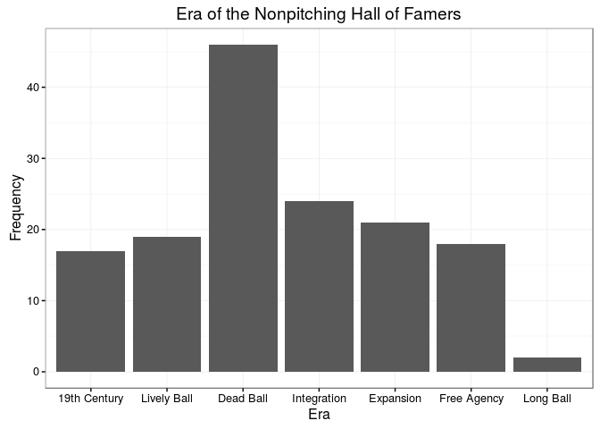
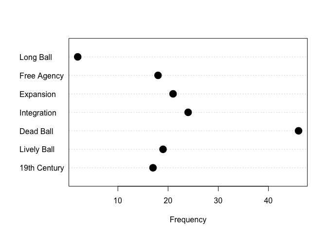
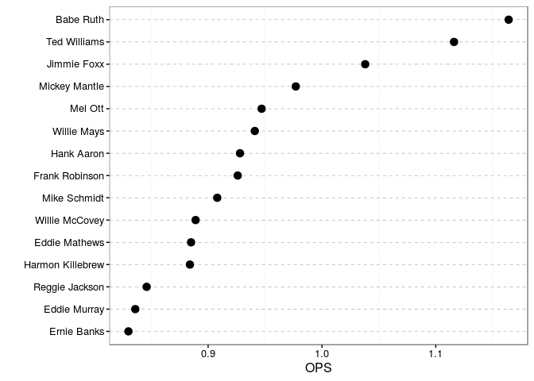
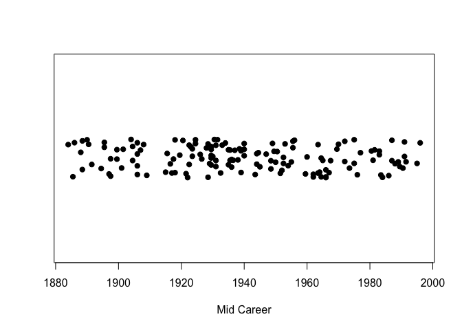
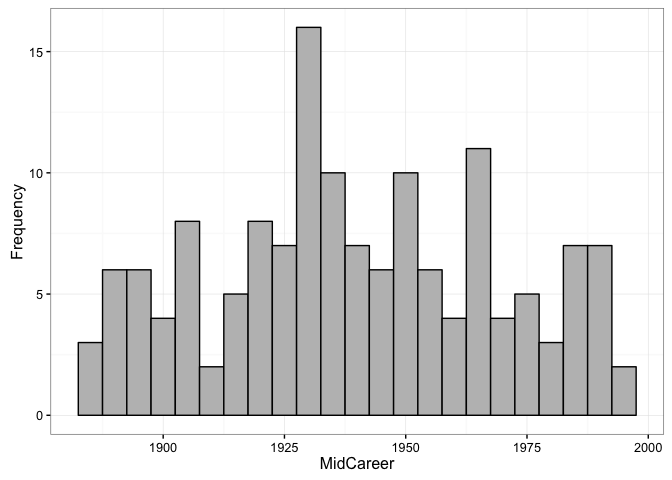
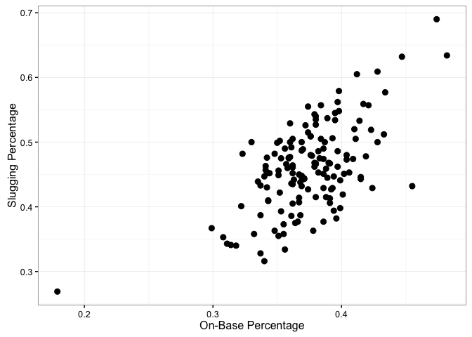
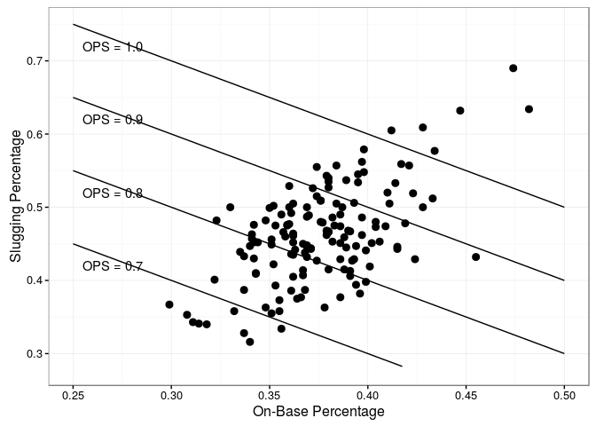
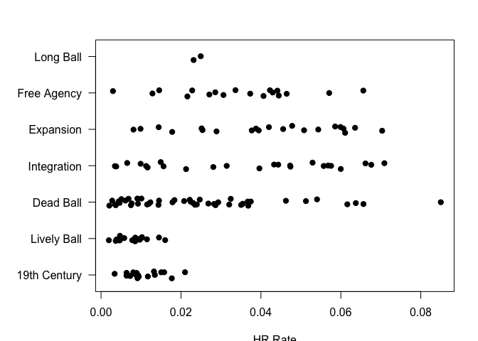
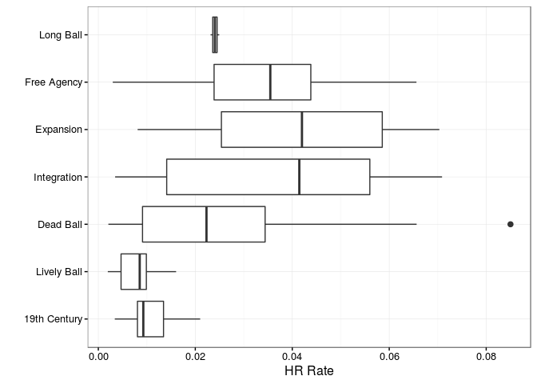
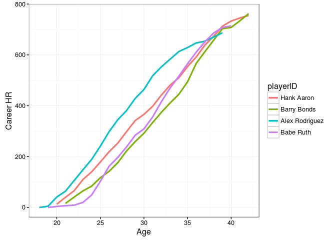

# tidy Baseball Chapter 3
C. A. Hamm  
`r format(Sys.Date())`  


### Chapter 3


```r
library("Lahman")
library("dplyr"); options(dplyr.width = Inf)
```

```
## 
## Attaching package: 'dplyr'
```

```
## The following objects are masked from 'package:stats':
## 
##     filter, lag
```

```
## The following objects are masked from 'package:base':
## 
##     intersect, setdiff, setequal, union
```

```r
library("ggplot2")
library("devtools")
library("readr")

set.seed(8761825)
session_info()
```

```
## Session info --------------------------------------------------------------
```

```
##  setting  value                       
##  version  R version 3.3.1 (2016-06-21)
##  system   x86_64, darwin13.4.0        
##  ui       X11                         
##  language (EN)                        
##  collate  en_US.UTF-8                 
##  tz       America/New_York            
##  date     2016-08-09
```

```
## Packages ------------------------------------------------------------------
```

```
##  package    * version date       source        
##  assertthat   0.1     2013-12-06 CRAN (R 3.3.0)
##  colorspace   1.2-6   2015-03-11 CRAN (R 3.3.0)
##  DBI          0.4-1   2016-05-08 CRAN (R 3.3.0)
##  devtools   * 1.12.0  2016-06-24 CRAN (R 3.3.0)
##  digest       0.6.10  2016-08-02 CRAN (R 3.3.1)
##  dplyr      * 0.5.0   2016-06-24 CRAN (R 3.3.0)
##  evaluate     0.9     2016-04-29 CRAN (R 3.3.0)
##  formatR      1.4     2016-05-09 CRAN (R 3.3.0)
##  ggplot2    * 2.1.0   2016-03-01 CRAN (R 3.3.0)
##  gtable       0.2.0   2016-02-26 CRAN (R 3.3.0)
##  htmltools    0.3.5   2016-03-21 CRAN (R 3.3.0)
##  knitr        1.13    2016-05-09 CRAN (R 3.3.0)
##  Lahman     * 4.0-1   2015-09-15 CRAN (R 3.3.0)
##  magrittr     1.5     2014-11-22 CRAN (R 3.3.0)
##  memoise      1.0.0   2016-01-29 CRAN (R 3.3.0)
##  munsell      0.4.3   2016-02-13 CRAN (R 3.3.0)
##  plyr         1.8.4   2016-06-08 CRAN (R 3.3.0)
##  R6           2.1.2   2016-01-26 CRAN (R 3.3.0)
##  Rcpp         0.12.6  2016-07-19 CRAN (R 3.3.0)
##  readr      * 1.0.0   2016-08-03 CRAN (R 3.3.0)
##  rmarkdown    1.0     2016-07-08 CRAN (R 3.3.0)
##  scales       0.4.0   2016-02-26 CRAN (R 3.3.0)
##  stringi      1.1.1   2016-05-27 CRAN (R 3.3.0)
##  stringr      1.0.0   2015-04-30 CRAN (R 3.3.0)
##  tibble       1.1     2016-07-04 CRAN (R 3.3.1)
##  withr        1.0.2   2016-06-20 CRAN (R 3.3.0)
##  yaml         2.1.13  2014-06-12 CRAN (R 3.3.0)
```


```r
# Section 3.1
hof <- read_csv("https://raw.githubusercontent.com/maxtoki/baseball_R/master/data/hofbatting.csv", col_names = TRUE)
```

```
## Warning: Missing column names filled in: 'X2' [2]
```

```
## Parsed with column specification:
## cols(
##   .default = col_integer(),
##   X2 = col_character(),
##   `WAR/pos` = col_double(),
##   BA = col_double(),
##   OBP = col_double(),
##   SLG = col_double(),
##   OPS = col_double()
## )
```

```
## See spec(...) for full column specifications.
```

```r
head(hof)
```

```
## # A tibble: 6 x 25
##      Rk                 X2 Inducted   Yrs  From    To   ASG WAR/pos     G
##   <int>              <chr>    <int> <int> <int> <int> <int>   <dbl> <int>
## 1     1     Hank Aaron HOF     1982    23  1954  1976    25   137.3  3298
## 2     3 Roberto Alomar HOF     2011    17  1988  2004    12    62.9  2379
## 3     6      Cap Anson HOF     1939    27  1871  1897     0    91.1  2524
## 4     7  Luis Aparicio HOF     1984    18  1956  1973    13    51.7  2599
## 5     8   Luke Appling HOF     1964    20  1930  1950     7    69.9  2422
## 6     9 Richie Ashburn HOF     1995    15  1948  1962     6    60.2  2189
##      PA    AB     R     H    2B    3B    HR   RBI    SB    CS    BB    SO
##   <int> <int> <int> <int> <int> <int> <int> <int> <int> <int> <int> <int>
## 1 13941 12364  2174  3771   624    98   755  2297   240    73  1402  1383
## 2 10400  9073  1508  2724   504    80   210  1134   474   114  1032  1140
## 3 11331 10281  1999  3435   582   142    97  2075   277    16   984   330
## 4 11230 10230  1335  2677   394    92    83   791   506   136   736   742
## 5 10254  8856  1319  2749   440   102    45  1116   179   108  1302   528
## 6  9736  8365  1322  2574   317   109    29   586   234    92  1198   571
##      BA   OBP   SLG   OPS
##   <dbl> <dbl> <dbl> <dbl>
## 1 0.305 0.374 0.555 0.928
## 2 0.300 0.371 0.443 0.814
## 3 0.334 0.394 0.447 0.841
## 4 0.262 0.311 0.343 0.653
## 5 0.310 0.399 0.398 0.798
## 6 0.308 0.396 0.382 0.778
```

```r
dim(hof)
```

```
## [1] 147  25
```


```r
# Rather than multiple additions to the data, lets create all of the variables we are interested in all at once. 
hof <- hof %>% mutate(MidCareer = ((From + To) / 2), Era = cut(MidCareer, breaks = c(1800, 1900, 1919, 1941, 1960, 1976, 1993, 2050), labels=c("19th Century", "Lively Ball", "Dead Ball", "Integration", "Expansion", "Free Agency", "Long Ball")), HR.Rate = (HR / AB)) %>% rename(Name = X2)
head(hof)
```

```
## # A tibble: 6 x 28
##      Rk               Name Inducted   Yrs  From    To   ASG WAR/pos     G
##   <int>              <chr>    <int> <int> <int> <int> <int>   <dbl> <int>
## 1     1     Hank Aaron HOF     1982    23  1954  1976    25   137.3  3298
## 2     3 Roberto Alomar HOF     2011    17  1988  2004    12    62.9  2379
## 3     6      Cap Anson HOF     1939    27  1871  1897     0    91.1  2524
## 4     7  Luis Aparicio HOF     1984    18  1956  1973    13    51.7  2599
## 5     8   Luke Appling HOF     1964    20  1930  1950     7    69.9  2422
## 6     9 Richie Ashburn HOF     1995    15  1948  1962     6    60.2  2189
##      PA    AB     R     H    2B    3B    HR   RBI    SB    CS    BB    SO
##   <int> <int> <int> <int> <int> <int> <int> <int> <int> <int> <int> <int>
## 1 13941 12364  2174  3771   624    98   755  2297   240    73  1402  1383
## 2 10400  9073  1508  2724   504    80   210  1134   474   114  1032  1140
## 3 11331 10281  1999  3435   582   142    97  2075   277    16   984   330
## 4 11230 10230  1335  2677   394    92    83   791   506   136   736   742
## 5 10254  8856  1319  2749   440   102    45  1116   179   108  1302   528
## 6  9736  8365  1322  2574   317   109    29   586   234    92  1198   571
##      BA   OBP   SLG   OPS MidCareer          Era     HR.Rate
##   <dbl> <dbl> <dbl> <dbl>     <dbl>       <fctr>       <dbl>
## 1 0.305 0.374 0.555 0.928    1965.0    Expansion 0.061064380
## 2 0.300 0.371 0.443 0.814    1996.0    Long Ball 0.023145597
## 3 0.334 0.394 0.447 0.841    1884.0 19th Century 0.009434880
## 4 0.262 0.311 0.343 0.653    1964.5    Expansion 0.008113392
## 5 0.310 0.399 0.398 0.798    1940.0    Dead Ball 0.005081301
## 6 0.308 0.396 0.382 0.778    1955.0  Integration 0.003466826
```

```r
# Let's get rid of the " HOF" in the name column
hof[, 2] <- gsub(" HOF", "", hof$Name)
head(hof)
```

```
## # A tibble: 6 x 28
##      Rk           Name Inducted   Yrs  From    To   ASG WAR/pos     G
##   <int>          <chr>    <int> <int> <int> <int> <int>   <dbl> <int>
## 1     1     Hank Aaron     1982    23  1954  1976    25   137.3  3298
## 2     3 Roberto Alomar     2011    17  1988  2004    12    62.9  2379
## 3     6      Cap Anson     1939    27  1871  1897     0    91.1  2524
## 4     7  Luis Aparicio     1984    18  1956  1973    13    51.7  2599
## 5     8   Luke Appling     1964    20  1930  1950     7    69.9  2422
## 6     9 Richie Ashburn     1995    15  1948  1962     6    60.2  2189
##      PA    AB     R     H    2B    3B    HR   RBI    SB    CS    BB    SO
##   <int> <int> <int> <int> <int> <int> <int> <int> <int> <int> <int> <int>
## 1 13941 12364  2174  3771   624    98   755  2297   240    73  1402  1383
## 2 10400  9073  1508  2724   504    80   210  1134   474   114  1032  1140
## 3 11331 10281  1999  3435   582   142    97  2075   277    16   984   330
## 4 11230 10230  1335  2677   394    92    83   791   506   136   736   742
## 5 10254  8856  1319  2749   440   102    45  1116   179   108  1302   528
## 6  9736  8365  1322  2574   317   109    29   586   234    92  1198   571
##      BA   OBP   SLG   OPS MidCareer          Era     HR.Rate
##   <dbl> <dbl> <dbl> <dbl>     <dbl>       <fctr>       <dbl>
## 1 0.305 0.374 0.555 0.928    1965.0    Expansion 0.061064380
## 2 0.300 0.371 0.443 0.814    1996.0    Long Ball 0.023145597
## 3 0.334 0.394 0.447 0.841    1884.0 19th Century 0.009434880
## 4 0.262 0.311 0.343 0.653    1964.5    Expansion 0.008113392
## 5 0.310 0.399 0.398 0.798    1940.0    Dead Ball 0.005081301
## 6 0.308 0.396 0.382 0.778    1955.0  Integration 0.003466826
```


```r
# Using ggplot we don't need to create a table
## Figure 3.1
ggplot(hof, aes(x = Era)) + theme_bw() + geom_bar() + ylab("Frequency") + xlab("Era") + ggtitle("Era of the Nonpitching Hall of Famers")
```

<!-- -->

### Skipping Figure 3.2


```r
## Figure 3.3, a Clevelnd dot plot of HoFers by Era. I am having trouble with this. This may be the first time I haven't been able to get ggplot to do what I want.
T.era <- table(hof$Era)
T.era
```

```
## 
## 19th Century  Lively Ball    Dead Ball  Integration    Expansion 
##           17           19           46           24           21 
##  Free Agency    Long Ball 
##           18            2
```

```r
dotchart(as.numeric(T.era), labels = names(T.era), xlab = "Frequency", ylab = "", pt.cex = 2, pch = 19) # note that there is a discrepency int the code on page 64 (naming the object "T.Era"), in previous example it is called "T.era."
```

<!-- -->

```r
# ggplot(hof, aes(y = Era, x = )) + geom_point(size = 2) # can't get ggplot to count the frequency of occurance. It can do that with a bar chart but not with geom_points(), to the best of my knowledge.
```


```r
## Figure 3.4 - No need to subset priot to plotting, we can do it inline with the plot call. 
ggplot(hof %>% filter(HR >= 500), aes(y = reorder(Name, OPS), x = OPS)) + geom_point(size = 3) + theme_bw() + theme(panel.grid.major.x = element_blank(), panel.grid.minor.y = element_blank(), panel.grid.major.y = element_line(color = "grey60", linetype = "dashed")) + ylab("") + xlab("OPS")
```

<!-- -->


```r
## Figure 3.5 - I can't seem to do make this figure with ggplot.
stripchart(hof$MidCareer, method = "jitter", pch = 19, xlab = "Mid Career")
```

<!-- -->


```r
## Figure 3.6
ggplot(hof, aes(x = MidCareer)) + theme_bw() + geom_histogram(binwidth = 5, fill = "grey", color = "black") + ylab("Frequency") + ylab("Frequency")
```

<!-- -->


```r
## Figure 3.7
ggplot(hof, aes(x = MidCareer, y = OPS))+ theme_bw() + geom_point(size = 2) + stat_smooth(method = "loess", col = "black", se = FALSE)
```

<!-- -->


```r
## Figure 3.8
ggplot(hof, aes(x = OBP, y = SLG)) + geom_point(size = 2.5) + theme_bw() + xlab("On-Base Percentage") + ylab("Slugging Percentage")
```

<!-- -->


```r
## Figure 3.9 (Changing the axes limits)
ggplot(hof, aes(x = OBP, y = SLG)) + geom_point(size = 2.5) + theme_bw() + ylim(0.28, 0.75) + xlim(0.25, 0.50) + xlab("On-Base Percentage") + ylab("Slugging Percentage")
```

```
## Warning: Removed 1 rows containing missing values (geom_point).
```

<!-- -->


```r
## Figure 3.10 (with lines delimiting OPS)
ggplot(hof, aes(x = OBP, y = SLG))+ theme_bw() + geom_point(size = 2.5) + ylim(0.28, 0.75) + xlim(0.25, 0.50) + xlab("On-Base Percentage") + ylab("Slugging Percentage") + stat_function(fun = function(x) 0.7 - x) + stat_function(fun = function(x) 0.8 - x) + stat_function(fun = function(x) 0.9 - x) + stat_function(fun = function(x) 1.0 - x) + annotate("text", x = 0.27, y = c(0.42, 0.52, 0.62, 0.72), label = c("OPS = 0.7", "OPS = 0.8", "OPS = 0.9", "OPS = 1.0"))
```

```
## Warning: Removed 1 rows containing missing values (geom_point).
```

```
## Warning: Removed 33 rows containing missing values (geom_path).
```

<!-- -->


```r
## Figure 3.12
par(plt = c(0.2, 0.95, 0.145, 0.883))
stripchart(HR.Rate ~ Era, data = hof, pch = 19, ylab = "", method = "jitter", las = 1)
```

<!-- -->


```r
## Figure 3.13
ggplot(hof, aes(y = HR.Rate, x = Era)) + theme_bw() + geom_boxplot(outlier.size = 2, stat = "boxplot") + coord_flip() + xlab("") + ylab("HR Rate")
```

<!-- -->

### This next section requires data from the Lahman database, available here: http://www.seanlahman.com/baseball-archive/statistics/
I have added the relevant files from the Lahman database to the "Data" directory.


```r
## Section 3.8
master <- read_csv("data/master.csv", col_names = TRUE)
```

```
## Parsed with column specification:
## cols(
##   .default = col_character(),
##   birthYear = col_integer(),
##   birthMonth = col_integer(),
##   birthDay = col_integer(),
##   deathYear = col_integer(),
##   deathMonth = col_integer(),
##   deathDay = col_integer(),
##   weight = col_integer(),
##   height = col_integer(),
##   debut = col_date(format = ""),
##   finalGame = col_date(format = "")
## )
```

```
## See spec(...) for full column specifications.
```

```r
head(master)
```

```
## # A tibble: 6 x 24
##    playerID birthYear birthMonth birthDay birthCountry birthState
##       <chr>     <int>      <int>    <int>        <chr>      <chr>
## 1 aardsda01      1981         12       27          USA         CO
## 2 aaronha01      1934          2        5          USA         AL
## 3 aaronto01      1939          8        5          USA         AL
## 4  aasedo01      1954          9        8          USA         CA
## 5  abadan01      1972          8       25          USA         FL
## 6  abadfe01      1985         12       17         D.R.  La Romana
##    birthCity deathYear deathMonth deathDay deathCountry deathState
##        <chr>     <int>      <int>    <int>        <chr>      <chr>
## 1     Denver        NA         NA       NA         <NA>       <NA>
## 2     Mobile        NA         NA       NA         <NA>       <NA>
## 3     Mobile      1984          8       16          USA         GA
## 4     Orange        NA         NA       NA         <NA>       <NA>
## 5 Palm Beach        NA         NA       NA         <NA>       <NA>
## 6  La Romana        NA         NA       NA         <NA>       <NA>
##   deathCity nameFirst nameLast        nameGiven weight height  bats throws
##       <chr>     <chr>    <chr>            <chr>  <int>  <int> <chr>  <chr>
## 1      <NA>     David  Aardsma      David Allan    220     75     R      R
## 2      <NA>      Hank    Aaron      Henry Louis    180     72     R      R
## 3   Atlanta    Tommie    Aaron       Tommie Lee    190     75     R      R
## 4      <NA>       Don     Aase   Donald William    190     75     R      R
## 5      <NA>      Andy     Abad    Fausto Andres    184     73     L      L
## 6      <NA>  Fernando     Abad Fernando Antonio    220     73     L      L
##        debut  finalGame  retroID   bbrefID
##       <date>     <date>    <chr>     <chr>
## 1 2004-04-06 2015-08-23 aardd001 aardsda01
## 2 1954-04-13 1976-10-03 aaroh101 aaronha01
## 3 1962-04-10 1971-09-26 aarot101 aaronto01
## 4 1977-07-26 1990-10-03 aased001  aasedo01
## 5 2001-09-10 2006-04-13 abada001  abadan01
## 6 2010-07-28 2015-10-03 abadf001  abadfe01
```

```r
dim(master)
```

```
## [1] 18846    24
```

```r
getinfo <- function(firstname, lastname){
	playerline <- subset(master, nameFirst == firstname & nameLast == lastname)
	name.code <- as.character(playerline$playerID)
	birthyear <- playerline$birthYear
	birthmonth <- playerline$birthMonth
	birthday <- playerline$birthDay
	byear <- ifelse(birthmonth <= 6, birthyear, birthyear + 1)
	list(name.code = name.code, byear = byear)
}

ruth.info <- getinfo("Babe", "Ruth")
aaron.info <- getinfo("Hank", "Aaron")
bonds.info <- getinfo("Barry", "Bonds")
arod.info <- getinfo("Alex", "Rodriguez")
ruth.info
```

```
## $name.code
## [1] "ruthba01"
## 
## $byear
## [1] 1895
```

```r
# comparing Ruth, Aaron, Bonds, and A-Rod
batting <- read_csv("data/batting.csv", col_names = TRUE)
```

```
## Parsed with column specification:
## cols(
##   .default = col_integer(),
##   playerID = col_character(),
##   teamID = col_character(),
##   lgID = col_character(),
##   SF = col_character(),
##   GIDP = col_character()
## )
## See spec(...) for full column specifications.
```

```r
dim(batting)
```

```
## [1] 101332     22
```

```r
# I rewrote this to use dplyr
ruth.data <- batting %>% filter(playerID == ruth.info$name.code) %>% mutate(Age = yearID - ruth.info$byear)

aaron.data <- batting %>% filter(playerID == aaron.info$name.code) %>% mutate(Age = yearID - aaron.info$byear)

bonds.data <- batting %>% filter(playerID == bonds.info$name.code) %>% mutate(Age = yearID - bonds.info$byear)

arod.data <- batting %>% filter(playerID == arod.info$name.code) %>% mutate(Age = yearID - arod.info$byear)

## Figure 3.14
with(ruth.data, plot(Age, cumsum(HR), type = "l", lty = 3, lwd = 2, xlab = "Age", ylab = "Career HR", xlim = c(18, 45), ylim = c(0, 800), las = 1))
with(aaron.data, lines(Age, cumsum(HR), lty = 2, lwd = 2))
with(bonds.data, lines(Age, cumsum(HR), lty = 1, lwd = 2))
with(arod.data, lines(Age, cumsum(HR), lty = 4, lwd = 2))
legend("topleft", legend = c("Ruth", "Aaron", "Bonds", "Arod"), lty = c(3, 2, 1, 4), lwd = 2, bty = "n")
```

<!-- -->


```r
### Section 3.9 - The 1998 home run race
# Look at how f-ing fast readr is!!!
data1998 <- read_csv("https://raw.githubusercontent.com/maxtoki/baseball_R/master/data/all1998.csv", col_names = FALSE)
```

```
## Parsed with column specification:
## cols(
##   .default = col_character(),
##   X3 = col_integer(),
##   X4 = col_integer(),
##   X5 = col_integer(),
##   X6 = col_integer(),
##   X7 = col_integer(),
##   X9 = col_integer(),
##   X10 = col_integer(),
##   X31 = col_logical(),
##   X32 = col_logical(),
##   X33 = col_integer(),
##   X34 = col_integer(),
##   X35 = col_integer(),
##   X36 = col_logical(),
##   X37 = col_logical(),
##   X38 = col_integer(),
##   X39 = col_logical(),
##   X40 = col_logical(),
##   X41 = col_integer(),
##   X42 = col_logical(),
##   X43 = col_logical()
##   # ... with 41 more columns
## )
```

```
## See spec(...) for full column specifications.
```

```
## Warning: 302 parsing failures.
##  row col               expected actual
##  755 X65 no trailing characters     E2
## 2388 X65 no trailing characters     E5
## 3910 X65 no trailing characters     E5
## 5206 X65 an integer                 E1
## 5401 X64 an integer                 E1
## .... ... ...................... ......
## See problems(...) for more details.
```

```r
fields <- read.csv("https://raw.githubusercontent.com/maxtoki/baseball_R/master/data/fields.csv", header = TRUE)
names(data1998) <- fields[, "Header"]

# need to parse out player IDs
retro.ids <- read.csv("https://raw.githubusercontent.com/maxtoki/baseball_R/master/data/retrosheetIDs.csv", header = TRUE)
head(retro.ids)
```

```
##      LAST    FIRST       ID      DEBUT
## 1 Aardsma    David aardd001 04/06/2004
## 2   Aaron     Hank aaroh101 04/13/1954
## 3   Aaron   Tommie aarot101 04/10/1962
## 4    Aase      Don aased001 07/26/1977
## 5    Abad     Andy abada001 09/10/2001
## 6    Abad Fernando abadf001 07/28/2010
```

```r
retro.ids %>% filter(FIRST == "Sammy" & LAST == "Sosa") %>% select(ID)
```

```
##         ID
## 1 sosas001
```

```r
retro.ids %>% filter(FIRST == "Mark" & LAST == "McGwire") %>% select(ID)
```

```
##         ID
## 1 mcgwm001
```

```r
sosa.data <- data1998 %>% filter(BAT_ID == "sosas001")
mac.data <- data1998 %>% filter(BAT_ID == "mcgwm001")
dim(sosa.data); dim(mac.data)
```

```
## [1] 737  97
```

```
## [1] 710  97
```

```r
# write function to extract variables
createdata <- function(d){
	d$Date <- as.Date(substr(d$GAME_ID, 4, 11), format = "%Y%m%d")
	d <- d[order(d$Date), ]
	d$HR <- ifelse(d$EVENT_CD == 23, 1, 0)
	d$cumHR <- cumsum(d$HR)
	d[, c("Date", "cumHR")]
}

sosa.hr <- createdata(sosa.data)
mac.hr <- createdata(mac.data)
head(sosa.hr); head(mac.hr)
```

```
## # A tibble: 6 x 2
##         Date cumHR
##       <date> <dbl>
## 1 1998-03-31     0
## 2 1998-03-31     0
## 3 1998-03-31     0
## 4 1998-03-31     0
## 5 1998-03-31     0
## 6 1998-04-01     0
```

```
## # A tibble: 6 x 2
##         Date cumHR
##       <date> <dbl>
## 1 1998-03-31     0
## 2 1998-03-31     0
## 3 1998-03-31     1
## 4 1998-03-31     1
## 5 1998-04-02     1
## 6 1998-04-02     1
```

```r
## Figure 3.15
plot(mac.hr, type = "l", lwd = 2, ylab = "HR in 1998", las = 1)
lines(sosa.hr, lwd = 2, col = "grey")
abline(h = 62, lty = 3, lwd = 2)
text(10405, 65, "62")
legend("topleft", legend = c("McGwire (70)", "Sosa (66)"), lwd = 2, col = c("black", "grey"), bty = "n")
```

<!-- -->

### Chapter 3 exercises
1. Question 1 - Using the HoF pitching data set:

```r
hofpitching <- read_csv("https://raw.githubusercontent.com/maxtoki/baseball_R/master/data/hofpitching.csv", col_names = TRUE)
```

```
## Warning: Missing column names filled in: 'X2' [2]
```

```
## Parsed with column specification:
## cols(
##   .default = col_integer(),
##   X2 = col_character(),
##   WAR = col_double(),
##   `W-L%` = col_double(),
##   ERA = col_double(),
##   IP = col_double()
## )
```

```
## See spec(...) for full column specifications.
```

```r
hofpitching <- hofpitching %>% mutate(BF.group = cut(BF, c(0, 10000, 15000, 20000, 30000), labels = c("Less than 10000", "(10000, 15000)", "(15000, 20000)", "more than 20000"))) %>% rename(Name = X2)

head(hofpitching)
```

```
## # A tibble: 6 x 31
##      Rk               Name Inducted   Yrs  From    To   ASG   WAR     W
##   <int>              <chr>    <int> <int> <int> <int> <int> <dbl> <int>
## 1     1 Pete Alexander HOF     1938    20  1911  1930     0 112.8   373
## 2     2   Chief Bender HOF     1953    16  1903  1925     0  40.8   212
## 3     3  Bert Blyleven HOF     2011    22  1970  1992     2  90.7   287
## 4     4 Mordecai Brown HOF     1949    14  1903  1916     0  51.7   239
## 5     5    Jim Bunning HOF     1996    17  1955  1971     9  56.7   224
## 6     6  Steve Carlton HOF     1994    24  1965  1988    10  78.6   329
##       L  W-L%   ERA     G    GS    GF    CG   SHO    SV     IP     H     R
##   <int> <dbl> <dbl> <int> <int> <int> <int> <int> <int>  <dbl> <int> <int>
## 1   208 0.642  2.56   696   600    80   437    90    32 5190.0  4868  1852
## 2   127 0.625  2.46   459   334   109   255    40    34 3017.0  2645  1108
## 3   250 0.534  3.31   692   685     3   242    60     0 4970.0  4632  2029
## 4   130 0.648  2.06   481   332   138   271    55    49 3172.1  2708  1044
## 5   184 0.549  3.27   591   519    39   151    40    16 3760.1  3433  1527
## 6   244 0.574  3.22   741   709    13   254    55     2 5217.2  4672  2130
##      ER    HR    BB   IBB    SO   HBP    BK    WP    BF        BF.group
##   <int> <int> <int> <int> <int> <int> <int> <int> <int>          <fctr>
## 1  1476   165   951    NA  2198    70     1    38 20893 more than 20000
## 2   823    40   712    NA  1711   102    10    79 11895  (10000, 15000)
## 3  1830   430  1322    71  3701   155    19   114 20491 more than 20000
## 4   725    43   673    NA  1375    61     4    61 12422  (10000, 15000)
## 5  1366   372  1000    98  2855   160     8    47 15618  (15000, 20000)
## 6  1864   414  1833   150  4136    53    90   183 21683 more than 20000
```

```r
hofpitching[, 2] <- gsub(" HOF", "", hofpitching$Name)
head(hofpitching)
```

```
## # A tibble: 6 x 31
##      Rk           Name Inducted   Yrs  From    To   ASG   WAR     W     L
##   <int>          <chr>    <int> <int> <int> <int> <int> <dbl> <int> <int>
## 1     1 Pete Alexander     1938    20  1911  1930     0 112.8   373   208
## 2     2   Chief Bender     1953    16  1903  1925     0  40.8   212   127
## 3     3  Bert Blyleven     2011    22  1970  1992     2  90.7   287   250
## 4     4 Mordecai Brown     1949    14  1903  1916     0  51.7   239   130
## 5     5    Jim Bunning     1996    17  1955  1971     9  56.7   224   184
## 6     6  Steve Carlton     1994    24  1965  1988    10  78.6   329   244
##    W-L%   ERA     G    GS    GF    CG   SHO    SV     IP     H     R    ER
##   <dbl> <dbl> <int> <int> <int> <int> <int> <int>  <dbl> <int> <int> <int>
## 1 0.642  2.56   696   600    80   437    90    32 5190.0  4868  1852  1476
## 2 0.625  2.46   459   334   109   255    40    34 3017.0  2645  1108   823
## 3 0.534  3.31   692   685     3   242    60     0 4970.0  4632  2029  1830
## 4 0.648  2.06   481   332   138   271    55    49 3172.1  2708  1044   725
## 5 0.549  3.27   591   519    39   151    40    16 3760.1  3433  1527  1366
## 6 0.574  3.22   741   709    13   254    55     2 5217.2  4672  2130  1864
##      HR    BB   IBB    SO   HBP    BK    WP    BF        BF.group
##   <int> <int> <int> <int> <int> <int> <int> <int>          <fctr>
## 1   165   951    NA  2198    70     1    38 20893 more than 20000
## 2    40   712    NA  1711   102    10    79 11895  (10000, 15000)
## 3   430  1322    71  3701   155    19   114 20491 more than 20000
## 4    43   673    NA  1375    61     4    61 12422  (10000, 15000)
## 5   372  1000    98  2855   160     8    47 15618  (15000, 20000)
## 6   414  1833   150  4136    53    90   183 21683 more than 20000
```

  + Construct a frequency table of BF.group using the table function.


```r
table(hofpitching$BF.group)
```

```
## 
## Less than 10000  (10000, 15000)  (15000, 20000) more than 20000 
##              11              22              23              14
```
  
  + Construct a bar graph of the output from table. How many HOF pitchers faced more than 20,000 *pitchers* in their career?


```r
# I think there was a typo in the above question. I propose that BF means "Batters Faced" and that we should replace "pitchers" with "batters." 
# 14 pitchers faced over 20,000 batters
ggplot(hofpitching, aes(BF.group)) + theme_bw() + geom_bar() + ylab("# HoF pitchers") + xlab("# batters faced")
```

<!-- -->

  + Construct a pie graph of the BF.group variable. Compare the effec-tiveness of the bar graph and pie graph in comparing the frequencies in the four intervals.


```r
pie(table(hofpitching$BF.group), col = c("dark grey", "white", "light grey", "black"))
```

<!-- -->

2. Question 2 - HoF pitching continued - WAR
  + Using the hist function, construct a histogram of WAR for the pitchers in the Hall of Fame dataset.


```r
ggplot(hofpitching, aes(WAR)) + theme_bw() + geom_histogram(bins = 15) + ylab("Count")
```

<!-- -->

  + There are two pitchers who stand out among all of the Hall of Famers on the total WAR variable. Identify these two pitchers.


```r
hofpitching %>% arrange(desc(WAR)) %>% slice(1:2) 
```

```
## # A tibble: 2 x 31
##      Rk           Name Inducted   Yrs  From    To   ASG   WAR     W     L
##   <int>          <chr>    <int> <int> <int> <int> <int> <dbl> <int> <int>
## 1    69       Cy Young     1937    22  1890  1911     0 162.3   511   316
## 2    30 Walter Johnson     1936    21  1907  1927     0 144.7   417   279
##    W-L%   ERA     G    GS    GF    CG   SHO    SV     IP     H     R    ER
##   <dbl> <dbl> <int> <int> <int> <int> <int> <int>  <dbl> <int> <int> <int>
## 1 0.618  2.63   906   815    84   749    76    17 7356.0  7092  3167  2147
## 2 0.599  2.17   802   666   127   531   110    34 5914.1  4913  1902  1424
##      HR    BB   IBB    SO   HBP    BK    WP    BF        BF.group
##   <int> <int> <int> <int> <int> <int> <int> <int>          <fctr>
## 1   138  1217    NA  2803   161     3   156 29565 more than 20000
## 2    97  1363    NA  3509   205     4   154 23405 more than 20000
```

```r
# The two pitchers are Cy Young and Walter Johnson
```
