# tidy Baseball Chapter 3
Chris Hamm  
`r format(Sys.Date())`  


## Chapter 3 - *Traditional graphics*


```r
library("Lahman")
library("tidyverse"); options(dplyr.width = Inf)
```

```
## Loading tidyverse: ggplot2
## Loading tidyverse: tibble
## Loading tidyverse: tidyr
## Loading tidyverse: readr
## Loading tidyverse: purrr
## Loading tidyverse: dplyr
```

```
## Conflicts with tidy packages ----------------------------------------------
```

```
## filter(): dplyr, stats
## lag():    dplyr, stats
```

```r
set.seed(8761825)
devtools::session_info()
```

```
## Session info --------------------------------------------------------------
```

```
##  setting  value                       
##  version  R version 3.3.1 (2016-06-21)
##  system   x86_64, darwin13.4.0        
##  ui       X11                         
##  language (EN)                        
##  collate  en_US.UTF-8                 
##  tz       America/New_York            
##  date     2016-10-04
```

```
## Packages ------------------------------------------------------------------
```

```
##  package    * version date       source        
##  assertthat   0.1     2013-12-06 CRAN (R 3.3.0)
##  colorspace   1.2-6   2015-03-11 CRAN (R 3.3.0)
##  DBI          0.5-1   2016-09-10 CRAN (R 3.3.0)
##  devtools     1.12.0  2016-06-24 CRAN (R 3.3.0)
##  digest       0.6.10  2016-08-02 CRAN (R 3.3.1)
##  dplyr      * 0.5.0   2016-06-24 CRAN (R 3.3.0)
##  evaluate     0.9     2016-04-29 CRAN (R 3.3.0)
##  formatR      1.4     2016-05-09 CRAN (R 3.3.0)
##  ggplot2    * 2.1.0   2016-03-01 CRAN (R 3.3.0)
##  gtable       0.2.0   2016-02-26 CRAN (R 3.3.0)
##  htmltools    0.3.5   2016-03-21 CRAN (R 3.3.0)
##  knitr        1.14    2016-08-13 CRAN (R 3.3.0)
##  Lahman     * 5.0-0   2016-08-27 CRAN (R 3.3.0)
##  magrittr     1.5     2014-11-22 CRAN (R 3.3.0)
##  memoise      1.0.0   2016-01-29 CRAN (R 3.3.0)
##  munsell      0.4.3   2016-02-13 CRAN (R 3.3.0)
##  plyr         1.8.4   2016-06-08 CRAN (R 3.3.0)
##  purrr      * 0.2.2   2016-06-18 CRAN (R 3.3.0)
##  R6           2.1.3   2016-08-19 CRAN (R 3.3.0)
##  Rcpp         0.12.7  2016-09-05 CRAN (R 3.3.0)
##  readr      * 1.0.0   2016-08-03 CRAN (R 3.3.0)
##  rmarkdown    1.0     2016-07-08 CRAN (R 3.3.0)
##  scales       0.4.0   2016-02-26 CRAN (R 3.3.0)
##  stringi      1.1.1   2016-05-27 CRAN (R 3.3.0)
##  stringr      1.1.0   2016-08-19 CRAN (R 3.3.0)
##  tibble     * 1.2     2016-08-26 CRAN (R 3.3.0)
##  tidyr      * 0.6.0   2016-08-12 CRAN (R 3.3.1)
##  tidyverse  * 1.0.0   2016-09-09 CRAN (R 3.3.0)
##  withr        1.0.2   2016-06-20 CRAN (R 3.3.0)
##  yaml         2.1.13  2014-06-12 CRAN (R 3.3.0)
```

### Section 3.1

```r
hof <- read_csv("https://raw.githubusercontent.com/maxtoki/baseball_R/master/data/hofbatting.csv", col_names = TRUE)
```

```
## Warning: Missing column names filled in: 'X2' [2]
```

```
## Parsed with column specification:
## cols(
##   .default = col_integer(),
##   X2 = col_character(),
##   `WAR/pos` = col_double(),
##   BA = col_double(),
##   OBP = col_double(),
##   SLG = col_double(),
##   OPS = col_double()
## )
```

```
## See spec(...) for full column specifications.
```

```r
head(hof)
```

```
## # A tibble: 6 × 25
##      Rk                 X2 Inducted   Yrs  From    To   ASG `WAR/pos`
##   <int>              <chr>    <int> <int> <int> <int> <int>     <dbl>
## 1     1     Hank Aaron HOF     1982    23  1954  1976    25     137.3
## 2     3 Roberto Alomar HOF     2011    17  1988  2004    12      62.9
## 3     6      Cap Anson HOF     1939    27  1871  1897     0      91.1
## 4     7  Luis Aparicio HOF     1984    18  1956  1973    13      51.7
## 5     8   Luke Appling HOF     1964    20  1930  1950     7      69.9
## 6     9 Richie Ashburn HOF     1995    15  1948  1962     6      60.2
##       G    PA    AB     R     H  `2B`  `3B`    HR   RBI    SB    CS    BB
##   <int> <int> <int> <int> <int> <int> <int> <int> <int> <int> <int> <int>
## 1  3298 13941 12364  2174  3771   624    98   755  2297   240    73  1402
## 2  2379 10400  9073  1508  2724   504    80   210  1134   474   114  1032
## 3  2524 11331 10281  1999  3435   582   142    97  2075   277    16   984
## 4  2599 11230 10230  1335  2677   394    92    83   791   506   136   736
## 5  2422 10254  8856  1319  2749   440   102    45  1116   179   108  1302
## 6  2189  9736  8365  1322  2574   317   109    29   586   234    92  1198
##      SO    BA   OBP   SLG   OPS
##   <int> <dbl> <dbl> <dbl> <dbl>
## 1  1383 0.305 0.374 0.555 0.928
## 2  1140 0.300 0.371 0.443 0.814
## 3   330 0.334 0.394 0.447 0.841
## 4   742 0.262 0.311 0.343 0.653
## 5   528 0.310 0.399 0.398 0.798
## 6   571 0.308 0.396 0.382 0.778
```

```r
dim(hof)
```

```
## [1] 147  25
```


```r
# Rather than multiple additions to the data, lets create all of the variables we are interested in all at once. 
hof <- hof %>% 
  mutate(MidCareer = ((From + To) / 2), 
         Era = cut(MidCareer, 
         breaks = c(1800, 1900, 1919, 1941, 1960, 1976, 1993, 2050), 
         labels = c("19th Century", "Lively Ball", "Dead Ball", "Integration", "Expansion", "Free Agency", "Long Ball")), 
         HR.Rate = (HR / AB)) %>% 
  rename(Name = X2)
head(hof)
```

```
## # A tibble: 6 × 28
##      Rk               Name Inducted   Yrs  From    To   ASG `WAR/pos`
##   <int>              <chr>    <int> <int> <int> <int> <int>     <dbl>
## 1     1     Hank Aaron HOF     1982    23  1954  1976    25     137.3
## 2     3 Roberto Alomar HOF     2011    17  1988  2004    12      62.9
## 3     6      Cap Anson HOF     1939    27  1871  1897     0      91.1
## 4     7  Luis Aparicio HOF     1984    18  1956  1973    13      51.7
## 5     8   Luke Appling HOF     1964    20  1930  1950     7      69.9
## 6     9 Richie Ashburn HOF     1995    15  1948  1962     6      60.2
##       G    PA    AB     R     H  `2B`  `3B`    HR   RBI    SB    CS    BB
##   <int> <int> <int> <int> <int> <int> <int> <int> <int> <int> <int> <int>
## 1  3298 13941 12364  2174  3771   624    98   755  2297   240    73  1402
## 2  2379 10400  9073  1508  2724   504    80   210  1134   474   114  1032
## 3  2524 11331 10281  1999  3435   582   142    97  2075   277    16   984
## 4  2599 11230 10230  1335  2677   394    92    83   791   506   136   736
## 5  2422 10254  8856  1319  2749   440   102    45  1116   179   108  1302
## 6  2189  9736  8365  1322  2574   317   109    29   586   234    92  1198
##      SO    BA   OBP   SLG   OPS MidCareer          Era     HR.Rate
##   <int> <dbl> <dbl> <dbl> <dbl>     <dbl>       <fctr>       <dbl>
## 1  1383 0.305 0.374 0.555 0.928    1965.0    Expansion 0.061064380
## 2  1140 0.300 0.371 0.443 0.814    1996.0    Long Ball 0.023145597
## 3   330 0.334 0.394 0.447 0.841    1884.0 19th Century 0.009434880
## 4   742 0.262 0.311 0.343 0.653    1964.5    Expansion 0.008113392
## 5   528 0.310 0.399 0.398 0.798    1940.0    Dead Ball 0.005081301
## 6   571 0.308 0.396 0.382 0.778    1955.0  Integration 0.003466826
```

```r
# Let's get rid of the " HOF" in the name column
hof[, 2] <- gsub(" HOF", "", hof$Name)
head(hof)
```

```
## # A tibble: 6 × 28
##      Rk           Name Inducted   Yrs  From    To   ASG `WAR/pos`     G
##   <int>          <chr>    <int> <int> <int> <int> <int>     <dbl> <int>
## 1     1     Hank Aaron     1982    23  1954  1976    25     137.3  3298
## 2     3 Roberto Alomar     2011    17  1988  2004    12      62.9  2379
## 3     6      Cap Anson     1939    27  1871  1897     0      91.1  2524
## 4     7  Luis Aparicio     1984    18  1956  1973    13      51.7  2599
## 5     8   Luke Appling     1964    20  1930  1950     7      69.9  2422
## 6     9 Richie Ashburn     1995    15  1948  1962     6      60.2  2189
##      PA    AB     R     H  `2B`  `3B`    HR   RBI    SB    CS    BB    SO
##   <int> <int> <int> <int> <int> <int> <int> <int> <int> <int> <int> <int>
## 1 13941 12364  2174  3771   624    98   755  2297   240    73  1402  1383
## 2 10400  9073  1508  2724   504    80   210  1134   474   114  1032  1140
## 3 11331 10281  1999  3435   582   142    97  2075   277    16   984   330
## 4 11230 10230  1335  2677   394    92    83   791   506   136   736   742
## 5 10254  8856  1319  2749   440   102    45  1116   179   108  1302   528
## 6  9736  8365  1322  2574   317   109    29   586   234    92  1198   571
##      BA   OBP   SLG   OPS MidCareer          Era     HR.Rate
##   <dbl> <dbl> <dbl> <dbl>     <dbl>       <fctr>       <dbl>
## 1 0.305 0.374 0.555 0.928    1965.0    Expansion 0.061064380
## 2 0.300 0.371 0.443 0.814    1996.0    Long Ball 0.023145597
## 3 0.334 0.394 0.447 0.841    1884.0 19th Century 0.009434880
## 4 0.262 0.311 0.343 0.653    1964.5    Expansion 0.008113392
## 5 0.310 0.399 0.398 0.798    1940.0    Dead Ball 0.005081301
## 6 0.308 0.396 0.382 0.778    1955.0  Integration 0.003466826
```

#### Figure 3.1

```r
# Using ggplot we don't need to create a table
## Figure 3.1
ggplot(hof, aes(x = Era)) + 
  theme_bw() + 
  geom_bar() + 
  ylab("Frequency") + 
  xlab("Era") + 
  ggtitle("Era of the Nonpitching Hall of Famers")
```


#### Figure 3.2

```r
## Figure 3.3, a Clevelnd dot plot of HoFers by Era. I am having trouble with this. This may be the first time I haven't been able to get ggplot to do what I want.
T.era <- table(hof$Era)
T.era
```

```
## 
## 19th Century  Lively Ball    Dead Ball  Integration    Expansion 
##           17           19           46           24           21 
##  Free Agency    Long Ball 
##           18            2
```

```r
dotchart(as.numeric(T.era), labels = names(T.era), xlab = "Frequency", ylab = "", pt.cex = 2, pch = 19) # note that there is a discrepency int the code on page 64 (naming the object "T.Era"), in previous example it is called "T.era."
```


```r
# ggplot(hof, aes(y = Era, x = )) + geom_point(size = 2) # can't get ggplot to count the frequency of occurance. It can do that with a bar chart but not with geom_points(), to the best of my knowledge.
```

#### Figure 3.4

```r
## Figure 3.4 - No need to subset priot to plotting, we can do it inline with the plot call. 
ggplot(hof %>% filter(HR >= 500), aes(y = reorder(Name, OPS), x = OPS)) + 
  geom_point(size = 3) + 
  theme_bw() + 
  theme(panel.grid.major.x = element_blank(), panel.grid.minor.y = element_blank(), panel.grid.major.y = element_line(color = "grey60", linetype = "dashed")) + 
  ylab("") + 
  xlab("OPS")
```


#### Figure 3.5 - I can't seem to do make this figure with ggplot.

```r
stripchart(hof$MidCareer, method = "jitter", pch = 19, xlab = "Mid Career")
```


#### Figure 3.6

```r
## Figure 3.6
ggplot(hof, aes(x = MidCareer)) + 
  theme_bw() + 
  geom_histogram(binwidth = 5, fill = "grey", color = "black") + 
  ylab("Frequency")
```


#### Figure 3.7

```r
ggplot(hof, aes(x = MidCareer, y = OPS)) + 
  theme_bw() + 
  geom_point(size = 2) + 
  stat_smooth(method = "loess", col = "black", se = FALSE)
```

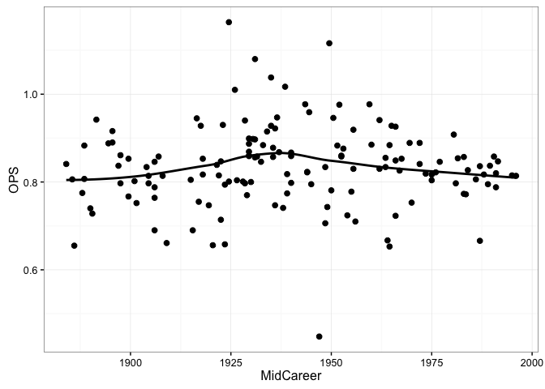

#### Figure 3.8

```r
ggplot(hof, aes(x = OBP, y = SLG)) + 
   theme_bw() + 
  geom_point(size = 2.5) + 
  xlab("On-Base Percentage") + 
  ylab("Slugging Percentage")
```


#### Figure 3.9 (Changing the axes limits)

```r
ggplot(hof, aes(x = OBP, y = SLG)) + 
  theme_bw() + 
  geom_point(size = 2.5) + 
  ylim(0.28, 0.75) + 
  xlim(0.25, 0.50) + 
  xlab("On-Base Percentage") + 
  ylab("Slugging Percentage")
```

```
## Warning: Removed 1 rows containing missing values (geom_point).
```

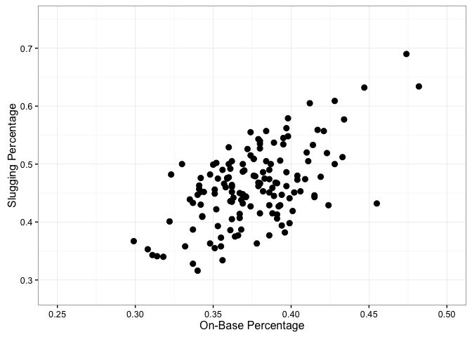

#### Figure 3.10 (with lines delimiting OPS)

```r
ggplot(hof, aes(x = OBP, y = SLG)) + 
  theme_bw() + 
  geom_point(size = 2.5) + 
  ylim(0.28, 0.75) + 
  xlim(0.25, 0.50) + 
  xlab("On-Base Percentage") + 
  ylab("Slugging Percentage") + 
  stat_function(fun = function(x) 0.7 - x) + 
  stat_function(fun = function(x) 0.8 - x) + 
  stat_function(fun = function(x) 0.9 - x) + 
  stat_function(fun = function(x) 1.0 - x) + 
  annotate("text", x = 0.27, y = c(0.42, 0.52, 0.62, 0.72), label = c("OPS = 0.7", "OPS = 0.8", "OPS = 0.9", "OPS = 1.0"))
```

```
## Warning: Removed 1 rows containing missing values (geom_point).
```

```
## Warning: Removed 33 rows containing missing values (geom_path).
```


#### Figure 3.12

```r
par(plt = c(0.2, 0.95, 0.145, 0.883))
stripchart(HR.Rate ~ Era, data = hof, pch = 19, ylab = "", method = "jitter", las = 1)
```


#### Figure 3.13

```r
ggplot(hof, aes(y = HR.Rate, x = Era)) + 
  theme_bw() + 
  geom_boxplot(outlier.size = 2, stat = "boxplot", fill = "grey") + 
  coord_flip() + 
  xlab("") + 
  ylab("HR Rate")
```

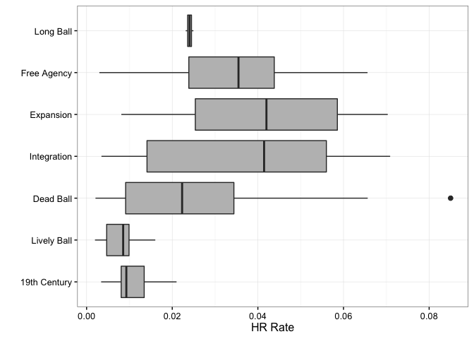

### This next section requires data from the Lahman database, available here: http://www.seanlahman.com/baseball-archive/statistics/
I have added the relevant files from the Lahman database to the "Data" directory; alternatively you could use the Lahman package from R. 


```r
## Section 3.8
head(Master)
```

```
##    playerID birthYear birthMonth birthDay birthCountry birthState
## 1 aardsda01      1981         12       27          USA         CO
## 2 aaronha01      1934          2        5          USA         AL
## 3 aaronto01      1939          8        5          USA         AL
## 4  aasedo01      1954          9        8          USA         CA
## 5  abadan01      1972          8       25          USA         FL
## 6  abadfe01      1985         12       17         D.R.  La Romana
##    birthCity deathYear deathMonth deathDay deathCountry deathState
## 1     Denver        NA         NA       NA         <NA>       <NA>
## 2     Mobile        NA         NA       NA         <NA>       <NA>
## 3     Mobile      1984          8       16          USA         GA
## 4     Orange        NA         NA       NA         <NA>       <NA>
## 5 Palm Beach        NA         NA       NA         <NA>       <NA>
## 6  La Romana        NA         NA       NA         <NA>       <NA>
##   deathCity nameFirst nameLast        nameGiven weight height bats throws
## 1      <NA>     David  Aardsma      David Allan    220     75    R      R
## 2      <NA>      Hank    Aaron      Henry Louis    180     72    R      R
## 3   Atlanta    Tommie    Aaron       Tommie Lee    190     75    R      R
## 4      <NA>       Don     Aase   Donald William    190     75    R      R
## 5      <NA>      Andy     Abad    Fausto Andres    184     73    L      L
## 6      <NA>  Fernando     Abad Fernando Antonio    220     73    L      L
##        debut  finalGame  retroID   bbrefID  deathDate  birthDate
## 1 2004-04-06 2015-08-23 aardd001 aardsda01       <NA> 1981-12-27
## 2 1954-04-13 1976-10-03 aaroh101 aaronha01       <NA> 1934-02-05
## 3 1962-04-10 1971-09-26 aarot101 aaronto01 1984-08-16 1939-08-05
## 4 1977-07-26 1990-10-03 aased001  aasedo01       <NA> 1954-09-08
## 5 2001-09-10 2006-04-13 abada001  abadan01       <NA> 1972-08-25
## 6 2010-07-28 2015-10-03 abadf001  abadfe01       <NA> 1985-12-17
```

```r
dim(Master)
```

```
## [1] 18846    26
```

```r
getinfo <- function(firstname, lastname){
	playerline <- subset(Master, nameFirst == firstname & nameLast == lastname)
	name.code <- as.character(playerline$playerID)
	birthyear <- playerline$birthYear
	birthmonth <- playerline$birthMonth
	birthday <- playerline$birthDay
	byear <- ifelse(birthmonth <= 6, birthyear, birthyear + 1)
	list(name.code = name.code, byear = byear)
}

ruth.info <- getinfo("Babe", "Ruth")
aaron.info <- getinfo("Hank", "Aaron")
bonds.info <- getinfo("Barry", "Bonds")
arod.info <- getinfo("Alex", "Rodriguez")
ruth.info
```

```
## $name.code
## [1] "ruthba01"
## 
## $byear
## [1] 1895
```

```r
# comparing Ruth, Aaron, Bonds, and A-Rod
#Batting <- read_csv("data/batting.csv", col_names = TRUE)
dim(Batting)
```

```
## [1] 101332     22
```

```r
# I rewrote this to use dplyr
ruth.data <- Batting %>% 
  filter(playerID == ruth.info$name.code) %>% 
  mutate(Age = yearID - ruth.info$byear)

aaron.data <- Batting %>% 
  filter(playerID == aaron.info$name.code) %>% 
  mutate(Age = yearID - aaron.info$byear)

bonds.data <- Batting %>% 
  filter(playerID == bonds.info$name.code) %>% 
  mutate(Age = yearID - bonds.info$byear)

arod.data <- Batting %>% 
  filter(playerID == arod.info$name.code) %>% 
  mutate(Age = yearID - arod.info$byear)


RABA <- rbind(ruth.data, aaron.data, bonds.data, arod.data)
RABA <- RABA %>% 
  select(playerID, HR, Age) %>% 
  group_by(playerID) %>% 
  mutate(cumHR = cumsum(HR))

## Figure 3.14
ggplot(RABA, aes(x = Age, y = cumHR, color = playerID)) + 
  theme_bw() + 
  geom_line(size = 1.1) + 
  ylab("Career HR") + 
  xlab("Age") + 
  scale_color_discrete(labels = c("Hank Aaron", "Barry Bonds", "Alex Rodriguez", "Babe Ruth"))
```

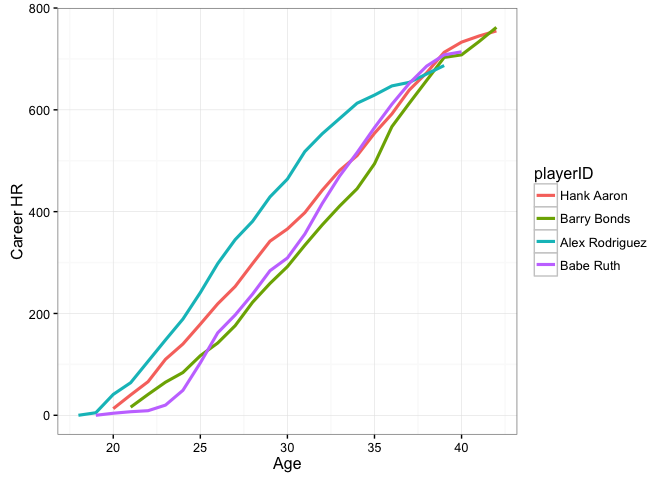


```r
### Section 3.9 - The 1998 home run race
# Look at how f-ing fast readr is!!!
data1998 <- read_csv("https://raw.githubusercontent.com/maxtoki/baseball_R/master/data/all1998.csv", col_names = FALSE)
```

```
## Parsed with column specification:
## cols(
##   .default = col_character(),
##   X3 = col_integer(),
##   X4 = col_integer(),
##   X5 = col_integer(),
##   X6 = col_integer(),
##   X7 = col_integer(),
##   X9 = col_integer(),
##   X10 = col_integer(),
##   X31 = col_logical(),
##   X32 = col_logical(),
##   X33 = col_integer(),
##   X34 = col_integer(),
##   X35 = col_integer(),
##   X36 = col_logical(),
##   X37 = col_logical(),
##   X38 = col_integer(),
##   X39 = col_logical(),
##   X40 = col_logical(),
##   X41 = col_integer(),
##   X42 = col_logical(),
##   X43 = col_logical()
##   # ... with 41 more columns
## )
```

```
## See spec(...) for full column specifications.
```

```
## Warning: 302 parsing failures.
##  row col               expected actual
##  755 X65 no trailing characters     E2
## 2388 X65 no trailing characters     E5
## 3910 X65 no trailing characters     E5
## 5206 X65 an integer                 E1
## 5401 X64 an integer                 E1
## .... ... ...................... ......
## See problems(...) for more details.
```

```r
fields <- read.csv("https://raw.githubusercontent.com/maxtoki/baseball_R/master/data/fields.csv", header = TRUE)
names(data1998) <- fields[, "Header"]

# need to parse out player IDs
retro.ids <- read.csv("https://raw.githubusercontent.com/maxtoki/baseball_R/master/data/retrosheetIDs.csv", header = TRUE)
head(retro.ids)
```

```
##      LAST    FIRST       ID      DEBUT
## 1 Aardsma    David aardd001 04/06/2004
## 2   Aaron     Hank aaroh101 04/13/1954
## 3   Aaron   Tommie aarot101 04/10/1962
## 4    Aase      Don aased001 07/26/1977
## 5    Abad     Andy abada001 09/10/2001
## 6    Abad Fernando abadf001 07/28/2010
```

```r
retro.ids %>% 
  filter(FIRST == "Sammy" & LAST == "Sosa") %>% 
  select(ID)
```

```
##         ID
## 1 sosas001
```

```r
retro.ids %>% 
  filter(FIRST == "Mark" & LAST == "McGwire") %>% 
  select(ID)
```

```
##         ID
## 1 mcgwm001
```

```r
sosa.data <- data1998 %>% 
  filter(BAT_ID == "sosas001")
mac.data <- data1998 %>% 
  filter(BAT_ID == "mcgwm001")
dim(sosa.data); dim(mac.data)
```

```
## [1] 737  97
```

```
## [1] 710  97
```

```r
# write function to extract variables
createdata <- function(d){
	d$Date <- as.Date(substr(d$GAME_ID, 4, 11), format = "%Y%m%d")
	d <- d[order(d$Date), ]
	d$HR <- ifelse(d$EVENT_CD == 23, 1, 0)
	d$cumHR <- cumsum(d$HR)
	d[, c("Date", "cumHR")]
}

sosa.hr <- createdata(sosa.data)
mac.hr <- createdata(mac.data)
head(sosa.hr); head(mac.hr)
```

```
## # A tibble: 6 × 2
##         Date cumHR
##       <date> <dbl>
## 1 1998-03-31     0
## 2 1998-03-31     0
## 3 1998-03-31     0
## 4 1998-03-31     0
## 5 1998-03-31     0
## 6 1998-04-01     0
```

```
## # A tibble: 6 × 2
##         Date cumHR
##       <date> <dbl>
## 1 1998-03-31     0
## 2 1998-03-31     0
## 3 1998-03-31     1
## 4 1998-03-31     1
## 5 1998-04-02     1
## 6 1998-04-02     1
```

```r
## Figure 3.15
plot(mac.hr, type = "l", lwd = 2, ylab = "HR in 1998", las = 1)
lines(sosa.hr, lwd = 2, col = "grey")
abline(h = 62, lty = 3, lwd = 2)
text(10405, 65, "62")
legend("topleft", legend = c("McGwire (70)", "Sosa (66)"), lwd = 2, col = c("black", "grey"), bty = "n")
```

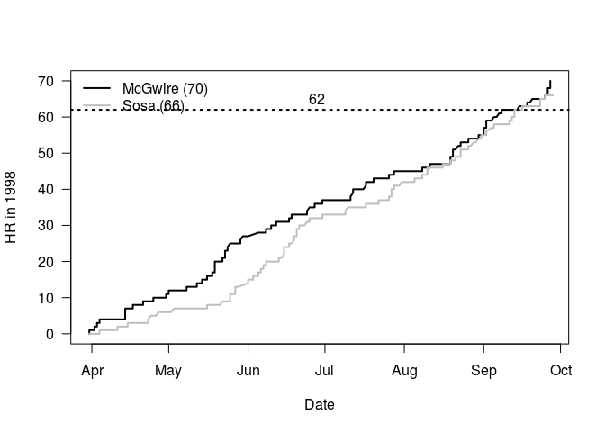

### Chapter 3 exercises
1. Question 1 - Using the HoF pitching data set:

```r
hofpitching <- read_csv("https://raw.githubusercontent.com/maxtoki/baseball_R/master/data/hofpitching.csv", col_names = TRUE)
```

```
## Warning: Missing column names filled in: 'X2' [2]
```

```
## Parsed with column specification:
## cols(
##   .default = col_integer(),
##   X2 = col_character(),
##   WAR = col_double(),
##   `W-L%` = col_double(),
##   ERA = col_double(),
##   IP = col_double()
## )
```

```
## See spec(...) for full column specifications.
```

```r
hofpitching <- hofpitching %>% 
  mutate(BF.group = cut(BF, c(0, 10000, 15000, 20000, 30000), labels = c("Less than 10000", "(10000, 15000)", "(15000, 20000)", "more than 20000"))) %>% 
  rename(Name = X2)

head(hofpitching)
```

```
## # A tibble: 6 × 31
##      Rk               Name Inducted   Yrs  From    To   ASG   WAR     W
##   <int>              <chr>    <int> <int> <int> <int> <int> <dbl> <int>
## 1     1 Pete Alexander HOF     1938    20  1911  1930     0 112.8   373
## 2     2   Chief Bender HOF     1953    16  1903  1925     0  40.8   212
## 3     3  Bert Blyleven HOF     2011    22  1970  1992     2  90.7   287
## 4     4 Mordecai Brown HOF     1949    14  1903  1916     0  51.7   239
## 5     5    Jim Bunning HOF     1996    17  1955  1971     9  56.7   224
## 6     6  Steve Carlton HOF     1994    24  1965  1988    10  78.6   329
##       L `W-L%`   ERA     G    GS    GF    CG   SHO    SV     IP     H
##   <int>  <dbl> <dbl> <int> <int> <int> <int> <int> <int>  <dbl> <int>
## 1   208  0.642  2.56   696   600    80   437    90    32 5190.0  4868
## 2   127  0.625  2.46   459   334   109   255    40    34 3017.0  2645
## 3   250  0.534  3.31   692   685     3   242    60     0 4970.0  4632
## 4   130  0.648  2.06   481   332   138   271    55    49 3172.1  2708
## 5   184  0.549  3.27   591   519    39   151    40    16 3760.1  3433
## 6   244  0.574  3.22   741   709    13   254    55     2 5217.2  4672
##       R    ER    HR    BB   IBB    SO   HBP    BK    WP    BF
##   <int> <int> <int> <int> <int> <int> <int> <int> <int> <int>
## 1  1852  1476   165   951    NA  2198    70     1    38 20893
## 2  1108   823    40   712    NA  1711   102    10    79 11895
## 3  2029  1830   430  1322    71  3701   155    19   114 20491
## 4  1044   725    43   673    NA  1375    61     4    61 12422
## 5  1527  1366   372  1000    98  2855   160     8    47 15618
## 6  2130  1864   414  1833   150  4136    53    90   183 21683
##          BF.group
##            <fctr>
## 1 more than 20000
## 2  (10000, 15000)
## 3 more than 20000
## 4  (10000, 15000)
## 5  (15000, 20000)
## 6 more than 20000
```

```r
hofpitching[, 2] <- gsub(" HOF", "", hofpitching$Name)
head(hofpitching)
```

```
## # A tibble: 6 × 31
##      Rk           Name Inducted   Yrs  From    To   ASG   WAR     W     L
##   <int>          <chr>    <int> <int> <int> <int> <int> <dbl> <int> <int>
## 1     1 Pete Alexander     1938    20  1911  1930     0 112.8   373   208
## 2     2   Chief Bender     1953    16  1903  1925     0  40.8   212   127
## 3     3  Bert Blyleven     2011    22  1970  1992     2  90.7   287   250
## 4     4 Mordecai Brown     1949    14  1903  1916     0  51.7   239   130
## 5     5    Jim Bunning     1996    17  1955  1971     9  56.7   224   184
## 6     6  Steve Carlton     1994    24  1965  1988    10  78.6   329   244
##   `W-L%`   ERA     G    GS    GF    CG   SHO    SV     IP     H     R
##    <dbl> <dbl> <int> <int> <int> <int> <int> <int>  <dbl> <int> <int>
## 1  0.642  2.56   696   600    80   437    90    32 5190.0  4868  1852
## 2  0.625  2.46   459   334   109   255    40    34 3017.0  2645  1108
## 3  0.534  3.31   692   685     3   242    60     0 4970.0  4632  2029
## 4  0.648  2.06   481   332   138   271    55    49 3172.1  2708  1044
## 5  0.549  3.27   591   519    39   151    40    16 3760.1  3433  1527
## 6  0.574  3.22   741   709    13   254    55     2 5217.2  4672  2130
##      ER    HR    BB   IBB    SO   HBP    BK    WP    BF        BF.group
##   <int> <int> <int> <int> <int> <int> <int> <int> <int>          <fctr>
## 1  1476   165   951    NA  2198    70     1    38 20893 more than 20000
## 2   823    40   712    NA  1711   102    10    79 11895  (10000, 15000)
## 3  1830   430  1322    71  3701   155    19   114 20491 more than 20000
## 4   725    43   673    NA  1375    61     4    61 12422  (10000, 15000)
## 5  1366   372  1000    98  2855   160     8    47 15618  (15000, 20000)
## 6  1864   414  1833   150  4136    53    90   183 21683 more than 20000
```

  + Construct a frequency table of BF.group using the table function.


```r
table(hofpitching$BF.group)
```

```
## 
## Less than 10000  (10000, 15000)  (15000, 20000) more than 20000 
##              11              22              23              14
```
  
  + Construct a bar graph of the output from table. How many HOF pitchers faced more than 20,000 *pitchers* in their career?


```r
# I think there was a typo in the above question. I propose that BF means "Batters Faced" and that we should replace "pitchers" with "batters." 
# 14 pitchers faced over 20,000 batters
ggplot(hofpitching, aes(BF.group)) + 
  theme_bw() + 
  geom_bar() + 
  ylab("# HoF pitchers") + 
  xlab("# batters faced")
```


  + Construct a pie graph of the BF.group variable. Compare the effec-tiveness of the bar graph and pie graph in comparing the frequencies in the four intervals.


```r
pie(table(hofpitching$BF.group), col = c("dark grey", "white", "light grey", "black"))
```

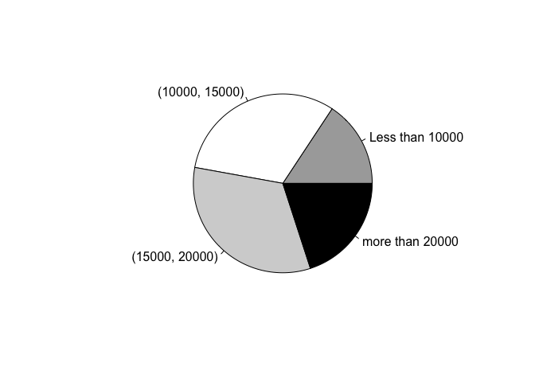

2. Question 2 - HoF pitching continued (WAR)
+ Using the hist function, construct a histogram of WAR for the pitchers in the Hall of Fame dataset.


```r
ggplot(hofpitching, aes(WAR)) + 
  theme_bw() + 
  geom_histogram(bins = 15) + 
  ylab("Count")
```

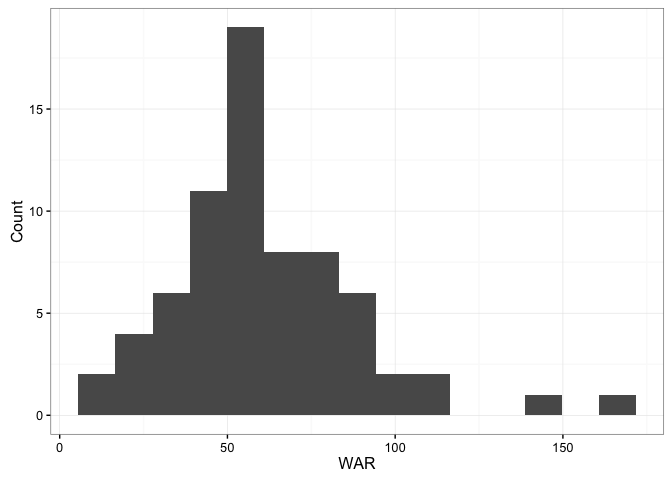

+ There are two pitchers who stand out among all of the Hall of Famers on the total WAR variable. Identify these two pitchers.


```r
hofpitching %>% arrange(desc(WAR)) %>% slice(1:2) 
```

```
## # A tibble: 2 × 31
##      Rk           Name Inducted   Yrs  From    To   ASG   WAR     W     L
##   <int>          <chr>    <int> <int> <int> <int> <int> <dbl> <int> <int>
## 1    69       Cy Young     1937    22  1890  1911     0 162.3   511   316
## 2    30 Walter Johnson     1936    21  1907  1927     0 144.7   417   279
##   `W-L%`   ERA     G    GS    GF    CG   SHO    SV     IP     H     R
##    <dbl> <dbl> <int> <int> <int> <int> <int> <int>  <dbl> <int> <int>
## 1  0.618  2.63   906   815    84   749    76    17 7356.0  7092  3167
## 2  0.599  2.17   802   666   127   531   110    34 5914.1  4913  1902
##      ER    HR    BB   IBB    SO   HBP    BK    WP    BF        BF.group
##   <int> <int> <int> <int> <int> <int> <int> <int> <int>          <fctr>
## 1  2147   138  1217    NA  2803   161     3   156 29565 more than 20000
## 2  1424    97  1363    NA  3509   205     4   154 23405 more than 20000
```

```r
# The two pitchers are Cy Young and Walter Johnson
```

3. Question 3 - HoF data set continued - To understand a pitcher’s season contribution, suppose we define the new variable WAR.Season defined by hofpitching$WAR.Season <- with(hofpitching, WAR / Yrs)


```r
hofpitching <- hofpitching %>% mutate(WAR.Season = (WAR / Yrs))
head(hofpitching)
```

```
## # A tibble: 6 × 32
##      Rk           Name Inducted   Yrs  From    To   ASG   WAR     W     L
##   <int>          <chr>    <int> <int> <int> <int> <int> <dbl> <int> <int>
## 1     1 Pete Alexander     1938    20  1911  1930     0 112.8   373   208
## 2     2   Chief Bender     1953    16  1903  1925     0  40.8   212   127
## 3     3  Bert Blyleven     2011    22  1970  1992     2  90.7   287   250
## 4     4 Mordecai Brown     1949    14  1903  1916     0  51.7   239   130
## 5     5    Jim Bunning     1996    17  1955  1971     9  56.7   224   184
## 6     6  Steve Carlton     1994    24  1965  1988    10  78.6   329   244
##   `W-L%`   ERA     G    GS    GF    CG   SHO    SV     IP     H     R
##    <dbl> <dbl> <int> <int> <int> <int> <int> <int>  <dbl> <int> <int>
## 1  0.642  2.56   696   600    80   437    90    32 5190.0  4868  1852
## 2  0.625  2.46   459   334   109   255    40    34 3017.0  2645  1108
## 3  0.534  3.31   692   685     3   242    60     0 4970.0  4632  2029
## 4  0.648  2.06   481   332   138   271    55    49 3172.1  2708  1044
## 5  0.549  3.27   591   519    39   151    40    16 3760.1  3433  1527
## 6  0.574  3.22   741   709    13   254    55     2 5217.2  4672  2130
##      ER    HR    BB   IBB    SO   HBP    BK    WP    BF        BF.group
##   <int> <int> <int> <int> <int> <int> <int> <int> <int>          <fctr>
## 1  1476   165   951    NA  2198    70     1    38 20893 more than 20000
## 2   823    40   712    NA  1711   102    10    79 11895  (10000, 15000)
## 3  1830   430  1322    71  3701   155    19   114 20491 more than 20000
## 4   725    43   673    NA  1375    61     4    61 12422  (10000, 15000)
## 5  1366   372  1000    98  2855   160     8    47 15618  (15000, 20000)
## 6  1864   414  1833   150  4136    53    90   183 21683 more than 20000
##   WAR.Season
##        <dbl>
## 1   5.640000
## 2   2.550000
## 3   4.122727
## 4   3.692857
## 5   3.335294
## 6   3.275000
```
+ Use the stripchart function to construct parallel stripcharts of WAR.Season for the different levels of BF.group.
  

```r
ggplot(hofpitching, aes(y = WAR.Season, x = BF.group)) + 
  theme_bw() + 
  geom_point(size = 2)  + 
  theme(panel.grid.major.x = element_blank(), panel.grid.minor.y = element_blank(), panel.grid.major.y = element_line(color = "grey60", linetype = "dashed")) + 
  ylab("WAR / Years") + 
  xlab("Batters Faced")
```

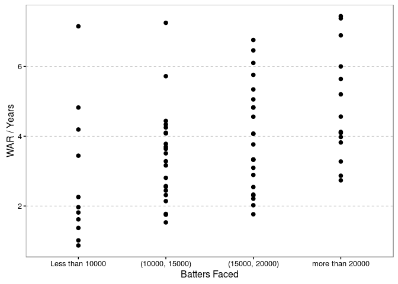

+ Use the boxplot function to construct parallel boxplots of WAR.Season across BP.group.


```r
ggplot(hofpitching, aes(y = WAR.Season, x = BF.group)) + 
  theme_bw() + 
  geom_boxplot(fill = "grey") + 
  ylab("WAR / Years") + 
  xlab("Batters Faced")
```

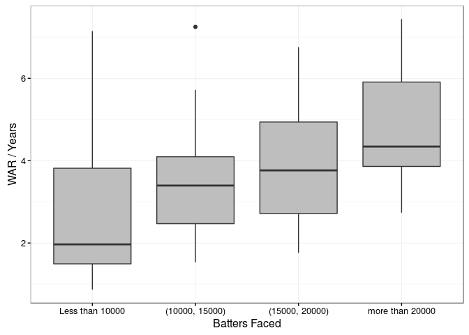
+ Based on your graphs, how does the wins above replacement per season depend on the number of batters faced?


```r
ggplot(hofpitching, aes(x = BF, y = WAR.Season)) + 
  theme_bw() + 
  ylim(0, 8) + 
  xlim(0, 30000) + 
  geom_point(size = 2) + 
  stat_smooth(method = "lm", col = "black") + 
  ylab("WAR / Years") + 
  xlab("Batters Faced")
```

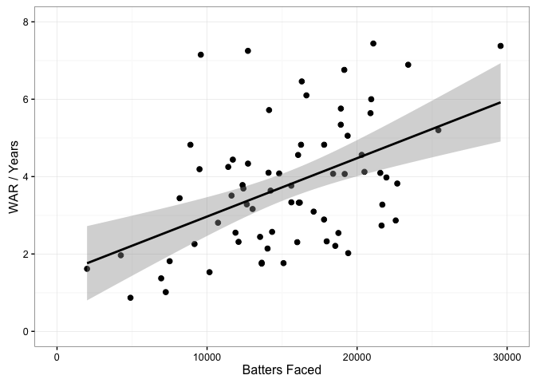

```r
# There is a positive relationship between WAR / Years and batters faced. It appears that the slope is driven by a few outliers.
```

4. Question 4 - Suppose we limit our exploration to pitchers whose mid-career was 1960 or later. We first define the MidYear variable and then use the subset function to construct a data frame consisting of only these 1960+ pitchers.


```r
hofpitching <- hofpitching %>% 
  mutate(MidYear = ((From + To) / 2))
head(hofpitching)
```

```
## # A tibble: 6 × 33
##      Rk           Name Inducted   Yrs  From    To   ASG   WAR     W     L
##   <int>          <chr>    <int> <int> <int> <int> <int> <dbl> <int> <int>
## 1     1 Pete Alexander     1938    20  1911  1930     0 112.8   373   208
## 2     2   Chief Bender     1953    16  1903  1925     0  40.8   212   127
## 3     3  Bert Blyleven     2011    22  1970  1992     2  90.7   287   250
## 4     4 Mordecai Brown     1949    14  1903  1916     0  51.7   239   130
## 5     5    Jim Bunning     1996    17  1955  1971     9  56.7   224   184
## 6     6  Steve Carlton     1994    24  1965  1988    10  78.6   329   244
##   `W-L%`   ERA     G    GS    GF    CG   SHO    SV     IP     H     R
##    <dbl> <dbl> <int> <int> <int> <int> <int> <int>  <dbl> <int> <int>
## 1  0.642  2.56   696   600    80   437    90    32 5190.0  4868  1852
## 2  0.625  2.46   459   334   109   255    40    34 3017.0  2645  1108
## 3  0.534  3.31   692   685     3   242    60     0 4970.0  4632  2029
## 4  0.648  2.06   481   332   138   271    55    49 3172.1  2708  1044
## 5  0.549  3.27   591   519    39   151    40    16 3760.1  3433  1527
## 6  0.574  3.22   741   709    13   254    55     2 5217.2  4672  2130
##      ER    HR    BB   IBB    SO   HBP    BK    WP    BF        BF.group
##   <int> <int> <int> <int> <int> <int> <int> <int> <int>          <fctr>
## 1  1476   165   951    NA  2198    70     1    38 20893 more than 20000
## 2   823    40   712    NA  1711   102    10    79 11895  (10000, 15000)
## 3  1830   430  1322    71  3701   155    19   114 20491 more than 20000
## 4   725    43   673    NA  1375    61     4    61 12422  (10000, 15000)
## 5  1366   372  1000    98  2855   160     8    47 15618  (15000, 20000)
## 6  1864   414  1833   150  4136    53    90   183 21683 more than 20000
##   WAR.Season MidYear
##        <dbl>   <dbl>
## 1   5.640000  1920.5
## 2   2.550000  1914.0
## 3   4.122727  1981.0
## 4   3.692857  1909.5
## 5   3.335294  1963.0
## 6   3.275000  1976.5
```

```r
hofpitching.recent <- hofpitching %>% 
  filter(MidYear >= 1960)
min(hofpitching.recent$MidYear)
```

```
## [1] 1960.5
```

+ By use of the order function, order the rows of the data frame by the value of WAR.Season.

```r
hofpitching.recent %>% arrange(desc(WAR.Season))
```

```
## # A tibble: 20 × 33
##       Rk             Name Inducted   Yrs  From    To   ASG   WAR     W
##    <int>            <chr>    <int> <int> <int> <int> <int> <dbl> <int>
## 1     56       Tom Seaver     1992    20  1967  1986    12 101.1   311
## 2     19       Bob Gibson     1981    17  1959  1975     9  77.5   251
## 3     33     Sandy Koufax     1972    12  1955  1966     7  50.3   165
## 4      3    Bert Blyleven     2011    22  1970  1992     2  90.7   287
## 5     12     Don Drysdale     1984    14  1956  1969     9  57.4   209
## 6     29   Fergie Jenkins     1991    19  1965  1983     3  77.4   284
## 7     47    Gaylord Perry     1991    22  1962  1983     5  87.5   314
## 8     42      Phil Niekro     1997    24  1964  1987     5  91.7   318
## 9     36    Juan Marichal     1983    16  1960  1975    10  58.2   243
## 10     5      Jim Bunning     1996    17  1955  1971     9  56.7   224
## 11    45       Jim Palmer     1990    19  1965  1984     6  63.2   268
## 12     6    Steve Carlton     1994    24  1965  1988    10  78.6   329
## 13    55       Nolan Ryan     1999    27  1966  1993     8  77.4   324
## 14    60       Don Sutton     1998    23  1966  1988     4  62.9   324
## 15    13 Dennis Eckersley     2004    24  1975  1998     6  58.6   197
## 16    66     Hoyt Wilhelm     1985    21  1952  1972     8  47.4   143
## 17    28   Catfish Hunter     1987    15  1965  1979     8  32.1   224
## 18    59     Bruce Sutter     2006    12  1976  1988     6  23.6    68
## 19    21     Rich Gossage     2008    22  1972  1994     9  39.9   124
## 20    16   Rollie Fingers     1992    17  1968  1985     7  23.3   114
##        L `W-L%`   ERA     G    GS    GF    CG   SHO    SV     IP     H
##    <int>  <dbl> <dbl> <int> <int> <int> <int> <int> <int>  <dbl> <int>
## 1    205  0.603  2.86   656   647     6   231    61     1 4783.0  3971
## 2    174  0.591  2.91   528   482    21   255    56     6 3884.1  3279
## 3     87  0.655  2.76   397   314    44   137    40     9 2324.1  1754
## 4    250  0.534  3.31   692   685     3   242    60     0 4970.0  4632
## 5    166  0.557  2.95   518   465    34   167    49     6 3432.0  3084
## 6    226  0.557  3.34   664   594    37   267    49     7 4500.2  4142
## 7    265  0.542  3.11   777   690    33   303    53    11 5350.0  4938
## 8    274  0.537  3.35   864   716    83   245    45    29 5404.0  5044
## 9    142  0.631  2.89   471   457    11   244    52     2 3507.0  3153
## 10   184  0.549  3.27   591   519    39   151    40    16 3760.1  3433
## 11   152  0.638  2.86   558   521    15   211    53     4 3948.0  3349
## 12   244  0.574  3.22   741   709    13   254    55     2 5217.2  4672
## 13   292  0.526  3.19   807   773    13   222    61     3 5386.0  3923
## 14   256  0.559  3.26   774   756    12   178    58     5 5282.1  4692
## 15   171  0.535  3.50  1071   361   577   100    20   390 3285.2  3076
## 16   122  0.540  2.52  1070    52   651    20     5   227 2254.1  1757
## 17   166  0.574  3.26   500   476     6   181    42     1 3449.1  2958
## 18    71  0.489  2.83   661     0   512     0     0   300 1042.0   879
## 19   107  0.537  3.01  1002    37   681    16     0   310 1809.1  1497
## 20   118  0.491  2.90   944    37   709     4     2   341 1701.1  1474
##        R    ER    HR    BB   IBB    SO   HBP    BK    WP    BF
##    <int> <int> <int> <int> <int> <int> <int> <int> <int> <int>
## 1   1674  1521   380  1390   116  3640    76     8   126 19369
## 2   1420  1258   257  1336   118  3117   102    13   108 16068
## 3    806   713   204   817    48  2396    18     7    87  9497
## 4   2029  1830   430  1322    71  3701   155    19   114 20491
## 5   1292  1124   280   855   123  2486   154    10    82 14097
## 6   1853  1669   484   997   116  3192    84    18    62 18400
## 7   2128  1846   399  1379   164  3534   108     6   160 21953
## 8   2337  2012   482  1809    86  3342   123    42   226 22677
## 9   1329  1126   320   709    82  2303    40    20    51 14236
## 10  1527  1366   372  1000    98  2855   160     8    47 15618
## 11  1395  1253   303  1311    37  2212    38    11    85 16114
## 12  2130  1864   414  1833   150  4136    53    90   183 21683
## 13  2178  1911   321  2795    78  5714   158    33   277 22575
## 14  2104  1914   472  1343   102  3574    82    21   112 21631
## 15  1382  1278   347   738    91  2401    75    16    28 13534
## 16   773   632   150   778    61  1610    62     4    90  9164
## 17  1380  1248   374   954    57  2012    49     7    49 14032
## 18   370   328    77   309    83   861    13     8    37  4252
## 19   670   605   119   732    90  1502    47     5    63  7507
## 20   615   549   123   492   109  1299    39     7    40  6942
##           BF.group WAR.Season MidYear
##             <fctr>      <dbl>   <dbl>
## 1   (15000, 20000)   5.055000  1976.5
## 2   (15000, 20000)   4.558824  1967.0
## 3  Less than 10000   4.191667  1960.5
## 4  more than 20000   4.122727  1981.0
## 5   (10000, 15000)   4.100000  1962.5
## 6   (15000, 20000)   4.073684  1974.0
## 7  more than 20000   3.977273  1972.5
## 8  more than 20000   3.820833  1975.5
## 9   (10000, 15000)   3.637500  1967.5
## 10  (15000, 20000)   3.335294  1963.0
## 11  (15000, 20000)   3.326316  1974.5
## 12 more than 20000   3.275000  1976.5
## 13 more than 20000   2.866667  1979.5
## 14 more than 20000   2.734783  1977.0
## 15  (10000, 15000)   2.441667  1986.5
## 16 Less than 10000   2.257143  1962.0
## 17  (10000, 15000)   2.140000  1972.0
## 18 Less than 10000   1.966667  1982.0
## 19 Less than 10000   1.813636  1983.0
## 20 Less than 10000   1.370588  1976.5
```

+ Construct a dot plot of the values of WAR.Season where the labels are the pitcher names.


```r
ggplot(hofpitching.recent, aes(x = WAR.Season, y = reorder(Name, WAR.Season))) + 
  theme_bw() + 
  geom_point(size = 2) + 
  theme(panel.grid.major.x = element_blank(), panel.grid.minor.y = element_blank(), panel.grid.major.y = element_line(color = "grey60", linetype = "dashed")) + 
  xlim(1, 5.5) + 
  ylab("Name") + 
  xlab("War / Season")
```

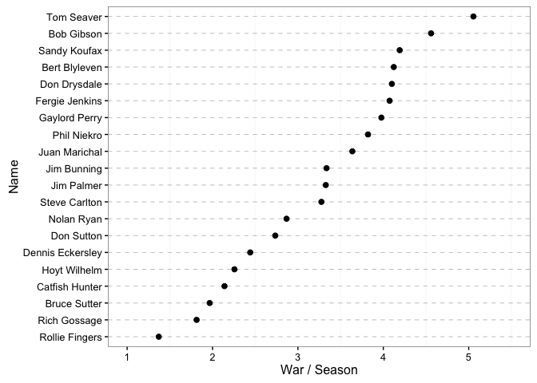
+ Which two 1960+ pitchers stand out with respect to wins above replacement per season?

```r
# Tough question. To me, Tom Seaver is nearly a full WAR point above Koufax, which blows my mind. Rollie Fingers has a rather low WAR at ~1.5.  
```

5. Question 5 - The variables MidYear and WAR.Season are defined in the previous exercises.
+ Construct a scatterplot of MidYear (horizontal) against WAR.Season (vertical).
+ Is there a general pattern in this scatterplot? Explain.

```r
ggplot(hofpitching, aes(x = MidYear, y = WAR.Season)) + 
  theme_bw() + 
  geom_point(size = 2) + 
  ylim(0, 8) + ylab("WAR / Season") + 
  xlab("Midyear of Career") + 
  stat_smooth(method = "lm", col = "black")
```

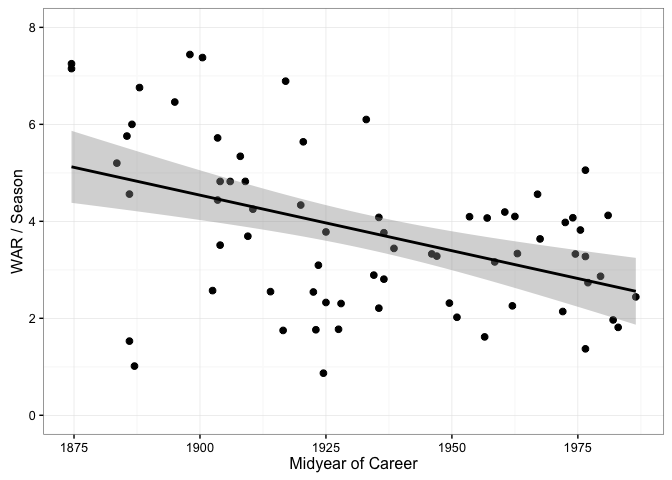

```r
# I see a negative association between WAR.Season and mid year of career.
```

+ There are two pitchers whose mid careers were in the 1800s who had relatively low WAR.Season values. Use the identify function with the scatterplot to find the names of these two pitchers.


```r
hofpitching %>% filter(WAR.Season < 2 & MidYear < 1900)
```

```
## # A tibble: 2 × 33
##      Rk       Name Inducted   Yrs  From    To   ASG   WAR     W     L
##   <int>      <chr>    <int> <int> <int> <int> <int> <dbl> <int> <int>
## 1    43 Hank O'Day     2013     7  1884  1890     0   7.1    73   110
## 2    64 Monte Ward     1964    17  1878  1894     0  26.0   164   103
##   `W-L%`   ERA     G    GS    GF    CG   SHO    SV     IP     H     R
##    <dbl> <dbl> <int> <int> <int> <int> <int> <int>  <dbl> <int> <int>
## 1  0.399  3.74   201   192     8   177     5     4 1651.1  1655  1128
## 2  0.614  2.10   293   262    32   245    24     3 2469.2  2324  1185
##      ER    HR    BB   IBB    SO   HBP    BK    WP    BF        BF.group
##   <int> <int> <int> <int> <int> <int> <int> <int> <int>          <fctr>
## 1   687    65   578    NA   663    81     0   122  7247 Less than 10000
## 2   576    26   253    NA   920    NA     0   144 10164  (10000, 15000)
##   WAR.Season MidYear
##        <dbl>   <dbl>
## 1   1.014286    1887
## 2   1.529412    1886
```

```r
# The two pitchers are Hank O'Day and Monte Ward
```

6. Question 6 - The Lahman data set
+ Read the Lahman “Master.csv” and “batting.csv” data files into R. *Already done*
+ Use the *getinfo* to obtain three data frames for the season batting statistics for the great hitters Ty Cobb, Ted Williams, and Pete Rose.
    + Add the variable Age to each data frame corresponding to the ages of the three players.

```r
Cobb.info <- getinfo("Ty", "Cobb")
Williams.info <- getinfo("Ted", "Williams")
Rose.info <- getinfo("Pete", "Rose")

Cobb.data <- Batting %>% 
  filter(playerID == Cobb.info$name.code) %>% 
  mutate(Age = yearID - Cobb.info$byear)

Williams.data <- Batting %>% filter(playerID == Williams.info$name.code) %>% mutate(Age = yearID - Williams.info$byear)

Rose.data <- Batting %>% filter(playerID == Rose.info$name.code[1]) %>% mutate(Age = yearID - Rose.info$byear[1])

# We need to do a little manipulation to run ggplot with the three batters.
CWR <- rbind(Cobb.data, Williams.data, Rose.data)
CWR <- CWR %>% select(playerID, H, Age) %>% group_by(playerID) %>% mutate(cumH = cumsum(H))
```
+ Using the plot function, construct a line graph of the cumulative hit totals against age for Pete Rose.
  

```r
ggplot(Rose.data, aes(y = cumsum(H), x = Age)) + 
  theme_bw() + 
  geom_line(size = 1.25) + 
  ylab("Hits")
```

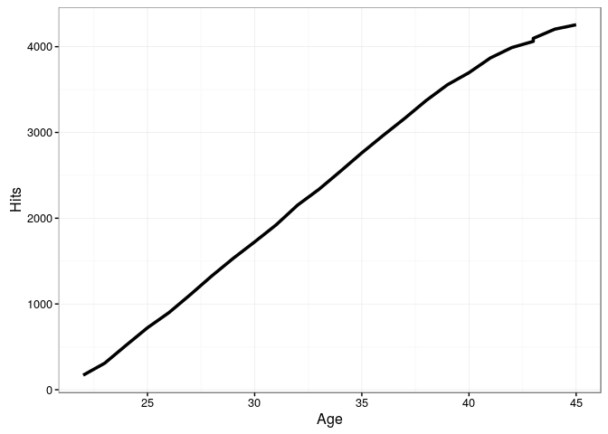
+ Using the lines function, overlay the cumulative hit totals for Cobb and Williams.
  

```r
ggplot(CWR, aes(y = cumH, x = Age)) + 
  theme_bw() + 
  geom_line(size = 1.25, aes(color = playerID)) 
```

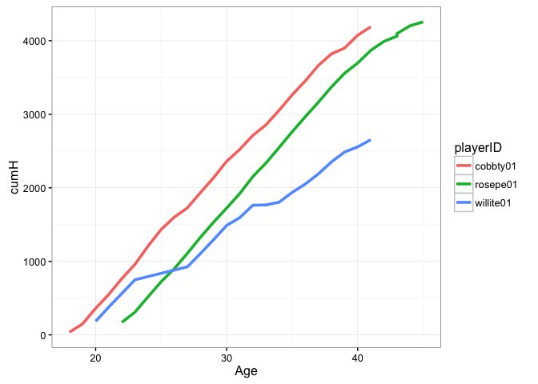

+ Write a short paragraph summarizing what you have learned about the hitting pattern of these three players.
  *Nah, I'm good. Thanks*
  
7. Question 7 - Retrosheet play-by-play data
+ Following the work in Section 3.9, create the two data frames mac.data and sosa.data containing the batting data for the two players.
  + Use the following R commands to restrict the two data frames to the plays where a batting event occurred. (The relevant variable BAT EVENT FL is either TRUE or FALSE.)
mac.data <- subset(mac.data, BAT_EVENT_FL == TRUE)
sosa.data <- subset(sosa.data, BAT_EVENT_FL == TRUE)


```r
mac.data <- mac.data %>% filter(BAT_EVENT_FL == TRUE)
sosa.data <- sosa.data %>% filter(BAT_EVENT_FL == TRUE)
```

For each data frame, create a new variable PA that numbers the plate appearances 1, 2, ... (The function nrow gives the number of rows of a data frame.)


```r
mac.data <- mac.data %>% mutate(PA = 1:nrow(mac.data))
sosa.data <- sosa.data %>% mutate(PA = 1:nrow(sosa.data))
```

+ The following commands will return the numbers of the plate appearances when the players hit home runs.
+ Using the R function diff, the following commands compute the spacings between the occurrences of home runs.


```r
mac.HR.PA <- mac.data %>% 
  filter(EVENT_CD == 23) %>% 
  select(PA) %>% 
  mutate(spacings = diff(c(0, PA)))
sosa.HR.PA <- sosa.data %>% 
  filter(EVENT_CD == 23) %>% select(PA) %>% 
  mutate(spacings = diff(c(0, PA)))
```

+ By use of the summary and hist functions on the vectors
mac.spacings and sosa.spacings, compare the home run spacings of the two players.


```r
summary(mac.HR.PA$spacings); summary(sosa.HR.PA$spacings)
```

```
##    Min. 1st Qu.  Median    Mean 3rd Qu.    Max. 
##   1.000   3.000   7.000   9.729  13.000  40.000
```

```
##    Min. 1st Qu.  Median    Mean 3rd Qu.    Max. 
##    1.00    4.00    8.00   10.68   15.75   48.00
```

```r
ggplot(mac.HR.PA, aes(spacings)) + 
  theme_bw() + 
  geom_histogram(bins = 20) + 
  ggtitle("McGwire") + 
  xlab("ABs between HRs") + 
  ylab("Count") + 
  xlim(0, 50)
```

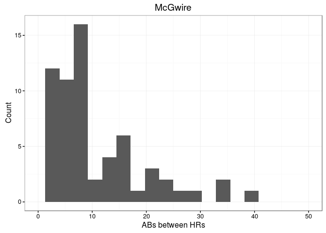

```r
ggplot(sosa.HR.PA, aes(spacings)) + 
  theme_bw() + 
  geom_histogram(bins = 20) + 
  ggtitle("Sosa") + 
  xlab("ABs between HRs") + 
  ylab("Count") + 
  xlim(0, 50)
```

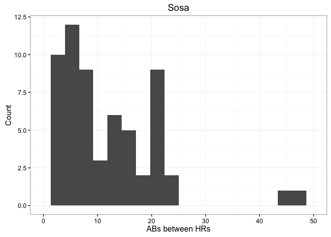
