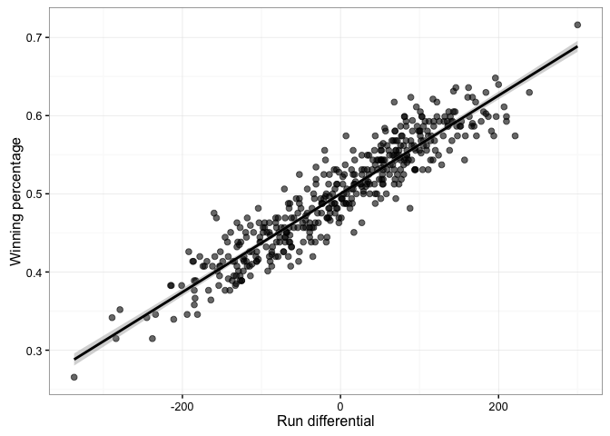
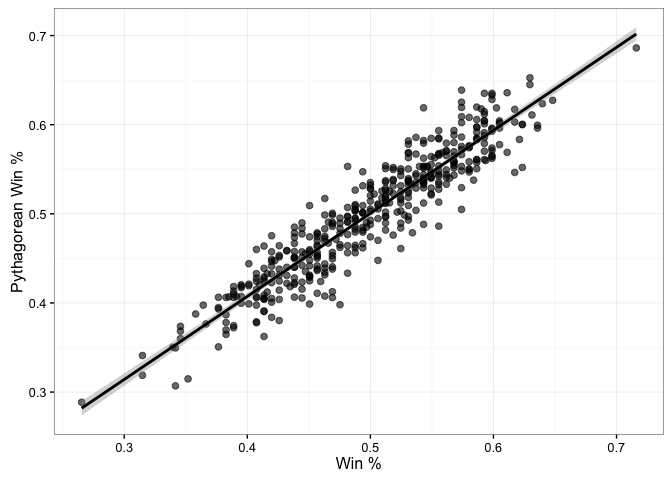
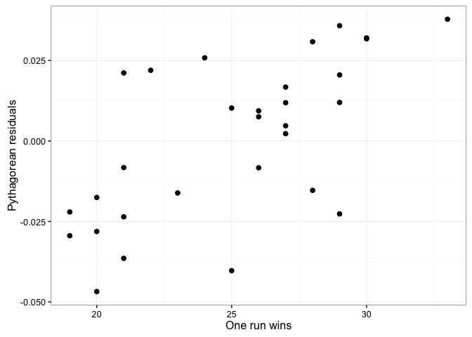
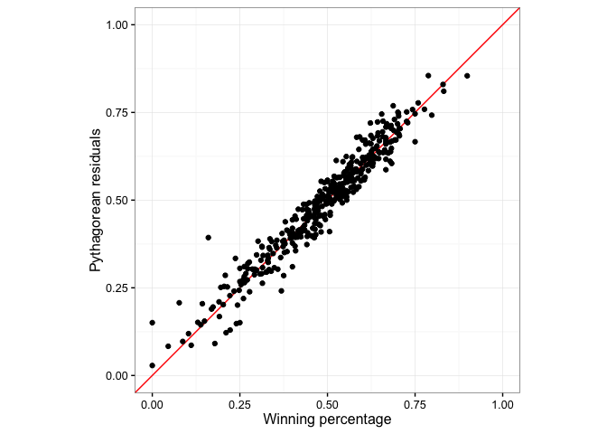
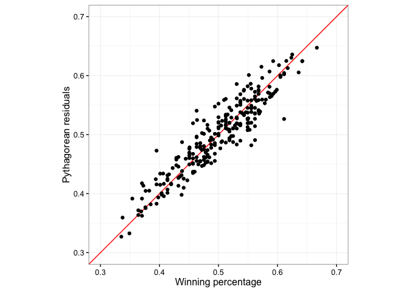

# tidy Baseball Chapter 4
C. A. Hamm  
`r format(Sys.Date())`  


### Chapter 4 -  The relation between runs and wins


```r
library("Lahman")
library("dplyr"); options(dplyr.width = Inf)
```

```
## 
## Attaching package: 'dplyr'
```

```
## The following objects are masked from 'package:stats':
## 
##     filter, lag
```

```
## The following objects are masked from 'package:base':
## 
##     intersect, setdiff, setequal, union
```

```r
library("ggplot2")
library("devtools")
library("readr")

set.seed(8761825)
session_info()
```

```
## Session info --------------------------------------------------------------
```

```
##  setting  value                       
##  version  R version 3.3.1 (2016-06-21)
##  system   x86_64, darwin13.4.0        
##  ui       X11                         
##  language (EN)                        
##  collate  en_US.UTF-8                 
##  tz       America/New_York            
##  date     2016-09-16
```

```
## Packages ------------------------------------------------------------------
```

```
##  package    * version date       source        
##  assertthat   0.1     2013-12-06 CRAN (R 3.3.0)
##  colorspace   1.2-6   2015-03-11 CRAN (R 3.3.0)
##  DBI          0.5-1   2016-09-10 CRAN (R 3.3.0)
##  devtools   * 1.12.0  2016-06-24 CRAN (R 3.3.0)
##  digest       0.6.10  2016-08-02 CRAN (R 3.3.1)
##  dplyr      * 0.5.0   2016-06-24 CRAN (R 3.3.0)
##  evaluate     0.9     2016-04-29 CRAN (R 3.3.0)
##  formatR      1.4     2016-05-09 CRAN (R 3.3.0)
##  ggplot2    * 2.1.0   2016-03-01 CRAN (R 3.3.0)
##  gtable       0.2.0   2016-02-26 CRAN (R 3.3.0)
##  htmltools    0.3.5   2016-03-21 CRAN (R 3.3.0)
##  knitr        1.14    2016-08-13 CRAN (R 3.3.0)
##  Lahman     * 5.0-0   2016-08-27 CRAN (R 3.3.0)
##  magrittr     1.5     2014-11-22 CRAN (R 3.3.0)
##  memoise      1.0.0   2016-01-29 CRAN (R 3.3.0)
##  munsell      0.4.3   2016-02-13 CRAN (R 3.3.0)
##  plyr         1.8.4   2016-06-08 CRAN (R 3.3.0)
##  R6           2.1.3   2016-08-19 CRAN (R 3.3.0)
##  Rcpp         0.12.7  2016-09-05 CRAN (R 3.3.0)
##  readr      * 1.0.0   2016-08-03 CRAN (R 3.3.0)
##  rmarkdown    1.0     2016-07-08 CRAN (R 3.3.0)
##  scales       0.4.0   2016-02-26 CRAN (R 3.3.0)
##  stringi      1.1.1   2016-05-27 CRAN (R 3.3.0)
##  stringr      1.1.0   2016-08-19 CRAN (R 3.3.0)
##  tibble       1.2     2016-08-26 CRAN (R 3.3.0)
##  withr        1.0.2   2016-06-20 CRAN (R 3.3.0)
##  yaml         2.1.13  2014-06-12 CRAN (R 3.3.0)
```

### Section 4.2 - Teams in Lahman's Database

```r
# The Teams table is includedin the Lahman package

str(Teams)
```

```
## 'data.frame':	2805 obs. of  48 variables:
##  $ yearID        : int  1871 1871 1871 1871 1871 1871 1871 1871 1871 1872 ...
##  $ lgID          : Factor w/ 7 levels "AA","AL","FL",..: 4 4 4 4 4 4 4 4 4 4 ...
##  $ teamID        : Factor w/ 149 levels "ALT","ANA","ARI",..: 24 31 39 56 90 97 111 136 142 8 ...
##  $ franchID      : Factor w/ 120 levels "ALT","ANA","ARI",..: 13 36 25 56 70 85 91 109 77 9 ...
##  $ divID         : chr  NA NA NA NA ...
##  $ Rank          : int  3 2 8 7 5 1 9 6 4 2 ...
##  $ G             : int  31 28 29 19 33 28 25 29 32 58 ...
##  $ Ghome         : int  NA NA NA NA NA NA NA NA NA NA ...
##  $ W             : int  20 19 10 7 16 21 4 13 15 35 ...
##  $ L             : int  10 9 19 12 17 7 21 15 15 19 ...
##  $ DivWin        : chr  NA NA NA NA ...
##  $ WCWin         : chr  NA NA NA NA ...
##  $ LgWin         : chr  "N" "N" "N" "N" ...
##  $ WSWin         : chr  NA NA NA NA ...
##  $ R             : int  401 302 249 137 302 376 231 351 310 617 ...
##  $ AB            : int  1372 1196 1186 746 1404 1281 1036 1248 1353 2576 ...
##  $ H             : int  426 323 328 178 403 410 274 384 375 747 ...
##  $ X2B           : int  70 52 35 19 43 66 44 51 54 94 ...
##  $ X3B           : int  37 21 40 8 21 27 25 34 26 35 ...
##  $ HR            : int  3 10 7 2 1 9 3 6 6 14 ...
##  $ BB            : int  60 60 26 33 33 46 38 49 48 27 ...
##  $ SO            : int  19 22 25 9 15 23 30 19 13 28 ...
##  $ SB            : int  73 69 18 16 46 56 53 62 48 35 ...
##  $ CS            : int  NA NA NA NA NA NA NA NA NA 15 ...
##  $ HBP           : int  NA NA NA NA NA NA NA NA NA NA ...
##  $ SF            : int  NA NA NA NA NA NA NA NA NA NA ...
##  $ RA            : int  303 241 341 243 313 266 287 362 303 434 ...
##  $ ER            : int  109 77 116 97 121 137 108 153 137 173 ...
##  $ ERA           : num  3.55 2.76 4.11 5.17 3.72 4.95 4.3 5.51 4.37 3.02 ...
##  $ CG            : int  22 25 23 19 32 27 23 28 32 48 ...
##  $ SHO           : int  1 0 0 1 1 0 1 0 0 1 ...
##  $ SV            : int  3 1 0 0 0 0 0 0 0 1 ...
##  $ IPouts        : int  828 753 762 507 879 747 678 750 846 1545 ...
##  $ HA            : int  367 308 346 261 373 329 315 431 371 566 ...
##  $ HRA           : int  2 6 13 5 7 3 3 4 4 3 ...
##  $ BBA           : int  42 28 53 21 42 53 34 75 45 63 ...
##  $ SOA           : int  23 22 34 17 22 16 16 12 13 0 ...
##  $ E             : int  225 218 223 163 227 194 220 198 217 432 ...
##  $ DP            : int  NA NA NA NA NA NA NA NA NA NA ...
##  $ FP            : num  0.83 0.82 0.81 0.8 0.83 0.84 0.82 0.84 0.85 0.82 ...
##  $ name          : chr  "Boston Red Stockings" "Chicago White Stockings" "Cleveland Forest Citys" "Fort Wayne Kekiongas" ...
##  $ park          : chr  "South End Grounds I" "Union Base-Ball Grounds" "National Association Grounds" "Hamilton Field" ...
##  $ attendance    : int  NA NA NA NA NA NA NA NA NA NA ...
##  $ BPF           : int  103 104 96 101 90 102 97 101 94 106 ...
##  $ PPF           : int  98 102 100 107 88 98 99 100 98 102 ...
##  $ teamIDBR      : chr  "BOS" "CHI" "CLE" "KEK" ...
##  $ teamIDlahman45: chr  "BS1" "CH1" "CL1" "FW1" ...
##  $ teamIDretro   : chr  "BS1" "CH1" "CL1" "FW1" ...
```

```r
tail(Teams)
```

```
##      yearID lgID teamID franchID divID Rank   G Ghome  W  L DivWin WCWin
## 2800   2015   NL    PHI      PHI     E    5 162    81 63 99      N     N
## 2801   2015   NL    LAN      LAD     W    1 162    81 92 70      Y     N
## 2802   2015   NL    SFN      SFG     W    2 162    81 84 78      N     N
## 2803   2015   NL    ARI      ARI     W    3 162    81 79 83      N     N
## 2804   2015   NL    SDN      SDP     W    4 162    81 74 88      N     N
## 2805   2015   NL    COL      COL     W    5 162    81 68 94      N     N
##      LgWin WSWin   R   AB    H X2B X3B  HR  BB   SO  SB CS HBP SF  RA  ER
## 2800     N     N 626 5529 1374 272  37 130 387 1274  88 32  54 29 809 749
## 2801     N     N 667 5385 1346 263  26 187 563 1258  59 34  60 30 595 553
## 2802     N     N 696 5565 1486 288  39 136 457 1159  93 36  49 37 627 597
## 2803     N     N 720 5649 1494 289  48 154 490 1312 132 44  33 57 713 659
## 2804     N     N 650 5457 1324 260  36 148 426 1327  82 29  40 42 731 655
## 2805     N     N 737 5572 1479 274  49 186 388 1283  97 43  33 34 844 799
##       ERA CG SHO SV IPouts   HA HRA BBA  SOA   E  DP    FP
## 2800 4.69  1   7 35   4309 1592 191 488 1153 117 145 0.981
## 2801 3.44  6  21 47   4337 1317 145 395 1396  75 133 0.988
## 2802 3.72  7  18 41   4333 1344 155 431 1165  78 145 0.987
## 2803 4.04  1  12 44   4400 1450 182 500 1215  86 146 0.986
## 2804 4.09  1   6 41   4321 1371 171 516 1393  92 138 0.985
## 2805 5.04  4   4 36   4279 1579 183 579 1112  95 171 0.985
##                       name               park attendance BPF PPF teamIDBR
## 2800 Philadelphia Phillies Citizens Bank Park    1831080  98  98      PHI
## 2801   Los Angeles Dodgers     Dodger Stadium    3764815 101  98      LAD
## 2802  San Francisco Giants          AT&T Park    3375882  99  97      SFG
## 2803  Arizona Diamondbacks        Chase Field    2080145 107 106      ARI
## 2804      San Diego Padres         Petco Park    2459742  98  97      SDP
## 2805      Colorado Rockies        Coors Field    2506789 119 118      COL
##      teamIDlahman45 teamIDretro
## 2800            PHI         PHI
## 2801            LAN         LAN
## 2802            SFN         SFN
## 2803            ARI         ARI
## 2804            SDN         SDN
## 2805            COL         COL
```

```r
dim(Teams)
```

```
## [1] 2805   48
```

```r
# run differential is the difference between runs scored and runs allowed. Rather than use the with statements in section 4.2 we will use a dplyr pipeline

myteams <- Teams %>% filter(yearID > 2000) %>% 
  select(teamID, yearID, lgID, G, W, L, R, RA) %>% 
  mutate(RD = R - RA, Wpct = W / (W + L))
tail(myteams)
```

```
##     teamID yearID lgID   G  W  L   R  RA   RD      Wpct
## 445    PHI   2015   NL 162 63 99 626 809 -183 0.3888889
## 446    LAN   2015   NL 162 92 70 667 595   72 0.5679012
## 447    SFN   2015   NL 162 84 78 696 627   69 0.5185185
## 448    ARI   2015   NL 162 79 83 720 713    7 0.4876543
## 449    SDN   2015   NL 162 74 88 650 731  -81 0.4567901
## 450    COL   2015   NL 162 68 94 737 844 -107 0.4197531
```

```r
# Figure 4.1
ggplot(myteams, aes(x = RD, y = Wpct)) + 
  geom_point(cex = 2, alpha = 0.6) + 
  theme_bw() + 
  stat_smooth(method = lm, colour = "black") + 
  xlab("Run differential") + 
  ylab("Winning percentage")
```

<!-- -->


```r
linfit <- lm(Wpct ~ RD, data = myteams)
summary(linfit)
```

```
## 
## Call:
## lm(formula = Wpct ~ RD, data = myteams)
## 
## Residuals:
##       Min        1Q    Median        3Q       Max 
## -0.073839 -0.018624 -0.001364  0.017197  0.075914 
## 
## Coefficients:
##              Estimate Std. Error t value Pr(>|t|)    
## (Intercept) 5.000e-01  1.186e-03   421.7   <2e-16 ***
## RD          6.287e-04  1.123e-05    56.0   <2e-16 ***
## ---
## Signif. codes:  0 '***' 0.001 '**' 0.01 '*' 0.05 '.' 0.1 ' ' 1
## 
## Residual standard error: 0.02515 on 448 degrees of freedom
## Multiple R-squared:  0.875,	Adjusted R-squared:  0.8747 
## F-statistic:  3137 on 1 and 448 DF,  p-value: < 2.2e-16
```

```r
# Wpct = 0.50 + 0.000628 * RD

myteams <- myteams %>% 
  mutate(linWpct = predict(linfit), linResiduals = residuals(linfit))
tail(myteams)
```

```
##     teamID yearID lgID   G  W  L   R  RA   RD      Wpct   linWpct
## 445    PHI   2015   NL 162 63 99 626 809 -183 0.3888889 0.3849333
## 446    LAN   2015   NL 162 92 70 667 595   72 0.5679012 0.5452608
## 447    SFN   2015   NL 162 84 78 696 627   69 0.5185185 0.5433746
## 448    ARI   2015   NL 162 79 83 720 713    7 0.4876543 0.5043930
## 449    SDN   2015   NL 162 74 88 650 731  -81 0.4567901 0.4490643
## 450    COL   2015   NL 162 68 94 737 844 -107 0.4197531 0.4327172
##     linResiduals
## 445  0.003955606
## 446  0.022640459
## 447 -0.024856051
## 448 -0.016738662
## 449  0.007725843
## 450 -0.012964077
```

```r
min(myteams$linResiduals)
```

```
## [1] -0.07383906
```

```r
max(myteams$linResiduals)
```

```
## [1] 0.07591445
```

```r
# Figure 4.2
ggplot(myteams, aes(x = RD, y = linResiduals)) + 
  geom_point(size = 2) + 
  theme_bw() + 
  ylab("Residuals") + 
  xlab("Run differential") + 
  scale_y_continuous(limits = c(-0.09, 0.09)) + 
  scale_x_continuous(limits = c(-400, 400)) 
```

<!-- -->

```r
mean(myteams$linResiduals)
```

```
## [1] -3.127622e-20
```

```r
linRMSE <- sqrt(mean(myteams$linResiduals^2))
linRMSE
```

```
## [1] 0.02509761
```

```r
nrow(subset(myteams, abs(linResiduals) < linRMSE)) / nrow(myteams)
```

```
## [1] 0.6822222
```

```r
nrow(subset(myteams, abs(linResiduals) < 2 * linRMSE)) / nrow(myteams)
```

```
## [1] 0.9555556
```

### Now let's explore the Pythagorean expectation

```r
# section 4.4
myteams <- myteams %>% mutate(pytWpct = R^2 / (R^2 + RA^2), pytResiduals = Wpct - pytWpct)
tail(myteams)
```

```
##     teamID yearID lgID   G  W  L   R  RA   RD      Wpct   linWpct
## 445    PHI   2015   NL 162 63 99 626 809 -183 0.3888889 0.3849333
## 446    LAN   2015   NL 162 92 70 667 595   72 0.5679012 0.5452608
## 447    SFN   2015   NL 162 84 78 696 627   69 0.5185185 0.5433746
## 448    ARI   2015   NL 162 79 83 720 713    7 0.4876543 0.5043930
## 449    SDN   2015   NL 162 74 88 650 731  -81 0.4567901 0.4490643
## 450    COL   2015   NL 162 68 94 737 844 -107 0.4197531 0.4327172
##     linResiduals   pytWpct pytResiduals
## 445  0.003955606 0.3745146   0.01437426
## 446  0.022640459 0.5568672   0.01103404
## 447 -0.024856051 0.5520127  -0.03349420
## 448 -0.016738662 0.5048847  -0.01723042
## 449  0.007725843 0.4415479   0.01524219
## 450 -0.012964077 0.4326299  -0.01287681
```

```r
sqrt(mean(myteams$pytResiduals^2))
```

```
## [1] 0.02541395
```

```r
ggplot(myteams, aes(y = pytWpct, x = Wpct)) + 
	theme_bw() +
	geom_point(cex = 2, alpha = 0.6) + 
	ylab("Pythagorean Win %") + 
	xlab("Win %") + 
	stat_smooth(method = "lm", color = "black")
```

<!-- -->

```r
lm2 <- lm(pytWpct ~ Wpct, data = myteams)
summary(lm2) # 0.034 + 0.93*Wpct
```

```
## 
## Call:
## lm(formula = pytWpct ~ Wpct, data = myteams)
## 
## Residuals:
##       Min        1Q    Median        3Q       Max 
## -0.079493 -0.016654  0.001886  0.016145  0.078200 
## 
## Coefficients:
##             Estimate Std. Error t value Pr(>|t|)    
## (Intercept) 0.034665   0.008383   4.135 4.23e-05 ***
## Wpct        0.931647   0.016599  56.127  < 2e-16 ***
## ---
## Signif. codes:  0 '***' 0.001 '**' 0.01 '*' 0.05 '.' 0.1 ' ' 1
## 
## Residual standard error: 0.025 on 448 degrees of freedom
## Multiple R-squared:  0.8755,	Adjusted R-squared:  0.8752 
## F-statistic:  3150 on 1 and 448 DF,  p-value: < 2.2e-16
```

```r
# I hate repeating myself in code so here is a function to compare the Bill James Pythagorean model with the linear model. RunsSc = Runs Scored, RunsAll = Runs Allowed, N = exponant
Pythag.line <- function(RunsSc, RunsAll, N){
	linear <- 0.50 + 0.000628 * (RunsSc - RunsAll)
	Pythag <- RunsSc^N / (RunsSc^N + RunsAll^N)
	return(list = c("linear" = linear, "Pythagorean" = Pythag))
}
Pythag.line(1620, 810, N = 2)
```

```
##      linear Pythagorean 
##     1.00868     0.80000
```

```r
Pythag.line(186, 0, N = 2)
```

```
##      linear Pythagorean 
##    0.616808    1.000000
```

```r
Pythag.line(100, 100, N = 2)
```

```
##      linear Pythagorean 
##         0.5         0.5
```

### Section 4.5

```r
# Section 4.5 - the exponent of the Pythagorean formula
myteams <- myteams %>% 
  mutate(logWratio = log(W / L), 
         logRratio = log(R / RA))
tail(myteams)
```

```
##     teamID yearID lgID   G  W  L   R  RA   RD      Wpct   linWpct
## 445    PHI   2015   NL 162 63 99 626 809 -183 0.3888889 0.3849333
## 446    LAN   2015   NL 162 92 70 667 595   72 0.5679012 0.5452608
## 447    SFN   2015   NL 162 84 78 696 627   69 0.5185185 0.5433746
## 448    ARI   2015   NL 162 79 83 720 713    7 0.4876543 0.5043930
## 449    SDN   2015   NL 162 74 88 650 731  -81 0.4567901 0.4490643
## 450    COL   2015   NL 162 68 94 737 844 -107 0.4197531 0.4327172
##     linResiduals   pytWpct pytResiduals   logWratio    logRratio
## 445  0.003955606 0.3745146   0.01437426 -0.45198512 -0.256448546
## 446  0.022640459 0.5568672   0.01103404  0.27329333  0.114228640
## 447 -0.024856051 0.5520127  -0.03349420  0.07410797  0.104403120
## 448 -0.016738662 0.5048847  -0.01723042 -0.04939276  0.009769792
## 449  0.007725843 0.4415479   0.01524219 -0.17327172 -0.117441097
## 450 -0.012964077 0.4326299  -0.01287681 -0.32378708 -0.135564602
```

```r
pytFit <- lm(logWratio ~ logRratio, data = myteams)
summary(pytFit) # suggests a Pythagorean exponent of 1.88 rather than 2.
```

```
## 
## Call:
## lm(formula = logWratio ~ logRratio, data = myteams)
## 
## Residuals:
##       Min        1Q    Median        3Q       Max 
## -0.280802 -0.071168 -0.008526  0.064435  0.309709 
## 
## Coefficients:
##              Estimate Std. Error t value Pr(>|t|)    
## (Intercept) -0.001925   0.004837  -0.398    0.691    
## logRratio    1.880136   0.033635  55.898   <2e-16 ***
## ---
## Signif. codes:  0 '***' 0.001 '**' 0.01 '*' 0.05 '.' 0.1 ' ' 1
## 
## Residual standard error: 0.1026 on 448 degrees of freedom
## Multiple R-squared:  0.8746,	Adjusted R-squared:  0.8743 
## F-statistic:  3125 on 1 and 448 DF,  p-value: < 2.2e-16
```

### Section 4.6 - Good and Bad predictions based on the Pythagorean Formula

```r
games1 <- Pythag.line(875, 737, N = 2)
games1 * 162
```

```
##      linear Pythagorean 
##    95.03957    94.76759
```

```r
games1a <- Pythag.line(875, 757, N = 1.88)
games1a * 162
```

```
##      linear Pythagorean 
##    93.00485    91.96202
```

```r
gl2011 <- read_delim("Data/gl2011.txt", delim = ",", col_names = FALSE)
```

```
## Parsed with column specification:
## cols(
##   .default = col_integer(),
##   X3 = col_character(),
##   X4 = col_character(),
##   X5 = col_character(),
##   X7 = col_character(),
##   X8 = col_character(),
##   X13 = col_character(),
##   X14 = col_number(),
##   X15 = col_character(),
##   X16 = col_character(),
##   X17 = col_character(),
##   X20 = col_character(),
##   X21 = col_character(),
##   X78 = col_character(),
##   X79 = col_character(),
##   X80 = col_character(),
##   X81 = col_character(),
##   X82 = col_character(),
##   X83 = col_character(),
##   X84 = col_character(),
##   X85 = col_character()
##   # ... with 58 more columns
## )
```

```
## See spec(...) for full column specifications.
```

```r
head(gl2011) # needs headers
```

```
## # A tibble: 6 × 161
##         X1    X2    X3    X4    X5    X6    X7    X8    X9   X10   X11
##      <int> <int> <chr> <chr> <chr> <int> <chr> <chr> <int> <int> <int>
## 1 20110331     0   Thu   MIL    NL     1   CIN    NL     1     6     7
## 2 20110331     0   Thu   SFN    NL     1   LAN    NL     1     1     2
## 3 20110331     0   Thu   SDN    NL     1   SLN    NL     1     5     3
## 4 20110331     0   Thu   ATL    NL     1   WAS    NL     1     2     0
## 5 20110331     0   Thu   ANA    AL     1   KCA    AL     1     4     2
## 6 20110331     0   Thu   DET    AL     1   NYA    AL     1     3     6
##     X12   X13   X14   X15   X16   X17   X18   X19         X20         X21
##   <int> <chr> <dbl> <chr> <chr> <chr> <int> <int>       <chr>       <chr>
## 1    53     D    NA  <NA>  <NA> CIN09 42398   189   310010100   100100104
## 2    51     N    NA  <NA>  <NA> LOS03 56000   170   000000001   00000101x
## 3    66     D    NA  <NA>  <NA> STL10 46368   197 00011000102 10010001000
## 4    54     D    NA  <NA>  <NA> WAS11 39055   152   110000000   000000000
## 5    54     D    NA  <NA>  <NA> KAN06 40055   195   000202000   000000110
## 6    51     D    NA  <NA>  <NA> NYC21 48226   182   010110000   00300021x
##     X22   X23   X24   X25   X26   X27   X28   X29   X30   X31   X32   X33
##   <int> <int> <int> <int> <int> <int> <int> <int> <int> <int> <int> <int>
## 1    35     9     2     0     3     6     0     1     0     5     2     7
## 2    32     5     0     0     1     1     0     0     0     2     0    10
## 3    39     8     2     0     1     4     0     1     2     3     0     6
## 4    31     5     1     0     1     2     0     0     0     1     0     5
## 5    38    12     4     0     2     4     1     0     1     1     0     9
## 6    31     6     1     0     0     3     1     2     0     2     0    10
##     X34   X35   X36   X37   X38   X39   X40   X41   X42   X43   X44   X45
##   <int> <int> <int> <int> <int> <int> <int> <int> <int> <int> <int> <int>
## 1     1     0     0     0     8     4     7     7     0     0    26     8
## 2     0     0     1     0     6     2     1     1     0     0    24     9
## 3     1     0     1     0     7     6     3     3     0     0    33    19
## 4     0     0     1     0     3     5     0     0     0     0    27    13
## 5     1     0     0     0    10     6     2     2     0     0    27     7
## 6     0     0     0     0     6     4     5     5     3     0    24     9
##     X46   X47   X48   X49   X50   X51   X52   X53   X54   X55   X56   X57
##   <int> <int> <int> <int> <int> <int> <int> <int> <int> <int> <int> <int>
## 1     0     0     0     0    35    12     1     0     3     7     2     2
## 2     3     1     0     0    30     6     1     0     0     1     0     0
## 3     0     1     4     0    40    12     0     1     1     3     1     0
## 4     0     0     0     0    31     5     1     0     0     0     0     0
## 5     0     1     0     0    33     7     0     0     2     2     0     0
## 6     1     0     0     0    26     5     1     0     2     6     2     1
##     X58   X59   X60   X61   X62   X63   X64   X65   X66   X67   X68   X69
##   <int> <int> <int> <int> <int> <int> <int> <int> <int> <int> <int> <int>
## 1     0     4     0    10     0     0     0     0    10     5     6     6
## 2     1     4     1     6     1     0     0     0     9     3     1     1
## 3     0     3     0     5     0     1     4     0     8     6     4     4
## 4     0     2     0     9     0     1     0     0     6     5     2     2
## 5     0     6     0    10     1     1     0     0    10     4     3     3
## 6     0     5     0     8     1     0     0     0     4     4     2     2
##     X70   X71   X72   X73   X74   X75   X76   X77      X78             X79
##   <int> <int> <int> <int> <int> <int> <int> <int>    <chr>           <chr>
## 1     1     1    27    11     1     0     0     0 gormb901    Brian Gorman
## 2     0     0    27     9     1     0     1     0 cedeg901 Gary Cederstrom
## 3     0     0    33    11     1     0     1     0 kellj901    Jeff Kellogg
## 4     0     0    27    10     0     0     1     0 welkt901       Tim Welke
## 5     0     0    27    12     3     0     0     0 demud901     Dana DeMuth
## 6     0     0    27     4     1     0     0     0 scotd901      Dale Scott
##        X80             X81      X82              X83      X84
##      <chr>           <chr>    <chr>            <chr>    <chr>
## 1 vanol901   Larry Vanover randt901    Tony Randazzo belld901
## 2 barkl901 Lance Barksdale culbf901 Fieldin Culbreth johna901
## 3 coope901     Eric Cooper carlm901     Mark Carlson timmt901
## 4 reynj901    Jim Reynolds dimum901      Mike DiMuro fleta901
## 5 danlk901   Kerwin Danley nauep901      Paul Nauert eddid901
## 6 mealj901     Jerry Meals buckc901       CB Bucknor iassd901
##              X85   X86    X87   X88    X89      X90            X91
##            <chr> <chr>  <chr> <chr>  <chr>    <chr>          <chr>
## 1    Dan Bellino  <NA> (none)  <NA> (none) roenr001   Ron Roenicke
## 2 Adrian Johnson  <NA> (none)  <NA> (none) bochb002    Bruce Bochy
## 3    Tim Timmons  <NA> (none)  <NA> (none) blacb001    Buddy Black
## 4  Andy Fletcher  <NA> (none)  <NA> (none) gonzf801 Fredi Gonzalez
## 5   Doug Eddings  <NA> (none)  <NA> (none) sciom001  Mike Scioscia
## 6   Dan Iassogna  <NA> (none)  <NA> (none) leylj801    Jim Leyland
##        X92           X93      X94              X95      X96
##      <chr>         <chr>    <chr>            <chr>    <chr>
## 1 baked002   Dusty Baker ondrl001   Logan Ondrusek axfoj001
## 2 mattd001 Don Mattingly kersc001  Clayton Kershaw linct001
## 3 larut101  Tony LaRussa neshp001       Pat Neshek augeb001
## 4 riggj801 Jim Riggleman lowed001       Derek Lowe hernl003
## 5 yoste001      Ned Yost weavj003     Jered Weaver hochl001
## 6 giraj001   Joe Girardi chamj002 Joba Chamberlain cokep001
##                X97      X98              X99     X100              X101
##              <chr>    <chr>            <chr>    <chr>             <chr>
## 1      John Axford     <NA>           (none) hernr002   Ramon Hernandez
## 2     Tim Lincecum broxj001 Jonathan Broxton     <NA>            (none)
## 3 Bryan Augenstein bellh001       Heath Bell     <NA>            (none)
## 4  Livan Hernandez kimbc001    Craig Kimbrel mccab002      Brian McCann
## 5    Luke Hochevar rodnf001  Fernando Rodney huntt001      Torii Hunter
## 6        Phil Coke rivem002   Mariano Rivera granc001 Curtis Granderson
##       X102             X103     X104            X105     X106
##      <chr>            <chr>    <chr>           <chr>    <chr>
## 1 gally001  Yovani Gallardo volqe001 Edinson Volquez weekr001
## 2 linct001     Tim Lincecum kersc001 Clayton Kershaw torra001
## 3 staut001     Tim Stauffer carpc002 Chris Carpenter venaw001
## 4 lowed001       Derek Lowe hernl003 Livan Hernandez pradm001
## 5 weavj003     Jered Weaver hochl001   Luke Hochevar iztum001
## 6 verlj001 Justin Verlander sabac001     CC Sabathia jacka001
##             X107  X108     X109           X110  X111     X112
##            <chr> <int>    <chr>          <chr> <int>    <chr>
## 1   Rickie Weeks     4 gomec002   Carlos Gomez     8 braur002
## 2  Andres Torres     8 sancf001 Freddy Sanchez     4 huffa001
## 3   Will Venable     9 bartj001 Jason Bartlett     6 hudso001
## 4   Martin Prado     7 mclon001   Nate McLouth     8 jonec004
## 5 Maicer Izturis     5 kendh001 Howie Kendrick     4 abreb001
## 6 Austin Jackson     8 rhymw001    Will Rhymes     4 ordom001
##              X113  X114     X115           X116  X117     X118
##             <chr> <int>    <chr>          <chr> <int>    <chr>
## 1      Ryan Braun     7 fielp001 Prince Fielder     3 mcgec001
## 2     Aubrey Huff     9 poseb001   Buster Posey     2 burrp001
## 3  Orlando Hudson     4 hawpb001     Brad Hawpe     3 ludwr001
## 4   Chipper Jones     5 mccab002   Brian McCann     2 uggld001
## 5     Bobby Abreu    10 huntt001   Torii Hunter     9 wellv001
## 6 Magglio Ordonez     9 cabrm001 Miguel Cabrera     3 martv001
##              X119  X120     X121          X122  X123     X124
##             <chr> <int>    <chr>         <chr> <int>    <chr>
## 1   Casey McGehee     5 kotsm001   Mark Kotsay     9 betay001
## 2     Pat Burrell     7 tejam001 Miguel Tejada     6 beltb001
## 3    Ryan Ludwick     7 headc001 Chase Headley     5 maybc001
## 4       Dan Uggla     4 heywj001 Jason Heyward     9 gonza002
## 5    Vernon Wells     7 aybae001   Erick Aybar     6 trumm001
## 6 Victor Martinez    10 rabur001   Ryan Raburn     7 peraj001
##                  X125  X126     X127            X128  X129     X130
##                 <chr> <int>    <chr>           <chr> <int>    <chr>
## 1 Yuniesky Betancourt     6 nievw001      Wil Nieves     2 gally001
## 2        Brandon Belt     3 sandp001  Pablo Sandoval     5 linct001
## 3      Cameron Maybin     8 hundn001    Nick Hundley     2 staut001
## 4       Alex Gonzalez     6 freef001 Freddie Freeman     3 lowed001
## 5         Mark Trumbo     3 mathj001     Jeff Mathis     2 bourp001
## 6      Jhonny Peralta     6 ingeb001    Brandon Inge     5 avila001
##              X131  X132     X133          X134  X135     X136
##             <chr> <int>    <chr>         <chr> <int>    <chr>
## 1 Yovani Gallardo     1 stubd001   Drew Stubbs     8 philb001
## 2    Tim Lincecum     1 furcr001 Rafael Furcal     6 gwynt002
## 3    Tim Stauffer     1 therr001  Ryan Theriot     6 rasmc001
## 4      Derek Lowe     1 desmi001   Ian Desmond     6 wertj001
## 5   Peter Bourjos     8 avilm001   Mike Aviles     5 cabrm002
## 6      Alex Avila     2 gardb001 Brett Gardner     7 jeted001
##               X137  X138     X139           X140  X141     X142
##              <chr> <int>    <chr>          <chr> <int>    <chr>
## 1 Brandon Phillips     4 vottj001     Joey Votto     3 roles001
## 2       Tony Gwynn     7 ethia001   Andre Ethier     9 kempm001
## 3     Colby Rasmus     8 pujoa001  Albert Pujols     3 hollm001
## 4     Jayson Werth     9 zimmr001 Ryan Zimmerman     5 laroa001
## 5    Melky Cabrera     8 gorda001    Alex Gordon     7 butlb003
## 6      Derek Jeter     6 teixm001  Mark Teixeira     3 rodra001
##             X143  X144     X145          X146  X147     X148
##            <chr> <int>    <chr>         <chr> <int>    <chr>
## 1    Scott Rolen     5 brucj001     Jay Bruce     9 gomej001
## 2      Matt Kemp     8 lonej001   James Loney     3 uribj002
## 3  Matt Holliday     7 berkl001 Lance Berkman     9 freed001
## 4   Adam LaRoche     3 morsm001    Mike Morse     7 ankir001
## 5   Billy Butler    10 kaaik001 Kila Ka'aihue     3 franj004
## 6 Alex Rodriguez     5 canor001 Robinson Cano     4 swisn001
##             X149  X150     X151            X152  X153     X154
##            <chr> <int>    <chr>           <chr> <int>    <chr>
## 1    Jonny Gomes     7 hernr002 Ramon Hernandez     2 janip001
## 2     Juan Uribe     5 barar001     Rod Barajas     2 carrj001
## 3   David Freese     5 moliy001   Yadier Molina     2 schus001
## 4    Rick Ankiel     8 espid001  Danny Espinosa     4 rodri001
## 5 Jeff Francoeur     9 escoa003 Alcides Escobar     6 tream001
## 6   Nick Swisher     9 posaj001    Jorge Posada    10 granc001
##                X155  X156     X157            X158  X159  X160  X161
##               <chr> <int>    <chr>           <chr> <int> <chr> <chr>
## 1       Paul Janish     6 volqe001 Edinson Volquez     1  <NA>     Y
## 2     Jamey Carroll     4 kersc001 Clayton Kershaw     1  <NA>     Y
## 3    Skip Schumaker     4 carpc002 Chris Carpenter     1  <NA>     Y
## 4    Ivan Rodriguez     2 hernl003 Livan Hernandez     1  <NA>     Y
## 5      Matt Treanor     2 getzc001      Chris Getz     4  <NA>     Y
## 6 Curtis Granderson     8 martr004  Russell Martin     2  <NA>     Y
```

```r
glheaders <- read_csv("Data/game_log_header.csv")
```

```
## Parsed with column specification:
## cols(
##   .default = col_character()
## )
## See spec(...) for full column specifications.
```

```r
glheaders
```

```
## # A tibble: 0 × 161
## # ... with 161 variables: Date <chr>, DoubleHeader <chr>, DayOfWeek <chr>,
## #   VisitingTeam <chr>, VisitingTeamLeague <chr>,
## #   VisitingTeamGameNumber <chr>, HomeTeam <chr>, HomeTeamLeague <chr>,
## #   HomeTeamGameNumber <chr>, VisitorRunsScored <chr>,
## #   HomeRunsScore <chr>, LengthInOuts <chr>, DayNight <chr>,
## #   CompletionInfo <chr>, ForfeitInfo <chr>, ProtestInfo <chr>,
## #   ParkID <chr>, Attendence <chr>, Duration <chr>,
## #   VisitorLineScore <chr>, HomeLineScore <chr>, VisitorAB <chr>,
## #   VisitorH <chr>, VisitorD <chr>, VisitorT <chr>, VisitorHR <chr>,
## #   VisitorRBI <chr>, VisitorSH <chr>, VisitorSF <chr>, VisitorHBP <chr>,
## #   VisitorBB <chr>, VisitorIBB <chr>, VisitorK <chr>, VisitorSB <chr>,
## #   VisitorCS <chr>, VisitorGDP <chr>, VisitorCI <chr>, VisitorLOB <chr>,
## #   VisitorPitchers <chr>, VisitorER <chr>, VisitorTER <chr>,
## #   VisitorWP <chr>, VisitorBalks <chr>, VisitorPO <chr>, VisitorA <chr>,
## #   VisitorE <chr>, VisitorPassed <chr>, VisitorDB <chr>, VisitorTP <chr>,
## #   HomeAB <chr>, HomeH <chr>, HomeD <chr>, HomeT <chr>, HomeHR <chr>,
## #   HomeRBI <chr>, HomeSH <chr>, HomeSF <chr>, HomeHBP <chr>,
## #   HomeBB <chr>, HomeIBB <chr>, HomeK <chr>, HomeSB <chr>, HomeCS <chr>,
## #   HomeGDP <chr>, HomeCI <chr>, HomeLOB <chr>, HomePitchers <chr>,
## #   HomeER <chr>, HomeTER <chr>, HomeWP <chr>, HomeBalks <chr>,
## #   HomePO <chr>, HomeA <chr>, HomeE <chr>, HomePassed <chr>,
## #   HomeDB <chr>, HomeTP <chr>, UmpireHID <chr>, UmpireHName <chr>,
## #   Umpire1BID <chr>, Umpire1BName <chr>, Umpire2BID <chr>,
## #   Umpire2BName <chr>, Umpire3BID <chr>, Umpire3BName <chr>,
## #   UmpireLFID <chr>, UmpireLFName <chr>, UmpireRFID <chr>,
## #   UmpireRFName <chr>, VisitorManagerID <chr>, VisitorManagerName <chr>,
## #   HomeManagerID <chr>, HomeManagerName <chr>, WinningPitcherID <chr>,
## #   WinningPitcherName <chr>, LosingPitcherID <chr>,
## #   LosingPitcherNAme <chr>, SavingPitcherID <chr>,
## #   SavingPitcherName <chr>, GameWinningRBIID <chr>, ...
```

```r
names(gl2011) <- names(glheaders)
head(gl2011)
```

```
## # A tibble: 6 × 161
##       Date DoubleHeader DayOfWeek VisitingTeam VisitingTeamLeague
##      <int>        <int>     <chr>        <chr>              <chr>
## 1 20110331            0       Thu          MIL                 NL
## 2 20110331            0       Thu          SFN                 NL
## 3 20110331            0       Thu          SDN                 NL
## 4 20110331            0       Thu          ATL                 NL
## 5 20110331            0       Thu          ANA                 AL
## 6 20110331            0       Thu          DET                 AL
##   VisitingTeamGameNumber HomeTeam HomeTeamLeague HomeTeamGameNumber
##                    <int>    <chr>          <chr>              <int>
## 1                      1      CIN             NL                  1
## 2                      1      LAN             NL                  1
## 3                      1      SLN             NL                  1
## 4                      1      WAS             NL                  1
## 5                      1      KCA             AL                  1
## 6                      1      NYA             AL                  1
##   VisitorRunsScored HomeRunsScore LengthInOuts DayNight CompletionInfo
##               <int>         <int>        <int>    <chr>          <dbl>
## 1                 6             7           53        D             NA
## 2                 1             2           51        N             NA
## 3                 5             3           66        D             NA
## 4                 2             0           54        D             NA
## 5                 4             2           54        D             NA
## 6                 3             6           51        D             NA
##   ForfeitInfo ProtestInfo ParkID Attendence Duration VisitorLineScore
##         <chr>       <chr>  <chr>      <int>    <int>            <chr>
## 1        <NA>        <NA>  CIN09      42398      189        310010100
## 2        <NA>        <NA>  LOS03      56000      170        000000001
## 3        <NA>        <NA>  STL10      46368      197      00011000102
## 4        <NA>        <NA>  WAS11      39055      152        110000000
## 5        <NA>        <NA>  KAN06      40055      195        000202000
## 6        <NA>        <NA>  NYC21      48226      182        010110000
##   HomeLineScore VisitorAB VisitorH VisitorD VisitorT VisitorHR VisitorRBI
##           <chr>     <int>    <int>    <int>    <int>     <int>      <int>
## 1     100100104        35        9        2        0         3          6
## 2     00000101x        32        5        0        0         1          1
## 3   10010001000        39        8        2        0         1          4
## 4     000000000        31        5        1        0         1          2
## 5     000000110        38       12        4        0         2          4
## 6     00300021x        31        6        1        0         0          3
##   VisitorSH VisitorSF VisitorHBP VisitorBB VisitorIBB VisitorK VisitorSB
##       <int>     <int>      <int>     <int>      <int>    <int>     <int>
## 1         0         1          0         5          2        7         1
## 2         0         0          0         2          0       10         0
## 3         0         1          2         3          0        6         1
## 4         0         0          0         1          0        5         0
## 5         1         0          1         1          0        9         1
## 6         1         2          0         2          0       10         0
##   VisitorCS VisitorGDP VisitorCI VisitorLOB VisitorPitchers VisitorER
##       <int>      <int>     <int>      <int>           <int>     <int>
## 1         0          0         0          8               4         7
## 2         0          1         0          6               2         1
## 3         0          1         0          7               6         3
## 4         0          1         0          3               5         0
## 5         0          0         0         10               6         2
## 6         0          0         0          6               4         5
##   VisitorTER VisitorWP VisitorBalks VisitorPO VisitorA VisitorE
##        <int>     <int>        <int>     <int>    <int>    <int>
## 1          7         0            0        26        8        0
## 2          1         0            0        24        9        3
## 3          3         0            0        33       19        0
## 4          0         0            0        27       13        0
## 5          2         0            0        27        7        0
## 6          5         3            0        24        9        1
##   VisitorPassed VisitorDB VisitorTP HomeAB HomeH HomeD HomeT HomeHR
##           <int>     <int>     <int>  <int> <int> <int> <int>  <int>
## 1             0         0         0     35    12     1     0      3
## 2             1         0         0     30     6     1     0      0
## 3             1         4         0     40    12     0     1      1
## 4             0         0         0     31     5     1     0      0
## 5             1         0         0     33     7     0     0      2
## 6             0         0         0     26     5     1     0      2
##   HomeRBI HomeSH HomeSF HomeHBP HomeBB HomeIBB HomeK HomeSB HomeCS HomeGDP
##     <int>  <int>  <int>   <int>  <int>   <int> <int>  <int>  <int>   <int>
## 1       7      2      2       0      4       0    10      0      0       0
## 2       1      0      0       1      4       1     6      1      0       0
## 3       3      1      0       0      3       0     5      0      1       4
## 4       0      0      0       0      2       0     9      0      1       0
## 5       2      0      0       0      6       0    10      1      1       0
## 6       6      2      1       0      5       0     8      1      0       0
##   HomeCI HomeLOB HomePitchers HomeER HomeTER HomeWP HomeBalks HomePO HomeA
##    <int>   <int>        <int>  <int>   <int>  <int>     <int>  <int> <int>
## 1      0      10            5      6       6      1         1     27    11
## 2      0       9            3      1       1      0         0     27     9
## 3      0       8            6      4       4      0         0     33    11
## 4      0       6            5      2       2      0         0     27    10
## 5      0      10            4      3       3      0         0     27    12
## 6      0       4            4      2       2      0         0     27     4
##   HomeE HomePassed HomeDB HomeTP UmpireHID     UmpireHName Umpire1BID
##   <int>      <int>  <int>  <int>     <chr>           <chr>      <chr>
## 1     1          0      0      0  gormb901    Brian Gorman   vanol901
## 2     1          0      1      0  cedeg901 Gary Cederstrom   barkl901
## 3     1          0      1      0  kellj901    Jeff Kellogg   coope901
## 4     0          0      1      0  welkt901       Tim Welke   reynj901
## 5     3          0      0      0  demud901     Dana DeMuth   danlk901
## 6     1          0      0      0  scotd901      Dale Scott   mealj901
##      Umpire1BName Umpire2BID     Umpire2BName Umpire3BID   Umpire3BName
##             <chr>      <chr>            <chr>      <chr>          <chr>
## 1   Larry Vanover   randt901    Tony Randazzo   belld901    Dan Bellino
## 2 Lance Barksdale   culbf901 Fieldin Culbreth   johna901 Adrian Johnson
## 3     Eric Cooper   carlm901     Mark Carlson   timmt901    Tim Timmons
## 4    Jim Reynolds   dimum901      Mike DiMuro   fleta901  Andy Fletcher
## 5   Kerwin Danley   nauep901      Paul Nauert   eddid901   Doug Eddings
## 6     Jerry Meals   buckc901       CB Bucknor   iassd901   Dan Iassogna
##   UmpireLFID UmpireLFName UmpireRFID UmpireRFName VisitorManagerID
##        <chr>        <chr>      <chr>        <chr>            <chr>
## 1       <NA>       (none)       <NA>       (none)         roenr001
## 2       <NA>       (none)       <NA>       (none)         bochb002
## 3       <NA>       (none)       <NA>       (none)         blacb001
## 4       <NA>       (none)       <NA>       (none)         gonzf801
## 5       <NA>       (none)       <NA>       (none)         sciom001
## 6       <NA>       (none)       <NA>       (none)         leylj801
##   VisitorManagerName HomeManagerID HomeManagerName WinningPitcherID
##                <chr>         <chr>           <chr>            <chr>
## 1       Ron Roenicke      baked002     Dusty Baker         ondrl001
## 2        Bruce Bochy      mattd001   Don Mattingly         kersc001
## 3        Buddy Black      larut101    Tony LaRussa         neshp001
## 4     Fredi Gonzalez      riggj801   Jim Riggleman         lowed001
## 5      Mike Scioscia      yoste001        Ned Yost         weavj003
## 6        Jim Leyland      giraj001     Joe Girardi         chamj002
##   WinningPitcherName LosingPitcherID LosingPitcherNAme SavingPitcherID
##                <chr>           <chr>             <chr>           <chr>
## 1     Logan Ondrusek        axfoj001       John Axford            <NA>
## 2    Clayton Kershaw        linct001      Tim Lincecum        broxj001
## 3         Pat Neshek        augeb001  Bryan Augenstein        bellh001
## 4         Derek Lowe        hernl003   Livan Hernandez        kimbc001
## 5       Jered Weaver        hochl001     Luke Hochevar        rodnf001
## 6   Joba Chamberlain        cokep001         Phil Coke        rivem002
##   SavingPitcherName GameWinningRBIID GameWinningRBIName
##               <chr>            <chr>              <chr>
## 1            (none)         hernr002    Ramon Hernandez
## 2  Jonathan Broxton             <NA>             (none)
## 3        Heath Bell             <NA>             (none)
## 4     Craig Kimbrel         mccab002       Brian McCann
## 5   Fernando Rodney         huntt001       Torii Hunter
## 6    Mariano Rivera         granc001  Curtis Granderson
##   VisitorStartingPitcherID VisitorStartingPitcherName
##                      <chr>                      <chr>
## 1                 gally001            Yovani Gallardo
## 2                 linct001               Tim Lincecum
## 3                 staut001               Tim Stauffer
## 4                 lowed001                 Derek Lowe
## 5                 weavj003               Jered Weaver
## 6                 verlj001           Justin Verlander
##   HomeStartingPitcherID HomeStartingPitcherName VisitorBatting1PlayerID
##                   <chr>                   <chr>                   <chr>
## 1              volqe001         Edinson Volquez                weekr001
## 2              kersc001         Clayton Kershaw                torra001
## 3              carpc002         Chris Carpenter                venaw001
## 4              hernl003         Livan Hernandez                pradm001
## 5              hochl001           Luke Hochevar                iztum001
## 6              sabac001             CC Sabathia                jacka001
##   VisitorBatting1Name VisitorBatting1Position VisitorBatting2PlayerID
##                 <chr>                   <int>                   <chr>
## 1        Rickie Weeks                       4                gomec002
## 2       Andres Torres                       8                sancf001
## 3        Will Venable                       9                bartj001
## 4        Martin Prado                       7                mclon001
## 5      Maicer Izturis                       5                kendh001
## 6      Austin Jackson                       8                rhymw001
##   VisitorBatting2Name VisitorBatting2Position VisitorBatting3PlayerID
##                 <chr>                   <int>                   <chr>
## 1        Carlos Gomez                       8                braur002
## 2      Freddy Sanchez                       4                huffa001
## 3      Jason Bartlett                       6                hudso001
## 4        Nate McLouth                       8                jonec004
## 5      Howie Kendrick                       4                abreb001
## 6         Will Rhymes                       4                ordom001
##   VisitorBatting3Name VisitorBatting3Position VisitorBatting4PlayerID
##                 <chr>                   <int>                   <chr>
## 1          Ryan Braun                       7                fielp001
## 2         Aubrey Huff                       9                poseb001
## 3      Orlando Hudson                       4                hawpb001
## 4       Chipper Jones                       5                mccab002
## 5         Bobby Abreu                      10                huntt001
## 6     Magglio Ordonez                       9                cabrm001
##   VisitorBatting4Name VisitorBatting4Position VisitorBatting5PlayerID
##                 <chr>                   <int>                   <chr>
## 1      Prince Fielder                       3                mcgec001
## 2        Buster Posey                       2                burrp001
## 3          Brad Hawpe                       3                ludwr001
## 4        Brian McCann                       2                uggld001
## 5        Torii Hunter                       9                wellv001
## 6      Miguel Cabrera                       3                martv001
##   VisitorBatting5Name VisitorBatting5Position VisitorBatting6PlayerID
##                 <chr>                   <int>                   <chr>
## 1       Casey McGehee                       5                kotsm001
## 2         Pat Burrell                       7                tejam001
## 3        Ryan Ludwick                       7                headc001
## 4           Dan Uggla                       4                heywj001
## 5        Vernon Wells                       7                aybae001
## 6     Victor Martinez                      10                rabur001
##   VisitorBatting6Name VisitorBatting6Position VisitorBatting7PlayerID
##                 <chr>                   <int>                   <chr>
## 1         Mark Kotsay                       9                betay001
## 2       Miguel Tejada                       6                beltb001
## 3       Chase Headley                       5                maybc001
## 4       Jason Heyward                       9                gonza002
## 5         Erick Aybar                       6                trumm001
## 6         Ryan Raburn                       7                peraj001
##   VisitorBatting7Name VisitorBatting7Position VisitorBatting8PlayerID
##                 <chr>                   <int>                   <chr>
## 1 Yuniesky Betancourt                       6                nievw001
## 2        Brandon Belt                       3                sandp001
## 3      Cameron Maybin                       8                hundn001
## 4       Alex Gonzalez                       6                freef001
## 5         Mark Trumbo                       3                mathj001
## 6      Jhonny Peralta                       6                ingeb001
##   VisitorBatting8Name VisitorBatting8Position VisitorBatting9PlayerID
##                 <chr>                   <int>                   <chr>
## 1          Wil Nieves                       2                gally001
## 2      Pablo Sandoval                       5                linct001
## 3        Nick Hundley                       2                staut001
## 4     Freddie Freeman                       3                lowed001
## 5         Jeff Mathis                       2                bourp001
## 6        Brandon Inge                       5                avila001
##   VisitorBatting9Name VisitorBatting9Position HomeBatting1PlayerID
##                 <chr>                   <int>                <chr>
## 1     Yovani Gallardo                       1             stubd001
## 2        Tim Lincecum                       1             furcr001
## 3        Tim Stauffer                       1             therr001
## 4          Derek Lowe                       1             desmi001
## 5       Peter Bourjos                       8             avilm001
## 6          Alex Avila                       2             gardb001
##   HomeBatting1Name HomeBatting1Position HomeBatting2PlayerID
##              <chr>                <int>                <chr>
## 1      Drew Stubbs                    8             philb001
## 2    Rafael Furcal                    6             gwynt002
## 3     Ryan Theriot                    6             rasmc001
## 4      Ian Desmond                    6             wertj001
## 5      Mike Aviles                    5             cabrm002
## 6    Brett Gardner                    7             jeted001
##   HomeBatting2Name HomeBatting2Position HomeBatting3PlayerID
##              <chr>                <int>                <chr>
## 1 Brandon Phillips                    4             vottj001
## 2       Tony Gwynn                    7             ethia001
## 3     Colby Rasmus                    8             pujoa001
## 4     Jayson Werth                    9             zimmr001
## 5    Melky Cabrera                    8             gorda001
## 6      Derek Jeter                    6             teixm001
##   HomeBatting3Name HomeBatting3Position HomeBatting4PlayerID
##              <chr>                <int>                <chr>
## 1       Joey Votto                    3             roles001
## 2     Andre Ethier                    9             kempm001
## 3    Albert Pujols                    3             hollm001
## 4   Ryan Zimmerman                    5             laroa001
## 5      Alex Gordon                    7             butlb003
## 6    Mark Teixeira                    3             rodra001
##   HomeBatting4Name HomeBatting4Position HomeBatting5PlayerID
##              <chr>                <int>                <chr>
## 1      Scott Rolen                    5             brucj001
## 2        Matt Kemp                    8             lonej001
## 3    Matt Holliday                    7             berkl001
## 4     Adam LaRoche                    3             morsm001
## 5     Billy Butler                   10             kaaik001
## 6   Alex Rodriguez                    5             canor001
##   HomeBatting5Name HomeBatting5Position HomeBatting6PlayerID
##              <chr>                <int>                <chr>
## 1        Jay Bruce                    9             gomej001
## 2      James Loney                    3             uribj002
## 3    Lance Berkman                    9             freed001
## 4       Mike Morse                    7             ankir001
## 5    Kila Ka'aihue                    3             franj004
## 6    Robinson Cano                    4             swisn001
##   HomeBatting6Name HomeBatting6Position HomeBatting7PlayerID
##              <chr>                <int>                <chr>
## 1      Jonny Gomes                    7             hernr002
## 2       Juan Uribe                    5             barar001
## 3     David Freese                    5             moliy001
## 4      Rick Ankiel                    8             espid001
## 5   Jeff Francoeur                    9             escoa003
## 6     Nick Swisher                    9             posaj001
##   HomeBatting7Name HomeBatting7Position HomeBatting8PlayerID
##              <chr>                <int>                <chr>
## 1  Ramon Hernandez                    2             janip001
## 2      Rod Barajas                    2             carrj001
## 3    Yadier Molina                    2             schus001
## 4   Danny Espinosa                    4             rodri001
## 5  Alcides Escobar                    6             tream001
## 6     Jorge Posada                   10             granc001
##    HomeBatting8Name HomeBatting8Position HomeBatting9PlayerID
##               <chr>                <int>                <chr>
## 1       Paul Janish                    6             volqe001
## 2     Jamey Carroll                    4             kersc001
## 3    Skip Schumaker                    4             carpc002
## 4    Ivan Rodriguez                    2             hernl003
## 5      Matt Treanor                    2             getzc001
## 6 Curtis Granderson                    8             martr004
##   HomeBatting9Name HomeBatting9Position AdditionalInfo AcquisitionInfo
##              <chr>                <int>          <chr>           <chr>
## 1  Edinson Volquez                    1           <NA>               Y
## 2  Clayton Kershaw                    1           <NA>               Y
## 3  Chris Carpenter                    1           <NA>               Y
## 4  Livan Hernandez                    1           <NA>               Y
## 5       Chris Getz                    4           <NA>               Y
## 6   Russell Martin                    2           <NA>               Y
```

```r
BOS2011 <- gl2011 %>% filter(HomeTeam == "BOS" | VisitingTeam == "BOS") %>% 
  select(VisitingTeam, HomeTeam, VisitorRunsScored, HomeRunsScore) %>% 
  mutate(ScoreDiff = ifelse(HomeTeam == "BOS", yes = HomeRunsScore - VisitorRunsScored, no = VisitorRunsScored - HomeRunsScore), 
         W = ScoreDiff > 0)
head(BOS2011)
```

```
## # A tibble: 6 × 6
##   VisitingTeam HomeTeam VisitorRunsScored HomeRunsScore ScoreDiff     W
##          <chr>    <chr>             <int>         <int>     <int> <lgl>
## 1          BOS      TEX                 5             9        -4 FALSE
## 2          BOS      TEX                 5            12        -7 FALSE
## 3          BOS      TEX                 1             5        -4 FALSE
## 4          BOS      CLE                 1             3        -2 FALSE
## 5          BOS      CLE                 4             8        -4 FALSE
## 6          BOS      CLE                 0             1        -1 FALSE
```

```r
# aggregate(abs(BOS2011$ScoreDiff), list(W = BOS2011$W), summary)

results <- gl2011 %>% 
  select(VisitingTeam, HomeTeam, VisitorRunsScored, HomeRunsScore) %>% 
  mutate(winner = ifelse(HomeRunsScore > VisitorRunsScored, yes = as.character(HomeTeam), no = as.character(VisitingTeam)), 
         diff = abs(VisitorRunsScored - HomeRunsScore))
head(results)
```

```
## # A tibble: 6 × 6
##   VisitingTeam HomeTeam VisitorRunsScored HomeRunsScore winner  diff
##          <chr>    <chr>             <int>         <int>  <chr> <int>
## 1          MIL      CIN                 6             7    CIN     1
## 2          SFN      LAN                 1             2    LAN     1
## 3          SDN      SLN                 5             3    SDN     2
## 4          ATL      WAS                 2             0    ATL     2
## 5          ANA      KCA                 4             2    ANA     2
## 6          DET      NYA                 3             6    NYA     3
```

```r
onerungames <- results %>% filter(diff == 1)
dim(onerungames)
```

```
## [1] 752   6
```

```r
head(onerungames)
```

```
## # A tibble: 6 × 6
##   VisitingTeam HomeTeam VisitorRunsScored HomeRunsScore winner  diff
##          <chr>    <chr>             <int>         <int>  <chr> <int>
## 1          MIL      CIN                 6             7    CIN     1
## 2          SFN      LAN                 1             2    LAN     1
## 3          ARI      COL                 7             6    ARI     1
## 4          SFN      LAN                 3             4    LAN     1
## 5          HOU      PHI                 4             5    PHI     1
## 6          ANA      KCA                 1             2    KCA     1
```

```r
onerunwins <- onerungames %>% 
  group_by(winner) %>% 
  tally()
names(onerunwins) <- c("teamID", "onerunW")
onerunwins
```

```
## # A tibble: 30 × 2
##    teamID onerunW
##     <chr>   <int>
## 1     ANA      27
## 2     ARI      28
## 3     ATL      29
## 4     BAL      22
## 5     BOS      19
## 6     CHA      24
## 7     CHN      25
## 8     CIN      29
## 9     CLE      30
## 10    COL      21
## # ... with 20 more rows
```

```r
teams2011 <- myteams %>% filter(yearID == 2011)
teams2011[teams2011$teamID == "LAA", "teamID"] <- "ANA"
teams2011 <- merge(teams2011, onerunwins)
head(teams2011)
```

```
##   teamID yearID lgID   G  W  L   R  RA   RD      Wpct   linWpct
## 1    ANA   2011   AL 162 86 76 667 633   34 0.5308642 0.5213688
## 2    ARI   2011   NL 162 94 68 731 662   69 0.5802469 0.5433746
## 3    ATL   2011   NL 162 89 73 641 605   36 0.5493827 0.5226263
## 4    BAL   2011   AL 162 69 93 708 860 -152 0.4259259 0.4044241
## 5    BOS   2011   AL 162 90 72 875 737  138 0.5555556 0.5867573
## 6    CHA   2011   AL 162 79 83 654 706  -52 0.4876543 0.4672976
##   linResiduals   pytWpct pytResiduals   logWratio   logRratio onerunW
## 1  0.009495362 0.5261360  0.004728229  0.12361396  0.05231962      27
## 2  0.036872344 0.5494121  0.030834768  0.32378708  0.09914790      28
## 3  0.026756410 0.5288684  0.020514359  0.19817693  0.05780100      29
## 4  0.021501849 0.4039637  0.021962236 -0.29849299 -0.19448830      22
## 5 -0.031201747 0.5849851 -0.029429553  0.22314355  0.17163599      19
## 6  0.020356718 0.4618205  0.025833799 -0.04939276 -0.07650789      24
```

```r
# Figure 4.3
ggplot(teams2011, aes(x = onerunW, y = pytResiduals)) +
  theme_bw() +
  geom_point(cex = 2) + 
  xlab("One run wins") + 
  ylab("Pythagorean residuals")
```

<!-- -->

```r
head(Pitching)
```

```
##    playerID yearID stint teamID lgID  W  L  G GS CG SHO SV IPouts   H  ER
## 1 bechtge01   1871     1    PH1   NA  1  2  3  3  2   0  0     78  43  23
## 2 brainas01   1871     1    WS3   NA 12 15 30 30 30   0  0    792 361 132
## 3 fergubo01   1871     1    NY2   NA  0  0  1  0  0   0  0      3   8   3
## 4 fishech01   1871     1    RC1   NA  4 16 24 24 22   1  0    639 295 103
## 5 fleetfr01   1871     1    NY2   NA  0  1  1  1  1   0  0     27  20  10
## 6 flowedi01   1871     1    TRO   NA  0  0  1  0  0   0  0      3   1   0
##   HR BB SO BAOpp   ERA IBB WP HBP BK BFP GF   R SH SF GIDP
## 1  0 11  1    NA  7.96  NA NA  NA  0  NA NA  42 NA NA   NA
## 2  4 37 13    NA  4.50  NA NA  NA  0  NA NA 292 NA NA   NA
## 3  0  0  0    NA 27.00  NA NA  NA  0  NA NA   9 NA NA   NA
## 4  3 31 15    NA  4.35  NA NA  NA  0  NA NA 257 NA NA   NA
## 5  0  3  0    NA 10.00  NA NA  NA  0  NA NA  21 NA NA   NA
## 6  0  0  0    NA  0.00  NA NA  NA  0  NA NA   0 NA NA   NA
```

```r
top_closers <- Pitching %>% filter(GF > 50, ERA < 2.5) %>% select(playerID, yearID, teamID)
head(top_closers)
```

```
##    playerID yearID teamID
## 1 kindeel01   1953    BOS
## 2 arroylu01   1961    NYA
## 3  facero01   1962    PIT
## 4 radatdi01   1962    BOS
## 5 millest01   1963    BAL
## 6 radatdi01   1963    BOS
```

```r
teams_top_closers <- merge(myteams, top_closers)
summary(teams_top_closers$pytResiduals)
```

```
##      Min.   1st Qu.    Median      Mean   3rd Qu.      Max. 
## -0.048690 -0.011560  0.002544  0.004925  0.023090  0.071400
```

```r
mean(teams_top_closers$pytResiduals) * 162 # teams with a top closer will outperform their Pythagorean expectation by 0.8 games
```

```
## [1] 0.797916
```

### Section 4.7 -  How many runs for a win?


```r
IR <- function(RS, RA){
	round((RS^2 + RA^2)^2 / (2 * RS * RA^2), 1)
}
IRtable <- expand.grid(RS = seq(3, 6, 0.5), RA = seq(3, 6, 0.5))
dim(IRtable)
```

```
## [1] 49  2
```

```r
rbind(head(IRtable), tail(IRtable))
```

```
##     RS RA
## 1  3.0  3
## 2  3.5  3
## 3  4.0  3
## 4  4.5  3
## 5  5.0  3
## 6  5.5  3
## 44 3.5  6
## 45 4.0  6
## 46 4.5  6
## 47 5.0  6
## 48 5.5  6
## 49 6.0  6
```

```r
IRtable <- IRtable %>% mutate(IRW = IR(RS, RA))
head(IRtable)
```

```
##    RS RA  IRW
## 1 3.0  3  6.0
## 2 3.5  3  7.2
## 3 4.0  3  8.7
## 4 4.5  3 10.6
## 5 5.0  3 12.8
## 6 5.5  3 15.6
```

```r
xtabs(IRW ~ RS + RA, data = IRtable)
```

```
##      RA
## RS       3  3.5    4  4.5    5  5.5    6
##   3    6.0  6.1  6.5  7.0  7.7  8.5  9.4
##   3.5  7.2  7.0  7.1  7.5  7.9  8.5  9.2
##   4    8.7  8.1  8.0  8.1  8.4  8.8  9.4
##   4.5 10.6  9.6  9.1  9.0  9.1  9.4  9.8
##   5   12.8 11.3 10.5 10.1 10.0 10.1 10.3
##   5.5 15.6 13.4 12.2 11.4 11.1 11.0 11.1
##   6   18.8 15.8 14.1 13.0 12.4 12.1 12.0
```

### Chapter 4 exercises
1. Section 4.3 used a simple linear model to predict a team’s winning percentage based on its run differential. This model was fit using team data since the 2001 season.
+ Refit this linear model using data from the seasons 1961-1970, the seasons 1971-1980, the seasons 1981-1990, and the seasons 1991-2000.

```r
# I am sure there is a "tidier" way to do this, but this is my first crack:
yr61_70 <- Teams %>%
  filter(yearID >= 1961 & yearID <= 1970) %>% 
  select(teamID, yearID, lgID, G, W, L, R, RA) %>% 
  mutate(RD = R - RA, Wpct = W / (W + L))
lm61_70 <- lm(Wpct ~ RD, data = yr61_70)

yr71_80 <- Teams %>%
  filter(yearID >= 1971 & yearID <= 1980) %>% 
  select(teamID, yearID, lgID, G, W, L, R, RA) %>% 
  mutate(RD = R - RA, Wpct = W / (W + L))
lm71_80 <- lm(Wpct ~ RD, data = yr71_80)

yr81_90 <- Teams %>%
  filter(yearID >= 1981 & yearID <= 1990) %>% 
  select(teamID, yearID, lgID, G, W, L, R, RA) %>% 
  mutate(RD = R - RA, Wpct = W / (W + L))
lm81_90 <- lm(Wpct ~ RD, data = yr81_90)

yr91_2k <- Teams %>%
  filter(yearID >= 1991 & yearID <= 2000) %>% 
  select(teamID, yearID, lgID, G, W, L, R, RA) %>% 
  mutate(RD = R - RA, Wpct = W / (W + L))
lm91_2k <- lm(Wpct ~ RD, data = yr91_2k)
```
+ Compare across the five decades the predicted winning percentage for a team with a run differential of 10 runs.

```r
Q1teams <- Teams %>% 
  filter(yearID >= 1951 & yearID <= 2000) %>% 
  select(teamID, yearID, lgID, G, W, L, R, RA) %>% 
  mutate(RD = R - RA, Wpct = W / (W + L))

Q1teams %>% filter(RD == 10) # It looks like only two teams has an RD of 10.
```

```
##   teamID yearID lgID   G  W  L   R  RA RD      Wpct
## 1    BOS   1952   AL 154 76 78 668 658 10 0.4935065
## 2    PHI   1982   NL 162 89 73 664 654 10 0.5493827
```
2. *Pythagorean Residuals for Poor and Great Teams in the 19th Century.* As baseball was evolving into its ultimate form, nineteenth century leagues often featured abysmal teams that did not even succeed in finishing their season, as well as some dominant clubs.
+ Fit a Pythagorean formula model to the run-differential, win-loss data for teams who played in the 19th century.

```r
C19teams <- Teams %>% 
  filter(yearID >= 1800 & yearID <= 1900) %>% 
  mutate(RD = R - RA, Wpct = W / (W + L), pytWpct = R^2 / (R^2 + RA^2), pytResiduals = Wpct - pytWpct)
head(C19teams)
```

```
##   yearID lgID teamID franchID divID Rank  G Ghome  W  L DivWin WCWin LgWin
## 1   1871   NA    BS1      BNA  <NA>    3 31    NA 20 10   <NA>  <NA>     N
## 2   1871   NA    CH1      CNA  <NA>    2 28    NA 19  9   <NA>  <NA>     N
## 3   1871   NA    CL1      CFC  <NA>    8 29    NA 10 19   <NA>  <NA>     N
## 4   1871   NA    FW1      KEK  <NA>    7 19    NA  7 12   <NA>  <NA>     N
## 5   1871   NA    NY2      NNA  <NA>    5 33    NA 16 17   <NA>  <NA>     N
## 6   1871   NA    PH1      PNA  <NA>    1 28    NA 21  7   <NA>  <NA>     Y
##   WSWin   R   AB   H X2B X3B HR BB SO SB CS HBP SF  RA  ER  ERA CG SHO SV
## 1  <NA> 401 1372 426  70  37  3 60 19 73 NA  NA NA 303 109 3.55 22   1  3
## 2  <NA> 302 1196 323  52  21 10 60 22 69 NA  NA NA 241  77 2.76 25   0  1
## 3  <NA> 249 1186 328  35  40  7 26 25 18 NA  NA NA 341 116 4.11 23   0  0
## 4  <NA> 137  746 178  19   8  2 33  9 16 NA  NA NA 243  97 5.17 19   1  0
## 5  <NA> 302 1404 403  43  21  1 33 15 46 NA  NA NA 313 121 3.72 32   1  0
## 6  <NA> 376 1281 410  66  27  9 46 23 56 NA  NA NA 266 137 4.95 27   0  0
##   IPouts  HA HRA BBA SOA   E DP   FP                    name
## 1    828 367   2  42  23 225 NA 0.83    Boston Red Stockings
## 2    753 308   6  28  22 218 NA 0.82 Chicago White Stockings
## 3    762 346  13  53  34 223 NA 0.81  Cleveland Forest Citys
## 4    507 261   5  21  17 163 NA 0.80    Fort Wayne Kekiongas
## 5    879 373   7  42  22 227 NA 0.83        New York Mutuals
## 6    747 329   3  53  16 194 NA 0.84  Philadelphia Athletics
##                           park attendance BPF PPF teamIDBR teamIDlahman45
## 1          South End Grounds I         NA 103  98      BOS            BS1
## 2      Union Base-Ball Grounds         NA 104 102      CHI            CH1
## 3 National Association Grounds         NA  96 100      CLE            CL1
## 4               Hamilton Field         NA 101 107      KEK            FW1
## 5     Union Grounds (Brooklyn)         NA  90  88      NYU            NY2
## 6     Jefferson Street Grounds         NA 102  98      ATH            PH1
##   teamIDretro   RD      Wpct   pytWpct pytResiduals
## 1         BS1   98 0.6666667 0.6365583  0.030108336
## 2         CH1   61 0.6785714 0.6109388  0.067632620
## 3         CL1  -92 0.3448276 0.3477693 -0.002941678
## 4         FW1 -106 0.3684211 0.2411910  0.127230069
## 5         NY2  -11 0.4848485 0.4821195  0.002728943
## 6         PH1  110 0.7500000 0.6664530  0.083547037
```
+ By inspecting the residual plot of your fitted model from (a), did the great and poor teams in the 19th century do better or worse than one would expect on the basis of their run differentials?

```r
ggplot(C19teams, aes(y = pytWpct, x = Wpct)) +
  theme_bw() + 
    geom_abline(slope = 1, color = "red") +
  geom_point(size = 1.5) + 
  ylab("Pythagorean residuals") + 
  xlab("Winning percentage") + 
  xlim(0, 1) + 
  ylim(0, 1) + 
  coord_fixed(ratio = 1)
```

<!-- -->

```r
 # It would appear that the Pythagorean expectations hold for 19th Century teams as well, but at the lower extremes there is a bit of spread. 
```
3. *Exploring the manager effect in baseball*. Retrosheet game logs report, for every game played, the managers of both
teams.
+ Select a period of your choice (encompassing at least ten years) and fit the Pythagorean formula model to the run-differential, win-loss data.

```r
# I was at game one of the 1988 World Series and love the Dodgers, so I'll select the 1980's.

Teams80s <- Teams %>%
  filter(yearID >= 1980 & yearID <= 1989) %>% 
  mutate(RD = R - RA, Wpct = W / (W + L), pytWpct = R^2 / (R^2 + RA^2), pytResiduals = Wpct - pytWpct) %>% arrange(pytResiduals)
head(Teams80s)
```

```
##   yearID lgID teamID franchID divID Rank   G Ghome  W  L DivWin WCWin
## 1   1986   NL    PIT      PIT     E    6 162    81 64 98      N  <NA>
## 2   1984   NL    PIT      PIT     E    6 162    81 75 87      N  <NA>
## 3   1980   NL    SLN      STL     E    4 162    81 74 88      N  <NA>
## 4   1981   AL    CAL      ANA     W    5 110    54 51 59      N  <NA>
## 5   1980   AL    ML4      MIL     E    3 162    82 86 76      N  <NA>
## 6   1984   NL    HOU      HOU     W    2 162    81 80 82      N  <NA>
##   LgWin WSWin   R   AB    H X2B X3B  HR  BB  SO  SB CS HBP SF  RA  ER  ERA
## 1     N     N 663 5456 1366 273  33 111 569 929 152 84  NA NA 700 628 3.90
## 2     N     N 615 5537 1412 237  33  98 438 841  96 62  NA NA 567 508 3.11
## 3     N     N 738 5608 1541 300  49 101 451 781 117 54  NA NA 710 632 3.93
## 4     N     N 476 3688  944 134  16  97 393 571  44 33  NA NA 453 399 3.70
## 5     N     N 811 5653 1555 298  36 203 455 745 131 56  NA NA 682 598 3.71
## 6     N     N 693 5548 1465 222  67  79 494 837 105 61  NA NA 630 535 3.32
##   CG SHO SV IPouts   HA HRA BBA SOA   E  DP   FP                name
## 1 17   9 30   4350 1397 138 570 924 142 134 0.97  Pittsburgh Pirates
## 2 27  13 34   4410 1344 102 502 995 128 142 0.98  Pittsburgh Pirates
## 3 34   9 27   4341 1454  90 495 664 122 174 0.98 St. Louis Cardinals
## 4 27   5 19   2914  958  81 323 426 101 120 0.97   California Angels
## 5 48  14 30   4350 1530 137 420 575 147 189 0.97   Milwaukee Brewers
## 6 24  13 29   4347 1350  91 502 950 133 160 0.97      Houston Astros
##                   park attendance BPF PPF teamIDBR teamIDlahman45
## 1 Three Rivers Stadium    1000917 102 103      PIT            PIT
## 2 Three Rivers Stadium     773500 101 101      PIT            PIT
## 3     Busch Stadium II    1385147 104 103      STL            SLN
## 4      Anaheim Stadium    1441545 100  99      CAL            CAL
## 5       County Stadium    1857408  97  96      MIL            MIL
## 6            Astrodome    1229862  92  92      HOU            HOU
##   teamIDretro  RD      Wpct   pytWpct pytResiduals
## 1         PIT -37 0.3950617 0.4728740  -0.07781226
## 2         PIT  48 0.4629630 0.5405423  -0.07757932
## 3         SLN  28 0.4567901 0.5193298  -0.06253967
## 4         CAL  23 0.4636364 0.5247426  -0.06110627
## 5         MIL 129 0.5308642 0.5857630  -0.05489875
## 6         HOU  63 0.4938272 0.5475113  -0.05368415
```

```r
# For kicks
Teams80s %>% filter(franchID == "LAD" & yearID == 1988)
```

```
##   yearID lgID teamID franchID divID Rank   G Ghome  W  L DivWin WCWin
## 1   1988   NL    LAN      LAD     W    1 162    81 94 67      Y  <NA>
##   LgWin WSWin   R   AB    H X2B X3B HR  BB  SO  SB CS HBP SF  RA  ER  ERA
## 1     Y     Y 628 5431 1346 217  25 99 437 947 131 46  NA NA 544 481 2.96
##   CG SHO SV IPouts   HA HRA BBA  SOA   E  DP   FP                name
## 1 32  24 49   4389 1291  84 473 1029 142 126 0.97 Los Angeles Dodgers
##             park attendance BPF PPF teamIDBR teamIDlahman45 teamIDretro RD
## 1 Dodger Stadium    2980262  98  97      LAD            LAN         LAN 84
##        Wpct   pytWpct pytResiduals
## 1 0.5838509 0.5713061   0.01254487
```

```r
ggplot(Teams80s, aes(y = pytWpct, x = Wpct)) +
  theme_bw() + 
    geom_abline(slope = 1, color = "red") +
  geom_point(size = 1.5) + 
  ylab("Pythagorean residuals") + 
  xlab("Winning percentage") + 
  xlim(0.3, 0.7) + 
  ylim(0.3, 0.7) + 
  coord_fixed(ratio = 1)
```

<!-- -->
+ On the basis of your fit in part (a) and the list of managers, compile a list of the managers who most overperformed their Pythagorean winning percentage and the managers who most underperformed it.

```r
# To find the most over- and under-performing managers, I'll use the residuals of the five years that had the largest positive and negative differences between actual winning percentange and Pythagorean WP. 

Bot <- Teams80s %>% slice(1:5)
Bot$name
```

```
## [1] "Pittsburgh Pirates"  "Pittsburgh Pirates"  "St. Louis Cardinals"
## [4] "California Angels"   "Milwaukee Brewers"
```

```r
# It gives me a bit of pleasure to see that The The Angels Angels of Anaheim are on this list. 
Top <- Teams80s %>% slice(256:260)
Top$name
```

```
## [1] "Montreal Expos"    "Houston Astros"    "Baltimore Orioles"
## [4] "New York Mets"     "Cincinnati Reds"
```

```r
head(Managers)
```

```
##    playerID yearID teamID lgID inseason  G  W  L rank plyrMgr
## 1 wrighha01   1871    BS1   NA        1 31 20 10    3       Y
## 2  woodji01   1871    CH1   NA        1 28 19  9    2       Y
## 3 paborch01   1871    CL1   NA        1 29 10 19    8       Y
## 4 lennobi01   1871    FW1   NA        1 14  5  9    8       Y
## 5 deaneha01   1871    FW1   NA        2  5  2  3    8       Y
## 6 fergubo01   1871    NY2   NA        1 33 16 17    5       Y
```

```r
# The most underperforming Pythagorean teams from the 1980s are:
left_join(Bot, Managers, by = c("teamID", "yearID", "W"))
```

```
##   yearID lgID.x teamID franchID divID Rank G.x Ghome  W L.x DivWin WCWin
## 1   1986     NL    PIT      PIT     E    6 162    81 64  98      N  <NA>
## 2   1984     NL    PIT      PIT     E    6 162    81 75  87      N  <NA>
## 3   1980     NL    SLN      STL     E    4 162    81 74  88      N  <NA>
## 4   1981     AL    CAL      ANA     W    5 110    54 51  59      N  <NA>
## 5   1980     AL    ML4      MIL     E    3 162    82 86  76      N  <NA>
##   LgWin WSWin   R   AB    H X2B X3B  HR  BB  SO  SB CS HBP SF  RA  ER  ERA
## 1     N     N 663 5456 1366 273  33 111 569 929 152 84  NA NA 700 628 3.90
## 2     N     N 615 5537 1412 237  33  98 438 841  96 62  NA NA 567 508 3.11
## 3     N     N 738 5608 1541 300  49 101 451 781 117 54  NA NA 710 632 3.93
## 4     N     N 476 3688  944 134  16  97 393 571  44 33  NA NA 453 399 3.70
## 5     N     N 811 5653 1555 298  36 203 455 745 131 56  NA NA 682 598 3.71
##   CG SHO SV IPouts   HA HRA BBA SOA   E  DP   FP                name
## 1 17   9 30   4350 1397 138 570 924 142 134 0.97  Pittsburgh Pirates
## 2 27  13 34   4410 1344 102 502 995 128 142 0.98  Pittsburgh Pirates
## 3 34   9 27   4341 1454  90 495 664 122 174 0.98 St. Louis Cardinals
## 4 27   5 19   2914  958  81 323 426 101 120 0.97   California Angels
## 5 48  14 30   4350 1530 137 420 575 147 189 0.97   Milwaukee Brewers
##                   park attendance BPF PPF teamIDBR teamIDlahman45
## 1 Three Rivers Stadium    1000917 102 103      PIT            PIT
## 2 Three Rivers Stadium     773500 101 101      PIT            PIT
## 3     Busch Stadium II    1385147 104 103      STL            SLN
## 4      Anaheim Stadium    1441545 100  99      CAL            CAL
## 5       County Stadium    1857408  97  96      MIL            MIL
##   teamIDretro  RD      Wpct   pytWpct pytResiduals  playerID lgID.y
## 1         PIT -37 0.3950617 0.4728740  -0.07781226 leylaji99     NL
## 2         PIT  48 0.4629630 0.5405423  -0.07757932 tannech01     NL
## 3         SLN  28 0.4567901 0.5193298  -0.06253967      <NA>   <NA>
## 4         CAL  23 0.4636364 0.5247426  -0.06110627      <NA>   <NA>
## 5         MIL 129 0.5308642 0.5857630  -0.05489875      <NA>   <NA>
##   inseason G.y L.y rank plyrMgr
## 1        1 162  98    6       N
## 2        1 162  87    6       N
## 3       NA  NA  NA   NA    <NA>
## 4       NA  NA  NA   NA    <NA>
## 5       NA  NA  NA   NA    <NA>
```

```r
# This in interesting. Notet that there is a blank for playerID fot the STL 1980 (they had FOUR managers that year), CAL 1981 (2 managers - note this was a strike year), and MIL 1980 (2 managers)spots. This is beacuse there were muliple managers for these teams. "leylaji99" is Jim Leyland, and "tannech01" was Chuck Tanner. 

# The most overperforming Pythagorean teams from the 1980s are:
left_join(Top, Managers, by = c("teamID", "yearID", "W"))
```

```
##   yearID lgID.x teamID franchID divID Rank G.x Ghome  W L.x DivWin WCWin
## 1   1987     NL    MON      WSN     E    3 162    81 91  71      N  <NA>
## 2   1989     NL    HOU      HOU     W    3 162    82 86  76      N  <NA>
## 3   1981     AL    BAL      BAL     E    2 105    55 59  46      N  <NA>
## 4   1984     NL    NYN      NYM     E    2 162    81 90  72      N  <NA>
## 5   1981     NL    CIN      CIN     W    1 108    54 66  42      N  <NA>
##   LgWin WSWin   R   AB    H X2B X3B  HR  BB   SO  SB CS HBP SF  RA  ER
## 1     N     N 741 5527 1467 310  39 120 501  918 166 74  NA NA 720 632
## 2     N     N 647 5516 1316 239  28  97 530  860 144 62  NA NA 669 598
## 3     N     N 429 3516  883 165  11  88 404  454  41 34  NA NA 437 386
## 4     N     N 652 5438 1400 235  25 107 500 1001 149 54  NA NA 676 577
## 5     N     N 464 3637  972 190  24  64 375  553  58 37  NA NA 440 400
##    ERA CG SHO SV IPouts   HA HRA BBA  SOA   E  DP   FP              name
## 1 3.92 16   8 50   4350 1428 145 446 1012 147 122 0.97    Montreal Expos
## 2 3.64 19  12 38   4437 1379 105 551  965 140 121 0.97    Houston Astros
## 3 3.70 25  10 23   2820  923  83 347  489  68 114 0.98 Baltimore Orioles
## 4 3.60 12  15 50   4326 1371 104 573 1028 129 154 0.97     New York Mets
## 5 3.73 25  19 20   2897  863  67 393  593  80  99 0.98   Cincinnati Reds
##                 park attendance BPF PPF teamIDBR teamIDlahman45
## 1    Stade Olympique    1850324 103 103      MON            MON
## 2          Astrodome    1834908  97  97      HOU            HOU
## 3   Memorial Stadium    1024247 100  99      BAL            BAL
## 4       Shea Stadium    1842695  99  99      NYM            NYN
## 5 Riverfront Stadium    1093730 102 102      CIN            CIN
##   teamIDretro  RD      Wpct   pytWpct pytResiduals  playerID lgID.y
## 1         MON  21 0.5617284 0.5143707   0.04735765 rodgebu01     NL
## 2         HOU -22 0.5308642 0.4832873   0.04757685  howear01     NL
## 3         BAL  -8 0.5619048 0.4907629   0.07114185 weaveea99     AL
## 4         NYN -24 0.5555556 0.4819336   0.07362194 johnsda02     NL
## 5         CIN  24 0.6111111 0.5265300   0.08458114 mcnamjo99     NL
##   inseason G.y L.y rank plyrMgr
## 1        1 162  71    3       N
## 2        1 162  76    3       N
## 3        1 105  46    2       N
## 4        1 162  72    2       N
## 5        1 108  42    2       N
```

```r
# "rodgebu01" is Buck Rogers, "howear01" is Art Howe, "weaveea99" was Earl Weaver, "johnsda02" is Davey Johnson, and "mcnamjo99" is John McNamara.
```
