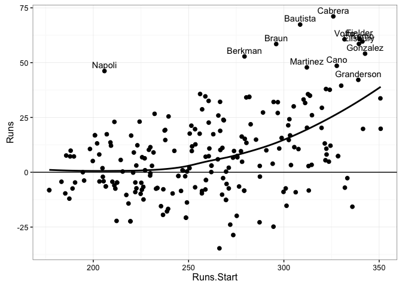
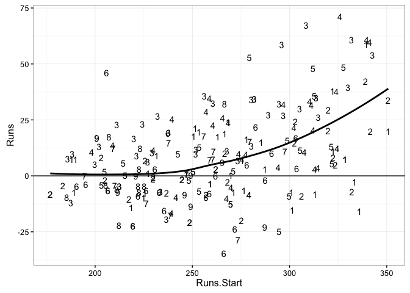
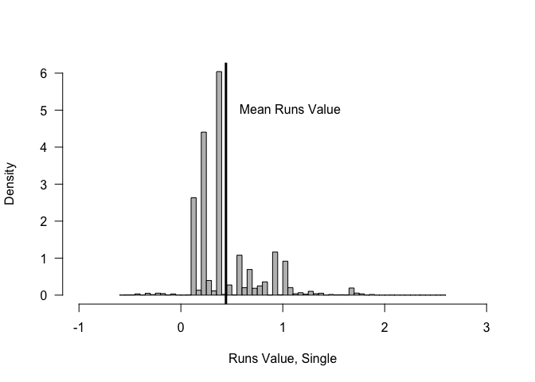
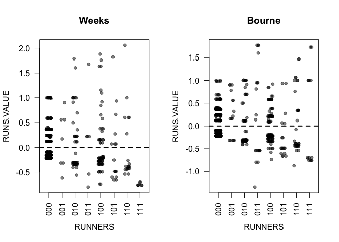
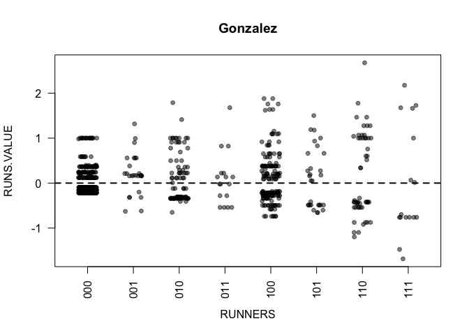
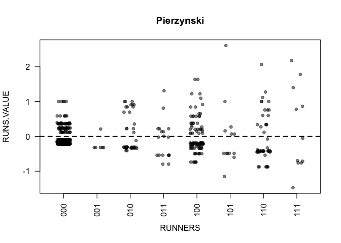

# tidy Baseball Chapter 5
Chris Hamm  
`r format(Sys.Date())`  


## Chapter 5 - *Value of Plays Using Run Expectancy*


```r
library("Lahman")
library("tidyverse"); options(dplyr.width = Inf)
```

```
## Loading tidyverse: ggplot2
## Loading tidyverse: tibble
## Loading tidyverse: tidyr
## Loading tidyverse: readr
## Loading tidyverse: purrr
## Loading tidyverse: dplyr
```

```
## Conflicts with tidy packages ----------------------------------------------
```

```
## filter(): dplyr, stats
## lag():    dplyr, stats
```

```r
set.seed(8761825)
devtools::session_info()
```

```
## Session info --------------------------------------------------------------
```

```
##  setting  value                       
##  version  R version 3.3.1 (2016-06-21)
##  system   x86_64, darwin13.4.0        
##  ui       X11                         
##  language (EN)                        
##  collate  en_US.UTF-8                 
##  tz       America/New_York            
##  date     2016-10-13
```

```
## Packages ------------------------------------------------------------------
```

```
##  package    * version date       source        
##  assertthat   0.1     2013-12-06 CRAN (R 3.3.0)
##  colorspace   1.2-7   2016-10-11 CRAN (R 3.3.1)
##  DBI          0.5-1   2016-09-10 CRAN (R 3.3.0)
##  devtools     1.12.0  2016-06-24 CRAN (R 3.3.0)
##  digest       0.6.10  2016-08-02 CRAN (R 3.3.1)
##  dplyr      * 0.5.0   2016-06-24 CRAN (R 3.3.0)
##  evaluate     0.10    2016-10-11 CRAN (R 3.3.1)
##  formatR      1.4     2016-05-09 CRAN (R 3.3.0)
##  ggplot2    * 2.1.0   2016-03-01 CRAN (R 3.3.0)
##  gtable       0.2.0   2016-02-26 CRAN (R 3.3.0)
##  htmltools    0.3.5   2016-03-21 CRAN (R 3.3.0)
##  knitr        1.14    2016-08-13 CRAN (R 3.3.0)
##  Lahman     * 5.0-0   2016-08-27 CRAN (R 3.3.0)
##  magrittr     1.5     2014-11-22 CRAN (R 3.3.0)
##  memoise      1.0.0   2016-01-29 CRAN (R 3.3.0)
##  munsell      0.4.3   2016-02-13 CRAN (R 3.3.0)
##  plyr         1.8.4   2016-06-08 CRAN (R 3.3.0)
##  purrr      * 0.2.2   2016-06-18 CRAN (R 3.3.0)
##  R6           2.2.0   2016-10-05 CRAN (R 3.3.1)
##  Rcpp         0.12.7  2016-09-05 CRAN (R 3.3.0)
##  readr      * 1.0.0   2016-08-03 CRAN (R 3.3.0)
##  rmarkdown    1.0     2016-07-08 CRAN (R 3.3.0)
##  scales       0.4.0   2016-02-26 CRAN (R 3.3.0)
##  stringi      1.1.2   2016-10-01 CRAN (R 3.3.1)
##  stringr      1.1.0   2016-08-19 CRAN (R 3.3.0)
##  tibble     * 1.2     2016-08-26 CRAN (R 3.3.0)
##  tidyr      * 0.6.0   2016-08-12 CRAN (R 3.3.1)
##  tidyverse  * 1.0.0   2016-09-09 CRAN (R 3.3.0)
##  withr        1.0.2   2016-06-20 CRAN (R 3.3.0)
##  yaml         2.1.13  2014-06-12 CRAN (R 3.3.0)
```

### Section 5.2 - *Runs scored in the remainder of the inning*

```r
# This is a 62 Mb file, so I'll download it from the GitHub repo. Note, you'll get a warning message when using read_csv because right here because there are no column headers. We'll add them manually. 
data2011 <- read.csv("https://raw.githubusercontent.com/maxtoki/baseball_R/master/data/all2011.csv", header = FALSE)
# I've placed the fields file in the data directory.
fields <- read.csv("Data/fields.csv")
names(data2011) <- fields[, "Header"]
head(data2011)
```

```
##        GAME_ID AWAY_TEAM_ID INN_CT BAT_HOME_ID OUTS_CT BALLS_CT STRIKES_CT
## 1 ANA201104080          TOR      1           0       0        1          2
## 2 ANA201104080          TOR      1           0       1        0          0
## 3 ANA201104080          TOR      1           0       2        1          2
## 4 ANA201104080          TOR      1           1       0        3          1
## 5 ANA201104080          TOR      1           1       0        2          2
## 6 ANA201104080          TOR      1           1       1        2          1
##   PITCH_SEQ_TX AWAY_SCORE_CT HOME_SCORE_CT   BAT_ID BAT_HAND_CD
## 1         FBSX             0             0 davir003           R
## 2            X             0             0 nix-j001           R
## 3         CBCS             0             0 bautj002           R
## 4        CBBBB             0             0 iztum001           L
## 5        BCSBS             0             0 kendh001           R
## 6       CBB1>S             0             0 abreb001           L
##   RESP_BAT_ID RESP_BAT_HAND_CD   PIT_ID PIT_HAND_CD RESP_PIT_ID
## 1    davir003                R sante001           R    sante001
## 2    nix-j001                R sante001           R    sante001
## 3    bautj002                R sante001           R    sante001
## 4    iztum001                L drabk001           R    drabk001
## 5    kendh001                R drabk001           R    drabk001
## 6    abreb001                L drabk001           R    drabk001
##   RESP_PIT_HAND_CD POS2_FLD_ID POS3_FLD_ID POS4_FLD_ID POS5_FLD_ID
## 1                R    congh001    trumm001    kendh001    calla001
## 2                R    congh001    trumm001    kendh001    calla001
## 3                R    congh001    trumm001    kendh001    calla001
## 4                R    molij001    linda001    hilla001    nix-j001
## 5                R    molij001    linda001    hilla001    nix-j001
## 6                R    molij001    linda001    hilla001    nix-j001
##   POS6_FLD_ID POS7_FLD_ID POS8_FLD_ID POS9_FLD_ID BASE1_RUN_ID
## 1    iztum001    wellv001    bourp001    huntt001             
## 2    iztum001    wellv001    bourp001    huntt001             
## 3    iztum001    wellv001    bourp001    huntt001             
## 4    mcdoj003    snidt001    davir003    bautj002             
## 5    mcdoj003    snidt001    davir003    bautj002     iztum001
## 6    mcdoj003    snidt001    davir003    bautj002     iztum001
##   BASE2_RUN_ID BASE3_RUN_ID EVENT_TX LEADOFF_FL PH_FL BAT_FLD_CD
## 1                                9/F       TRUE FALSE          8
## 2                                9/F      FALSE FALSE          5
## 3                                  K      FALSE FALSE          9
## 4                                  W       TRUE FALSE          6
## 5                                  K      FALSE FALSE          4
## 6                            CS2(26)      FALSE FALSE         10
##   BAT_LINEUP_ID EVENT_CD BAT_EVENT_FL AB_FL H_FL SH_FL SF_FL EVENT_OUTS_CT
## 1             1        2         TRUE  TRUE    0 FALSE FALSE             1
## 2             2        2         TRUE  TRUE    0 FALSE FALSE             1
## 3             3        3         TRUE  TRUE    0 FALSE FALSE             1
## 4             1       14         TRUE FALSE    0 FALSE FALSE             0
## 5             2        3         TRUE  TRUE    0 FALSE FALSE             1
## 6             3        6        FALSE FALSE    0 FALSE FALSE             1
##   DP_FL TP_FL RBI_CT WP_FL PB_FL FLD_CD BATTEDBALL_CD BUNT_FL FOUL_FL
## 1 FALSE FALSE      0 FALSE FALSE      9             F   FALSE   FALSE
## 2 FALSE FALSE      0 FALSE FALSE      9             F   FALSE   FALSE
## 3 FALSE FALSE      0 FALSE FALSE      0                 FALSE   FALSE
## 4 FALSE FALSE      0 FALSE FALSE      0                 FALSE   FALSE
## 5 FALSE FALSE      0 FALSE FALSE      0                 FALSE   FALSE
## 6 FALSE FALSE      0 FALSE FALSE      0                 FALSE   FALSE
##   BATTEDBALL_LOC_TX ERR_CT ERR1_FLD_CD ERR1_CD ERR2_FLD_CD ERR2_CD
## 1                        0           0       N           0       N
## 2                        0           0       N           0       N
## 3                        0           0       N           0       N
## 4                        0           0       N           0       N
## 5                        0           0       N           0       N
## 6                        0           0       N           0       N
##   ERR3_FLD_CD ERR3_CD BAT_DEST_ID RUN1_DEST_ID RUN2_DEST_ID RUN3_DEST_ID
## 1           0       N           0            0            0            0
## 2           0       N           0            0            0            0
## 3           0       N           0            0            0            0
## 4           0       N           1            0            0            0
## 5           0       N           0            1            0            0
## 6           0       N           0            0            0            0
##   BAT_PLAY_TX RUN1_PLAY_TX RUN2_PLAY_TX RUN3_PLAY_TX RUN1_SB_FL RUN2_SB_FL
## 1           9                                             FALSE      FALSE
## 2           9                                             FALSE      FALSE
## 3           2                                             FALSE      FALSE
## 4          NA                                             FALSE      FALSE
## 5           2                                             FALSE      FALSE
## 6          NA           26                                FALSE      FALSE
##   RUN3_SB_FL RUN1_CS_FL RUN2_CS_FL RUN3_CS_FL RUN1_PK_FL RUN2_PK_FL
## 1      FALSE      FALSE      FALSE      FALSE      FALSE      FALSE
## 2      FALSE      FALSE      FALSE      FALSE      FALSE      FALSE
## 3      FALSE      FALSE      FALSE      FALSE      FALSE      FALSE
## 4      FALSE      FALSE      FALSE      FALSE      FALSE      FALSE
## 5      FALSE      FALSE      FALSE      FALSE      FALSE      FALSE
## 6      FALSE       TRUE      FALSE      FALSE      FALSE      FALSE
##   RUN3_PK_FL RUN1_RESP_PIT_ID RUN2_RESP_PIT_ID RUN3_RESP_PIT_ID
## 1      FALSE                                                   
## 2      FALSE                                                   
## 3      FALSE                                                   
## 4      FALSE                                                   
## 5      FALSE         drabk001                                  
## 6      FALSE         drabk001                                  
##   GAME_NEW_FL GAME_END_FL PR_RUN1_FL PR_RUN2_FL PR_RUN3_FL
## 1        TRUE       FALSE      FALSE      FALSE      FALSE
## 2       FALSE       FALSE      FALSE      FALSE      FALSE
## 3       FALSE       FALSE      FALSE      FALSE      FALSE
## 4       FALSE       FALSE      FALSE      FALSE      FALSE
## 5       FALSE       FALSE      FALSE      FALSE      FALSE
## 6       FALSE       FALSE      FALSE      FALSE      FALSE
##   REMOVED_FOR_PR_RUN1_ID REMOVED_FOR_PR_RUN2_ID REMOVED_FOR_PR_RUN3_ID
## 1                                                                     
## 2                                                                     
## 3                                                                     
## 4                                                                     
## 5                                                                     
## 6                                                                     
##   REMOVED_FOR_PH_BAT_ID REMOVED_FOR_PH_BAT_FLD_CD PO1_FLD_CD PO2_FLD_CD
## 1                                               0          9          0
## 2                                               0          9          0
## 3                                               0          2          0
## 4                                               0          0          0
## 5                                               0          2          0
## 6                                               0          6          0
##   PO3_FLD_CD ASS1_FLD_CD ASS2_FLD_CD ASS3_FLD_CD ASS4_FLD_CD ASS5_FLD_CD
## 1          0           0           0           0           0           0
## 2          0           0           0           0           0           0
## 3          0           0           0           0           0           0
## 4          0           0           0           0           0           0
## 5          0           0           0           0           0           0
## 6          0           2           0           0           0           0
##   EVENT_ID
## 1        1
## 2        2
## 3        3
## 4        4
## 5        5
## 6        6
```

```r
dim(data2011)
```

```
## [1] 191864     97
```

```r
data2011 <- data2011 %>% 
  mutate(RUNS = AWAY_SCORE_CT + HOME_SCORE_CT, HALF.INNING = paste(GAME_ID, INN_CT, BAT_HOME_ID), RUNS.SCORED = ((BAT_DEST_ID > 3) + (RUN1_DEST_ID > 3) + (RUN2_DEST_ID > 3) + (RUN3_DEST_ID > 3))) # Please note, I am following the book here and creating the HALF.INNING variable that contains 3 seperate pieces of data in one cell. This is not "tidy" per se but it works.
head(data2011)
```

```
##        GAME_ID AWAY_TEAM_ID INN_CT BAT_HOME_ID OUTS_CT BALLS_CT STRIKES_CT
## 1 ANA201104080          TOR      1           0       0        1          2
## 2 ANA201104080          TOR      1           0       1        0          0
## 3 ANA201104080          TOR      1           0       2        1          2
## 4 ANA201104080          TOR      1           1       0        3          1
## 5 ANA201104080          TOR      1           1       0        2          2
## 6 ANA201104080          TOR      1           1       1        2          1
##   PITCH_SEQ_TX AWAY_SCORE_CT HOME_SCORE_CT   BAT_ID BAT_HAND_CD
## 1         FBSX             0             0 davir003           R
## 2            X             0             0 nix-j001           R
## 3         CBCS             0             0 bautj002           R
## 4        CBBBB             0             0 iztum001           L
## 5        BCSBS             0             0 kendh001           R
## 6       CBB1>S             0             0 abreb001           L
##   RESP_BAT_ID RESP_BAT_HAND_CD   PIT_ID PIT_HAND_CD RESP_PIT_ID
## 1    davir003                R sante001           R    sante001
## 2    nix-j001                R sante001           R    sante001
## 3    bautj002                R sante001           R    sante001
## 4    iztum001                L drabk001           R    drabk001
## 5    kendh001                R drabk001           R    drabk001
## 6    abreb001                L drabk001           R    drabk001
##   RESP_PIT_HAND_CD POS2_FLD_ID POS3_FLD_ID POS4_FLD_ID POS5_FLD_ID
## 1                R    congh001    trumm001    kendh001    calla001
## 2                R    congh001    trumm001    kendh001    calla001
## 3                R    congh001    trumm001    kendh001    calla001
## 4                R    molij001    linda001    hilla001    nix-j001
## 5                R    molij001    linda001    hilla001    nix-j001
## 6                R    molij001    linda001    hilla001    nix-j001
##   POS6_FLD_ID POS7_FLD_ID POS8_FLD_ID POS9_FLD_ID BASE1_RUN_ID
## 1    iztum001    wellv001    bourp001    huntt001             
## 2    iztum001    wellv001    bourp001    huntt001             
## 3    iztum001    wellv001    bourp001    huntt001             
## 4    mcdoj003    snidt001    davir003    bautj002             
## 5    mcdoj003    snidt001    davir003    bautj002     iztum001
## 6    mcdoj003    snidt001    davir003    bautj002     iztum001
##   BASE2_RUN_ID BASE3_RUN_ID EVENT_TX LEADOFF_FL PH_FL BAT_FLD_CD
## 1                                9/F       TRUE FALSE          8
## 2                                9/F      FALSE FALSE          5
## 3                                  K      FALSE FALSE          9
## 4                                  W       TRUE FALSE          6
## 5                                  K      FALSE FALSE          4
## 6                            CS2(26)      FALSE FALSE         10
##   BAT_LINEUP_ID EVENT_CD BAT_EVENT_FL AB_FL H_FL SH_FL SF_FL EVENT_OUTS_CT
## 1             1        2         TRUE  TRUE    0 FALSE FALSE             1
## 2             2        2         TRUE  TRUE    0 FALSE FALSE             1
## 3             3        3         TRUE  TRUE    0 FALSE FALSE             1
## 4             1       14         TRUE FALSE    0 FALSE FALSE             0
## 5             2        3         TRUE  TRUE    0 FALSE FALSE             1
## 6             3        6        FALSE FALSE    0 FALSE FALSE             1
##   DP_FL TP_FL RBI_CT WP_FL PB_FL FLD_CD BATTEDBALL_CD BUNT_FL FOUL_FL
## 1 FALSE FALSE      0 FALSE FALSE      9             F   FALSE   FALSE
## 2 FALSE FALSE      0 FALSE FALSE      9             F   FALSE   FALSE
## 3 FALSE FALSE      0 FALSE FALSE      0                 FALSE   FALSE
## 4 FALSE FALSE      0 FALSE FALSE      0                 FALSE   FALSE
## 5 FALSE FALSE      0 FALSE FALSE      0                 FALSE   FALSE
## 6 FALSE FALSE      0 FALSE FALSE      0                 FALSE   FALSE
##   BATTEDBALL_LOC_TX ERR_CT ERR1_FLD_CD ERR1_CD ERR2_FLD_CD ERR2_CD
## 1                        0           0       N           0       N
## 2                        0           0       N           0       N
## 3                        0           0       N           0       N
## 4                        0           0       N           0       N
## 5                        0           0       N           0       N
## 6                        0           0       N           0       N
##   ERR3_FLD_CD ERR3_CD BAT_DEST_ID RUN1_DEST_ID RUN2_DEST_ID RUN3_DEST_ID
## 1           0       N           0            0            0            0
## 2           0       N           0            0            0            0
## 3           0       N           0            0            0            0
## 4           0       N           1            0            0            0
## 5           0       N           0            1            0            0
## 6           0       N           0            0            0            0
##   BAT_PLAY_TX RUN1_PLAY_TX RUN2_PLAY_TX RUN3_PLAY_TX RUN1_SB_FL RUN2_SB_FL
## 1           9                                             FALSE      FALSE
## 2           9                                             FALSE      FALSE
## 3           2                                             FALSE      FALSE
## 4          NA                                             FALSE      FALSE
## 5           2                                             FALSE      FALSE
## 6          NA           26                                FALSE      FALSE
##   RUN3_SB_FL RUN1_CS_FL RUN2_CS_FL RUN3_CS_FL RUN1_PK_FL RUN2_PK_FL
## 1      FALSE      FALSE      FALSE      FALSE      FALSE      FALSE
## 2      FALSE      FALSE      FALSE      FALSE      FALSE      FALSE
## 3      FALSE      FALSE      FALSE      FALSE      FALSE      FALSE
## 4      FALSE      FALSE      FALSE      FALSE      FALSE      FALSE
## 5      FALSE      FALSE      FALSE      FALSE      FALSE      FALSE
## 6      FALSE       TRUE      FALSE      FALSE      FALSE      FALSE
##   RUN3_PK_FL RUN1_RESP_PIT_ID RUN2_RESP_PIT_ID RUN3_RESP_PIT_ID
## 1      FALSE                                                   
## 2      FALSE                                                   
## 3      FALSE                                                   
## 4      FALSE                                                   
## 5      FALSE         drabk001                                  
## 6      FALSE         drabk001                                  
##   GAME_NEW_FL GAME_END_FL PR_RUN1_FL PR_RUN2_FL PR_RUN3_FL
## 1        TRUE       FALSE      FALSE      FALSE      FALSE
## 2       FALSE       FALSE      FALSE      FALSE      FALSE
## 3       FALSE       FALSE      FALSE      FALSE      FALSE
## 4       FALSE       FALSE      FALSE      FALSE      FALSE
## 5       FALSE       FALSE      FALSE      FALSE      FALSE
## 6       FALSE       FALSE      FALSE      FALSE      FALSE
##   REMOVED_FOR_PR_RUN1_ID REMOVED_FOR_PR_RUN2_ID REMOVED_FOR_PR_RUN3_ID
## 1                                                                     
## 2                                                                     
## 3                                                                     
## 4                                                                     
## 5                                                                     
## 6                                                                     
##   REMOVED_FOR_PH_BAT_ID REMOVED_FOR_PH_BAT_FLD_CD PO1_FLD_CD PO2_FLD_CD
## 1                                               0          9          0
## 2                                               0          9          0
## 3                                               0          2          0
## 4                                               0          0          0
## 5                                               0          2          0
## 6                                               0          6          0
##   PO3_FLD_CD ASS1_FLD_CD ASS2_FLD_CD ASS3_FLD_CD ASS4_FLD_CD ASS5_FLD_CD
## 1          0           0           0           0           0           0
## 2          0           0           0           0           0           0
## 3          0           0           0           0           0           0
## 4          0           0           0           0           0           0
## 5          0           0           0           0           0           0
## 6          0           2           0           0           0           0
##   EVENT_ID RUNS      HALF.INNING RUNS.SCORED
## 1        1    0 ANA201104080 1 0           0
## 2        2    0 ANA201104080 1 0           0
## 3        3    0 ANA201104080 1 0           0
## 4        4    0 ANA201104080 1 1           0
## 5        5    0 ANA201104080 1 1           0
## 6        6    0 ANA201104080 1 1           0
```

```r
RUNS.SCORED.INNING <- aggregate(data2011$RUNS.SCORED, list(HALF.INNING = data2011$HALF.INNING), sum)
head(RUNS.SCORED.INNING)
```

```
##        HALF.INNING x
## 1 ANA201104080 1 0 0
## 2 ANA201104080 1 1 1
## 3 ANA201104080 2 0 0
## 4 ANA201104080 2 1 0
## 5 ANA201104080 3 0 0
## 6 ANA201104080 3 1 1
```

```r
RUNS.SCORED.START <- aggregate(data2011$RUNS, list(HALF.INNING = data2011$HALF.INNING), "[", 1)
head(RUNS.SCORED.START)
```

```
##        HALF.INNING x
## 1 ANA201104080 1 0 0
## 2 ANA201104080 1 1 0
## 3 ANA201104080 2 0 1
## 4 ANA201104080 2 1 1
## 5 ANA201104080 3 0 1
## 6 ANA201104080 3 1 1
```

```r
MAX <- data.frame(HALF.INNING = RUNS.SCORED.START$HALF.INNING)
MAX <- MAX %>% 
  mutate(x = RUNS.SCORED.INNING$x + RUNS.SCORED.START$x)
head(MAX)
```

```
##        HALF.INNING x
## 1 ANA201104080 1 0 0
## 2 ANA201104080 1 1 1
## 3 ANA201104080 2 0 1
## 4 ANA201104080 2 1 1
## 5 ANA201104080 3 0 1
## 6 ANA201104080 3 1 2
```

```r
data2011 <- merge(data2011, MAX)
N <- ncol(data2011)
names(data2011)[N] <- "MAX.RUNS"
data2011 <- data2011 %>% 
  mutate(RUNS.ROI = MAX.RUNS - RUNS)
head(data2011)
```

```
##        HALF.INNING      GAME_ID AWAY_TEAM_ID INN_CT BAT_HOME_ID OUTS_CT
## 1 ANA201104080 1 0 ANA201104080          TOR      1           0       0
## 2 ANA201104080 1 0 ANA201104080          TOR      1           0       1
## 3 ANA201104080 1 0 ANA201104080          TOR      1           0       2
## 4 ANA201104080 1 1 ANA201104080          TOR      1           1       0
## 5 ANA201104080 1 1 ANA201104080          TOR      1           1       0
## 6 ANA201104080 1 1 ANA201104080          TOR      1           1       1
##   BALLS_CT STRIKES_CT PITCH_SEQ_TX AWAY_SCORE_CT HOME_SCORE_CT   BAT_ID
## 1        1          2         FBSX             0             0 davir003
## 2        0          0            X             0             0 nix-j001
## 3        1          2         CBCS             0             0 bautj002
## 4        3          1        CBBBB             0             0 iztum001
## 5        2          2        BCSBS             0             0 kendh001
## 6        2          1       CBB1>S             0             0 abreb001
##   BAT_HAND_CD RESP_BAT_ID RESP_BAT_HAND_CD   PIT_ID PIT_HAND_CD
## 1           R    davir003                R sante001           R
## 2           R    nix-j001                R sante001           R
## 3           R    bautj002                R sante001           R
## 4           L    iztum001                L drabk001           R
## 5           R    kendh001                R drabk001           R
## 6           L    abreb001                L drabk001           R
##   RESP_PIT_ID RESP_PIT_HAND_CD POS2_FLD_ID POS3_FLD_ID POS4_FLD_ID
## 1    sante001                R    congh001    trumm001    kendh001
## 2    sante001                R    congh001    trumm001    kendh001
## 3    sante001                R    congh001    trumm001    kendh001
## 4    drabk001                R    molij001    linda001    hilla001
## 5    drabk001                R    molij001    linda001    hilla001
## 6    drabk001                R    molij001    linda001    hilla001
##   POS5_FLD_ID POS6_FLD_ID POS7_FLD_ID POS8_FLD_ID POS9_FLD_ID BASE1_RUN_ID
## 1    calla001    iztum001    wellv001    bourp001    huntt001             
## 2    calla001    iztum001    wellv001    bourp001    huntt001             
## 3    calla001    iztum001    wellv001    bourp001    huntt001             
## 4    nix-j001    mcdoj003    snidt001    davir003    bautj002             
## 5    nix-j001    mcdoj003    snidt001    davir003    bautj002     iztum001
## 6    nix-j001    mcdoj003    snidt001    davir003    bautj002     iztum001
##   BASE2_RUN_ID BASE3_RUN_ID EVENT_TX LEADOFF_FL PH_FL BAT_FLD_CD
## 1                                9/F       TRUE FALSE          8
## 2                                9/F      FALSE FALSE          5
## 3                                  K      FALSE FALSE          9
## 4                                  W       TRUE FALSE          6
## 5                                  K      FALSE FALSE          4
## 6                            CS2(26)      FALSE FALSE         10
##   BAT_LINEUP_ID EVENT_CD BAT_EVENT_FL AB_FL H_FL SH_FL SF_FL EVENT_OUTS_CT
## 1             1        2         TRUE  TRUE    0 FALSE FALSE             1
## 2             2        2         TRUE  TRUE    0 FALSE FALSE             1
## 3             3        3         TRUE  TRUE    0 FALSE FALSE             1
## 4             1       14         TRUE FALSE    0 FALSE FALSE             0
## 5             2        3         TRUE  TRUE    0 FALSE FALSE             1
## 6             3        6        FALSE FALSE    0 FALSE FALSE             1
##   DP_FL TP_FL RBI_CT WP_FL PB_FL FLD_CD BATTEDBALL_CD BUNT_FL FOUL_FL
## 1 FALSE FALSE      0 FALSE FALSE      9             F   FALSE   FALSE
## 2 FALSE FALSE      0 FALSE FALSE      9             F   FALSE   FALSE
## 3 FALSE FALSE      0 FALSE FALSE      0                 FALSE   FALSE
## 4 FALSE FALSE      0 FALSE FALSE      0                 FALSE   FALSE
## 5 FALSE FALSE      0 FALSE FALSE      0                 FALSE   FALSE
## 6 FALSE FALSE      0 FALSE FALSE      0                 FALSE   FALSE
##   BATTEDBALL_LOC_TX ERR_CT ERR1_FLD_CD ERR1_CD ERR2_FLD_CD ERR2_CD
## 1                        0           0       N           0       N
## 2                        0           0       N           0       N
## 3                        0           0       N           0       N
## 4                        0           0       N           0       N
## 5                        0           0       N           0       N
## 6                        0           0       N           0       N
##   ERR3_FLD_CD ERR3_CD BAT_DEST_ID RUN1_DEST_ID RUN2_DEST_ID RUN3_DEST_ID
## 1           0       N           0            0            0            0
## 2           0       N           0            0            0            0
## 3           0       N           0            0            0            0
## 4           0       N           1            0            0            0
## 5           0       N           0            1            0            0
## 6           0       N           0            0            0            0
##   BAT_PLAY_TX RUN1_PLAY_TX RUN2_PLAY_TX RUN3_PLAY_TX RUN1_SB_FL RUN2_SB_FL
## 1           9                                             FALSE      FALSE
## 2           9                                             FALSE      FALSE
## 3           2                                             FALSE      FALSE
## 4          NA                                             FALSE      FALSE
## 5           2                                             FALSE      FALSE
## 6          NA           26                                FALSE      FALSE
##   RUN3_SB_FL RUN1_CS_FL RUN2_CS_FL RUN3_CS_FL RUN1_PK_FL RUN2_PK_FL
## 1      FALSE      FALSE      FALSE      FALSE      FALSE      FALSE
## 2      FALSE      FALSE      FALSE      FALSE      FALSE      FALSE
## 3      FALSE      FALSE      FALSE      FALSE      FALSE      FALSE
## 4      FALSE      FALSE      FALSE      FALSE      FALSE      FALSE
## 5      FALSE      FALSE      FALSE      FALSE      FALSE      FALSE
## 6      FALSE       TRUE      FALSE      FALSE      FALSE      FALSE
##   RUN3_PK_FL RUN1_RESP_PIT_ID RUN2_RESP_PIT_ID RUN3_RESP_PIT_ID
## 1      FALSE                                                   
## 2      FALSE                                                   
## 3      FALSE                                                   
## 4      FALSE                                                   
## 5      FALSE         drabk001                                  
## 6      FALSE         drabk001                                  
##   GAME_NEW_FL GAME_END_FL PR_RUN1_FL PR_RUN2_FL PR_RUN3_FL
## 1        TRUE       FALSE      FALSE      FALSE      FALSE
## 2       FALSE       FALSE      FALSE      FALSE      FALSE
## 3       FALSE       FALSE      FALSE      FALSE      FALSE
## 4       FALSE       FALSE      FALSE      FALSE      FALSE
## 5       FALSE       FALSE      FALSE      FALSE      FALSE
## 6       FALSE       FALSE      FALSE      FALSE      FALSE
##   REMOVED_FOR_PR_RUN1_ID REMOVED_FOR_PR_RUN2_ID REMOVED_FOR_PR_RUN3_ID
## 1                                                                     
## 2                                                                     
## 3                                                                     
## 4                                                                     
## 5                                                                     
## 6                                                                     
##   REMOVED_FOR_PH_BAT_ID REMOVED_FOR_PH_BAT_FLD_CD PO1_FLD_CD PO2_FLD_CD
## 1                                               0          9          0
## 2                                               0          9          0
## 3                                               0          2          0
## 4                                               0          0          0
## 5                                               0          2          0
## 6                                               0          6          0
##   PO3_FLD_CD ASS1_FLD_CD ASS2_FLD_CD ASS3_FLD_CD ASS4_FLD_CD ASS5_FLD_CD
## 1          0           0           0           0           0           0
## 2          0           0           0           0           0           0
## 3          0           0           0           0           0           0
## 4          0           0           0           0           0           0
## 5          0           0           0           0           0           0
## 6          0           2           0           0           0           0
##   EVENT_ID RUNS RUNS.SCORED MAX.RUNS RUNS.ROI
## 1        1    0           0        0        0
## 2        2    0           0        0        0
## 3        3    0           0        0        0
## 4        4    0           0        1        1
## 5        5    0           0        1        1
## 6        6    0           0        1        1
```

### Section 5.3 - *Creating the matrix*

```r
RUNNER1 <- ifelse(as.character(data2011[, "BASE1_RUN_ID"]) == "", 0, 1)
RUNNER2 <- ifelse(as.character(data2011[, "BASE2_RUN_ID"]) == "", 0, 1)
RUNNER3 <- ifelse(as.character(data2011[, "BASE3_RUN_ID"]) == "", 0, 1)

get.state <- function(runner1, runner2, runner3, outs){
	runners <- paste(runner1, runner2, runner3, sep = "")
	paste(runners, outs)
}

data2011 <- data2011 %>% 
  mutate(STATE = get.state(RUNNER1, RUNNER2, RUNNER3, OUTS_CT))
head(data2011)
```

```
##        HALF.INNING      GAME_ID AWAY_TEAM_ID INN_CT BAT_HOME_ID OUTS_CT
## 1 ANA201104080 1 0 ANA201104080          TOR      1           0       0
## 2 ANA201104080 1 0 ANA201104080          TOR      1           0       1
## 3 ANA201104080 1 0 ANA201104080          TOR      1           0       2
## 4 ANA201104080 1 1 ANA201104080          TOR      1           1       0
## 5 ANA201104080 1 1 ANA201104080          TOR      1           1       0
## 6 ANA201104080 1 1 ANA201104080          TOR      1           1       1
##   BALLS_CT STRIKES_CT PITCH_SEQ_TX AWAY_SCORE_CT HOME_SCORE_CT   BAT_ID
## 1        1          2         FBSX             0             0 davir003
## 2        0          0            X             0             0 nix-j001
## 3        1          2         CBCS             0             0 bautj002
## 4        3          1        CBBBB             0             0 iztum001
## 5        2          2        BCSBS             0             0 kendh001
## 6        2          1       CBB1>S             0             0 abreb001
##   BAT_HAND_CD RESP_BAT_ID RESP_BAT_HAND_CD   PIT_ID PIT_HAND_CD
## 1           R    davir003                R sante001           R
## 2           R    nix-j001                R sante001           R
## 3           R    bautj002                R sante001           R
## 4           L    iztum001                L drabk001           R
## 5           R    kendh001                R drabk001           R
## 6           L    abreb001                L drabk001           R
##   RESP_PIT_ID RESP_PIT_HAND_CD POS2_FLD_ID POS3_FLD_ID POS4_FLD_ID
## 1    sante001                R    congh001    trumm001    kendh001
## 2    sante001                R    congh001    trumm001    kendh001
## 3    sante001                R    congh001    trumm001    kendh001
## 4    drabk001                R    molij001    linda001    hilla001
## 5    drabk001                R    molij001    linda001    hilla001
## 6    drabk001                R    molij001    linda001    hilla001
##   POS5_FLD_ID POS6_FLD_ID POS7_FLD_ID POS8_FLD_ID POS9_FLD_ID BASE1_RUN_ID
## 1    calla001    iztum001    wellv001    bourp001    huntt001             
## 2    calla001    iztum001    wellv001    bourp001    huntt001             
## 3    calla001    iztum001    wellv001    bourp001    huntt001             
## 4    nix-j001    mcdoj003    snidt001    davir003    bautj002             
## 5    nix-j001    mcdoj003    snidt001    davir003    bautj002     iztum001
## 6    nix-j001    mcdoj003    snidt001    davir003    bautj002     iztum001
##   BASE2_RUN_ID BASE3_RUN_ID EVENT_TX LEADOFF_FL PH_FL BAT_FLD_CD
## 1                                9/F       TRUE FALSE          8
## 2                                9/F      FALSE FALSE          5
## 3                                  K      FALSE FALSE          9
## 4                                  W       TRUE FALSE          6
## 5                                  K      FALSE FALSE          4
## 6                            CS2(26)      FALSE FALSE         10
##   BAT_LINEUP_ID EVENT_CD BAT_EVENT_FL AB_FL H_FL SH_FL SF_FL EVENT_OUTS_CT
## 1             1        2         TRUE  TRUE    0 FALSE FALSE             1
## 2             2        2         TRUE  TRUE    0 FALSE FALSE             1
## 3             3        3         TRUE  TRUE    0 FALSE FALSE             1
## 4             1       14         TRUE FALSE    0 FALSE FALSE             0
## 5             2        3         TRUE  TRUE    0 FALSE FALSE             1
## 6             3        6        FALSE FALSE    0 FALSE FALSE             1
##   DP_FL TP_FL RBI_CT WP_FL PB_FL FLD_CD BATTEDBALL_CD BUNT_FL FOUL_FL
## 1 FALSE FALSE      0 FALSE FALSE      9             F   FALSE   FALSE
## 2 FALSE FALSE      0 FALSE FALSE      9             F   FALSE   FALSE
## 3 FALSE FALSE      0 FALSE FALSE      0                 FALSE   FALSE
## 4 FALSE FALSE      0 FALSE FALSE      0                 FALSE   FALSE
## 5 FALSE FALSE      0 FALSE FALSE      0                 FALSE   FALSE
## 6 FALSE FALSE      0 FALSE FALSE      0                 FALSE   FALSE
##   BATTEDBALL_LOC_TX ERR_CT ERR1_FLD_CD ERR1_CD ERR2_FLD_CD ERR2_CD
## 1                        0           0       N           0       N
## 2                        0           0       N           0       N
## 3                        0           0       N           0       N
## 4                        0           0       N           0       N
## 5                        0           0       N           0       N
## 6                        0           0       N           0       N
##   ERR3_FLD_CD ERR3_CD BAT_DEST_ID RUN1_DEST_ID RUN2_DEST_ID RUN3_DEST_ID
## 1           0       N           0            0            0            0
## 2           0       N           0            0            0            0
## 3           0       N           0            0            0            0
## 4           0       N           1            0            0            0
## 5           0       N           0            1            0            0
## 6           0       N           0            0            0            0
##   BAT_PLAY_TX RUN1_PLAY_TX RUN2_PLAY_TX RUN3_PLAY_TX RUN1_SB_FL RUN2_SB_FL
## 1           9                                             FALSE      FALSE
## 2           9                                             FALSE      FALSE
## 3           2                                             FALSE      FALSE
## 4          NA                                             FALSE      FALSE
## 5           2                                             FALSE      FALSE
## 6          NA           26                                FALSE      FALSE
##   RUN3_SB_FL RUN1_CS_FL RUN2_CS_FL RUN3_CS_FL RUN1_PK_FL RUN2_PK_FL
## 1      FALSE      FALSE      FALSE      FALSE      FALSE      FALSE
## 2      FALSE      FALSE      FALSE      FALSE      FALSE      FALSE
## 3      FALSE      FALSE      FALSE      FALSE      FALSE      FALSE
## 4      FALSE      FALSE      FALSE      FALSE      FALSE      FALSE
## 5      FALSE      FALSE      FALSE      FALSE      FALSE      FALSE
## 6      FALSE       TRUE      FALSE      FALSE      FALSE      FALSE
##   RUN3_PK_FL RUN1_RESP_PIT_ID RUN2_RESP_PIT_ID RUN3_RESP_PIT_ID
## 1      FALSE                                                   
## 2      FALSE                                                   
## 3      FALSE                                                   
## 4      FALSE                                                   
## 5      FALSE         drabk001                                  
## 6      FALSE         drabk001                                  
##   GAME_NEW_FL GAME_END_FL PR_RUN1_FL PR_RUN2_FL PR_RUN3_FL
## 1        TRUE       FALSE      FALSE      FALSE      FALSE
## 2       FALSE       FALSE      FALSE      FALSE      FALSE
## 3       FALSE       FALSE      FALSE      FALSE      FALSE
## 4       FALSE       FALSE      FALSE      FALSE      FALSE
## 5       FALSE       FALSE      FALSE      FALSE      FALSE
## 6       FALSE       FALSE      FALSE      FALSE      FALSE
##   REMOVED_FOR_PR_RUN1_ID REMOVED_FOR_PR_RUN2_ID REMOVED_FOR_PR_RUN3_ID
## 1                                                                     
## 2                                                                     
## 3                                                                     
## 4                                                                     
## 5                                                                     
## 6                                                                     
##   REMOVED_FOR_PH_BAT_ID REMOVED_FOR_PH_BAT_FLD_CD PO1_FLD_CD PO2_FLD_CD
## 1                                               0          9          0
## 2                                               0          9          0
## 3                                               0          2          0
## 4                                               0          0          0
## 5                                               0          2          0
## 6                                               0          6          0
##   PO3_FLD_CD ASS1_FLD_CD ASS2_FLD_CD ASS3_FLD_CD ASS4_FLD_CD ASS5_FLD_CD
## 1          0           0           0           0           0           0
## 2          0           0           0           0           0           0
## 3          0           0           0           0           0           0
## 4          0           0           0           0           0           0
## 5          0           0           0           0           0           0
## 6          0           2           0           0           0           0
##   EVENT_ID RUNS RUNS.SCORED MAX.RUNS RUNS.ROI STATE
## 1        1    0           0        0        0 000 0
## 2        2    0           0        0        0 000 1
## 3        3    0           0        0        0 000 2
## 4        4    0           0        1        1 000 0
## 5        5    0           0        1        1 100 0
## 6        6    0           0        1        1 100 1
```

```r
head(data2011$STATE)
```

```
## [1] "000 0" "000 1" "000 2" "000 0" "100 0" "100 1"
```

```r
# Create vectors with 0's and 1's.
NRUNNER1 <- with(data2011, as.numeric(RUN1_DEST_ID == 1 | BAT_DEST_ID == 1))
NRUNNER2 <- with(data2011, as.numeric(RUN1_DEST_ID == 2 | RUN2_DEST_ID == 2 | BAT_DEST_ID == 2))
NRUNNER3 <- with(data2011, as.numeric(RUN1_DEST_ID == 3 | RUN2_DEST_ID == 3 | RUN3_DEST_ID == 3 | BAT_DEST_ID == 3))
NOUTS <- with(data2011, OUTS_CT + EVENT_OUTS_CT)

data2011$NEW.STATE <- get.state(NRUNNER1, NRUNNER2, NRUNNER3, NOUTS)
head(data2011)
```

```
##        HALF.INNING      GAME_ID AWAY_TEAM_ID INN_CT BAT_HOME_ID OUTS_CT
## 1 ANA201104080 1 0 ANA201104080          TOR      1           0       0
## 2 ANA201104080 1 0 ANA201104080          TOR      1           0       1
## 3 ANA201104080 1 0 ANA201104080          TOR      1           0       2
## 4 ANA201104080 1 1 ANA201104080          TOR      1           1       0
## 5 ANA201104080 1 1 ANA201104080          TOR      1           1       0
## 6 ANA201104080 1 1 ANA201104080          TOR      1           1       1
##   BALLS_CT STRIKES_CT PITCH_SEQ_TX AWAY_SCORE_CT HOME_SCORE_CT   BAT_ID
## 1        1          2         FBSX             0             0 davir003
## 2        0          0            X             0             0 nix-j001
## 3        1          2         CBCS             0             0 bautj002
## 4        3          1        CBBBB             0             0 iztum001
## 5        2          2        BCSBS             0             0 kendh001
## 6        2          1       CBB1>S             0             0 abreb001
##   BAT_HAND_CD RESP_BAT_ID RESP_BAT_HAND_CD   PIT_ID PIT_HAND_CD
## 1           R    davir003                R sante001           R
## 2           R    nix-j001                R sante001           R
## 3           R    bautj002                R sante001           R
## 4           L    iztum001                L drabk001           R
## 5           R    kendh001                R drabk001           R
## 6           L    abreb001                L drabk001           R
##   RESP_PIT_ID RESP_PIT_HAND_CD POS2_FLD_ID POS3_FLD_ID POS4_FLD_ID
## 1    sante001                R    congh001    trumm001    kendh001
## 2    sante001                R    congh001    trumm001    kendh001
## 3    sante001                R    congh001    trumm001    kendh001
## 4    drabk001                R    molij001    linda001    hilla001
## 5    drabk001                R    molij001    linda001    hilla001
## 6    drabk001                R    molij001    linda001    hilla001
##   POS5_FLD_ID POS6_FLD_ID POS7_FLD_ID POS8_FLD_ID POS9_FLD_ID BASE1_RUN_ID
## 1    calla001    iztum001    wellv001    bourp001    huntt001             
## 2    calla001    iztum001    wellv001    bourp001    huntt001             
## 3    calla001    iztum001    wellv001    bourp001    huntt001             
## 4    nix-j001    mcdoj003    snidt001    davir003    bautj002             
## 5    nix-j001    mcdoj003    snidt001    davir003    bautj002     iztum001
## 6    nix-j001    mcdoj003    snidt001    davir003    bautj002     iztum001
##   BASE2_RUN_ID BASE3_RUN_ID EVENT_TX LEADOFF_FL PH_FL BAT_FLD_CD
## 1                                9/F       TRUE FALSE          8
## 2                                9/F      FALSE FALSE          5
## 3                                  K      FALSE FALSE          9
## 4                                  W       TRUE FALSE          6
## 5                                  K      FALSE FALSE          4
## 6                            CS2(26)      FALSE FALSE         10
##   BAT_LINEUP_ID EVENT_CD BAT_EVENT_FL AB_FL H_FL SH_FL SF_FL EVENT_OUTS_CT
## 1             1        2         TRUE  TRUE    0 FALSE FALSE             1
## 2             2        2         TRUE  TRUE    0 FALSE FALSE             1
## 3             3        3         TRUE  TRUE    0 FALSE FALSE             1
## 4             1       14         TRUE FALSE    0 FALSE FALSE             0
## 5             2        3         TRUE  TRUE    0 FALSE FALSE             1
## 6             3        6        FALSE FALSE    0 FALSE FALSE             1
##   DP_FL TP_FL RBI_CT WP_FL PB_FL FLD_CD BATTEDBALL_CD BUNT_FL FOUL_FL
## 1 FALSE FALSE      0 FALSE FALSE      9             F   FALSE   FALSE
## 2 FALSE FALSE      0 FALSE FALSE      9             F   FALSE   FALSE
## 3 FALSE FALSE      0 FALSE FALSE      0                 FALSE   FALSE
## 4 FALSE FALSE      0 FALSE FALSE      0                 FALSE   FALSE
## 5 FALSE FALSE      0 FALSE FALSE      0                 FALSE   FALSE
## 6 FALSE FALSE      0 FALSE FALSE      0                 FALSE   FALSE
##   BATTEDBALL_LOC_TX ERR_CT ERR1_FLD_CD ERR1_CD ERR2_FLD_CD ERR2_CD
## 1                        0           0       N           0       N
## 2                        0           0       N           0       N
## 3                        0           0       N           0       N
## 4                        0           0       N           0       N
## 5                        0           0       N           0       N
## 6                        0           0       N           0       N
##   ERR3_FLD_CD ERR3_CD BAT_DEST_ID RUN1_DEST_ID RUN2_DEST_ID RUN3_DEST_ID
## 1           0       N           0            0            0            0
## 2           0       N           0            0            0            0
## 3           0       N           0            0            0            0
## 4           0       N           1            0            0            0
## 5           0       N           0            1            0            0
## 6           0       N           0            0            0            0
##   BAT_PLAY_TX RUN1_PLAY_TX RUN2_PLAY_TX RUN3_PLAY_TX RUN1_SB_FL RUN2_SB_FL
## 1           9                                             FALSE      FALSE
## 2           9                                             FALSE      FALSE
## 3           2                                             FALSE      FALSE
## 4          NA                                             FALSE      FALSE
## 5           2                                             FALSE      FALSE
## 6          NA           26                                FALSE      FALSE
##   RUN3_SB_FL RUN1_CS_FL RUN2_CS_FL RUN3_CS_FL RUN1_PK_FL RUN2_PK_FL
## 1      FALSE      FALSE      FALSE      FALSE      FALSE      FALSE
## 2      FALSE      FALSE      FALSE      FALSE      FALSE      FALSE
## 3      FALSE      FALSE      FALSE      FALSE      FALSE      FALSE
## 4      FALSE      FALSE      FALSE      FALSE      FALSE      FALSE
## 5      FALSE      FALSE      FALSE      FALSE      FALSE      FALSE
## 6      FALSE       TRUE      FALSE      FALSE      FALSE      FALSE
##   RUN3_PK_FL RUN1_RESP_PIT_ID RUN2_RESP_PIT_ID RUN3_RESP_PIT_ID
## 1      FALSE                                                   
## 2      FALSE                                                   
## 3      FALSE                                                   
## 4      FALSE                                                   
## 5      FALSE         drabk001                                  
## 6      FALSE         drabk001                                  
##   GAME_NEW_FL GAME_END_FL PR_RUN1_FL PR_RUN2_FL PR_RUN3_FL
## 1        TRUE       FALSE      FALSE      FALSE      FALSE
## 2       FALSE       FALSE      FALSE      FALSE      FALSE
## 3       FALSE       FALSE      FALSE      FALSE      FALSE
## 4       FALSE       FALSE      FALSE      FALSE      FALSE
## 5       FALSE       FALSE      FALSE      FALSE      FALSE
## 6       FALSE       FALSE      FALSE      FALSE      FALSE
##   REMOVED_FOR_PR_RUN1_ID REMOVED_FOR_PR_RUN2_ID REMOVED_FOR_PR_RUN3_ID
## 1                                                                     
## 2                                                                     
## 3                                                                     
## 4                                                                     
## 5                                                                     
## 6                                                                     
##   REMOVED_FOR_PH_BAT_ID REMOVED_FOR_PH_BAT_FLD_CD PO1_FLD_CD PO2_FLD_CD
## 1                                               0          9          0
## 2                                               0          9          0
## 3                                               0          2          0
## 4                                               0          0          0
## 5                                               0          2          0
## 6                                               0          6          0
##   PO3_FLD_CD ASS1_FLD_CD ASS2_FLD_CD ASS3_FLD_CD ASS4_FLD_CD ASS5_FLD_CD
## 1          0           0           0           0           0           0
## 2          0           0           0           0           0           0
## 3          0           0           0           0           0           0
## 4          0           0           0           0           0           0
## 5          0           0           0           0           0           0
## 6          0           2           0           0           0           0
##   EVENT_ID RUNS RUNS.SCORED MAX.RUNS RUNS.ROI STATE NEW.STATE
## 1        1    0           0        0        0 000 0     000 1
## 2        2    0           0        0        0 000 1     000 2
## 3        3    0           0        0        0 000 2     000 3
## 4        4    0           0        1        1 000 0     100 0
## 5        5    0           0        1        1 100 0     100 1
## 6        6    0           0        1        1 100 1     000 2
```

```r
data2011 <- data2011 %>% 
  filter((STATE != NEW.STATE) | (RUNS.SCORED > 0))
head(data2011)
```

```
##        HALF.INNING      GAME_ID AWAY_TEAM_ID INN_CT BAT_HOME_ID OUTS_CT
## 1 ANA201104080 1 0 ANA201104080          TOR      1           0       0
## 2 ANA201104080 1 0 ANA201104080          TOR      1           0       1
## 3 ANA201104080 1 0 ANA201104080          TOR      1           0       2
## 4 ANA201104080 1 1 ANA201104080          TOR      1           1       0
## 5 ANA201104080 1 1 ANA201104080          TOR      1           1       0
## 6 ANA201104080 1 1 ANA201104080          TOR      1           1       1
##   BALLS_CT STRIKES_CT PITCH_SEQ_TX AWAY_SCORE_CT HOME_SCORE_CT   BAT_ID
## 1        1          2         FBSX             0             0 davir003
## 2        0          0            X             0             0 nix-j001
## 3        1          2         CBCS             0             0 bautj002
## 4        3          1        CBBBB             0             0 iztum001
## 5        2          2        BCSBS             0             0 kendh001
## 6        2          1       CBB1>S             0             0 abreb001
##   BAT_HAND_CD RESP_BAT_ID RESP_BAT_HAND_CD   PIT_ID PIT_HAND_CD
## 1           R    davir003                R sante001           R
## 2           R    nix-j001                R sante001           R
## 3           R    bautj002                R sante001           R
## 4           L    iztum001                L drabk001           R
## 5           R    kendh001                R drabk001           R
## 6           L    abreb001                L drabk001           R
##   RESP_PIT_ID RESP_PIT_HAND_CD POS2_FLD_ID POS3_FLD_ID POS4_FLD_ID
## 1    sante001                R    congh001    trumm001    kendh001
## 2    sante001                R    congh001    trumm001    kendh001
## 3    sante001                R    congh001    trumm001    kendh001
## 4    drabk001                R    molij001    linda001    hilla001
## 5    drabk001                R    molij001    linda001    hilla001
## 6    drabk001                R    molij001    linda001    hilla001
##   POS5_FLD_ID POS6_FLD_ID POS7_FLD_ID POS8_FLD_ID POS9_FLD_ID BASE1_RUN_ID
## 1    calla001    iztum001    wellv001    bourp001    huntt001             
## 2    calla001    iztum001    wellv001    bourp001    huntt001             
## 3    calla001    iztum001    wellv001    bourp001    huntt001             
## 4    nix-j001    mcdoj003    snidt001    davir003    bautj002             
## 5    nix-j001    mcdoj003    snidt001    davir003    bautj002     iztum001
## 6    nix-j001    mcdoj003    snidt001    davir003    bautj002     iztum001
##   BASE2_RUN_ID BASE3_RUN_ID EVENT_TX LEADOFF_FL PH_FL BAT_FLD_CD
## 1                                9/F       TRUE FALSE          8
## 2                                9/F      FALSE FALSE          5
## 3                                  K      FALSE FALSE          9
## 4                                  W       TRUE FALSE          6
## 5                                  K      FALSE FALSE          4
## 6                            CS2(26)      FALSE FALSE         10
##   BAT_LINEUP_ID EVENT_CD BAT_EVENT_FL AB_FL H_FL SH_FL SF_FL EVENT_OUTS_CT
## 1             1        2         TRUE  TRUE    0 FALSE FALSE             1
## 2             2        2         TRUE  TRUE    0 FALSE FALSE             1
## 3             3        3         TRUE  TRUE    0 FALSE FALSE             1
## 4             1       14         TRUE FALSE    0 FALSE FALSE             0
## 5             2        3         TRUE  TRUE    0 FALSE FALSE             1
## 6             3        6        FALSE FALSE    0 FALSE FALSE             1
##   DP_FL TP_FL RBI_CT WP_FL PB_FL FLD_CD BATTEDBALL_CD BUNT_FL FOUL_FL
## 1 FALSE FALSE      0 FALSE FALSE      9             F   FALSE   FALSE
## 2 FALSE FALSE      0 FALSE FALSE      9             F   FALSE   FALSE
## 3 FALSE FALSE      0 FALSE FALSE      0                 FALSE   FALSE
## 4 FALSE FALSE      0 FALSE FALSE      0                 FALSE   FALSE
## 5 FALSE FALSE      0 FALSE FALSE      0                 FALSE   FALSE
## 6 FALSE FALSE      0 FALSE FALSE      0                 FALSE   FALSE
##   BATTEDBALL_LOC_TX ERR_CT ERR1_FLD_CD ERR1_CD ERR2_FLD_CD ERR2_CD
## 1                        0           0       N           0       N
## 2                        0           0       N           0       N
## 3                        0           0       N           0       N
## 4                        0           0       N           0       N
## 5                        0           0       N           0       N
## 6                        0           0       N           0       N
##   ERR3_FLD_CD ERR3_CD BAT_DEST_ID RUN1_DEST_ID RUN2_DEST_ID RUN3_DEST_ID
## 1           0       N           0            0            0            0
## 2           0       N           0            0            0            0
## 3           0       N           0            0            0            0
## 4           0       N           1            0            0            0
## 5           0       N           0            1            0            0
## 6           0       N           0            0            0            0
##   BAT_PLAY_TX RUN1_PLAY_TX RUN2_PLAY_TX RUN3_PLAY_TX RUN1_SB_FL RUN2_SB_FL
## 1           9                                             FALSE      FALSE
## 2           9                                             FALSE      FALSE
## 3           2                                             FALSE      FALSE
## 4          NA                                             FALSE      FALSE
## 5           2                                             FALSE      FALSE
## 6          NA           26                                FALSE      FALSE
##   RUN3_SB_FL RUN1_CS_FL RUN2_CS_FL RUN3_CS_FL RUN1_PK_FL RUN2_PK_FL
## 1      FALSE      FALSE      FALSE      FALSE      FALSE      FALSE
## 2      FALSE      FALSE      FALSE      FALSE      FALSE      FALSE
## 3      FALSE      FALSE      FALSE      FALSE      FALSE      FALSE
## 4      FALSE      FALSE      FALSE      FALSE      FALSE      FALSE
## 5      FALSE      FALSE      FALSE      FALSE      FALSE      FALSE
## 6      FALSE       TRUE      FALSE      FALSE      FALSE      FALSE
##   RUN3_PK_FL RUN1_RESP_PIT_ID RUN2_RESP_PIT_ID RUN3_RESP_PIT_ID
## 1      FALSE                                                   
## 2      FALSE                                                   
## 3      FALSE                                                   
## 4      FALSE                                                   
## 5      FALSE         drabk001                                  
## 6      FALSE         drabk001                                  
##   GAME_NEW_FL GAME_END_FL PR_RUN1_FL PR_RUN2_FL PR_RUN3_FL
## 1        TRUE       FALSE      FALSE      FALSE      FALSE
## 2       FALSE       FALSE      FALSE      FALSE      FALSE
## 3       FALSE       FALSE      FALSE      FALSE      FALSE
## 4       FALSE       FALSE      FALSE      FALSE      FALSE
## 5       FALSE       FALSE      FALSE      FALSE      FALSE
## 6       FALSE       FALSE      FALSE      FALSE      FALSE
##   REMOVED_FOR_PR_RUN1_ID REMOVED_FOR_PR_RUN2_ID REMOVED_FOR_PR_RUN3_ID
## 1                                                                     
## 2                                                                     
## 3                                                                     
## 4                                                                     
## 5                                                                     
## 6                                                                     
##   REMOVED_FOR_PH_BAT_ID REMOVED_FOR_PH_BAT_FLD_CD PO1_FLD_CD PO2_FLD_CD
## 1                                               0          9          0
## 2                                               0          9          0
## 3                                               0          2          0
## 4                                               0          0          0
## 5                                               0          2          0
## 6                                               0          6          0
##   PO3_FLD_CD ASS1_FLD_CD ASS2_FLD_CD ASS3_FLD_CD ASS4_FLD_CD ASS5_FLD_CD
## 1          0           0           0           0           0           0
## 2          0           0           0           0           0           0
## 3          0           0           0           0           0           0
## 4          0           0           0           0           0           0
## 5          0           0           0           0           0           0
## 6          0           2           0           0           0           0
##   EVENT_ID RUNS RUNS.SCORED MAX.RUNS RUNS.ROI STATE NEW.STATE
## 1        1    0           0        0        0 000 0     000 1
## 2        2    0           0        0        0 000 1     000 2
## 3        3    0           0        0        0 000 2     000 3
## 4        4    0           0        1        1 000 0     100 0
## 5        5    0           0        1        1 100 0     100 1
## 6        6    0           0        1        1 100 1     000 2
```

```r
dim(data2011)
```

```
## [1] 191825    104
```

```r
data.outs <- data2011 %>% 
  group_by(HALF.INNING) %>% 
  summarize(Outs.Inning = sum(EVENT_OUTS_CT))
head(data.outs)
```

```
## # A tibble: 6 × 2
##        HALF.INNING Outs.Inning
##              <chr>       <int>
## 1 ANA201104080 1 0           3
## 2 ANA201104080 1 1           3
## 3 ANA201104080 2 0           3
## 4 ANA201104080 2 1           3
## 5 ANA201104080 3 0           3
## 6 ANA201104080 3 1           3
```

```r
data2011 <- inner_join(data2011, data.outs)
```

```
## Joining, by = "HALF.INNING"
```

```r
head(data2011)
```

```
##        HALF.INNING      GAME_ID AWAY_TEAM_ID INN_CT BAT_HOME_ID OUTS_CT
## 1 ANA201104080 1 0 ANA201104080          TOR      1           0       0
## 2 ANA201104080 1 0 ANA201104080          TOR      1           0       1
## 3 ANA201104080 1 0 ANA201104080          TOR      1           0       2
## 4 ANA201104080 1 1 ANA201104080          TOR      1           1       0
## 5 ANA201104080 1 1 ANA201104080          TOR      1           1       0
## 6 ANA201104080 1 1 ANA201104080          TOR      1           1       1
##   BALLS_CT STRIKES_CT PITCH_SEQ_TX AWAY_SCORE_CT HOME_SCORE_CT   BAT_ID
## 1        1          2         FBSX             0             0 davir003
## 2        0          0            X             0             0 nix-j001
## 3        1          2         CBCS             0             0 bautj002
## 4        3          1        CBBBB             0             0 iztum001
## 5        2          2        BCSBS             0             0 kendh001
## 6        2          1       CBB1>S             0             0 abreb001
##   BAT_HAND_CD RESP_BAT_ID RESP_BAT_HAND_CD   PIT_ID PIT_HAND_CD
## 1           R    davir003                R sante001           R
## 2           R    nix-j001                R sante001           R
## 3           R    bautj002                R sante001           R
## 4           L    iztum001                L drabk001           R
## 5           R    kendh001                R drabk001           R
## 6           L    abreb001                L drabk001           R
##   RESP_PIT_ID RESP_PIT_HAND_CD POS2_FLD_ID POS3_FLD_ID POS4_FLD_ID
## 1    sante001                R    congh001    trumm001    kendh001
## 2    sante001                R    congh001    trumm001    kendh001
## 3    sante001                R    congh001    trumm001    kendh001
## 4    drabk001                R    molij001    linda001    hilla001
## 5    drabk001                R    molij001    linda001    hilla001
## 6    drabk001                R    molij001    linda001    hilla001
##   POS5_FLD_ID POS6_FLD_ID POS7_FLD_ID POS8_FLD_ID POS9_FLD_ID BASE1_RUN_ID
## 1    calla001    iztum001    wellv001    bourp001    huntt001             
## 2    calla001    iztum001    wellv001    bourp001    huntt001             
## 3    calla001    iztum001    wellv001    bourp001    huntt001             
## 4    nix-j001    mcdoj003    snidt001    davir003    bautj002             
## 5    nix-j001    mcdoj003    snidt001    davir003    bautj002     iztum001
## 6    nix-j001    mcdoj003    snidt001    davir003    bautj002     iztum001
##   BASE2_RUN_ID BASE3_RUN_ID EVENT_TX LEADOFF_FL PH_FL BAT_FLD_CD
## 1                                9/F       TRUE FALSE          8
## 2                                9/F      FALSE FALSE          5
## 3                                  K      FALSE FALSE          9
## 4                                  W       TRUE FALSE          6
## 5                                  K      FALSE FALSE          4
## 6                            CS2(26)      FALSE FALSE         10
##   BAT_LINEUP_ID EVENT_CD BAT_EVENT_FL AB_FL H_FL SH_FL SF_FL EVENT_OUTS_CT
## 1             1        2         TRUE  TRUE    0 FALSE FALSE             1
## 2             2        2         TRUE  TRUE    0 FALSE FALSE             1
## 3             3        3         TRUE  TRUE    0 FALSE FALSE             1
## 4             1       14         TRUE FALSE    0 FALSE FALSE             0
## 5             2        3         TRUE  TRUE    0 FALSE FALSE             1
## 6             3        6        FALSE FALSE    0 FALSE FALSE             1
##   DP_FL TP_FL RBI_CT WP_FL PB_FL FLD_CD BATTEDBALL_CD BUNT_FL FOUL_FL
## 1 FALSE FALSE      0 FALSE FALSE      9             F   FALSE   FALSE
## 2 FALSE FALSE      0 FALSE FALSE      9             F   FALSE   FALSE
## 3 FALSE FALSE      0 FALSE FALSE      0                 FALSE   FALSE
## 4 FALSE FALSE      0 FALSE FALSE      0                 FALSE   FALSE
## 5 FALSE FALSE      0 FALSE FALSE      0                 FALSE   FALSE
## 6 FALSE FALSE      0 FALSE FALSE      0                 FALSE   FALSE
##   BATTEDBALL_LOC_TX ERR_CT ERR1_FLD_CD ERR1_CD ERR2_FLD_CD ERR2_CD
## 1                        0           0       N           0       N
## 2                        0           0       N           0       N
## 3                        0           0       N           0       N
## 4                        0           0       N           0       N
## 5                        0           0       N           0       N
## 6                        0           0       N           0       N
##   ERR3_FLD_CD ERR3_CD BAT_DEST_ID RUN1_DEST_ID RUN2_DEST_ID RUN3_DEST_ID
## 1           0       N           0            0            0            0
## 2           0       N           0            0            0            0
## 3           0       N           0            0            0            0
## 4           0       N           1            0            0            0
## 5           0       N           0            1            0            0
## 6           0       N           0            0            0            0
##   BAT_PLAY_TX RUN1_PLAY_TX RUN2_PLAY_TX RUN3_PLAY_TX RUN1_SB_FL RUN2_SB_FL
## 1           9                                             FALSE      FALSE
## 2           9                                             FALSE      FALSE
## 3           2                                             FALSE      FALSE
## 4          NA                                             FALSE      FALSE
## 5           2                                             FALSE      FALSE
## 6          NA           26                                FALSE      FALSE
##   RUN3_SB_FL RUN1_CS_FL RUN2_CS_FL RUN3_CS_FL RUN1_PK_FL RUN2_PK_FL
## 1      FALSE      FALSE      FALSE      FALSE      FALSE      FALSE
## 2      FALSE      FALSE      FALSE      FALSE      FALSE      FALSE
## 3      FALSE      FALSE      FALSE      FALSE      FALSE      FALSE
## 4      FALSE      FALSE      FALSE      FALSE      FALSE      FALSE
## 5      FALSE      FALSE      FALSE      FALSE      FALSE      FALSE
## 6      FALSE       TRUE      FALSE      FALSE      FALSE      FALSE
##   RUN3_PK_FL RUN1_RESP_PIT_ID RUN2_RESP_PIT_ID RUN3_RESP_PIT_ID
## 1      FALSE                                                   
## 2      FALSE                                                   
## 3      FALSE                                                   
## 4      FALSE                                                   
## 5      FALSE         drabk001                                  
## 6      FALSE         drabk001                                  
##   GAME_NEW_FL GAME_END_FL PR_RUN1_FL PR_RUN2_FL PR_RUN3_FL
## 1        TRUE       FALSE      FALSE      FALSE      FALSE
## 2       FALSE       FALSE      FALSE      FALSE      FALSE
## 3       FALSE       FALSE      FALSE      FALSE      FALSE
## 4       FALSE       FALSE      FALSE      FALSE      FALSE
## 5       FALSE       FALSE      FALSE      FALSE      FALSE
## 6       FALSE       FALSE      FALSE      FALSE      FALSE
##   REMOVED_FOR_PR_RUN1_ID REMOVED_FOR_PR_RUN2_ID REMOVED_FOR_PR_RUN3_ID
## 1                                                                     
## 2                                                                     
## 3                                                                     
## 4                                                                     
## 5                                                                     
## 6                                                                     
##   REMOVED_FOR_PH_BAT_ID REMOVED_FOR_PH_BAT_FLD_CD PO1_FLD_CD PO2_FLD_CD
## 1                                               0          9          0
## 2                                               0          9          0
## 3                                               0          2          0
## 4                                               0          0          0
## 5                                               0          2          0
## 6                                               0          6          0
##   PO3_FLD_CD ASS1_FLD_CD ASS2_FLD_CD ASS3_FLD_CD ASS4_FLD_CD ASS5_FLD_CD
## 1          0           0           0           0           0           0
## 2          0           0           0           0           0           0
## 3          0           0           0           0           0           0
## 4          0           0           0           0           0           0
## 5          0           0           0           0           0           0
## 6          0           2           0           0           0           0
##   EVENT_ID RUNS RUNS.SCORED MAX.RUNS RUNS.ROI STATE NEW.STATE Outs.Inning
## 1        1    0           0        0        0 000 0     000 1           3
## 2        2    0           0        0        0 000 1     000 2           3
## 3        3    0           0        0        0 000 2     000 3           3
## 4        4    0           0        1        1 000 0     100 0           3
## 5        5    0           0        1        1 100 0     100 1           3
## 6        6    0           0        1        1 100 1     000 2           3
```

```r
dim(data2011)
```

```
## [1] 191825    105
```

```r
data2011C <- data2011 %>% 
  filter(Outs.Inning == 3)
dim(data2011C)
```

```
## [1] 190777    105
```

```r
RUNS <- with(data2011C, aggregate(RUNS.ROI, list(STATE), mean))
RUNS$Outs <- substr(RUNS$Group, 5, 5)
RUNS <- RUNS[order(RUNS$Outs), ]
head(RUNS)
```

```
##    Group.1         x Outs
## 1    000 0 0.4711649    0
## 4    001 0 1.4543568    0
## 7    010 0 1.0582804    0
## 10   011 0 1.9304897    0
## 13   100 0 0.8350992    0
## 16   101 0 1.7526998    0
```

```r
RUNS.out <- matrix(round(RUNS$x, 2), 8, 3)
dimnames(RUNS.out)[[2]] <- c("0 outs", "1 out", "2 outs")
dimnames(RUNS.out)[[1]] <- c("000", "001", "010", "011", "100", "101", "110", "111")
RUNS.out
```

```
##     0 outs 1 out 2 outs
## 000   0.47  0.25   0.10
## 001   1.45  0.94   0.32
## 010   1.06  0.65   0.31
## 011   1.93  1.34   0.54
## 100   0.84  0.50   0.22
## 101   1.75  1.15   0.49
## 110   1.41  0.87   0.42
## 111   2.17  1.47   0.76
```

```r
RUNS.2002 <- matrix(c(0.51, 1.40, 1.14, 1.96, .90, 1.84, 1.51, 2.33, 0.27, 0.94, 0.68, 1.36, 0.54, 1.18, 0.94, 1.51, 0.10, 0.36, 0.32, 0.63, 0.23, 0.52, 0.45, 0.78), 8, 3)
dimnames(RUNS.2002) <- dimnames(RUNS.out)
cbind(RUNS.out, RUNS.2002)
```

```
##     0 outs 1 out 2 outs 0 outs 1 out 2 outs
## 000   0.47  0.25   0.10   0.51  0.27   0.10
## 001   1.45  0.94   0.32   1.40  0.94   0.36
## 010   1.06  0.65   0.31   1.14  0.68   0.32
## 011   1.93  1.34   0.54   1.96  1.36   0.63
## 100   0.84  0.50   0.22   0.90  0.54   0.23
## 101   1.75  1.15   0.49   1.84  1.18   0.52
## 110   1.41  0.87   0.42   1.51  0.94   0.45
## 111   2.17  1.47   0.76   2.33  1.51   0.78
```

### Section 5.4 Measuring success of a batting play

```r
RUNS.POTENTIAL <- matrix(c(RUNS$x, rep(0, 8)), 32, 1)
dimnames(RUNS.POTENTIAL)[[1]] <- c(RUNS$Group, "000 3", "001 3", "010 3", "011 3", "100 3", "101 3", "110 3", "111 3")
data2011$RUNS.STATE <- RUNS.POTENTIAL[data2011$STATE, ]
data2011$RUNS.NEW.STATE <- RUNS.POTENTIAL[data2011$NEW.STATE, ]
data2011 <- data2011 %>% 
  mutate(RUNS.VALUE = RUNS.NEW.STATE - RUNS.STATE + RUNS.SCORED)
head(data2011)
```

```
##        HALF.INNING      GAME_ID AWAY_TEAM_ID INN_CT BAT_HOME_ID OUTS_CT
## 1 ANA201104080 1 0 ANA201104080          TOR      1           0       0
## 2 ANA201104080 1 0 ANA201104080          TOR      1           0       1
## 3 ANA201104080 1 0 ANA201104080          TOR      1           0       2
## 4 ANA201104080 1 1 ANA201104080          TOR      1           1       0
## 5 ANA201104080 1 1 ANA201104080          TOR      1           1       0
## 6 ANA201104080 1 1 ANA201104080          TOR      1           1       1
##   BALLS_CT STRIKES_CT PITCH_SEQ_TX AWAY_SCORE_CT HOME_SCORE_CT   BAT_ID
## 1        1          2         FBSX             0             0 davir003
## 2        0          0            X             0             0 nix-j001
## 3        1          2         CBCS             0             0 bautj002
## 4        3          1        CBBBB             0             0 iztum001
## 5        2          2        BCSBS             0             0 kendh001
## 6        2          1       CBB1>S             0             0 abreb001
##   BAT_HAND_CD RESP_BAT_ID RESP_BAT_HAND_CD   PIT_ID PIT_HAND_CD
## 1           R    davir003                R sante001           R
## 2           R    nix-j001                R sante001           R
## 3           R    bautj002                R sante001           R
## 4           L    iztum001                L drabk001           R
## 5           R    kendh001                R drabk001           R
## 6           L    abreb001                L drabk001           R
##   RESP_PIT_ID RESP_PIT_HAND_CD POS2_FLD_ID POS3_FLD_ID POS4_FLD_ID
## 1    sante001                R    congh001    trumm001    kendh001
## 2    sante001                R    congh001    trumm001    kendh001
## 3    sante001                R    congh001    trumm001    kendh001
## 4    drabk001                R    molij001    linda001    hilla001
## 5    drabk001                R    molij001    linda001    hilla001
## 6    drabk001                R    molij001    linda001    hilla001
##   POS5_FLD_ID POS6_FLD_ID POS7_FLD_ID POS8_FLD_ID POS9_FLD_ID BASE1_RUN_ID
## 1    calla001    iztum001    wellv001    bourp001    huntt001             
## 2    calla001    iztum001    wellv001    bourp001    huntt001             
## 3    calla001    iztum001    wellv001    bourp001    huntt001             
## 4    nix-j001    mcdoj003    snidt001    davir003    bautj002             
## 5    nix-j001    mcdoj003    snidt001    davir003    bautj002     iztum001
## 6    nix-j001    mcdoj003    snidt001    davir003    bautj002     iztum001
##   BASE2_RUN_ID BASE3_RUN_ID EVENT_TX LEADOFF_FL PH_FL BAT_FLD_CD
## 1                                9/F       TRUE FALSE          8
## 2                                9/F      FALSE FALSE          5
## 3                                  K      FALSE FALSE          9
## 4                                  W       TRUE FALSE          6
## 5                                  K      FALSE FALSE          4
## 6                            CS2(26)      FALSE FALSE         10
##   BAT_LINEUP_ID EVENT_CD BAT_EVENT_FL AB_FL H_FL SH_FL SF_FL EVENT_OUTS_CT
## 1             1        2         TRUE  TRUE    0 FALSE FALSE             1
## 2             2        2         TRUE  TRUE    0 FALSE FALSE             1
## 3             3        3         TRUE  TRUE    0 FALSE FALSE             1
## 4             1       14         TRUE FALSE    0 FALSE FALSE             0
## 5             2        3         TRUE  TRUE    0 FALSE FALSE             1
## 6             3        6        FALSE FALSE    0 FALSE FALSE             1
##   DP_FL TP_FL RBI_CT WP_FL PB_FL FLD_CD BATTEDBALL_CD BUNT_FL FOUL_FL
## 1 FALSE FALSE      0 FALSE FALSE      9             F   FALSE   FALSE
## 2 FALSE FALSE      0 FALSE FALSE      9             F   FALSE   FALSE
## 3 FALSE FALSE      0 FALSE FALSE      0                 FALSE   FALSE
## 4 FALSE FALSE      0 FALSE FALSE      0                 FALSE   FALSE
## 5 FALSE FALSE      0 FALSE FALSE      0                 FALSE   FALSE
## 6 FALSE FALSE      0 FALSE FALSE      0                 FALSE   FALSE
##   BATTEDBALL_LOC_TX ERR_CT ERR1_FLD_CD ERR1_CD ERR2_FLD_CD ERR2_CD
## 1                        0           0       N           0       N
## 2                        0           0       N           0       N
## 3                        0           0       N           0       N
## 4                        0           0       N           0       N
## 5                        0           0       N           0       N
## 6                        0           0       N           0       N
##   ERR3_FLD_CD ERR3_CD BAT_DEST_ID RUN1_DEST_ID RUN2_DEST_ID RUN3_DEST_ID
## 1           0       N           0            0            0            0
## 2           0       N           0            0            0            0
## 3           0       N           0            0            0            0
## 4           0       N           1            0            0            0
## 5           0       N           0            1            0            0
## 6           0       N           0            0            0            0
##   BAT_PLAY_TX RUN1_PLAY_TX RUN2_PLAY_TX RUN3_PLAY_TX RUN1_SB_FL RUN2_SB_FL
## 1           9                                             FALSE      FALSE
## 2           9                                             FALSE      FALSE
## 3           2                                             FALSE      FALSE
## 4          NA                                             FALSE      FALSE
## 5           2                                             FALSE      FALSE
## 6          NA           26                                FALSE      FALSE
##   RUN3_SB_FL RUN1_CS_FL RUN2_CS_FL RUN3_CS_FL RUN1_PK_FL RUN2_PK_FL
## 1      FALSE      FALSE      FALSE      FALSE      FALSE      FALSE
## 2      FALSE      FALSE      FALSE      FALSE      FALSE      FALSE
## 3      FALSE      FALSE      FALSE      FALSE      FALSE      FALSE
## 4      FALSE      FALSE      FALSE      FALSE      FALSE      FALSE
## 5      FALSE      FALSE      FALSE      FALSE      FALSE      FALSE
## 6      FALSE       TRUE      FALSE      FALSE      FALSE      FALSE
##   RUN3_PK_FL RUN1_RESP_PIT_ID RUN2_RESP_PIT_ID RUN3_RESP_PIT_ID
## 1      FALSE                                                   
## 2      FALSE                                                   
## 3      FALSE                                                   
## 4      FALSE                                                   
## 5      FALSE         drabk001                                  
## 6      FALSE         drabk001                                  
##   GAME_NEW_FL GAME_END_FL PR_RUN1_FL PR_RUN2_FL PR_RUN3_FL
## 1        TRUE       FALSE      FALSE      FALSE      FALSE
## 2       FALSE       FALSE      FALSE      FALSE      FALSE
## 3       FALSE       FALSE      FALSE      FALSE      FALSE
## 4       FALSE       FALSE      FALSE      FALSE      FALSE
## 5       FALSE       FALSE      FALSE      FALSE      FALSE
## 6       FALSE       FALSE      FALSE      FALSE      FALSE
##   REMOVED_FOR_PR_RUN1_ID REMOVED_FOR_PR_RUN2_ID REMOVED_FOR_PR_RUN3_ID
## 1                                                                     
## 2                                                                     
## 3                                                                     
## 4                                                                     
## 5                                                                     
## 6                                                                     
##   REMOVED_FOR_PH_BAT_ID REMOVED_FOR_PH_BAT_FLD_CD PO1_FLD_CD PO2_FLD_CD
## 1                                               0          9          0
## 2                                               0          9          0
## 3                                               0          2          0
## 4                                               0          0          0
## 5                                               0          2          0
## 6                                               0          6          0
##   PO3_FLD_CD ASS1_FLD_CD ASS2_FLD_CD ASS3_FLD_CD ASS4_FLD_CD ASS5_FLD_CD
## 1          0           0           0           0           0           0
## 2          0           0           0           0           0           0
## 3          0           0           0           0           0           0
## 4          0           0           0           0           0           0
## 5          0           0           0           0           0           0
## 6          0           2           0           0           0           0
##   EVENT_ID RUNS RUNS.SCORED MAX.RUNS RUNS.ROI STATE NEW.STATE Outs.Inning
## 1        1    0           0        0        0 000 0     000 1           3
## 2        2    0           0        0        0 000 1     000 2           3
## 3        3    0           0        0        0 000 2     000 3           3
## 4        4    0           0        1        1 000 0     100 0           3
## 5        5    0           0        1        1 100 0     100 1           3
## 6        6    0           0        1        1 100 1     000 2           3
##   RUNS.STATE RUNS.NEW.STATE  RUNS.VALUE
## 1 0.47116494     0.25469556 -0.21646938
## 2 0.25469556     0.09718452 -0.15751104
## 3 0.09718452     0.00000000 -0.09718452
## 4 0.47116494     0.83509916  0.36393422
## 5 0.83509916     0.49604923 -0.33904993
## 6 0.49604923     0.09718452 -0.39886471
```

### Section 5.5 - *José Alberto Pujols Alcántara*

```r
Roster <- read_csv("https://raw.githubusercontent.com/maxtoki/baseball_R/master/data/roster2011.csv", col_names = TRUE)
```

```
## Warning: Missing column names filled in: 'X1' [1]
```

```
## Parsed with column specification:
## cols(
##   X1 = col_integer(),
##   Player.ID = col_character(),
##   Last.Name = col_character(),
##   First.Name = col_character(),
##   Bats = col_character(),
##   Pitches = col_character(),
##   Team = col_character(),
##   V7 = col_character()
## )
```

```r
albert.id <- Roster %>% filter(First.Name == "Albert" & Last.Name == "Pujols") %>% 
  select(Player.ID)
albert.id <- as.character(albert.id[[1]])

albert <- data2011 %>% filter(BAT_ID == albert.id) %>% mutate(RUNNERS = substr(STATE, 1, 3))
head(albert)
```

```
##        HALF.INNING      GAME_ID AWAY_TEAM_ID INN_CT BAT_HOME_ID OUTS_CT
## 1 ARI201104110 1 0 ARI201104110          SLN      1           0       1
## 2 ARI201104110 3 0 ARI201104110          SLN      3           0       2
## 3 ARI201104110 4 0 ARI201104110          SLN      4           0       2
## 4 ARI201104110 7 0 ARI201104110          SLN      7           0       0
## 5 ARI201104110 9 0 ARI201104110          SLN      9           0       1
## 6 ARI201104120 1 0 ARI201104120          SLN      1           0       2
##   BALLS_CT STRIKES_CT PITCH_SEQ_TX AWAY_SCORE_CT HOME_SCORE_CT   BAT_ID
## 1        0          0            X             0             0 pujoa001
## 2        0          0            X             1             0 pujoa001
## 3        3          2      CBFBB>X             4             0 pujoa001
## 4        2          2       .CSBBS             4             1 pujoa001
## 5        0          0           .X             5             2 pujoa001
## 6        2          2      CSBBFFX             0             0 pujoa001
##   BAT_HAND_CD RESP_BAT_ID RESP_BAT_HAND_CD   PIT_ID PIT_HAND_CD
## 1           R    pujoa001                R enrib001           R
## 2           R    pujoa001                R enrib001           R
## 3           R    pujoa001                R enrib001           R
## 4           R    pujoa001                R demes001           R
## 5           R    pujoa001                R gutij002           R
## 6           R    pujoa001                R galaa002           R
##   RESP_PIT_ID RESP_PIT_HAND_CD POS2_FLD_ID POS3_FLD_ID POS4_FLD_ID
## 1    enrib001                R    montm001    miraj001    johnk003
## 2    enrib001                R    montm001    miraj001    johnk003
## 3    enrib001                R    montm001    miraj001    johnk003
## 4    demes001                R    montm001    miraj001    johnk003
## 5    gutij002                R    montm001    miraj001    johnk003
## 6    galaa002                R    montm001    branr001    johnk003
##   POS5_FLD_ID POS6_FLD_ID POS7_FLD_ID POS8_FLD_ID POS9_FLD_ID BASE1_RUN_ID
## 1    moram002    drews001    bloow001    younc004    uptoj001     rasmc001
## 2    moram002    drews001    bloow001    younc004    uptoj001             
## 3    moram002    drews001    bloow001    younc004    uptoj001     rasmc001
## 4    moram002    drews001    bloow001    younc004    uptoj001             
## 5    moram002    drews001    bloow001    younc004    uptoj001             
## 6    rober002    drews001    bloow001    younc004    uptoj001             
##   BASE2_RUN_ID BASE3_RUN_ID   EVENT_TX LEADOFF_FL PH_FL BAT_FLD_CD
## 1                           54(1)3/GDP      FALSE FALSE          3
## 2                  mcclk001        7/L      FALSE FALSE          3
## 3     therr001     mcclk001        9/F      FALSE FALSE          3
## 4                                    K       TRUE FALSE          3
## 5                                 S8/G      FALSE FALSE          3
## 6                                 S7/G      FALSE FALSE          3
##   BAT_LINEUP_ID EVENT_CD BAT_EVENT_FL AB_FL H_FL SH_FL SF_FL EVENT_OUTS_CT
## 1             3        2         TRUE  TRUE    0 FALSE FALSE             2
## 2             3        2         TRUE  TRUE    0 FALSE FALSE             1
## 3             3        2         TRUE  TRUE    0 FALSE FALSE             1
## 4             3        3         TRUE  TRUE    0 FALSE FALSE             1
## 5             3       20         TRUE  TRUE    1 FALSE FALSE             0
## 6             3       20         TRUE  TRUE    1 FALSE FALSE             0
##   DP_FL TP_FL RBI_CT WP_FL PB_FL FLD_CD BATTEDBALL_CD BUNT_FL FOUL_FL
## 1  TRUE FALSE      0 FALSE FALSE      5             G   FALSE   FALSE
## 2 FALSE FALSE      0 FALSE FALSE      7             L   FALSE   FALSE
## 3 FALSE FALSE      0 FALSE FALSE      9             F   FALSE   FALSE
## 4 FALSE FALSE      0 FALSE FALSE      0                 FALSE   FALSE
## 5 FALSE FALSE      0 FALSE FALSE      8             G   FALSE   FALSE
## 6 FALSE FALSE      0 FALSE FALSE      7             G   FALSE   FALSE
##   BATTEDBALL_LOC_TX ERR_CT ERR1_FLD_CD ERR1_CD ERR2_FLD_CD ERR2_CD
## 1                        0           0       N           0       N
## 2                        0           0       N           0       N
## 3                        0           0       N           0       N
## 4                        0           0       N           0       N
## 5                        0           0       N           0       N
## 6                        0           0       N           0       N
##   ERR3_FLD_CD ERR3_CD BAT_DEST_ID RUN1_DEST_ID RUN2_DEST_ID RUN3_DEST_ID
## 1           0       N           0            0            0            0
## 2           0       N           0            0            0            3
## 3           0       N           0            1            2            3
## 4           0       N           0            0            0            0
## 5           0       N           1            0            0            0
## 6           0       N           1            0            0            0
##   BAT_PLAY_TX RUN1_PLAY_TX RUN2_PLAY_TX RUN3_PLAY_TX RUN1_SB_FL RUN2_SB_FL
## 1          43           54                                FALSE      FALSE
## 2           7                                             FALSE      FALSE
## 3           9                                             FALSE      FALSE
## 4           2                                             FALSE      FALSE
## 5          NA                                             FALSE      FALSE
## 6          NA                                             FALSE      FALSE
##   RUN3_SB_FL RUN1_CS_FL RUN2_CS_FL RUN3_CS_FL RUN1_PK_FL RUN2_PK_FL
## 1      FALSE      FALSE      FALSE      FALSE      FALSE      FALSE
## 2      FALSE      FALSE      FALSE      FALSE      FALSE      FALSE
## 3      FALSE      FALSE      FALSE      FALSE      FALSE      FALSE
## 4      FALSE      FALSE      FALSE      FALSE      FALSE      FALSE
## 5      FALSE      FALSE      FALSE      FALSE      FALSE      FALSE
## 6      FALSE      FALSE      FALSE      FALSE      FALSE      FALSE
##   RUN3_PK_FL RUN1_RESP_PIT_ID RUN2_RESP_PIT_ID RUN3_RESP_PIT_ID
## 1      FALSE         enrib001                                  
## 2      FALSE                                           enrib001
## 3      FALSE         enrib001         enrib001         enrib001
## 4      FALSE                                                   
## 5      FALSE                                                   
## 6      FALSE                                                   
##   GAME_NEW_FL GAME_END_FL PR_RUN1_FL PR_RUN2_FL PR_RUN3_FL
## 1       FALSE       FALSE      FALSE      FALSE      FALSE
## 2       FALSE       FALSE      FALSE      FALSE      FALSE
## 3       FALSE       FALSE      FALSE      FALSE      FALSE
## 4       FALSE       FALSE      FALSE      FALSE      FALSE
## 5       FALSE       FALSE      FALSE      FALSE      FALSE
## 6       FALSE       FALSE      FALSE      FALSE      FALSE
##   REMOVED_FOR_PR_RUN1_ID REMOVED_FOR_PR_RUN2_ID REMOVED_FOR_PR_RUN3_ID
## 1                                                                     
## 2                                                                     
## 3                                                                     
## 4                                                                     
## 5                                                                     
## 6                                                                     
##   REMOVED_FOR_PH_BAT_ID REMOVED_FOR_PH_BAT_FLD_CD PO1_FLD_CD PO2_FLD_CD
## 1                                               0          4          3
## 2                                               0          7          0
## 3                                               0          9          0
## 4                                               0          2          0
## 5                                               0          0          0
## 6                                               0          0          0
##   PO3_FLD_CD ASS1_FLD_CD ASS2_FLD_CD ASS3_FLD_CD ASS4_FLD_CD ASS5_FLD_CD
## 1          0           5           4           0           0           0
## 2          0           0           0           0           0           0
## 3          0           0           0           0           0           0
## 4          0           0           0           0           0           0
## 5          0           0           0           0           0           0
## 6          0           0           0           0           0           0
##   EVENT_ID RUNS RUNS.SCORED MAX.RUNS RUNS.ROI STATE NEW.STATE Outs.Inning
## 1        3    0           0        0        0 100 1     000 3           3
## 2       21    1           0        1        0 001 2     001 3           3
## 3       36    4           0        4        0 111 2     111 3           3
## 4       59    5           0        6        1 000 0     000 1           3
## 5       76    7           0       10        3 000 1     100 1           3
## 6        3    0           0        0        0 000 2     100 2           3
##   RUNS.STATE RUNS.NEW.STATE RUNS.VALUE RUNNERS
## 1 0.49604923      0.0000000 -0.4960492     100
## 2 0.31739130      0.0000000 -0.3173913     001
## 3 0.76100940      0.0000000 -0.7610094     111
## 4 0.47116494      0.2546956 -0.2164694     000
## 5 0.25469556      0.4960492  0.2413537     000
## 6 0.09718452      0.2179536  0.1207691     000
```

```r
dim(albert)
```

```
## [1] 666 109
```

```r
albert %>% 
  select(STATE, NEW.STATE, RUNS.VALUE) %>% 
  slice(1:2) 
```

```
##   STATE NEW.STATE RUNS.VALUE
## 1 100 1     000 3 -0.4960492
## 2 001 2     001 3 -0.3173913
```

```r
table(albert$RUNNERS)
```

```
## 
## 000 001 010 011 100 101 110 111 
## 354  27  61   7 147  20  37  13
```

#### Figure 5.1

```r
with(albert, stripchart(RUNS.VALUE ~ RUNNERS, vertical = TRUE, jitter = 0.2, xlab = "RUNNERS", method = "jitter", ylab = "RUNS.VALUE", pch = 19, cex = 0.8, col = rgb(0, 0, 0, 0.5), las = 1))
abline(h = 0, lty = 2, lwd = 2)
```


```r
A.runs <- aggregate(albert$RUNS.VALUE, list(albert$RUNNERS), sum)
names(A.runs)[2] <- "RUNS"
A.PA <- aggregate(albert$RUNS.VALUE, list(albert$RUNNERS), length)
names(A.PA)[2] <- "PA"
A <- merge(A.PA, A.runs)
A
```

```
##   Group.1  PA       RUNS
## 1     000 354 10.7568515
## 2     001  27 -0.9417766
## 3     010  61  9.9271385
## 4     011   7 -0.5680439
## 5     100 147 13.4284944
## 6     101  20 -2.8006251
## 7     110  37 -4.0944186
## 8     111  13  0.6971003
```

```r
sum(A$RUNS)
```

```
## [1] 26.40472
```

```r
data2011b <- data2011 %>% 
  filter(BAT_EVENT_FL == TRUE)
dim(data2011b)
```

```
## [1] 185245    108
```

### Section 5.6 - *Opportunities and success for all hitters*

```r
# Rather than use aggretate, I'll continue to use the dplyr pipeline.
runs.sums <- data2011b %>% 
  select(Batter = BAT_ID, RUNS.VALUE) %>% 
  group_by(Batter) %>% 
  summarize(Runs = sum(RUNS.VALUE))
head(runs.sums); str(runs.sums)
```

```
## # A tibble: 6 × 2
##     Batter      Runs
##     <fctr>     <dbl>
## 1 abreb001  9.695694
## 2 ackld001  7.344202
## 3 adamr003 -4.443089
## 4 affej001 -0.104864
## 5 alfoe002 -2.866780
## 6 alleb001 -6.349806
```

```
## Classes 'tbl_df', 'tbl' and 'data.frame':	934 obs. of  2 variables:
##  $ Batter: Factor w/ 934 levels "abreb001","ackld001",..: 1 2 3 4 5 6 7 8 9 10 ...
##  $ Runs  : num  9.696 7.344 -4.443 -0.105 -2.867 ...
```

```r
runs.pa <- data2011b %>% 
  select(Batter = BAT_ID, RUNS.VALUE) %>% 
  group_by(Batter) %>% 
  summarize(PA = length(RUNS.VALUE))
head(runs.pa) ;str(runs.pa)
```

```
## # A tibble: 6 × 2
##     Batter    PA
##     <fctr> <int>
## 1 abreb001   585
## 2 ackld001   376
## 3 adamr003    96
## 4 affej001     2
## 5 alfoe002    79
## 6 alleb001   195
```

```
## Classes 'tbl_df', 'tbl' and 'data.frame':	934 obs. of  2 variables:
##  $ Batter: Factor w/ 934 levels "abreb001","ackld001",..: 1 2 3 4 5 6 7 8 9 10 ...
##  $ PA    : int  585 376 96 2 79 195 29 98 234 262 ...
```

```r
runs.start <- data2011b %>% 
  select(Batter = BAT_ID, RUNS.STATE) %>% 
  group_by(Batter) %>% 
  summarize(Runs.Start = sum(RUNS.STATE))
head(runs.start); str(runs.start)
```

```
## # A tibble: 6 × 2
##     Batter  Runs.Start
##     <fctr>       <dbl>
## 1 abreb001 251.6928179
## 2 ackld001 165.2519543
## 3 adamr003  47.3769949
## 4 affej001   0.5271209
## 5 alfoe002  33.9502625
## 6 alleb001  89.0316137
```

```
## Classes 'tbl_df', 'tbl' and 'data.frame':	934 obs. of  2 variables:
##  $ Batter    : Factor w/ 934 levels "abreb001","ackld001",..: 1 2 3 4 5 6 7 8 9 10 ...
##  $ Runs.Start: num  251.693 165.252 47.377 0.527 33.95 ...
```

```r
# We already have the roster2011 data imported
head(Roster)
```

```
## # A tibble: 6 × 8
##      X1 Player.ID Last.Name First.Name  Bats Pitches  Team    V7
##   <int>     <chr>     <chr>      <chr> <chr>   <chr> <chr> <chr>
## 1     1  abreb001     Abreu      Bobby     L       R   ANA    OF
## 2     2  amara001  Amarista      Alexi     L       R   ANA    2B
## 3     3  aybae001     Aybar      Erick     B       R   ANA    SS
## 4     4  bellt002      Bell     Trevor     L       R   ANA     P
## 5     5  bourp001   Bourjos      Peter     R       R   ANA    OF
## 6     6  branr001   Branyan    Russell     L       R   ANA    3B
```

```r
# Is there a way to join multiple data frames at once? 
runs <- inner_join(runs.sums, runs.pa, by = "Batter")
runs <- inner_join(runs, runs.start, by = "Batter")
runs <- inner_join(x = runs, y = Roster, by = c("Batter" = "Player.ID"))
```

```
## Warning in inner_join_impl(x, y, by$x, by$y, suffix$x, suffix$y): joining
## factor and character vector, coercing into character vector
```

```r
head(runs)
```

```
## # A tibble: 6 × 11
##     Batter      Runs    PA  Runs.Start    X1 Last.Name First.Name  Bats
##      <chr>     <dbl> <int>       <dbl> <int>     <chr>      <chr> <chr>
## 1 abreb001  9.695694   585 251.6928179     1     Abreu      Bobby     L
## 2 ackld001  7.344202   376 165.2519543  1069    Ackley     Dustin     L
## 3 adamr003 -4.443089    96  47.3769949   141     Adams       Ryan     R
## 4 affej001 -0.104864     2   0.5271209  1116   Affeldt     Jeremy     L
## 5 alfoe002 -2.866780    79  33.9502625   411   Alfonzo    Eliezer     R
## 6 alleb001 -6.349806   195  89.0316137    44     Allen    Brandon     L
##   Pitches  Team    V7
##     <chr> <chr> <chr>
## 1       R   ANA    OF
## 2       R   SEA    2B
## 3       R   BAL    2B
## 4       L   SFN     P
## 5       R   COL     C
## 6       R   ARI    1B
```

```r
runs400 <- runs %>% filter(PA >= 400)
head(runs400)
```

```
## # A tibble: 6 × 11
##     Batter      Runs    PA Runs.Start    X1 Last.Name First.Name  Bats
##      <chr>     <dbl> <int>      <dbl> <int>     <chr>      <chr> <chr>
## 1 abreb001  9.695694   585   251.6928     1     Abreu      Bobby     L
## 2 andir001 -8.511571   511   246.0340   142    Andino     Robert     R
## 3 andre001  4.847767   665   323.6004  1249    Andrus      Elvis     R
## 4 ankir001 -4.326331   415   183.3090  1346    Ankiel       Rick     L
## 5 arenj001  6.358087   486   226.9625  1294 Arencibia       J.P.     R
## 6 avila001 32.125231   551   266.5247   467     Avila       Alex     L
##   Pitches  Team    V7
##     <chr> <chr> <chr>
## 1       R   ANA    OF
## 2       R   BAL    SS
## 3       R   TEX    SS
## 4       L   WAS    OF
## 5       R   TOR     P
## 6       R   DET     C
```

#### Figure 5.2

```r
runs.plot <- ggplot(runs400, aes(y = Runs, x = Runs.Start)) + geom_hline(yintercept = 0) + 
  theme_bw() + 
  geom_point(size = 2) + 
  stat_smooth(method = "loess", col = "black", se = FALSE)

runs.plot + geom_text(data = (runs %>% filter(PA >= 400 & Runs >= 40)), aes(y = Runs, x = Runs.Start, label = Last.Name), vjust = -0.5, check_overlap = FALSE)
```




```r
runs400.top <- runs400 %>% filter(Runs >= 40)
head(runs400.top)
```

```
## # A tibble: 6 × 11
##     Batter     Runs    PA Runs.Start    X1 Last.Name First.Name  Bats
##      <chr>    <dbl> <int>      <dbl> <int>     <chr>      <chr> <chr>
## 1 bautj002 67.36938   655   308.5264  1295  Bautista       Jose     R
## 2 berkl001 52.83215   587   279.3356  1162   Berkman      Lance     B
## 3 braur002 58.49088   629   295.9677   697     Braun       Ryan     R
## 4 cabrm001 71.10873   688   325.9320   472   Cabrera     Miguel     R
## 5 canor001 48.56538   681   327.7485   789      Cano   Robinson     L
## 6 ellsj001 58.53706   732   339.3634   204  Ellsbury     Jacoby     L
##   Pitches  Team    V7
##     <chr> <chr> <chr>
## 1       R   TOR    3B
## 2       L   SLN    OF
## 3       R   MIL    3B
## 4       R   DET    3B
## 5       R   NYA    2B
## 6       L   BOS    OF
```

```r
runs400.top <-  inner_join(x = runs400.top, y = Roster, by = c("Batter" = "Player.ID"))
runs400.top
```

```
## # A tibble: 13 × 18
##      Batter     Runs    PA Runs.Start  X1.x Last.Name.x First.Name.x
##       <chr>    <dbl> <int>      <dbl> <int>       <chr>        <chr>
## 1  bautj002 67.36938   655   308.5264  1295    Bautista         Jose
## 2  berkl001 52.83215   587   279.3356  1162     Berkman        Lance
## 3  braur002 58.49088   629   295.9677   697       Braun         Ryan
## 4  cabrm001 71.10873   688   325.9320   472     Cabrera       Miguel
## 5  canor001 48.56538   681   327.7485   789        Cano     Robinson
## 6  ellsj001 58.53706   732   339.3634   204    Ellsbury       Jacoby
## 7  fielp001 60.81853   692   339.6421   705     Fielder       Prince
## 8  gonza003 54.09867   715   342.5901   206    Gonzalez       Adrian
## 9  granc001 42.14290   691   339.0359   801  Granderson       Curtis
## 10 kempm001 59.63951   689   341.1932   671        Kemp         Matt
## 11 martv001 47.83208   595   312.0488   483    Martinez       Victor
## 12 napom001 46.18176   432   205.8715  1275      Napoli         Mike
## 13 vottj001 60.65103   719   331.7919   362       Votto         Joey
##    Bats.x Pitches.x Team.x  V7.x  X1.y Last.Name.y First.Name.y Bats.y
##     <chr>     <chr>  <chr> <chr> <int>       <chr>        <chr>  <chr>
## 1       R         R    TOR    3B  1295    Bautista         Jose      R
## 2       B         L    SLN    OF  1162     Berkman        Lance      B
## 3       R         R    MIL    3B   697       Braun         Ryan      R
## 4       R         R    DET    3B   472     Cabrera       Miguel      R
## 5       L         R    NYA    2B   789        Cano     Robinson      L
## 6       L         L    BOS    OF   204    Ellsbury       Jacoby      L
## 7       L         R    MIL    1B   705     Fielder       Prince      L
## 8       L         L    BOS    1B   206    Gonzalez       Adrian      L
## 9       L         R    NYA    RF   801  Granderson       Curtis      L
## 10      R         R    LAN    OF   671        Kemp         Matt      R
## 11      B         R    DET     C   483    Martinez       Victor      B
## 12      R         R    TEX     C  1275      Napoli         Mike      R
## 13      L         R    CIN    1B   362       Votto         Joey      L
##    Pitches.y Team.y  V7.y
##        <chr>  <chr> <chr>
## 1          R    TOR    3B
## 2          L    SLN    OF
## 3          R    MIL    3B
## 4          R    DET    3B
## 5          R    NYA    2B
## 6          L    BOS    OF
## 7          R    MIL    1B
## 8          L    BOS    1B
## 9          R    NYA    RF
## 10         R    LAN    OF
## 11         R    DET     C
## 12         R    TEX     C
## 13         R    CIN    1B
```

### Section 5.7 - *Position in batting lineup*

```r
get.batting.pos <- function(batter){
	TB <- table(subset(data2011, BAT_ID == batter)$BAT_LINEUP_ID)
	names(TB)[TB == max(TB)][1]
}
position <- sapply(as.character(runs400$Batter), get.batting.pos)
head(position)
```

```
## abreb001 andir001 andre001 ankir001 arenj001 avila001 
##      "3"      "9"      "2"      "2"      "8"      "8"
```

#### Figure 5.3

```r
ggplot(runs400, aes(x = Runs.Start, y = Runs)) + 
  theme_bw() + 
  stat_smooth(method = "loess", col = "black", se = FALSE) + 
  geom_hline(yintercept = 0) + 
  geom_text(aes(label = position))
```



### Section 5.8 - *Runs values of different base hits*

#### I made a table of the 24 different *EVENT_CD* codes and placed it in the repo. 

```r
d.homerun <- data2011 %>% 
  filter(EVENT_CD == 23)
dim(d.homerun)
```

```
## [1] 4552  108
```

```r
table(d.homerun$STATE)
```

```
## 
## 000 0 000 1 000 2 001 0 001 1 001 2 010 0 010 1 010 2 011 0 011 1 011 2 
##  1226   812   630    15    50    54    57    94   144    17    28    32 
## 100 0 100 1 100 2 101 0 101 1 101 2 110 0 110 1 110 2 111 0 111 1 111 2 
##   262   301   286    32    50    61    60   115   128    15    42    41
```

```r
# Make a proportion table
round(prop.table(table(d.homerun$STATE)), 3)
```

```
## 
## 000 0 000 1 000 2 001 0 001 1 001 2 010 0 010 1 010 2 011 0 011 1 011 2 
## 0.269 0.178 0.138 0.003 0.011 0.012 0.013 0.021 0.032 0.004 0.006 0.007 
## 100 0 100 1 100 2 101 0 101 1 101 2 110 0 110 1 110 2 111 0 111 1 111 2 
## 0.058 0.066 0.063 0.007 0.011 0.013 0.013 0.025 0.028 0.003 0.009 0.009
```

#### Figure 5.4

```r
MASS::truehist(d.homerun$RUNS.VALUE, col = "grey", xlim = c(1, 4), las = 1, xlab = "Runs Value, Home Run", ylab = "Density")
abline(v = mean(d.homerun$RUNS.VALUE), lwd = 3)
text(x = 1.5, y = 5, "Mean Runs Value", pos = 4)
```


```r
# I don't know of a way to make this easily with ggplot2

subset(d.homerun, RUNS.VALUE == max(RUNS.VALUE))[1, c("STATE", "NEW.STATE", "RUNS.VALUE")] 
```

```
##     STATE NEW.STATE RUNS.VALUE
## 148 111 2     000 2   3.336175
```

```r
(mean.HR <- mean(d.homerun$RUNS.VALUE))
```

```
## [1] 1.392393
```

```r
d.single <- data2011 %>% filter(EVENT_CD == 20)
```

#### Figure 5.5

```r
MASS::truehist(d.single$RUNS.VALUE, col = "grey", xlim = c(-1, 3), las = 1, xlab = "Runs Value, Single", ylab = "Density")
abline(v = mean(d.single$RUNS.VALUE), lwd = 3)
text(0.5, 5, "Mean Runs Value", pos = 4)
```



```r
mean(d.single$RUNS.VALUE)
```

```
## [1] 0.4424186
```

```r
table(d.single$STATE)
```

```
## 
## 000 0 000 1 000 2 001 0 001 1 001 2 010 0 010 1 010 2 011 0 011 1 011 2 
##  7078  5067  3814    85   315   356   502   844   959    87   225   216 
## 100 0 100 1 100 2 101 0 101 1 101 2 110 0 110 1 110 2 111 0 111 1 111 2 
##  1593  2063  1826   154   344   385   346   728   770   100   284   277
```

```r
round(prop.table(table(d.single$STATE)), 3)
```

```
## 
## 000 0 000 1 000 2 001 0 001 1 001 2 010 0 010 1 010 2 011 0 011 1 011 2 
## 0.249 0.178 0.134 0.003 0.011 0.013 0.018 0.030 0.034 0.003 0.008 0.008 
## 100 0 100 1 100 2 101 0 101 1 101 2 110 0 110 1 110 2 111 0 111 1 111 2 
## 0.056 0.073 0.064 0.005 0.012 0.014 0.012 0.026 0.027 0.004 0.010 0.010
```

```r
subset(d.single, d.single$RUNS.VALUE == min(d.single$RUNS.VALUE))[, c("STATE", "NEW.STATE", "RUNS.VALUE")]
```

```
##       STATE NEW.STATE RUNS.VALUE
## 10403 010 0     100 1 -0.5622312
## 20745 010 0     100 1 -0.5622312
```

### Section 5.9 - *value of stolen bases*

```r
stealing <- data2011 %>% 
  filter(EVENT_CD == 6| EVENT_CD == 4)
dim(stealing)
```

```
## [1] 3727  108
```

```r
head(stealing)
```

```
##         HALF.INNING      GAME_ID AWAY_TEAM_ID INN_CT BAT_HOME_ID OUTS_CT
## 1  ANA201104080 1 1 ANA201104080          TOR      1           1       1
## 2  ANA201104080 9 0 ANA201104080          TOR      9           0       2
## 3 ANA201104090 10 0 ANA201104090          TOR     10           0       1
## 4 ANA201104090 12 0 ANA201104090          TOR     12           0       0
## 5 ANA201104090 13 1 ANA201104090          TOR     13           1       2
## 6  ANA201104110 3 0 ANA201104110          CLE      3           0       1
##   BALLS_CT STRIKES_CT PITCH_SEQ_TX AWAY_SCORE_CT HOME_SCORE_CT   BAT_ID
## 1        2          1       CBB1>S             0             0 abreb001
## 2        0          0        .11>C             3             2 snidt001
## 3        1          0         1B>S             5             5 mcdoj003
## 4        2          1      C+1PB>S             5             5 encae001
## 5        0          0            1             5             5 woodb003
## 6        1          1      1S11B>B             4             0 santc002
##   BAT_HAND_CD RESP_BAT_ID RESP_BAT_HAND_CD   PIT_ID PIT_HAND_CD
## 1           L    abreb001                L drabk001           R
## 2           L    snidt001                L rodnf001           R
## 3           R    mcdoj003                R kohnm001           R
## 4           R    encae001                R bulgj001           R
## 5           R    woodb003                R camps002           R
## 6           L    santc002                L chatt001           R
##   RESP_PIT_ID RESP_PIT_HAND_CD POS2_FLD_ID POS3_FLD_ID POS4_FLD_ID
## 1    drabk001                R    molij001    linda001    hilla001
## 2    rodnf001                R    congh001    trumm001    kendh001
## 3    kohnm001                R    mathj001    trumm001    kendh001
## 4    bulgj001                R    mathj001    woodb003    kendh001
## 5    camps002                R    arenj001    linda001    hilla001
## 6    chatt001                R    congh001    trumm001    kendh001
##   POS5_FLD_ID POS6_FLD_ID POS7_FLD_ID POS8_FLD_ID POS9_FLD_ID BASE1_RUN_ID
## 1    nix-j001    mcdoj003    snidt001    davir003    bautj002     iztum001
## 2    calla001    iztum001    wellv001    bourp001    huntt001     mccom001
## 3    calla001    iztum001    wellv001    bourp001    huntt001     snidt001
## 4    calla001    iztum001    wellv001    bourp001    huntt001     snidt001
## 5    nix-j001    mcdoj003    snidt001    davir003    bautj002     calla001
## 6    calla001    iztum001    wellv001    bourp001    huntt001     choos001
##   BASE2_RUN_ID BASE3_RUN_ID EVENT_TX LEADOFF_FL PH_FL BAT_FLD_CD
## 1                            CS2(26)      FALSE FALSE         10
## 2                                SB2      FALSE FALSE          7
## 3                                SB2      FALSE FALSE          6
## 4                                SB2      FALSE FALSE          5
## 5                  abreb001 CSH(142)      FALSE FALSE          3
## 6                            CS2(26)      FALSE FALSE          2
##   BAT_LINEUP_ID EVENT_CD BAT_EVENT_FL AB_FL H_FL SH_FL SF_FL EVENT_OUTS_CT
## 1             3        6        FALSE FALSE    0 FALSE FALSE             1
## 2             7        4        FALSE FALSE    0 FALSE FALSE             0
## 3             9        4        FALSE FALSE    0 FALSE FALSE             0
## 4             8        4        FALSE FALSE    0 FALSE FALSE             0
## 5             7        6        FALSE FALSE    0 FALSE FALSE             1
## 6             4        6        FALSE FALSE    0 FALSE FALSE             1
##   DP_FL TP_FL RBI_CT WP_FL PB_FL FLD_CD BATTEDBALL_CD BUNT_FL FOUL_FL
## 1 FALSE FALSE      0 FALSE FALSE      0                 FALSE   FALSE
## 2 FALSE FALSE      0 FALSE FALSE      0                 FALSE   FALSE
## 3 FALSE FALSE      0 FALSE FALSE      0                 FALSE   FALSE
## 4 FALSE FALSE      0 FALSE FALSE      0                 FALSE   FALSE
## 5 FALSE FALSE      0 FALSE FALSE      0                 FALSE   FALSE
## 6 FALSE FALSE      0 FALSE FALSE      0                 FALSE   FALSE
##   BATTEDBALL_LOC_TX ERR_CT ERR1_FLD_CD ERR1_CD ERR2_FLD_CD ERR2_CD
## 1                        0           0       N           0       N
## 2                        0           0       N           0       N
## 3                        0           0       N           0       N
## 4                        0           0       N           0       N
## 5                        0           0       N           0       N
## 6                        0           0       N           0       N
##   ERR3_FLD_CD ERR3_CD BAT_DEST_ID RUN1_DEST_ID RUN2_DEST_ID RUN3_DEST_ID
## 1           0       N           0            0            0            0
## 2           0       N           0            2            0            0
## 3           0       N           0            2            0            0
## 4           0       N           0            2            0            0
## 5           0       N           0            1            0            0
## 6           0       N           0            0            0            0
##   BAT_PLAY_TX RUN1_PLAY_TX RUN2_PLAY_TX RUN3_PLAY_TX RUN1_SB_FL RUN2_SB_FL
## 1          NA           26                                FALSE      FALSE
## 2          NA                                              TRUE      FALSE
## 3          NA                                              TRUE      FALSE
## 4          NA                                              TRUE      FALSE
## 5          NA                                    142      FALSE      FALSE
## 6          NA           26                                FALSE      FALSE
##   RUN3_SB_FL RUN1_CS_FL RUN2_CS_FL RUN3_CS_FL RUN1_PK_FL RUN2_PK_FL
## 1      FALSE       TRUE      FALSE      FALSE      FALSE      FALSE
## 2      FALSE      FALSE      FALSE      FALSE      FALSE      FALSE
## 3      FALSE      FALSE      FALSE      FALSE      FALSE      FALSE
## 4      FALSE      FALSE      FALSE      FALSE      FALSE      FALSE
## 5      FALSE      FALSE      FALSE       TRUE      FALSE      FALSE
## 6      FALSE       TRUE      FALSE      FALSE      FALSE      FALSE
##   RUN3_PK_FL RUN1_RESP_PIT_ID RUN2_RESP_PIT_ID RUN3_RESP_PIT_ID
## 1      FALSE         drabk001                                  
## 2      FALSE         rodnf001                                  
## 3      FALSE         kohnm001                                  
## 4      FALSE         bulgj001                                  
## 5      FALSE         camps002                          camps002
## 6      FALSE         chatt001                                  
##   GAME_NEW_FL GAME_END_FL PR_RUN1_FL PR_RUN2_FL PR_RUN3_FL
## 1       FALSE       FALSE      FALSE      FALSE      FALSE
## 2       FALSE       FALSE       TRUE      FALSE      FALSE
## 3       FALSE       FALSE      FALSE      FALSE      FALSE
## 4       FALSE       FALSE      FALSE      FALSE      FALSE
## 5       FALSE       FALSE      FALSE      FALSE      FALSE
## 6       FALSE       FALSE      FALSE      FALSE      FALSE
##   REMOVED_FOR_PR_RUN1_ID REMOVED_FOR_PR_RUN2_ID REMOVED_FOR_PR_RUN3_ID
## 1                                                                     
## 2               rivej001                                              
## 3                                                                     
## 4                                                                     
## 5                                                                     
## 6                                                                     
##   REMOVED_FOR_PH_BAT_ID REMOVED_FOR_PH_BAT_FLD_CD PO1_FLD_CD PO2_FLD_CD
## 1                                               0          6          0
## 2                                               0          0          0
## 3                                               0          0          0
## 4                                               0          0          0
## 5                                               0          2          0
## 6                                               0          6          0
##   PO3_FLD_CD ASS1_FLD_CD ASS2_FLD_CD ASS3_FLD_CD ASS4_FLD_CD ASS5_FLD_CD
## 1          0           2           0           0           0           0
## 2          0           0           0           0           0           0
## 3          0           0           0           0           0           0
## 4          0           0           0           0           0           0
## 5          0           1           4           0           0           0
## 6          0           2           0           0           0           0
##   EVENT_ID RUNS RUNS.SCORED MAX.RUNS RUNS.ROI STATE NEW.STATE Outs.Inning
## 1        6    0           0        1        1 100 1     000 2           3
## 2       68    5           0        5        0 100 2     010 2           3
## 3       84   10           0       10        0 100 1     010 1           3
## 4      103   10           0       10        0 100 0     010 0           3
## 5      121   10           0       10        0 101 2     100 3           3
## 6       21    4           0        4        0 100 1     000 2           3
##   RUNS.STATE RUNS.NEW.STATE  RUNS.VALUE
## 1  0.4960492     0.09718452 -0.39886471
## 2  0.2179536     0.30916732  0.09121373
## 3  0.4960492     0.65019763  0.15414840
## 4  0.8350992     1.05828044  0.22318128
## 5  0.4882597     0.00000000 -0.48825967
## 6  0.4960492     0.09718452 -0.39886471
```

```r
table(stealing$EVENT_CD)
```

```
## 
##    4    6 
## 2863  864
```

```r
table(stealing$STATE)
```

```
## 
## 001 1 001 2 010 0 010 1 010 2 011 1 100 0 100 1 100 2 101 0 101 1 101 2 
##    10     1    19   114   101     1   758  1018  1160    35   111   180 
## 110 0 110 1 110 2 111 1 
##    27   102    89     1
```

#### Figure 5.6

```r
MASS::truehist(stealing$RUNS.VALUE, xlim = c(-1.5, 1.5), col = "grey", xlab = "Runs Value, Stealing", las = 1, ylab = "Density")
abline(v = mean(stealing$RUNS.VALUE), lwd = 3)
```


```r
mean(stealing$RUNS.VALUE)
```

```
## [1] 0.03445439
```

```r
stealing.1001 <- stealing %>% 
  filter(STATE == "100 1")
table(stealing.1001$EVENT_CD)
```

```
## 
##   4   6 
## 753 265
```

```r
with(stealing.1001, table(NEW.STATE))
```

```
## NEW.STATE
## 000 2 001 1 010 1 
##   262    52   704
```

```r
mean(stealing.1001$RUNS.VALUE)
```

```
## [1] 0.02649315
```

### Chapter 5 exercises
1. **Runs Values of Hits** - In Section 5.8, we found the average runs value of a home run and a single.
+ Use similar R code as described in Section 5.8 for the 2011 season data to find the mean run values for a double, and for a triple.

```r
# The event code for a double is '21', and a triple is '22'.
d.double <- data2011 %>% 
  filter(EVENT_CD == 21)
mean(d.double$RUNS.VALUE)
```

```
## [1] 0.7359337
```

```r
d.triple <- data2011 %>% 
  filter(EVENT_CD == 22)
mean(d.triple$RUNS.VALUE)
```

```
## [1] 1.064454
```
+ Albert and Bennett (2001) use a regression approach to obtain the weights 0.46, 0.80, 1.02, and 1.40 for a single, double, triple, and home run, respectively. Compare the results from Section 5.8 and part (a) with the weights of Albert and Bennett.

We estimated: *single* = 0.4424186, *double* = 0.7359337, *triple* = 1.0644537, and *home run* = 1.3923926. These values appear to be slightly lower than those estimated via regression. 

2. **Value of Different Ways of Reaching First Base** - 
There are three different ways for a runner to get on base, a single, walk (BB), or hit-by-pitch (HBP). But these three outcomes have different runs values due to the different advancement of the runners on base. Use runs values based on data from the 2011 season to compare the benefit of a
walk, a hit-by-pitch, and a single when there is a single runner on first base.
I consider that there are actually [*seven ways*](http://sabr.org/research/was-there-seven-way-game-seven-ways-reaching-first-base) to get on base, don't forget: 
+ interference
+ dropped third strike
+ fielder's choice / indifference
+ error


```r
# Nonetheless... The codes for single is '20', BB is '14', and HBP is '16'.

# Single
mean(d.single$RUNS.VALUE)
```

```
## [1] 0.4424186
```

```r
# BB
d.BB <- data2011 %>% 
  filter(EVENT_CD == 14)
mean(d.BB$RUNS.VALUE)
```

```
## [1] 0.2959013
```

```r
# HBP 
d.HBP <- data2011 %>% 
  filter(EVENT_CD == 16) %>% 
  select(RUNS.VALUE)
mean(d.HBP$RUNS.VALUE)
```

```
## [1] 0.3194289
```

```r
# Interference (code 17)
d.Int <- data2011 %>% 
  filter(EVENT_CD == 17)
mean(d.Int$RUNS.VALUE)
```

```
## [1] 0.3137751
```

```r
# A single is most valuable
```

3. **Comparing Two Players with Similar OBPs.** - Rickie Weeks (batter id “weekr001”) and Michael Bourne (batter id
“bourm001”) both were leadoff hitters during the 2011 season. They had similar on-base percentages – .350 for Weeks and .349 for Bourne. By exploring the runs values of these two payers, investigate which player was really more valuable to his team. Can you explain the difference in runs values in terms of traditional batting statistics such as AVG, SLG, or OBP?


```r
Weeks <- data2011 %>% 
  filter(BAT_ID == "weekr001") %>% 
  mutate(RUNNERS = substr(STATE, 1, 3))

Bourne <- data2011 %>% 
  filter(BAT_ID == "bourm001") %>% 
  mutate(RUNNERS = substr(STATE, 1, 3))

# I wrote a function to calculate the results we need
Runs <- function(data){
  t.runs <- aggregate(data$RUNS.VALUE, list(data$RUNNERS), sum)
  names(t.runs)[2] <- "RUNS"
  t.PA <- aggregate(data$RUNS.VALUE, list(data$RUNNERS), length)
  names(t.PA)[2] <- "PA"
  t.W <- merge(t.PA, t.runs)
  return(list(t.W,  RUNS = sum(t.W$RUNS)))
}

Runs(Weeks)
```

```
## [[1]]
##   Group.1  PA       RUNS
## 1     000 355 10.6667651
## 2     001   7  0.9338301
## 3     010  47  3.5723206
## 4     011   6  0.9991548
## 5     100  68  1.2252245
## 6     101  16 -0.8441498
## 7     110  20 -0.6798701
## 8     111   7 -5.2158642
## 
## $RUNS
## [1] 10.65741
```

```r
Runs(Bourne)
```

```
## [[1]]
##   Group.1  PA       RUNS
## 1     000 488  1.4531156
## 2     001  16  4.0204368
## 3     010  59  0.8059828
## 4     011  20  4.2138527
## 5     100  92 -0.4692739
## 6     101  18 -4.3715347
## 7     110  34  1.9992826
## 8     111  14  1.6050216
## 
## $RUNS
## [1] 9.256884
```

```r
# It looks like Ricky Weeks hit more homes as a lead off hitter than Bourne. 

par(mfrow = c(1, 2))
with(Weeks, stripchart(RUNS.VALUE ~ RUNNERS, vertical = TRUE, jitter = 0.2, xlab = "RUNNERS", method = "jitter", ylab = "RUNS.VALUE", pch = 19, cex = 0.8, col = rgb(0, 0, 0, 0.5), las = 2, main = "Weeks"))
abline(h = 0, lty = 2, lwd = 2)
with(Bourne, stripchart(RUNS.VALUE ~ RUNNERS, vertical = TRUE, jitter = 0.2, xlab = "RUNNERS", method = "jitter", ylab = "RUNS.VALUE", pch = 19, cex = 0.8, col = rgb(0, 0, 0, 0.5), las = 2, main = "Bourne"))
abline(h = 0, lty = 2, lwd = 2)
```



```r
par(mfrow = c(1, 1))
```
4. **Create Probability of Scoring a Run Matrix** - In Section 5.3, the construction of the runs expectancy matrix from 2011 season data was illustrated. Suppose instead that one was interested in computing the proportion of times when at least one run was scored for each of the 24 possible bases/outs situations. Use R to construct this
probability of scoring matrix.

```r
# Here we just want to percentage of times a run was scored under each of the 24 conditions. We will need the RUNS.SCORED and STATE columns. 
dim(data2011)
```

```
## [1] 191825    108
```

```r
table(data2011$STATE)
```

```
## 
## 000 0 000 1 000 2 001 0 001 1 001 2 010 0 010 1 010 2 011 0 011 1 011 2 
## 45331 32689 25814   485  1970  3005  3501  6127  7643   638  1593  1902 
## 100 0 100 1 100 2 101 0 101 1 101 2 110 0 110 1 110 2 111 0 111 1 111 2 
## 11139 13237 13172   941  2241  2910  2487  4792  5801   667  1693  2047
```

```r
sum(data2011$RUNS.SCORED) # Sanity check, I recall that about 21,000 runs are scored each year in MLB.
```

```
## [1] 20808
```

```r
# Here is the dplyr code that sums the runs created in each of the 24 different states. 
data2011 %>% group_by(STATE) %>% 
  summarize(percentage = (sum(RUNS.SCORED) / sum(data2011$RUNS.SCORED)) * 100)  %>% 
  print(n = 24)
```

```
## # A tibble: 24 × 2
##    STATE percentage
##    <chr>      <dbl>
## 1  000 0   5.896770
## 2  000 1   3.911957
## 3  000 2   3.037293
## 4  001 0   1.302384
## 5  001 1   4.704921
## 6  001 2   3.162245
## 7  010 0   2.306805
## 8  010 1   4.224337
## 9  010 2   6.665705
## 10 011 0   1.970396
## 11 011 1   4.440600
## 12 011 2   3.147828
## 13 100 0   3.493849
## 14 100 1   4.248366
## 15 100 2   4.579969
## 16 101 0   2.883506
## 17 101 1   6.199539
## 18 101 2   4.190696
## 19 110 0   2.450980
## 20 110 1   5.603614
## 21 110 2   6.987697
## 22 111 0   2.609573
## 23 111 1   6.415802
## 24 111 2   5.565167
```

```r
# Thinking about this, I believe that my code answers the question but perhaps it isn't the most interesting thing. This Gives the percentage of total runs and says that 5.89% of all runs come with no one on and no outs, and that 5.56% of all runs come with the bases loaded and two outs. The latter condition is likely to drive in more more runs because runners are on, but I think the more interesting question is how often do these situations occur. Come to think of it, that is the question asked in the exercise and I misunderstood it. I'll get back to it later after I think about how to answer it. 
```
5. **Runner Advancement with a Single** - Suppose one is interested in studying how runners move with a single. 
+ Using the subset function, select the plays when a single was hit. (The value of EVENT CD for a single is 20.) Call the new data frame d.single.

```r
# We already created this object
```
+ Use the table function with the data frame d.single to construct a table of frequencies of the variables STATE (the beginning runners/outs state) and NEW.STATE (the final runners/outs state).

```r
table(d.single$STATE)
```

```
## 
## 000 0 000 1 000 2 001 0 001 1 001 2 010 0 010 1 010 2 011 0 011 1 011 2 
##  7078  5067  3814    85   315   356   502   844   959    87   225   216 
## 100 0 100 1 100 2 101 0 101 1 101 2 110 0 110 1 110 2 111 0 111 1 111 2 
##  1593  2063  1826   154   344   385   346   728   770   100   284   277
```

```r
table(d.single$NEW.STATE)
```

```
## 
## 000 1 000 2 000 3 001 0 001 1 001 2 001 3 010 0 010 1 010 2 010 3 011 0 
##    57    67    88    17    16    37    13   100   143   217     3    49 
## 011 1 011 2 011 3 100 0 100 1 100 2 100 3 101 0 101 1 101 2 101 3 110 0 
##    82   108     1  7216  5701  4843    95   804  1288  1212     7  1400 
## 110 1 110 2 110 3 111 0 111 1 111 2 
##  2075  1840    40   264   436   199
```
+ Suppose there is a single runner on first base. Using the table from part (b), explore where runners move with a single. Is it more likely for the lead runner to move to second, or to third base?

```r
# It appears that a runner on first is most likely to move to second. 
```
+ Suppose instead there are runners on first and second. Explore where runners move with a single. Estimate the probability a run is scored on the play.

6. **Hitting Evaluation of Players by Runs Values** - Choose several players who were good hitters in the 2011 season. For each player, find the runs values and the runners on base for all plate appearances. As in Figure 5.1, construct a graph of the runs values against the runners on base. Was this particular batter successful when there were runners in scoring position?

```r
# I'll pick three totally random players from 2011 that have nothing to do wtih me being a Dodgers : Matt Kemp, Adrian Gonzalez, and AJ Pierzynski.

Kemp <- data2011 %>% 
  filter(BAT_ID == "kempm001") %>% 
  mutate(RUNNERS = substr(STATE, 1, 3))
dim(Kemp)
```

```
## [1] 704 109
```

```r
with(Kemp, stripchart(RUNS.VALUE ~ RUNNERS, vertical = TRUE, jitter = 0.2, xlab = "RUNNERS", method = "jitter", ylab = "RUNS.VALUE", pch = 19, cex = 0.8, col = rgb(0, 0, 0, 0.5), las = 2, , main = "Kemp"))
abline(h = 0, lty = 2, lwd = 2)
```


```r
Gonzalez <- data2011 %>% 
  filter(BAT_ID == "gonza003") %>% 
  mutate(RUNNERS = substr(STATE, 1, 3))
dim(Gonzalez)
```

```
## [1] 755 109
```

```r
with(Gonzalez, stripchart(RUNS.VALUE ~ RUNNERS, vertical = TRUE, jitter = 0.2, xlab = "RUNNERS", method = "jitter", ylab = "RUNS.VALUE", pch = 19, cex = 0.8, col = rgb(0, 0, 0, 0.5), las = 2, , main = "Gonzalez"))
abline(h = 0, lty = 2, lwd = 2)
```



```r
Pierzynski <- data2011 %>% 
  filter(BAT_ID == "piera001") %>% 
  mutate(RUNNERS = substr(STATE, 1, 3))
dim(Pierzynski)
```

```
## [1] 512 109
```

```r
with(Pierzynski, stripchart(RUNS.VALUE ~ RUNNERS, vertical = TRUE, jitter = 0.2, xlab = "RUNNERS", method = "jitter", ylab = "RUNS.VALUE", pch = 19, cex = 0.8, col = rgb(0, 0, 0, 0.5), las = 2, , main = "Pierzynski"))
abline(h = 0, lty = 2, lwd = 2)
```


