# Chapter_6.Rmd
C. A. Hamm  
`r format(Sys.Date())`  


### Chapter 6 - **Advanced graphics**.
####I'll be the first to confess that my re-write of the chapter on advanced graphics may be redundant, but what the heck. 


```r
library("Lahman")
library("dplyr"); options(dplyr.width = Inf)
```

```
## 
## Attaching package: 'dplyr'
```

```
## The following objects are masked from 'package:stats':
## 
##     filter, lag
```

```
## The following objects are masked from 'package:base':
## 
##     intersect, setdiff, setequal, union
```

```r
library("ggplot2")
library("devtools")
library("readr")

set.seed(8761825)
session_info()
```

```
## Session info --------------------------------------------------------------
```

```
##  setting  value                       
##  version  R version 3.3.1 (2016-06-21)
##  system   x86_64, darwin13.4.0        
##  ui       X11                         
##  language (EN)                        
##  collate  en_US.UTF-8                 
##  tz       America/Los_Angeles         
##  date     2016-09-22
```

```
## Packages ------------------------------------------------------------------
```

```
##  package    * version date       source        
##  assertthat   0.1     2013-12-06 CRAN (R 3.3.0)
##  colorspace   1.2-6   2015-03-11 CRAN (R 3.3.0)
##  DBI          0.5-1   2016-09-10 CRAN (R 3.3.0)
##  devtools   * 1.12.0  2016-06-24 CRAN (R 3.3.0)
##  digest       0.6.10  2016-08-02 CRAN (R 3.3.1)
##  dplyr      * 0.5.0   2016-06-24 CRAN (R 3.3.0)
##  evaluate     0.9     2016-04-29 CRAN (R 3.3.0)
##  formatR      1.4     2016-05-09 CRAN (R 3.3.0)
##  ggplot2    * 2.1.0   2016-03-01 CRAN (R 3.3.0)
##  gtable       0.2.0   2016-02-26 CRAN (R 3.3.0)
##  htmltools    0.3.5   2016-03-21 CRAN (R 3.3.0)
##  knitr        1.14    2016-08-13 CRAN (R 3.3.0)
##  Lahman     * 5.0-0   2016-08-27 CRAN (R 3.3.0)
##  magrittr     1.5     2014-11-22 CRAN (R 3.3.0)
##  memoise      1.0.0   2016-01-29 CRAN (R 3.3.0)
##  munsell      0.4.3   2016-02-13 CRAN (R 3.3.0)
##  plyr         1.8.4   2016-06-08 CRAN (R 3.3.0)
##  R6           2.1.3   2016-08-19 CRAN (R 3.3.0)
##  Rcpp         0.12.7  2016-09-05 CRAN (R 3.3.0)
##  readr      * 1.0.0   2016-08-03 CRAN (R 3.3.0)
##  rmarkdown    1.0     2016-07-08 CRAN (R 3.3.0)
##  scales       0.4.0   2016-02-26 CRAN (R 3.3.0)
##  stringi      1.1.1   2016-05-27 CRAN (R 3.3.0)
##  stringr      1.1.0   2016-08-19 CRAN (R 3.3.0)
##  tibble       1.2     2016-08-26 CRAN (R 3.3.0)
##  withr        1.0.2   2016-06-20 CRAN (R 3.3.0)
##  yaml         2.1.13  2014-06-12 CRAN (R 3.3.0)
```

### Section 6.2 - the lattice package. I think the power of the lattice package comes from the facets (multi-pane images). We can use the facet() function in ggplot2 to the same effect.

```r
# The Verlander dataset
load("Data/balls_strikes_count.RData") #I've placed the relevent .RData file in the Data directory.
str(verlander)
```

```
## 'data.frame':	15307 obs. of  12 variables:
##  $ season     : int  2009 2009 2009 2009 2009 2009 2009 2009 2009 2009 ...
##  $ gamedate   : Date, format: "2009-04-06" "2009-04-06" ...
##  $ pitch_type : Factor w/ 5 levels "CH","CU","FF",..: 3 2 2 2 3 2 3 3 3 1 ...
##  $ balls      : int  0 0 1 1 1 1 2 3 0 0 ...
##  $ strikes    : int  0 1 1 2 2 2 2 2 0 1 ...
##  $ pitches    : int  0 1 2 3 4 5 6 7 8 9 ...
##  $ speed      : num  96.6 81.1 80.4 83.1 97.9 82.6 98.7 97.1 97.8 85.8 ...
##  $ px         : num  -0.43 -0.43 -0.17 -0.76 -0.31 0.32 0.72 0.51 -0.45 -0.89 ...
##  $ pz         : num  3.24 3.79 2.98 3.45 2.5 1.3 3.3 2.37 2.29 2.1 ...
##  $ pfx_x      : num  -4.44 5.53 4.83 4.21 -6.64 5.21 -7.65 -5.1 -8.07 -6.67 ...
##  $ pfx_z      : num  9.28 -8.28 -8.03 -9.33 6.3 -8.44 4.77 6.29 7.38 4.47 ...
##  $ batter_hand: Factor w/ 2 levels "L","R": 2 2 2 2 2 2 2 2 2 2 ...
```

```r
dim(verlander)
```

```
## [1] 15307    12
```

```r
sampleRows <- verlander %>% 
  sample_n(20, replace = FALSE) # Note that the sample function in R has replace = FALSE as the default as well. 
sampleRows
```

```
##       season   gamedate pitch_type balls strikes pitches speed    px   pz
## 6856    2010 2010-08-27         SL     0       2      60  90.1  1.95 1.36
## 13815   2012 2012-06-19         CU     1       2      27  77.0 -0.76 0.83
## 13119   2012 2012-07-15         FF     0       1      42  93.3 -0.74 2.57
## 329     2009 2009-04-22         FF     0       0      45  91.9 -0.40 4.20
## 8709    2011 2011-05-19         FF     1       1      73  96.8  0.62 2.73
## 6245    2010 2010-08-01         FF     1       0      32  96.9  0.35 2.20
## 5144    2010 2010-06-05         FT     0       0       7  95.2 -1.17 1.23
## 2193    2009 2009-07-24         SL     2       1      54  88.2  0.91 2.70
## 12889   2012 2012-07-26         FF     0       1      46  96.7 -1.10 3.52
## 1372    2009 2009-06-10         FT     0       0      91  93.7 -1.45 2.52
## 7507    2010 2010-09-24         CH     1       0     116  84.9  1.09 1.68
## 5684    2010 2010-07-03         FF     0       0      37  95.6  0.29 2.17
## 14445   2012 2012-05-13         FF     2       2      71  96.1  0.51 2.04
## 3803    2009 2009-10-04         FF     3       2      24  98.5  0.01 3.00
## 7803    2011 2011-04-06         CU     0       2      55  78.4  0.41 1.75
## 4325    2010 2010-04-27         FF     3       2      13  97.5 -0.29 3.33
## 1267    2009 2009-06-05         CU     0       2     101  82.2  1.26 1.66
## 9101    2011 2011-06-09         FF     0       2       3  97.0 -0.88 2.72
## 13250   2012 2012-07-20         SL     0       0      28  81.8 -0.13 3.00
## 5251    2010 2010-06-11         FF     0       0       2  95.1 -0.94 3.11
##        pfx_x pfx_z batter_hand
## 6856   -2.31  6.04           R
## 13815   7.72 -6.22           L
## 13119  -1.55 11.27           R
## 329    -6.71  9.51           L
## 8709   -4.79  5.60           L
## 6245   -7.33 12.03           L
## 5144   -9.16  9.62           L
## 2193    2.54  5.16           R
## 12889  -4.33  7.83           L
## 1372   -8.94  9.32           L
## 7507  -10.23  5.88           L
## 5684   -8.43 11.00           R
## 14445  -7.81  9.16           R
## 3803   -5.56  9.54           R
## 7803   10.12 -7.13           L
## 4325   -7.83  9.28           L
## 1267    7.71 -2.22           L
## 9101   -7.21  7.44           R
## 13250   2.00 -4.09           R
## 5251   -6.77  8.95           L
```

```r
## Figure 6.1
ggplot(verlander, aes(speed)) + 
  theme_bw() + 
  geom_histogram(bins = 30) + 
  xlab("Speed") + 
  ylab("Count")
```

<!-- -->

```r
ggplot(verlander, aes(speed)) + 
  theme_bw() + 
  geom_line(stat = "density") + 
  ylab("Density") + 
  xlab("Speed")
```

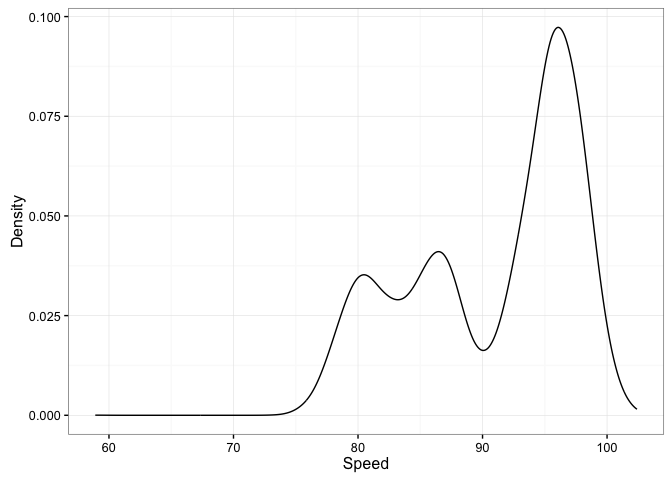<!-- -->

```r
## Figure 6.2 - facets!!!!
ggplot(verlander, aes(speed)) + 
  theme_bw() + 
  geom_line(stat = "density") + 
  ylab("Density") + 
  xlab("Speed") + 
  facet_wrap(~ pitch_type, nrow = 5)
```

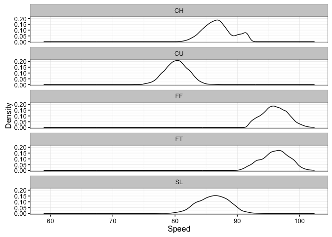<!-- -->

```r
## Figure 6.3
ggplot(verlander, aes(speed, lty = pitch_type)) + 
  theme_bw() + 
  geom_line(stat = "density") + 
  ylab("Density") + 
  xlab("Speed")
```

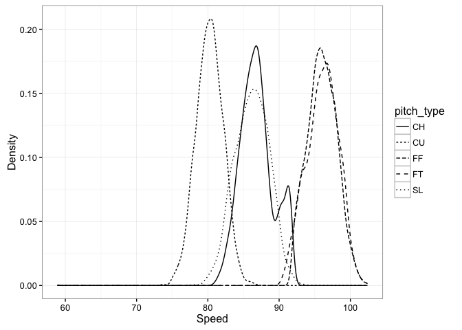<!-- -->

```r
## Figure 6.4
F4verl <- verlander %>% 
  filter(pitch_type == "FF") %>% 
  mutate(gameDay = as.integer(format(gamedate, format = "%j")))
head(F4verl)
```

```
##   season   gamedate pitch_type balls strikes pitches speed    px   pz
## 1   2009 2009-04-06         FF     0       0       0  96.6 -0.43 3.24
## 2   2009 2009-04-06         FF     1       2       4  97.9 -0.31 2.50
## 3   2009 2009-04-06         FF     2       2       6  98.7  0.72 3.30
## 4   2009 2009-04-06         FF     3       2       7  97.1  0.51 2.37
## 5   2009 2009-04-06         FF     0       0       8  97.8 -0.45 2.29
## 6   2009 2009-04-06         FF     2       1      11  98.3  0.64 4.00
##   pfx_x pfx_z batter_hand gameDay
## 1 -4.44  9.28           R      96
## 2 -6.64  6.30           R      96
## 3 -7.65  4.77           R      96
## 4 -5.10  6.29           R      96
## 5 -8.07  7.38           R      96
## 6 -5.75  7.43           R      96
```

```r
dim(F4verl)
```

```
## [1] 6756   13
```

```r
# Using dplyr rather than aggregate
dailySpeed <- F4verl %>% 
  select(gameDay, season, speed) %>% 
  group_by(gameDay, season) %>% 
  summarize(speed = mean(speed))
dim(dailySpeed)
```

```
## [1] 135   3
```

```r
head(dailySpeed)
```

```
## Source: local data frame [6 x 3]
## Groups: gameDay [4]
## 
##   gameDay season    speed
##     <int>  <int>    <dbl>
## 1      90   2011 94.86923
## 2      95   2010 99.39091
## 3      96   2009 96.77500
## 4      96   2011 94.73913
## 5      96   2012 94.28788
## 6     101   2009 95.94200
```

```r
ggplot(dailySpeed, aes(y = speed, x = gameDay)) + 
  theme_bw() + 
  facet_wrap(~ season, nrow = 2) + 
  geom_point(size = 2) + 
  ylab("Pitch Speed (MPH)") + 
  xlab("Day of Year")
```

<!-- -->

```r
## Figure 6.5
speedFC <- verlander %>% 
  filter(pitch_type %in% c("FF", "CH"))
head(speedFC)
```

```
##   season   gamedate pitch_type balls strikes pitches speed    px   pz
## 1   2009 2009-04-06         FF     0       0       0  96.6 -0.43 3.24
## 2   2009 2009-04-06         FF     1       2       4  97.9 -0.31 2.50
## 3   2009 2009-04-06         FF     2       2       6  98.7  0.72 3.30
## 4   2009 2009-04-06         FF     3       2       7  97.1  0.51 2.37
## 5   2009 2009-04-06         FF     0       0       8  97.8 -0.45 2.29
## 6   2009 2009-04-06         CH     0       1       9  85.8 -0.89 2.10
##   pfx_x pfx_z batter_hand
## 1 -4.44  9.28           R
## 2 -6.64  6.30           R
## 3 -7.65  4.77           R
## 4 -5.10  6.29           R
## 5 -8.07  7.38           R
## 6 -6.67  4.47           R
```

```r
avgspeedFC <- speedFC %>% 
  select(pitch_type, season, speed) %>% 
  group_by(season, pitch_type) %>% 
  summarize(speed = mean(speed))
avgspeedFC
```

```
## Source: local data frame [8 x 3]
## Groups: season [?]
## 
##   season pitch_type    speed
##    <int>     <fctr>    <dbl>
## 1   2009         CH 85.06900
## 2   2009         FF 96.46576
## 3   2010         CH 86.72249
## 4   2010         FF 96.23772
## 5   2011         CH 87.56312
## 6   2011         FF 95.83171
## 7   2012         CH 87.38355
## 8   2012         FF 95.46240
```

```r
ggplot(avgspeedFC, aes(y = season, x = speed)) + 
  theme_bw() + 
  geom_text(aes(label = pitch_type)) + 
  ylab("Season") + 
  xlab("Speed")
```

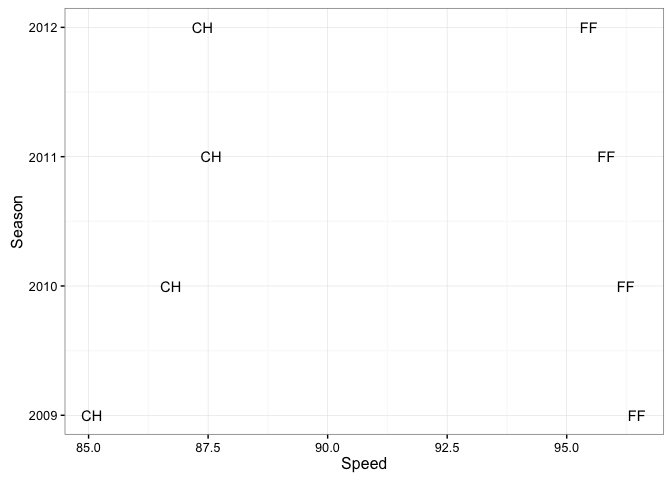<!-- -->

```r
## Figure 6.6
avgSpeed <- F4verl %>% 
  select(pitches, season, speed) %>% 
  group_by(pitches, season) %>% 
  summarize(speed = mean(speed))
head(avgSpeed)
```

```
## Source: local data frame [6 x 3]
## Groups: pitches [2]
## 
##   pitches season    speed
##     <int>  <int>    <dbl>
## 1       0   2009 94.27500
## 2       0   2010 94.51818
## 3       0   2011 93.27895
## 4       0   2012 93.17273
## 5       1   2009 94.67917
## 6       1   2010 95.10000
```

```r
ggplot(avgSpeed, aes(y = speed, x = pitches)) + 
  theme_bw() + 
  facet_wrap(~ season, nrow = 2) + 
  geom_point(size = 1.5) + 
  geom_hline(aes(yintercept = mean(speed))) 
```

<!-- -->

```r
## Figure 6.7
NoHit <- verlander %>% 
  filter(gamedate == "2011-05-07")
dim(NoHit)
```

```
## [1] 83 12
```

```r
head(NoHit)
```

```
##   season   gamedate pitch_type balls strikes pitches speed    px   pz
## 1   2011 2011-05-07         FF     1       1       2  96.1 -1.32 3.18
## 2   2011 2011-05-07         FT     0       0       3  93.0 -1.14 2.85
## 3   2011 2011-05-07         CH     0       1       4  84.7 -1.90 1.83
## 4   2011 2011-05-07         FT     0       2       6  96.2  1.34 3.44
## 5   2011 2011-05-07         FF     1       2       7  99.0  1.00 2.52
## 6   2011 2011-05-07         FF     0       0       9  94.0  0.27 2.31
##    pfx_x pfx_z batter_hand
## 1  -5.90  5.48           R
## 2  -9.85  6.03           L
## 3 -12.23  3.58           L
## 4  -8.84 10.43           L
## 5  -6.69  4.27           L
## 6  -7.46 11.90           R
```

```r
f6.7 <- ggplot(NoHit, aes(x = px, y = pz)) + 
  theme_bw() + 
  facet_wrap(~ batter_hand, nrow = 1) + 
  geom_point(aes(shape = pitch_type), size = 2.5)
f6.7
```

<!-- -->

```r
### Figure 6.8
f6.8 <- ggplot(NoHit, aes(x = px, y = pz)) + 
  theme_bw() + 
  facet_wrap(~ batter_hand, ncol = 1) + 
  geom_point(aes(shape = pitch_type), size = 2.5) + 
  xlim(-2.2, 2.2) + ylim(0, 4)
f6.8
```

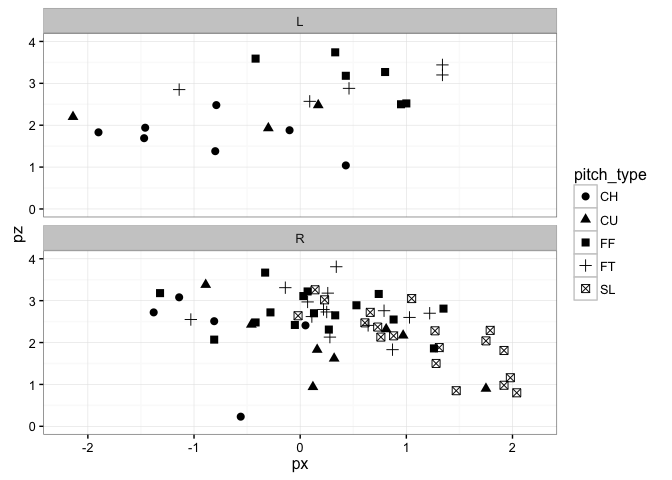<!-- -->

```r
### Figure 6.9
f6.9 <- ggplot(NoHit, aes(x = px, y = pz)) + 
  theme_bw() + 
  facet_wrap(~ batter_hand, nrow = 1) + 
  geom_point(aes(shape = pitch_type), size = 2.5) + 
  xlim(-2.2, 2.2) + 
  ylim(0, 5) + 
  ylab("Vertical Location\n(ft. from ground)") + 
  xlab("Horizontal Location\n(ft. from middle of plate)") +
  labs(shape = "Pitch Type")
f6.9
```

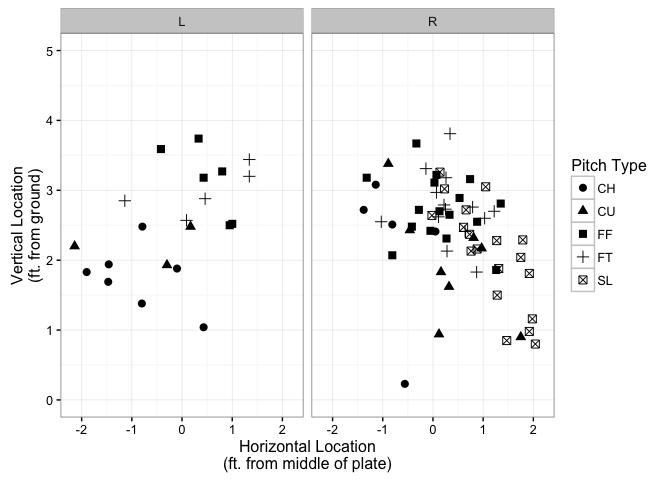<!-- -->

```r
### Figure 6.10
topKzone <- 3.5
botKzone <- 1.6
inKzone <- -0.95
outKzone <- 0.95

f6.10 <- ggplot(NoHit, aes(x = px, y = pz)) + 
  theme_bw() + 
  facet_wrap(~ batter_hand, nrow = 1) + 
  geom_point(aes(shape = pitch_type), size = 2.5) + 
  xlim(-2.2, 2.2) + 
  ylim(0, 5) + 
  ylab("Vertical Location\n(ft. from ground)") + 
  xlab("Horizontal Location\n(ft. from middle of plate)") +
  labs(shape = "Pitch Type") + 
  annotate("rect", xmin = -0.95, xmax = 0.95, ymin = 1.6, ymax = 3.5, fill = "dodgerblue", alpha = 0.3) # I think that shading in the strike zone is WAY prettier than a dashed line box. 
f6.10
```

<!-- -->


```r
### Figure 6.11
head(cabrera)
```

```
##   season   gamedate pitch_type balls strikes speed    px   pz swung hitx
## 1   2009 2009-04-06         FT     0       0  94.2 -0.55 2.33     0   NA
## 2   2009 2009-04-06         FT     0       1  94.8 -1.07 1.80     1 5.68
## 3   2009 2009-04-06         FC     0       0  91.1  1.28 2.10     0   NA
## 4   2009 2009-04-06         FT     1       0  94.4 -0.93 1.76     0   NA
## 5   2009 2009-04-06         FT     2       0  94.5  0.40 2.44     0   NA
## 6   2009 2009-04-06         FT     2       1  95.1 -0.58 2.42     1 2.99
##     hity hit_outcome
## 1     NA        <NA>
## 2 156.10           O
## 3     NA        <NA>
## 4     NA        <NA>
## 5     NA        <NA>
## 6  61.57           H
```

```r
dim(cabrera)
```

```
## [1] 6265   12
```

```r
ggplot(cabrera, aes(x = hitx, y = hity)) + 
  geom_point()
```

```
## Warning: Removed 4284 rows containing missing values (geom_point).
```

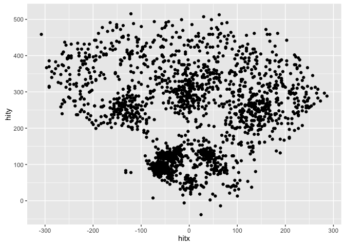<!-- -->

```r
### Figure 6.12
ggplot(cabrera, aes(x = hitx, y = hity)) + 
  geom_point(aes(color = hit_outcome)) + 
  coord_equal()
```

```
## Warning: Removed 4284 rows containing missing values (geom_point).
```

<!-- -->

```r
### Figure 6.13
ggplot(cabrera, aes(x = hitx, y = hity)) + 
  geom_point(aes(color = hit_outcome)) + 
  coord_equal() + 
  facet_wrap(~ season)
```

```
## Warning: Removed 4284 rows containing missing values (geom_point).
```

<!-- -->

```r
bases <- data.frame(x = c(0, 90 / sqrt(2), 0, -90 / sqrt(2), 0), y = c(0, 90 / sqrt(2), 2 * 90 / sqrt(2), 90 / sqrt(2), 0))

### Figure 6.14
ggplot(cabrera, aes(x = hitx, y = hity)) + 
  geom_point(aes(color = hit_outcome)) + 
  coord_equal() + 
  facet_wrap(~ season) + 
  geom_path(aes(x = x, y = y), data = bases) + 
  geom_segment(x = 0, xend = 300, y = 0, yend = 300) + 
  geom_segment(x = 0, xend = -300, y = 0, yend = 300)
```

```
## Warning: Removed 4284 rows containing missing values (geom_point).
```

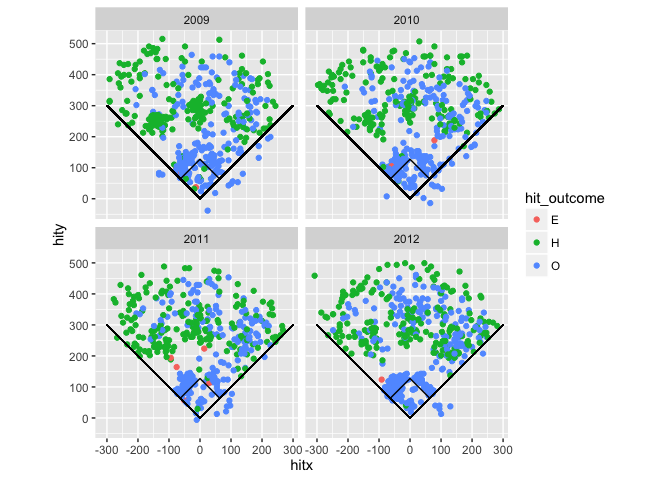<!-- -->

```r
### Figure 6.15
cabreraStretch <- cabrera %>% 
  filter(gamedate > "2012-08-31")

ggplot(cabreraStretch, aes(x = hitx, y = hity)) + 
  geom_point(aes(shape = hit_outcome, color = pitch_type, size = speed)) + 
  coord_equal() + 
  geom_path(aes(x = x, y = y), data = bases) + 
  guides(col = guide_legend(ncol = 2))+ 
  geom_segment(x = 0, xend = 300, y = 0, yend = 300) + 
  geom_segment(x = 0, xend = -300, y = 0, yend = 300)
```

```
## Warning: Removed 211 rows containing missing values (geom_point).
```

<!-- -->

```r
### Figure 6.16 Note that recent ggplot2 versions use geom_hline 
ggplot(F4verl, aes(x = pitches, y = speed)) + 
  facet_wrap(~ season) + 
  geom_hline(aes(yintercept = mean(speed)), lty = 3) + 
  geom_point(aes(x = pitches, y = speed), data = F4verl[sample(1:nrow(F4verl), 1000), ]) + 
  geom_smooth(col = "black") + 
  geom_vline(aes(xintercept = 100), col = "black", lty = 2)
```

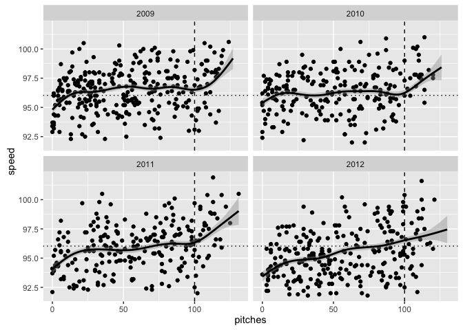<!-- -->

```r
### Figure 6.17
kZone <- data.frame(x = c(inKzone, inKzone, outKzone, outKzone, inKzone), y = c(botKzone, topKzone, topKzone, botKzone, botKzone))
kZone
```

```
##       x   y
## 1 -0.95 1.6
## 2 -0.95 3.5
## 3  0.95 3.5
## 4  0.95 1.6
## 5 -0.95 1.6
```

```r
# In my experience, setting the facet prior to calling geom is good practice
ggplot(F4verl, aes(x = px, y = pz)) + 
  facet_wrap(~ batter_hand) + 
  geom_point() + 
  coord_equal() + 
  geom_path(aes(x, y), data = kZone, lwd = 2, col = "white")
```

<!-- -->

```r
### Figure 6.18
ggplot(F4verl, aes(x = px, y = pz)) + 
  facet_wrap(~ batter_hand) + 
  stat_binhex() + 
  coord_equal() + 
  geom_path(aes(x, y), data = kZone, lwd = 2, col = "white", alpha = 0.3)
```

<!-- -->

```r
### Figure 6.19
Comerica <- jpeg::readJPEG("Data/Comerica.jpg")

ggplot(cabrera, aes(x = hitx, y = hity)) + 
  coord_equal() + 
  theme(panel.background = element_rect(fill = "white")) + 
  annotation_raster(Comerica, -310, 305, -100, 480) + 
  stat_binhex(alpha = 0.9, binwidth = c(5, 5)) + 
  scale_fill_gradient(low = "grey70", high = "black") + 
  ylab("") +
  xlab("")
```

```
## Warning: Removed 4284 rows containing non-finite values (stat_binhex).
```

<!-- -->

### Chapter 6 exercises
1. **Location of Pitches for Left- and Right-Handed Batters** - Use a density plot to display the horizontal location of Justin Verlander’s pitchers by opponent’s handedness. Choose the conditioning and grouping variables so that one can easily detect the differences in location by handedness. Add a legend (if necessary) and vertical reference lines indicating the borders of the strike zone.


```r
ggplot(verlander, aes(x = px)) + 
  theme_bw() + 
  geom_line(stat = "density", aes(color = batter_hand), size = 2) + 
  xlab("Horizontal location") + 
  ylab("Density") + 
  geom_vline(xintercept = -0.95, linetype = 2, size = 1.5) +
  geom_vline(xintercept = 0.95, linetype = 2, size = 1.5)
```

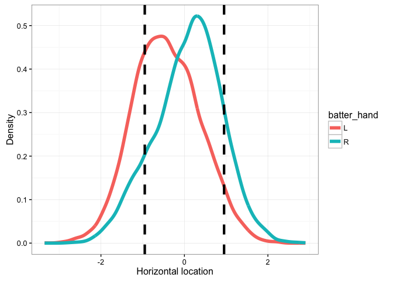<!-- -->
2. **Comparing Pitch Locations for Two Pitchers** - The sanchez data frame contains 2008-2012 PITCHf/x data for pitcher Jonathan Sanchez. The structure of this data frame is similar to the verlander data frame described in the chapter. Use a graphical display to compare the ability of Sanchez and Verlander in maintaining their fast-ball speed through the game. (See Sections 6.2.7 and 6.3.8.) Use either the lattice or ggplot2 graphics package and display the data either as a multipanel plot or a superposed lines plot

Use the following function to plot multiple images on one pane. [Link to source of code](www.cookbook-r.com/Graphs/Multiple_graphs_on_one_page_(ggplot2)/)

```r
multiplot <- function(..., plotlist = NULL, file, cols = 1, layout = NULL){
  library(grid)
  plots <- c(list(...), plotlist)
  numPlots <- length(plots)
  if(is.null(layout)){
    layout <- matrix(seq(1, cols * ceiling(numPlots / cols)), ncol = cols, nrow = ceiling(numPlots / cols))
  }
  if (numPlots == 1){
    print(plots[[1]])
  }
  else{
    grid.newpage()
    pushViewport(viewport(layout = grid.layout(nrow(layout), ncol(layout))))
    for(i in 1:numPlots){
      matchidx <- as.data.frame(which(layout == i, arr.ind = TRUE))
      print(plots[[i]], vp = viewport(layout.pos.row = matchidx$row, layout.pos.col = matchidx$col))
    }
  }
}  
```

```r
head(sanchez)
```

```
##   season   gamedate pitch_type balls strikes pitches speed    px   pz
## 1   2009 2009-04-11         FF     0       0       0  94.9  0.87 2.75
## 2   2009 2009-04-11         FF     0       1       1  95.3  0.96 4.77
## 3   2009 2009-04-11         FT     1       1       2  95.1 -0.12 1.75
## 4   2009 2009-04-11         SL     1       2       3  83.1 -0.09 2.69
## 5   2009 2009-04-11         FT     1       2       4  95.0 -0.79 2.79
## 6   2009 2009-04-11         FF     0       0       5  94.5  0.26 3.58
##   batter_hand
## 1           R
## 2           R
## 3           R
## 4           R
## 5           R
## 6           R
```

```r
dim(sanchez)
```

```
## [1] 9113   10
```

```r
Sanchez_FF <- sanchez %>% filter(pitch_type == "FF") %>% select(speed, pitches)

S_FF <- ggplot(Sanchez_FF, aes(x = pitches, y = speed)) +
  theme_bw() + 
  geom_point(size = 1.75, alpha = 0.4) + 
  geom_smooth(method = "lm", col = "red") +
  ggtitle("Sanchez fastball") +
  xlab("Pitches") +
  ylab("Speed (mph)") +
  ylim(85, 105) + 
  xlim(0, 135)

# Earlier we created the F4verl object, which contains the data we need. 

V_FF <- ggplot(F4verl, aes(x = pitches, y = speed)) +
  theme_bw() + 
  geom_point(size = 1.75, alpha = 0.4) + 
  geom_smooth(method = "lm", col = "red") +
  ggtitle("Verlander fastball") +
  xlab("Pitches") +
  ylab("") +
  ylim(85, 105) + 
  xlim(0, 135)

multiplot(S_FF, V_FF, cols = 2)
```

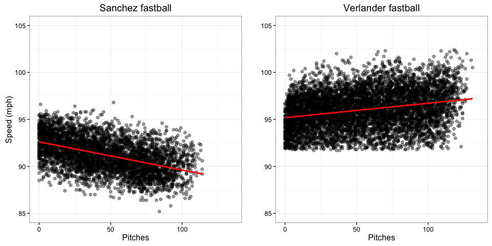<!-- -->

```r
# Cool. Verlander's fastbal speed increases the more he throws and Sanchez's velocity decreases.
```


3. **Graphical View of the Speeds of Justin Verlander’s Fastballs** 
+ The cut function is useful for recoding a continuous variable into intervals. Use this function to categorize the pitches variable in the verlander data frame in groups of ten pitches.

```r
Verl_cut <- cut(verlander$pitches, breaks = 10)
head(Verl_cut)
```

```
## [1] (-0.131,13.1] (-0.131,13.1] (-0.131,13.1] (-0.131,13.1] (-0.131,13.1]
## [6] (-0.131,13.1]
## 10 Levels: (-0.131,13.1] (13.1,26.2] (26.2,39.3] ... (118,131]
```

```r
table(Verl_cut)
```

```
## Verl_cut
## (-0.131,13.1]   (13.1,26.2]   (26.2,39.3]   (39.3,52.4]   (52.4,65.5] 
##          1874          1748          1740          1746          1748 
##   (65.5,78.6]   (78.6,91.7]    (91.7,105]     (105,118]     (118,131] 
##          1734          1705          1633          1132           247
```
+ Use the bwplot function from the lattice package to produce a boxplot of Verlander’s four-seam fastball speed (use the F4verl data frame) for each ten-pitches group. Compare the information conveyed by the resulting chart with that of Figure 6.6.

```r
# I'll use ggplot2 for this. 
VC <- verlander %>% mutate(pitch_bin = cut(verlander$pitches, breaks = 10))
head(VC)
```

```
##   season   gamedate pitch_type balls strikes pitches speed    px   pz
## 1   2009 2009-04-06         FF     0       0       0  96.6 -0.43 3.24
## 2   2009 2009-04-06         CU     0       1       1  81.1 -0.43 3.79
## 3   2009 2009-04-06         CU     1       1       2  80.4 -0.17 2.98
## 4   2009 2009-04-06         CU     1       2       3  83.1 -0.76 3.45
## 5   2009 2009-04-06         FF     1       2       4  97.9 -0.31 2.50
## 6   2009 2009-04-06         CU     1       2       5  82.6  0.32 1.30
##   pfx_x pfx_z batter_hand     pitch_bin
## 1 -4.44  9.28           R (-0.131,13.1]
## 2  5.53 -8.28           R (-0.131,13.1]
## 3  4.83 -8.03           R (-0.131,13.1]
## 4  4.21 -9.33           R (-0.131,13.1]
## 5 -6.64  6.30           R (-0.131,13.1]
## 6  5.21 -8.44           R (-0.131,13.1]
```

```r
str(VC)
```

```
## 'data.frame':	15307 obs. of  13 variables:
##  $ season     : int  2009 2009 2009 2009 2009 2009 2009 2009 2009 2009 ...
##  $ gamedate   : Date, format: "2009-04-06" "2009-04-06" ...
##  $ pitch_type : Factor w/ 5 levels "CH","CU","FF",..: 3 2 2 2 3 2 3 3 3 1 ...
##  $ balls      : int  0 0 1 1 1 1 2 3 0 0 ...
##  $ strikes    : int  0 1 1 2 2 2 2 2 0 1 ...
##  $ pitches    : int  0 1 2 3 4 5 6 7 8 9 ...
##  $ speed      : num  96.6 81.1 80.4 83.1 97.9 82.6 98.7 97.1 97.8 85.8 ...
##  $ px         : num  -0.43 -0.43 -0.17 -0.76 -0.31 0.32 0.72 0.51 -0.45 -0.89 ...
##  $ pz         : num  3.24 3.79 2.98 3.45 2.5 1.3 3.3 2.37 2.29 2.1 ...
##  $ pfx_x      : num  -4.44 5.53 4.83 4.21 -6.64 5.21 -7.65 -5.1 -8.07 -6.67 ...
##  $ pfx_z      : num  9.28 -8.28 -8.03 -9.33 6.3 -8.44 4.77 6.29 7.38 4.47 ...
##  $ batter_hand: Factor w/ 2 levels "L","R": 2 2 2 2 2 2 2 2 2 2 ...
##  $ pitch_bin  : Factor w/ 10 levels "(-0.131,13.1]",..: 1 1 1 1 1 1 1 1 1 1 ...
```

```r
ggplot(VC, aes(y = speed, x = pitch_bin)) + 
  geom_boxplot(fill = "grey", outlier.size = 2, stat = "boxplot") +
  theme_bw() +
  xlab("Number of pitches") + 
  ylab("Speed (mph)") + 
  theme(axis.text.x = element_text(angle = 90))
```

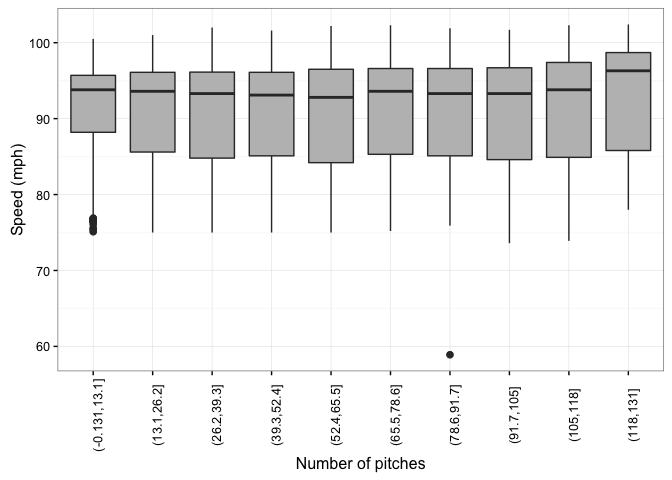<!-- -->

```r
# You can really see that he dialed up the spped in his final pitches
```
4. **Exploring Miguel Cabrera’s Slugging Power**
+ Create a data frame by selecting, from the cabrera data frame, the instances where the hit outcome variable assumes the value H (for base hit).

```r
Q4a <- cabrera %>% filter(hit_outcome == "H")
head(Q4a)
```

```
##   season   gamedate pitch_type balls strikes speed    px   pz swung
## 1   2009 2009-04-06         FT     2       1  95.1 -0.58 2.42     1
## 2   2009 2009-04-06         SI     0       1  96.9  0.55 1.95     1
## 3   2009 2009-04-07         SL     1       0  82.9 -0.06 2.72     1
## 4   2009 2009-04-07         SI     0       0  90.3 -0.23 1.95     1
## 5   2009 2009-04-08         SI     0       0  93.0 -0.77 2.28     1
## 6   2009 2009-04-08         SI     1       1  90.9 -0.09 3.11     1
##      hitx   hity hit_outcome
## 1    2.99  61.57           H
## 2    2.99 261.44           H
## 3 -121.27 202.02           H
## 4    5.68 442.40           H
## 5 -221.20 377.57           H
## 6  -48.34 491.01           H
```

```r
dim(Q4a)
```

```
## [1] 781  12
```
+ Using the hitx and hity variables, create a new variable equal to the distance, in feet from home plate, of Cabrera’s base hits. (This variable is computed by simply applying the Pythagorean Theorem – remember that home plate is at the origin.)

```r
pythag <- function(a, b){
  c2 <- a^2 + b^2
  sqrt(c2)
}
cabrera <- cabrera %>% mutate(distance = pythag(hitx, hity))
head(cabrera)
```

```
##   season   gamedate pitch_type balls strikes speed    px   pz swung hitx
## 1   2009 2009-04-06         FT     0       0  94.2 -0.55 2.33     0   NA
## 2   2009 2009-04-06         FT     0       1  94.8 -1.07 1.80     1 5.68
## 3   2009 2009-04-06         FC     0       0  91.1  1.28 2.10     0   NA
## 4   2009 2009-04-06         FT     1       0  94.4 -0.93 1.76     0   NA
## 5   2009 2009-04-06         FT     2       0  94.5  0.40 2.44     0   NA
## 6   2009 2009-04-06         FT     2       1  95.1 -0.58 2.42     1 2.99
##     hity hit_outcome  distance
## 1     NA        <NA>        NA
## 2 156.10           O 156.20330
## 3     NA        <NA>        NA
## 4     NA        <NA>        NA
## 5     NA        <NA>        NA
## 6  61.57           H  61.64256
```
+ In the newly created data frame, create a gameDay variable indicating the day of the year (from 0 to 365) in which the game took place (see Section 6.2.6).

```r
cabrera <- cabrera %>% 
  mutate(gameDay = as.integer(format(gamedate, format="%j")))
head(cabrera)
```

```
##   season   gamedate pitch_type balls strikes speed    px   pz swung hitx
## 1   2009 2009-04-06         FT     0       0  94.2 -0.55 2.33     0   NA
## 2   2009 2009-04-06         FT     0       1  94.8 -1.07 1.80     1 5.68
## 3   2009 2009-04-06         FC     0       0  91.1  1.28 2.10     0   NA
## 4   2009 2009-04-06         FT     1       0  94.4 -0.93 1.76     0   NA
## 5   2009 2009-04-06         FT     2       0  94.5  0.40 2.44     0   NA
## 6   2009 2009-04-06         FT     2       1  95.1 -0.58 2.42     1 2.99
##     hity hit_outcome  distance gameDay
## 1     NA        <NA>        NA      96
## 2 156.10           O 156.20330      96
## 3     NA        <NA>        NA      96
## 4     NA        <NA>        NA      96
## 5     NA        <NA>        NA      96
## 6  61.57           H  61.64256      96
```
+ Build a scatterplot featuring gameDay on the x-axis, distance on the y-axis and a smooth line with error bands. Does the resulting plot appear to indicate changes in Cabrera’s power during the season?

```r
ggplot(cabrera, aes(x = gameDay, y = distance)) +
  theme_bw() + 
  geom_point(size = 1.5) + 
  ylim(0, 550) + 
  xlim(90, 274) + 
  xlab("Distance") + 
  ylab("Day of year") + 
  stat_smooth(method = "lm", color = "red", size = 1.5) # Note that the ~4300 removed values are NAs.
```

```
## Warning: Removed 4308 rows containing non-finite values (stat_smooth).
```

```
## Warning: Removed 4308 rows containing missing values (geom_point).
```

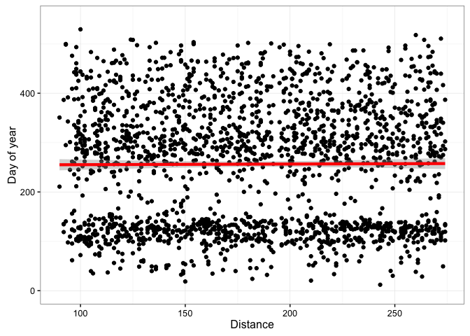<!-- -->

```r
# Looks like a slight decline in distance but I highly doubt it is statistically significant let alone means anything in reality.
```
