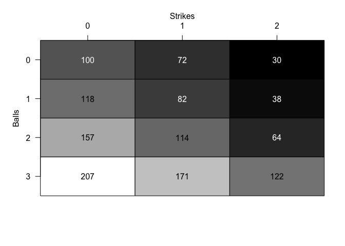
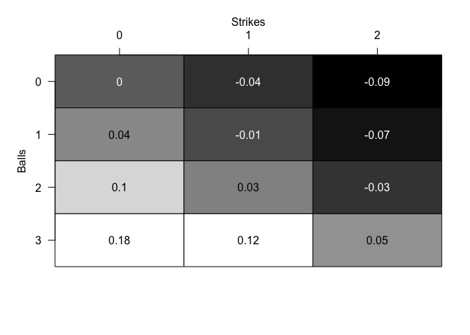
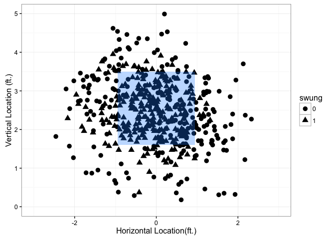
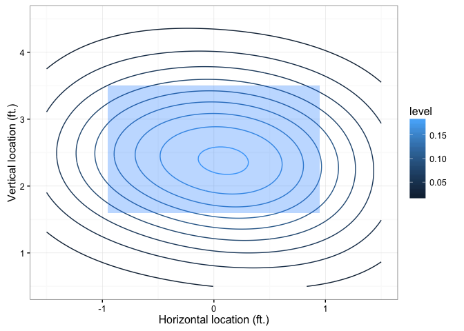
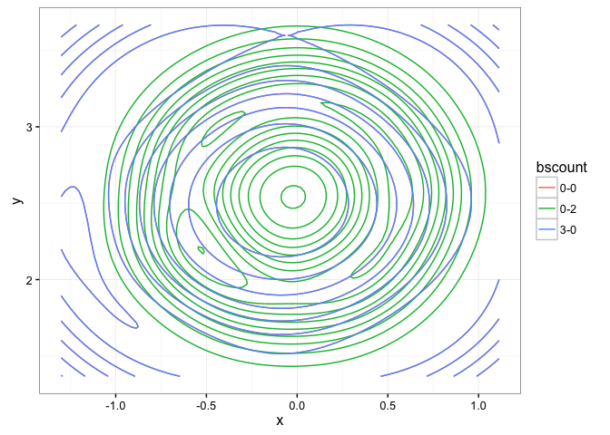

# tidy Baseball Chapter 7
Chris Hamm  
`r format(Sys.Date())`  


## Chapter 7 - *Balls and strikes effects*


```r
library("Lahman")
library("tidyverse"); options(dplyr.width = Inf)
```

```
## Loading tidyverse: ggplot2
## Loading tidyverse: tibble
## Loading tidyverse: tidyr
## Loading tidyverse: readr
## Loading tidyverse: purrr
## Loading tidyverse: dplyr
```

```
## Conflicts with tidy packages ----------------------------------------------
```

```
## filter(): dplyr, stats
## lag():    dplyr, stats
```

```r
library("plotrix")

set.seed(8761825)
devtools::session_info()
```

```
## Session info --------------------------------------------------------------
```

```
##  setting  value                       
##  version  R version 3.3.1 (2016-06-21)
##  system   x86_64, darwin13.4.0        
##  ui       X11                         
##  language (EN)                        
##  collate  en_US.UTF-8                 
##  tz       America/New_York            
##  date     2016-10-04
```

```
## Packages ------------------------------------------------------------------
```

```
##  package    * version date       source        
##  assertthat   0.1     2013-12-06 CRAN (R 3.3.0)
##  colorspace   1.2-6   2015-03-11 CRAN (R 3.3.0)
##  DBI          0.5-1   2016-09-10 CRAN (R 3.3.0)
##  devtools     1.12.0  2016-06-24 CRAN (R 3.3.0)
##  digest       0.6.10  2016-08-02 CRAN (R 3.3.1)
##  dplyr      * 0.5.0   2016-06-24 CRAN (R 3.3.0)
##  evaluate     0.9     2016-04-29 CRAN (R 3.3.0)
##  formatR      1.4     2016-05-09 CRAN (R 3.3.0)
##  ggplot2    * 2.1.0   2016-03-01 CRAN (R 3.3.0)
##  gtable       0.2.0   2016-02-26 CRAN (R 3.3.0)
##  htmltools    0.3.5   2016-03-21 CRAN (R 3.3.0)
##  knitr        1.14    2016-08-13 CRAN (R 3.3.0)
##  Lahman     * 5.0-0   2016-08-27 CRAN (R 3.3.0)
##  magrittr     1.5     2014-11-22 CRAN (R 3.3.0)
##  memoise      1.0.0   2016-01-29 CRAN (R 3.3.0)
##  munsell      0.4.3   2016-02-13 CRAN (R 3.3.0)
##  plotrix    * 3.6-3   2016-07-21 CRAN (R 3.3.0)
##  plyr         1.8.4   2016-06-08 CRAN (R 3.3.0)
##  purrr      * 0.2.2   2016-06-18 CRAN (R 3.3.0)
##  R6           2.1.3   2016-08-19 CRAN (R 3.3.0)
##  Rcpp         0.12.7  2016-09-05 CRAN (R 3.3.0)
##  readr      * 1.0.0   2016-08-03 CRAN (R 3.3.0)
##  rmarkdown    1.0     2016-07-08 CRAN (R 3.3.0)
##  scales       0.4.0   2016-02-26 CRAN (R 3.3.0)
##  stringi      1.1.1   2016-05-27 CRAN (R 3.3.0)
##  stringr      1.1.0   2016-08-19 CRAN (R 3.3.0)
##  tibble     * 1.2     2016-08-26 CRAN (R 3.3.0)
##  tidyr      * 0.6.0   2016-08-12 CRAN (R 3.3.1)
##  tidyverse  * 1.0.0   2016-09-09 CRAN (R 3.3.0)
##  withr        1.0.2   2016-06-20 CRAN (R 3.3.0)
##  yaml         2.1.13  2014-06-12 CRAN (R 3.3.0)
```

#### Figure 7.1 - This is essentially a plot of a contingency table

```r
mussina <- expand.grid(balls = 0:3, strikes = 0:2)
mussina$value <- c(100, 118, 157, 207, 72, 82, 114, 171, 30, 38, 64, 122)
mussina
```

```
##    balls strikes value
## 1      0       0   100
## 2      1       0   118
## 3      2       0   157
## 4      3       0   207
## 5      0       1    72
## 6      1       1    82
## 7      2       1   114
## 8      3       1   171
## 9      0       2    30
## 10     1       2    38
## 11     2       2    64
## 12     3       2   122
```

```r
countmap <- function(data){
  data <- xtabs(value ~ ., data)
  color2D.matplot(data, show.values = 2, axes = FALSE
, xlab = "", ylab = "")
  axis(side = 2, at = 3.5:0.5, labels = rownames(data), las = 1)
  axis(side = 3, at = 0.5:2.5, labels = colnames(data))
  mtext(text = "Balls", side = 2, line = 2, cex.lab = 1)
  mtext(text = "Strikes", side = 3, line = 2, cex.lab = 1)
}
countmap(mussina)
```




```r
## Functions for string manipulation
sequences <- c("BBX", "C11BBC1S", "1X")
grep("1", sequences)
```

```
## [1] 2 3
```

```r
grepl("1", sequences)
```

```
## [1] FALSE  TRUE  TRUE
```

```r
grepl("11", sequences)
```

```
## [1] FALSE  TRUE FALSE
```

```r
gsub("1", "", sequences)
```

```
## [1] "BBX"   "CBBCS" "X"
```

```r
pbp2011 <- read.csv("https://raw.githubusercontent.com/maxtoki/baseball_R/master/data/all2011.csv", header = FALSE)
headers <- read_csv("Data/fields.csv")
```

```
## Parsed with column specification:
## cols(
##   `Field number` = col_integer(),
##   Description = col_character(),
##   Header = col_character()
## )
```

```r
names(pbp2011) <- headers$Header
head(pbp2011)
```

```
##        GAME_ID AWAY_TEAM_ID INN_CT BAT_HOME_ID OUTS_CT BALLS_CT STRIKES_CT
## 1 ANA201104080          TOR      1           0       0        1          2
## 2 ANA201104080          TOR      1           0       1        0          0
## 3 ANA201104080          TOR      1           0       2        1          2
## 4 ANA201104080          TOR      1           1       0        3          1
## 5 ANA201104080          TOR      1           1       0        2          2
## 6 ANA201104080          TOR      1           1       1        2          1
##   PITCH_SEQ_TX AWAY_SCORE_CT HOME_SCORE_CT   BAT_ID BAT_HAND_CD
## 1         FBSX             0             0 davir003           R
## 2            X             0             0 nix-j001           R
## 3         CBCS             0             0 bautj002           R
## 4        CBBBB             0             0 iztum001           L
## 5        BCSBS             0             0 kendh001           R
## 6       CBB1>S             0             0 abreb001           L
##   RESP_BAT_ID RESP_BAT_HAND_CD   PIT_ID PIT_HAND_CD RESP_PIT_ID
## 1    davir003                R sante001           R    sante001
## 2    nix-j001                R sante001           R    sante001
## 3    bautj002                R sante001           R    sante001
## 4    iztum001                L drabk001           R    drabk001
## 5    kendh001                R drabk001           R    drabk001
## 6    abreb001                L drabk001           R    drabk001
##   RESP_PIT_HAND_CD POS2_FLD_ID POS3_FLD_ID POS4_FLD_ID POS5_FLD_ID
## 1                R    congh001    trumm001    kendh001    calla001
## 2                R    congh001    trumm001    kendh001    calla001
## 3                R    congh001    trumm001    kendh001    calla001
## 4                R    molij001    linda001    hilla001    nix-j001
## 5                R    molij001    linda001    hilla001    nix-j001
## 6                R    molij001    linda001    hilla001    nix-j001
##   POS6_FLD_ID POS7_FLD_ID POS8_FLD_ID POS9_FLD_ID BASE1_RUN_ID
## 1    iztum001    wellv001    bourp001    huntt001             
## 2    iztum001    wellv001    bourp001    huntt001             
## 3    iztum001    wellv001    bourp001    huntt001             
## 4    mcdoj003    snidt001    davir003    bautj002             
## 5    mcdoj003    snidt001    davir003    bautj002     iztum001
## 6    mcdoj003    snidt001    davir003    bautj002     iztum001
##   BASE2_RUN_ID BASE3_RUN_ID EVENT_TX LEADOFF_FL PH_FL BAT_FLD_CD
## 1                                9/F       TRUE FALSE          8
## 2                                9/F      FALSE FALSE          5
## 3                                  K      FALSE FALSE          9
## 4                                  W       TRUE FALSE          6
## 5                                  K      FALSE FALSE          4
## 6                            CS2(26)      FALSE FALSE         10
##   BAT_LINEUP_ID EVENT_CD BAT_EVENT_FL AB_FL H_FL SH_FL SF_FL EVENT_OUTS_CT
## 1             1        2         TRUE  TRUE    0 FALSE FALSE             1
## 2             2        2         TRUE  TRUE    0 FALSE FALSE             1
## 3             3        3         TRUE  TRUE    0 FALSE FALSE             1
## 4             1       14         TRUE FALSE    0 FALSE FALSE             0
## 5             2        3         TRUE  TRUE    0 FALSE FALSE             1
## 6             3        6        FALSE FALSE    0 FALSE FALSE             1
##   DP_FL TP_FL RBI_CT WP_FL PB_FL FLD_CD BATTEDBALL_CD BUNT_FL FOUL_FL
## 1 FALSE FALSE      0 FALSE FALSE      9             F   FALSE   FALSE
## 2 FALSE FALSE      0 FALSE FALSE      9             F   FALSE   FALSE
## 3 FALSE FALSE      0 FALSE FALSE      0                 FALSE   FALSE
## 4 FALSE FALSE      0 FALSE FALSE      0                 FALSE   FALSE
## 5 FALSE FALSE      0 FALSE FALSE      0                 FALSE   FALSE
## 6 FALSE FALSE      0 FALSE FALSE      0                 FALSE   FALSE
##   BATTEDBALL_LOC_TX ERR_CT ERR1_FLD_CD ERR1_CD ERR2_FLD_CD ERR2_CD
## 1                        0           0       N           0       N
## 2                        0           0       N           0       N
## 3                        0           0       N           0       N
## 4                        0           0       N           0       N
## 5                        0           0       N           0       N
## 6                        0           0       N           0       N
##   ERR3_FLD_CD ERR3_CD BAT_DEST_ID RUN1_DEST_ID RUN2_DEST_ID RUN3_DEST_ID
## 1           0       N           0            0            0            0
## 2           0       N           0            0            0            0
## 3           0       N           0            0            0            0
## 4           0       N           1            0            0            0
## 5           0       N           0            1            0            0
## 6           0       N           0            0            0            0
##   BAT_PLAY_TX RUN1_PLAY_TX RUN2_PLAY_TX RUN3_PLAY_TX RUN1_SB_FL RUN2_SB_FL
## 1           9                                             FALSE      FALSE
## 2           9                                             FALSE      FALSE
## 3           2                                             FALSE      FALSE
## 4          NA                                             FALSE      FALSE
## 5           2                                             FALSE      FALSE
## 6          NA           26                                FALSE      FALSE
##   RUN3_SB_FL RUN1_CS_FL RUN2_CS_FL RUN3_CS_FL RUN1_PK_FL RUN2_PK_FL
## 1      FALSE      FALSE      FALSE      FALSE      FALSE      FALSE
## 2      FALSE      FALSE      FALSE      FALSE      FALSE      FALSE
## 3      FALSE      FALSE      FALSE      FALSE      FALSE      FALSE
## 4      FALSE      FALSE      FALSE      FALSE      FALSE      FALSE
## 5      FALSE      FALSE      FALSE      FALSE      FALSE      FALSE
## 6      FALSE       TRUE      FALSE      FALSE      FALSE      FALSE
##   RUN3_PK_FL RUN1_RESP_PIT_ID RUN2_RESP_PIT_ID RUN3_RESP_PIT_ID
## 1      FALSE                                                   
## 2      FALSE                                                   
## 3      FALSE                                                   
## 4      FALSE                                                   
## 5      FALSE         drabk001                                  
## 6      FALSE         drabk001                                  
##   GAME_NEW_FL GAME_END_FL PR_RUN1_FL PR_RUN2_FL PR_RUN3_FL
## 1        TRUE       FALSE      FALSE      FALSE      FALSE
## 2       FALSE       FALSE      FALSE      FALSE      FALSE
## 3       FALSE       FALSE      FALSE      FALSE      FALSE
## 4       FALSE       FALSE      FALSE      FALSE      FALSE
## 5       FALSE       FALSE      FALSE      FALSE      FALSE
## 6       FALSE       FALSE      FALSE      FALSE      FALSE
##   REMOVED_FOR_PR_RUN1_ID REMOVED_FOR_PR_RUN2_ID REMOVED_FOR_PR_RUN3_ID
## 1                                                                     
## 2                                                                     
## 3                                                                     
## 4                                                                     
## 5                                                                     
## 6                                                                     
##   REMOVED_FOR_PH_BAT_ID REMOVED_FOR_PH_BAT_FLD_CD PO1_FLD_CD PO2_FLD_CD
## 1                                               0          9          0
## 2                                               0          9          0
## 3                                               0          2          0
## 4                                               0          0          0
## 5                                               0          2          0
## 6                                               0          6          0
##   PO3_FLD_CD ASS1_FLD_CD ASS2_FLD_CD ASS3_FLD_CD ASS4_FLD_CD ASS5_FLD_CD
## 1          0           0           0           0           0           0
## 2          0           0           0           0           0           0
## 3          0           0           0           0           0           0
## 4          0           0           0           0           0           0
## 5          0           0           0           0           0           0
## 6          0           2           0           0           0           0
##   EVENT_ID
## 1        1
## 2        2
## 3        3
## 4        4
## 5        5
## 6        6
```

```r
dim(pbp2011)
```

```
## [1] 191864     97
```

```r
pbp2011 <- pbp2011 %>% 
  mutate(pseq = gsub("[.>123N+*]", "", PITCH_SEQ_TX), 
    c10 = grepl("^[BIPV]", pseq), 
    c01 = grepl("^[CFKLMOQRST]", pseq))

pbp2011[1:10, c("PITCH_SEQ_TX", "c10", "c01")]
```

```
##    PITCH_SEQ_TX   c10   c01
## 1          FBSX FALSE  TRUE
## 2             X FALSE FALSE
## 3          CBCS FALSE  TRUE
## 4         CBBBB FALSE  TRUE
## 5         BCSBS  TRUE FALSE
## 6        CBB1>S FALSE  TRUE
## 7   CBB1>S.FBFB FALSE  TRUE
## 8           CCX FALSE  TRUE
## 9            BX  TRUE FALSE
## 10        CBBFX FALSE  TRUE
```

```r
## Expect run value by count
pbp11rc <- read.csv("https://raw.githubusercontent.com/maxtoki/baseball_R/master/data/pbp11rc.csv", header = TRUE) # using read_csv results in 198 parsing errors
pbp11rc[1:5, c("GAME_ID", "EVENT_ID", "c00", "c10", "c20", "c11", "c01", "c30", "c21", "c31", "c02", "c12", "c22", "c32", "RUNS.VALUE")]
```

```
##        GAME_ID EVENT_ID c00 c10 c20 c11 c01 c30 c21 c31 c02 c12 c22 c32
## 1 ANA201104080        2   1   0   0   0   0   0   0   0   0   0   0   0
## 2 ANA201104080        3   1   0   0   1   1   0   0   0   0   1   0   0
## 3 ANA201104080        4   1   0   0   1   1   0   1   1   0   0   0   0
## 4 ANA201104080        5   1   1   0   1   0   0   0   0   0   1   1   0
## 5 ANA201104080        6   1   0   0   1   1   0   1   0   0   0   1   0
##   RUNS.VALUE
## 1 -0.1555661
## 2 -0.0953746
## 3  0.3571207
## 4 -0.3347205
## 5 -0.3919715
```

```r
ab10 <- pbp11rc %>% filter(c10 == 1)
ab01 <- pbp11rc %>% filter(c01 == 1)
c(mean(ab10$RUNS.VALUE), mean(ab01$RUNS.VALUE))
```

```
## [1]  0.03969483 -0.03546708
```

```r
runs.by.count <- expand.grid(balls = 0:3, strikes = 0:2)
runs.by.count$value <- 0

bs.count.run.value <- function(b, s){
	column.name <- paste("c", b, s, sep = "")
	mean(pbp11rc[pbp11rc[, column.name] == 1, "RUNS.VALUE"])
}

runs.by.count$value <- mapply(FUN = bs.count.run.value, 
	b = runs.by.count$balls,
	s = runs.by.count$strikes)
```

### Figure 7.2

```r
countmap(runs.by.count)
```




```r
count22 <- pbp11rc %>% filter(c22 == 1)
mean(count22$RUNS.VALUE) # This was also in figure 7.2
```

```
## [1] -0.03134373
```

```r
count22 <- count22 %>% mutate(after2 = ifelse(c20 == 1, "2-0", ifelse(c02 == 1, "0-2", "1-1")))
head(count22)
```

```
##        HALF.INNING      GAME_ID AWAY_TEAM_ID INN_CT BAT_HOME_ID OUTS_CT
## 1 ANA201104080 1 1 ANA201104080          TOR      1           1       0
## 2 ANA201104080 1 1 ANA201104080          TOR      1           1       1
## 3 ANA201104080 1 1 ANA201104080          TOR      1           1       2
## 4 ANA201104080 2 0 ANA201104080          TOR      2           0       0
## 5 ANA201104080 2 0 ANA201104080          TOR      2           0       2
## 6 ANA201104080 2 1 ANA201104080          TOR      2           1       0
##   BALLS_CT STRIKES_CT PITCH_SEQ_TX AWAY_SCORE_CT HOME_SCORE_CT   BAT_ID
## 1        2          2        BCSBS             0             0 kendh001
## 2        2          1       CBB1>S             0             0 abreb001
## 3        3          2  CBB1>S.FBFB             0             0 abreb001
## 4        2          2        CBBFX             0             1 linda001
## 5        2          2       FBCBFX             0             1 rivej001
## 6        3          2       CBBSBB             0             1 calla001
##   BAT_HAND_CD RESP_BAT_ID RESP_BAT_HAND_CD   PIT_ID PIT_HAND_CD
## 1           R    kendh001                R drabk001           R
## 2           L    abreb001                L drabk001           R
## 3           L    abreb001                L drabk001           R
## 4           L    linda001                L sante001           R
## 5           R    rivej001                R sante001           R
## 6           L    calla001                L drabk001           R
##   RESP_PIT_ID RESP_PIT_HAND_CD POS2_FLD_ID POS3_FLD_ID POS4_FLD_ID
## 1    drabk001                R    molij001    linda001    hilla001
## 2    drabk001                R    molij001    linda001    hilla001
## 3    drabk001                R    molij001    linda001    hilla001
## 4    sante001                R    congh001    trumm001    kendh001
## 5    sante001                R    congh001    trumm001    kendh001
## 6    drabk001                R    molij001    linda001    hilla001
##   POS5_FLD_ID POS6_FLD_ID POS7_FLD_ID POS8_FLD_ID POS9_FLD_ID BASE1_RUN_ID
## 1    nix-j001    mcdoj003    snidt001    davir003    bautj002     iztum001
## 2    nix-j001    mcdoj003    snidt001    davir003    bautj002     iztum001
## 3    nix-j001    mcdoj003    snidt001    davir003    bautj002             
## 4    calla001    iztum001    wellv001    bourp001    huntt001             
## 5    calla001    iztum001    wellv001    bourp001    huntt001             
## 6    nix-j001    mcdoj003    snidt001    davir003    bautj002             
##   BASE2_RUN_ID BASE3_RUN_ID EVENT_TX LEADOFF_FL PH_FL BAT_FLD_CD
## 1                                  K      FALSE FALSE          4
## 2                            CS2(26)      FALSE FALSE         10
## 3                                  W      FALSE FALSE         10
## 4                               3/L-       TRUE FALSE          3
## 5                               63/G      FALSE FALSE         10
## 6                                  W       TRUE FALSE          5
##   BAT_LINEUP_ID EVENT_CD BAT_EVENT_FL AB_FL H_FL SH_FL SF_FL EVENT_OUTS_CT
## 1             2        3         TRUE  TRUE    0 FALSE FALSE             1
## 2             3        6        FALSE FALSE    0 FALSE FALSE             1
## 3             3       14         TRUE FALSE    0 FALSE FALSE             0
## 4             4        2         TRUE  TRUE    0 FALSE FALSE             1
## 5             6        2         TRUE  TRUE    0 FALSE FALSE             1
## 6             6       14         TRUE FALSE    0 FALSE FALSE             0
##   DP_FL TP_FL RBI_CT WP_FL PB_FL FLD_CD BATTEDBALL_CD BUNT_FL FOUL_FL
## 1 FALSE FALSE      0 FALSE FALSE      0                 FALSE   FALSE
## 2 FALSE FALSE      0 FALSE FALSE      0                 FALSE   FALSE
## 3 FALSE FALSE      0 FALSE FALSE      0                 FALSE   FALSE
## 4 FALSE FALSE      0 FALSE FALSE      3             L   FALSE   FALSE
## 5 FALSE FALSE      0 FALSE FALSE      6             G   FALSE   FALSE
## 6 FALSE FALSE      0 FALSE FALSE      0                 FALSE   FALSE
##   BATTEDBALL_LOC_TX ERR_CT ERR1_FLD_CD ERR1_CD ERR2_FLD_CD ERR2_CD
## 1                        0           0       N           0       N
## 2                        0           0       N           0       N
## 3                        0           0       N           0       N
## 4                        0           0       N           0       N
## 5                        0           0       N           0       N
## 6                        0           0       N           0       N
##   ERR3_FLD_CD ERR3_CD BAT_DEST_ID RUN1_DEST_ID RUN2_DEST_ID RUN3_DEST_ID
## 1           0       N           0            1            0            0
## 2           0       N           0            0            0            0
## 3           0       N           1            0            0            0
## 4           0       N           0            0            0            0
## 5           0       N           0            0            0            0
## 6           0       N           1            0            0            0
##   BAT_PLAY_TX RUN1_PLAY_TX RUN2_PLAY_TX RUN3_PLAY_TX RUN1_SB_FL RUN2_SB_FL
## 1           2                                             FALSE      FALSE
## 2          NA           26                                FALSE      FALSE
## 3          NA                                             FALSE      FALSE
## 4           3                                             FALSE      FALSE
## 5          63                                             FALSE      FALSE
## 6          NA                                             FALSE      FALSE
##   RUN3_SB_FL RUN1_CS_FL RUN2_CS_FL RUN3_CS_FL RUN1_PK_FL RUN2_PK_FL
## 1      FALSE      FALSE      FALSE      FALSE      FALSE      FALSE
## 2      FALSE       TRUE      FALSE      FALSE      FALSE      FALSE
## 3      FALSE      FALSE      FALSE      FALSE      FALSE      FALSE
## 4      FALSE      FALSE      FALSE      FALSE      FALSE      FALSE
## 5      FALSE      FALSE      FALSE      FALSE      FALSE      FALSE
## 6      FALSE      FALSE      FALSE      FALSE      FALSE      FALSE
##   RUN3_PK_FL RUN1_RESP_PIT_ID RUN2_RESP_PIT_ID RUN3_RESP_PIT_ID
## 1      FALSE         drabk001                                  
## 2      FALSE         drabk001                                  
## 3      FALSE                                                   
## 4      FALSE                                                   
## 5      FALSE                                                   
## 6      FALSE                                                   
##   GAME_NEW_FL GAME_END_FL PR_RUN1_FL PR_RUN2_FL PR_RUN3_FL
## 1       FALSE       FALSE      FALSE      FALSE      FALSE
## 2       FALSE       FALSE      FALSE      FALSE      FALSE
## 3       FALSE       FALSE      FALSE      FALSE      FALSE
## 4       FALSE       FALSE      FALSE      FALSE      FALSE
## 5       FALSE       FALSE      FALSE      FALSE      FALSE
## 6       FALSE       FALSE      FALSE      FALSE      FALSE
##   REMOVED_FOR_PR_RUN1_ID REMOVED_FOR_PR_RUN2_ID REMOVED_FOR_PR_RUN3_ID
## 1                                                                     
## 2                                                                     
## 3                                                                     
## 4                                                                     
## 5                                                                     
## 6                                                                     
##   REMOVED_FOR_PH_BAT_ID REMOVED_FOR_PH_BAT_FLD_CD PO1_FLD_CD PO2_FLD_CD
## 1                                               0          2          0
## 2                                               0          6          0
## 3                                               0          0          0
## 4                                               0          3          0
## 5                                               0          3          0
## 6                                               0          0          0
##   PO3_FLD_CD ASS1_FLD_CD ASS2_FLD_CD ASS3_FLD_CD ASS4_FLD_CD ASS5_FLD_CD
## 1          0           0           0           0           0           0
## 2          0           2           0           0           0           0
## 3          0           0           0           0           0           0
## 4          0           0           0           0           0           0
## 5          0           6           0           0           0           0
## 6          0           0           0           0           0           0
##   EVENT_ID c00 c10 c20 c11 c01 c30 c21 c31 c02 c12 c22 c32 RUNS MAX.RUNS
## 1        5   1   1   0   1   0   0   0   0   0   1   1   0    0        1
## 2        6   1   0   0   1   1   0   1   0   0   0   1   0    0        1
## 3        7   1   0   0   1   1   0   1   0   0   0   1   0    0        1
## 4       10   1   0   0   1   1   0   1   0   0   0   1   0    1        1
## 5       12   1   0   0   1   1   0   0   0   0   1   1   0    1        1
## 6       13   1   0   0   1   1   0   1   0   0   0   1   1    1        1
##   RUNS.ROI STATE RUNS.SCORED NEW.STATE RUNS.STATE RUNS.NEW.STATE
## 1        1 100 0           0     100 1  0.8220666      0.4873461
## 2        1 100 1           0     000 2  0.4873461      0.0953746
## 3        1 000 2           0     100 2  0.0953746      0.2132554
## 4        0 000 0           0     000 1  0.4649460      0.2509407
## 5        0 000 2           0     000 3  0.0953746      0.0000000
## 6        0 000 0           0     100 0  0.4649460      0.8220666
##   RUNS.VALUE after2
## 1 -0.3347205    1-1
## 2 -0.3919715    1-1
## 3  0.1178808    1-1
## 4 -0.2140053    1-1
## 5 -0.0953746    1-1
## 6  0.3571207    1-1
```

```r
# Using dplyr pipes rather than aggregate, because they are more intuitive to me.  
count22 %>% group_by(after2) %>% summarize(RUNS.VALUE = mean(RUNS.VALUE)) # Note the excellent point made by the authors about this seemingly odd result. 
```

```
## # A tibble: 3 × 2
##   after2  RUNS.VALUE
##    <chr>       <dbl>
## 1    0-2 -0.02440420
## 2    1-1 -0.03277434
## 3    2-0 -0.03570539
```

```r
count11 <- pbp11rc %>% filter(c11 == 1) %>% mutate(after1 = ifelse(c10 == 1, "1-0", "0-1"))
count11 %>% group_by(after1) %>% summarize(RUNS.VALUE = mean(RUNS.VALUE))
```

```
## # A tibble: 2 × 2
##   after1   RUNS.VALUE
##    <chr>        <dbl>
## 1    0-1 -0.013234572
## 2    1-0 -0.009274024
```

### Figure 7.3

```r
load("Data/balls_strikes_count.Rdata")

sampCabrera <- cabrera %>% sample_n(500, replace = FALSE)
str(sampCabrera$swung) #swung is an integer but should be a factor
```

```
##  int [1:500] 1 1 0 0 1 0 1 0 0 1 ...
```

```r
sampCabrera$swung <- as.factor(sampCabrera$swung)

ggplot(sampCabrera, aes(x = px, y = pz, shape = swung)) + 
  theme_bw() + 
  geom_point(size = 3) + 
  xlim(-3, 3) + 
  ylim(-0, 5) + 
  ylab("Vertical Location (ft.)") + 
  xlab("Horizontal Location(ft.)") + 
  annotate("rect", xmin = -0.95, xmax = 0.95, ymin = 1.6, ymax = 3.5, fill = "dodgerblue", alpha = 0.3) # I think that shading in the strike zone is WAY prettier than a dashed line box.
```

```
## Warning: Removed 4 rows containing missing values (geom_point).
```

<!-- -->


```r
miggy.loess <- loess(swung ~ px + pz, data = cabrera, control = loess.control(surface = "direct"))
pred.area <- expand.grid(px = seq(-2, 2, 0.1), pz = seq(0, 6, 0.1))
pred.area$fit <- c(predict(miggy.loess, pred.area))

pred.area %>% filter(px == 0 & pz == 2.5)
```

```
##   px  pz       fit
## 1  0 2.5 0.8435487
```

```r
pred.area %>% filter(px == 0 & pz == 0)
```

```
##   px pz       fit
## 1  0  0 0.1542753
```

```r
pred.area %>% filter(px == 2 & pz == 2.5)
```

```
##   px  pz        fit
## 1  2 2.5 0.07825502
```

### Figure 7.4 - contour plot - I don't know how to make the countourplot exactly as it is from the lattice package

```r
ggplot(cabrera, aes(x = px, y = pz)) + 
  theme_bw() + ylim(0.5, 4.5) + 
  xlim(-1.5, 1.5) + 
  stat_density2d(aes(color = ..level..), n = 100, h = c(2, 2)) + 
  annotate("rect", xmin = -0.95, xmax = 0.95, ymin = 1.6, ymax = 3.5, fill = "dodgerblue", alpha = 0.3) + 
	ylab("Vertical location (ft.)") +
	xlab("Horizontal location (ft.)")
```

```
## Warning: Removed 698 rows containing non-finite values (stat_density2d).
```




```r
cabrera <- cabrera %>% mutate(bscount = paste(balls, strikes, sep = "-"))
head(cabrera)
```

```
##   season   gamedate pitch_type balls strikes speed    px   pz swung hitx
## 1   2009 2009-04-06         FT     0       0  94.2 -0.55 2.33     0   NA
## 2   2009 2009-04-06         FT     0       1  94.8 -1.07 1.80     1 5.68
## 3   2009 2009-04-06         FC     0       0  91.1  1.28 2.10     0   NA
## 4   2009 2009-04-06         FT     1       0  94.4 -0.93 1.76     0   NA
## 5   2009 2009-04-06         FT     2       0  94.5  0.40 2.44     0   NA
## 6   2009 2009-04-06         FT     2       1  95.1 -0.58 2.42     1 2.99
##     hity hit_outcome bscount
## 1     NA        <NA>     0-0
## 2 156.10           O     0-1
## 3     NA        <NA>     0-0
## 4     NA        <NA>     1-0
## 5     NA        <NA>     2-0
## 6  61.57           H     2-1
```

```r
# I don't see how to do this section following the tidy principle. Lots of small steps. Need to think on it. 
miggy00 <- cabrera %>% filter(bscount == "0-0")
miggy00loess <- loess(swung ~ px + pz, data = miggy00, control = loess.control(surface = "direct"))

pred.area$fit00 <- c(predict(miggy00loess, pred.area))
head(pred.area)
```

```
##     px pz         fit      fit00
## 1 -2.0  0 -0.18832397 -0.2375695
## 2 -1.9  0 -0.15355890 -0.2104169
## 3 -1.8  0 -0.11924257 -0.1845244
## 4 -1.7  0 -0.08729403 -0.1598631
## 5 -1.6  0 -0.05756282 -0.1365477
## 6 -1.5  0 -0.02953346 -0.1145484
```


```r
table(verlander$pitch_type)
```

```
## 
##   CH   CU   FF   FT   SL 
## 2550 2716 6756 2021 1264
```

```r
round(100 * prop.table(table(verlander$pitch_type)))
```

```
## 
## CH CU FF FT SL 
## 17 18 44 13  8
```

```r
# type_verlander_hand <- verlander %>% select(batter_hand, pitch_type) %>% group_by(batter_hand, pitch_type) %>% table(pitch_type, batter_hand)

type_verlander_hand <- with(verlander, table(pitch_type, batter_hand))
round(100 * prop.table(type_verlander_hand, margin = 2))
```

```
##           batter_hand
## pitch_type  L  R
##         CH 23  8
##         CU 17 18
##         FF 43 45
##         FT 15 11
##         SL  2 17
```

```r
verlander <- verlander %>% mutate(bscount = paste(balls, strikes, sep = "-"))
head(verlander)
```

```
##   season   gamedate pitch_type balls strikes pitches speed    px   pz
## 1   2009 2009-04-06         FF     0       0       0  96.6 -0.43 3.24
## 2   2009 2009-04-06         CU     0       1       1  81.1 -0.43 3.79
## 3   2009 2009-04-06         CU     1       1       2  80.4 -0.17 2.98
## 4   2009 2009-04-06         CU     1       2       3  83.1 -0.76 3.45
## 5   2009 2009-04-06         FF     1       2       4  97.9 -0.31 2.50
## 6   2009 2009-04-06         CU     1       2       5  82.6  0.32 1.30
##   pfx_x pfx_z batter_hand bscount
## 1 -4.44  9.28           R     0-0
## 2  5.53 -8.28           R     0-1
## 3  4.83 -8.03           R     1-1
## 4  4.21 -9.33           R     1-2
## 5 -6.64  6.30           R     1-2
## 6  5.21 -8.44           R     1-2
```

```r
verl_RHB <- verlander %>% filter(batter_hand == "R")
head(verl_RHB)
```

```
##   season   gamedate pitch_type balls strikes pitches speed    px   pz
## 1   2009 2009-04-06         FF     0       0       0  96.6 -0.43 3.24
## 2   2009 2009-04-06         CU     0       1       1  81.1 -0.43 3.79
## 3   2009 2009-04-06         CU     1       1       2  80.4 -0.17 2.98
## 4   2009 2009-04-06         CU     1       2       3  83.1 -0.76 3.45
## 5   2009 2009-04-06         FF     1       2       4  97.9 -0.31 2.50
## 6   2009 2009-04-06         CU     1       2       5  82.6  0.32 1.30
##   pfx_x pfx_z batter_hand bscount
## 1 -4.44  9.28           R     0-0
## 2  5.53 -8.28           R     0-1
## 3  4.83 -8.03           R     1-1
## 4  4.21 -9.33           R     1-2
## 5 -6.64  6.30           R     1-2
## 6  5.21 -8.44           R     1-2
```

```r
verl_type_cnt_R <- table(verl_RHB$bscount, verl_RHB$pitch_type)
round(100 * prop.table(verl_type_cnt_R, margin = 1))
```

```
##      
##       CH CU FF FT SL
##   0-0  7 11 53 16 13
##   0-1  6 24 40 10 19
##   0-2 16 28 27  6 22
##   1-0  5 11 52 11 21
##   1-1  8 24 40 10 19
##   1-2 14 33 28  6 19
##   2-0  2  2 70 15 12
##   2-1  6  8 51 14 20
##   2-2 10 29 36  9 16
##   3-0  8  0 81 10  0
##   3-1  2  0 78 12  8
##   3-2  4  4 69 12 11
```

```r
# This needs to be made into a function
umpiresRHB <- umpires %>% filter(batter_hand == "R")
head(umpiresRHB)
```

```
##   season          umpire batter_hand pitch_type balls strikes    px   pz
## 1   2012 Mike Muchlinski           R         SL     0       0 -0.18 2.46
## 2   2012 Mike Muchlinski           R         CH     0       0  1.12 1.59
## 3   2012 Mike Muchlinski           R         CH     1       0  0.97 3.13
## 4   2012 Mike Muchlinski           R         CU     1       2 -0.31 1.70
## 5   2012 Mike Muchlinski           R         CH     0       0  0.48 2.53
## 6   2012 Mike Muchlinski           R         FF     0       1  0.80 3.81
##   called_strike
## 1             1
## 2             0
## 3             1
## 4             0
## 5             1
## 6             0
```

```r
ump_func <- function(int1, int2, data){
	ump_temp <- filter(data, balls == int1 & strikes == int2)
	ump_smp <- ump_temp %>% sample_n(3000, replace = FALSE)
	return(ump_smp)
}

ump_00 <- ump_func(int1 = 0, int2 = 0, data = umpiresRHB)
dim(ump_00)
```

```
## [1] 3000    9
```

```r
head(ump_00)
```

```
##       season       umpire batter_hand pitch_type balls strikes   px   pz
## 42712   2012 Doug Eddings           R         FC     0       0 1.30 1.56
## 30206   2012 Mike Winters           R         SL     0       0 0.13 2.74
## 42356   2012    Jim Joyce           R         SI     0       0 0.73 2.29
## 25328   2012  Jerry Layne           R         FF     0       0 0.49 2.71
## 27168   2012  Tom Hallion           R         FC     0       0 0.81 2.82
## 60134   2012  Tom Hallion           R         FT     0       0 1.19 1.52
##       called_strike
## 42712             0
## 30206             1
## 42356             1
## 25328             1
## 27168             0
## 60134             0
```

```r
ump_30 <- ump_func(int1 = 3, int2 = 0, data = umpiresRHB)
head(ump_30)
```

```
##      season          umpire batter_hand pitch_type balls strikes    px
## 1729   2012      James Hoye           R         FF     3       0  0.72
## 3040   2012    Sam Holbrook           R         FF     3       0  0.08
## 2077   2012  Tim McClelland           R         FT     3       0  0.03
## 2703   2012    Mark Carlson           R         FF     3       0  0.36
## 2170   2012      James Hoye           R         FC     3       0 -0.40
## 2747   2012 Mike Muchlinski           R         FF     3       0 -0.33
##        pz called_strike
## 1729 2.47             1
## 3040 3.93             0
## 2077 2.69             1
## 2703 1.71             1
## 2170 2.75             1
## 2747 1.94             1
```

```r
dim(ump_30)
```

```
## [1] 3000    9
```

```r
ump_02 <- ump_func(int1 = 0, int2 = 2, data = umpiresRHB)
dim(ump_02)
```

```
## [1] 3000    9
```

```r
head(ump_02)
```

```
##       season       umpire batter_hand pitch_type balls strikes    px   pz
## 2968    2012  Eric Cooper           R         FF     0       2  1.45 3.27
## 7885    2012  Gerry Davis           R         FF     0       2  2.16 1.17
## 8716    2012 Marty Foster           R         FF     0       2  1.95 4.22
## 7065    2012  Dan Bellino           R         CU     0       2  1.51 2.31
## 11512   2012 Brian Knight           R         FA     0       2  0.42 3.42
## 8717    2012 Marty Foster           R         FF     0       2 -0.31 4.57
##       called_strike
## 2968              0
## 7885              0
## 8716              0
## 7065              0
## 11512             0
## 8717              0
```

```r
ump_loess <- function(data){
	ump.loess <- loess(called_strike ~ px + pz, data = data, control = loess.control(surface = "direct"))
	return(ump.loess)
}

ump00.loess <- ump_loess(data = ump_00)
ump30.loess <- ump_loess(data = ump_30)
ump02.loess <- ump_loess(data = ump_02)

ump_contours <- function(data){
	ump_tours <- contourLines(x = seq(-2, 2, 0.1), y = seq(0, 6, 0.1), z = predict(data, pred.area), levels = c(0.5))
	return(ump_tours)
}

ump00contour <- ump_contours(data = ump00.loess)
ump30contour <- ump_contours(data = ump30.loess)
ump02contour <- ump_contours(data = ump02.loess)


ump00df <- as.data.frame(ump30contour)
ump00df$bscount <- "0-0"
head(ump00df)
```

```
##   level         x        y bscount
## 1   0.5 -1.300000 2.393200     0-0
## 2   0.5 -1.300521 2.400000     0-0
## 3   0.5 -1.300000 2.441472     0-0
## 4   0.5 -1.299259 2.500000     0-0
## 5   0.5 -1.290454 2.600000     0-0
## 6   0.5 -1.272993 2.700000     0-0
```

```r
ump30df <- as.data.frame(ump30contour)
ump30df$bscount <- "3-0"
head(ump30df)
```

```
##   level         x        y bscount
## 1   0.5 -1.300000 2.393200     3-0
## 2   0.5 -1.300521 2.400000     3-0
## 3   0.5 -1.300000 2.441472     3-0
## 4   0.5 -1.299259 2.500000     3-0
## 5   0.5 -1.290454 2.600000     3-0
## 6   0.5 -1.272993 2.700000     3-0
```

```r
ump02df <- as.data.frame(ump02contour)
ump02df$bscount <- "0-2"
head(ump02df)
```

```
##   level          x        y bscount
## 1   0.5 -0.6000000 2.265787     0-2
## 2   0.5 -0.6153948 2.300000     0-2
## 3   0.5 -0.6395618 2.400000     0-2
## 4   0.5 -0.6483110 2.500000     0-2
## 5   0.5 -0.6437990 2.600000     0-2
## 6   0.5 -0.6312305 2.700000     0-2
```

```r
umpireContours <- rbind(ump00df, ump02df, ump30df)

# Work on this some more
ggplot(umpireContours, aes(x = x, y = y)) + 
  theme_bw() + 
  stat_density2d(aes(color = bscount))
```

<!-- -->
