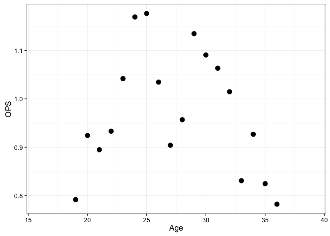
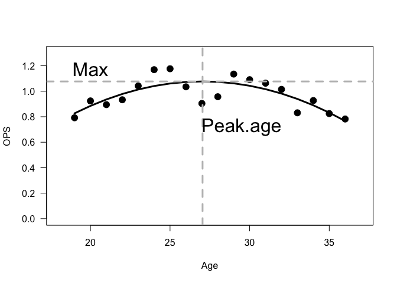
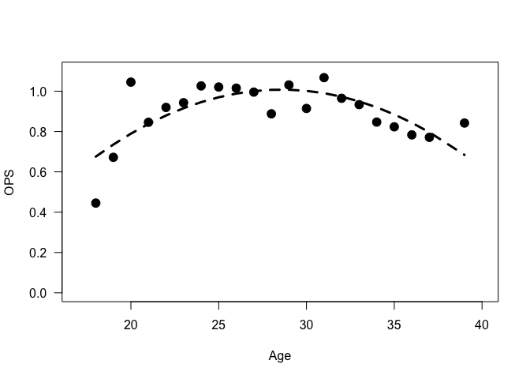

# tidy Baseball Chapter 8
Chris Hamm  
`r format(Sys.Date())`  


## Chapter 8 - *Career trajectories*


```r
library("Lahman")
library("tidyverse"); options(dplyr.width = Inf)
```

```
## Loading tidyverse: ggplot2
## Loading tidyverse: tibble
## Loading tidyverse: tidyr
## Loading tidyverse: readr
## Loading tidyverse: purrr
## Loading tidyverse: dplyr
```

```
## Conflicts with tidy packages ----------------------------------------------
```

```
## filter(): dplyr, stats
## lag():    dplyr, stats
```

```r
set.seed(8761825)
devtools::session_info()
```

```
## Session info --------------------------------------------------------------
```

```
##  setting  value                       
##  version  R version 3.3.2 (2016-10-31)
##  system   x86_64, darwin13.4.0        
##  ui       X11                         
##  language (EN)                        
##  collate  en_US.UTF-8                 
##  tz       America/New_York            
##  date     2016-11-11
```

```
## Packages ------------------------------------------------------------------
```

```
##  package    * version date       source        
##  assertthat   0.1     2013-12-06 CRAN (R 3.3.0)
##  colorspace   1.2-7   2016-10-11 CRAN (R 3.3.0)
##  DBI          0.5-1   2016-09-10 CRAN (R 3.3.0)
##  devtools     1.12.0  2016-06-24 CRAN (R 3.3.0)
##  digest       0.6.10  2016-08-02 CRAN (R 3.3.1)
##  dplyr      * 0.5.0   2016-06-24 CRAN (R 3.3.0)
##  evaluate     0.10    2016-10-11 CRAN (R 3.3.1)
##  ggplot2    * 2.1.0   2016-03-01 CRAN (R 3.3.0)
##  gtable       0.2.0   2016-02-26 CRAN (R 3.3.0)
##  htmltools    0.3.5   2016-03-21 CRAN (R 3.3.0)
##  knitr        1.15    2016-11-09 CRAN (R 3.3.2)
##  Lahman     * 5.0-0   2016-08-27 CRAN (R 3.3.0)
##  magrittr     1.5     2014-11-22 CRAN (R 3.3.0)
##  memoise      1.0.0   2016-01-29 CRAN (R 3.3.0)
##  munsell      0.4.3   2016-02-13 CRAN (R 3.3.0)
##  plyr         1.8.4   2016-06-08 CRAN (R 3.3.0)
##  purrr      * 0.2.2   2016-06-18 CRAN (R 3.3.0)
##  R6           2.2.0   2016-10-05 CRAN (R 3.3.1)
##  Rcpp         0.12.7  2016-09-05 CRAN (R 3.3.0)
##  readr      * 1.0.0   2016-08-03 CRAN (R 3.3.0)
##  rmarkdown    1.1     2016-10-16 CRAN (R 3.3.1)
##  scales       0.4.1   2016-11-09 CRAN (R 3.3.2)
##  stringi      1.1.2   2016-10-01 CRAN (R 3.3.1)
##  stringr      1.1.0   2016-08-19 CRAN (R 3.3.0)
##  tibble     * 1.2     2016-08-26 CRAN (R 3.3.0)
##  tidyr      * 0.6.0   2016-08-12 CRAN (R 3.3.1)
##  tidyverse  * 1.0.0   2016-09-09 CRAN (R 3.3.0)
##  withr        1.0.2   2016-06-20 CRAN (R 3.3.0)
##  yaml         2.1.13  2014-06-12 CRAN (R 3.3.0)
```

### Section 8.2 - *Mickey Mantel's Batting Trajectory*

```r
# The Batting and Master files are already loaded with the Lahman package. 
head(Batting) # using read.csv here rather than read_csv because it imports triples as X3B rather than 3B, which is not the best
```

```
##    playerID yearID stint teamID lgID  G  AB  R  H X2B X3B HR RBI SB CS BB
## 1 abercda01   1871     1    TRO   NA  1   4  0  0   0   0  0   0  0  0  0
## 2  addybo01   1871     1    RC1   NA 25 118 30 32   6   0  0  13  8  1  4
## 3 allisar01   1871     1    CL1   NA 29 137 28 40   4   5  0  19  3  1  2
## 4 allisdo01   1871     1    WS3   NA 27 133 28 44  10   2  2  27  1  1  0
## 5 ansonca01   1871     1    RC1   NA 25 120 29 39  11   3  0  16  6  2  2
## 6 armstbo01   1871     1    FW1   NA 12  49  9 11   2   1  0   5  0  1  0
##   SO IBB HBP SH SF GIDP
## 1  0  NA  NA NA NA   NA
## 2  0  NA  NA NA NA   NA
## 3  5  NA  NA NA NA   NA
## 4  2  NA  NA NA NA   NA
## 5  1  NA  NA NA NA   NA
## 6  1  NA  NA NA NA   NA
```

```r
# I don't know how to recode variables with dplyr so I will use recode from "car."
Batting$SF <- car::recode(Batting$SF, "NA = 0")
Batting$HBP <- car::recode(Batting$HBP, "NA = 0")
head(Batting)
```

```
##    playerID yearID stint teamID lgID  G  AB  R  H X2B X3B HR RBI SB CS BB
## 1 abercda01   1871     1    TRO   NA  1   4  0  0   0   0  0   0  0  0  0
## 2  addybo01   1871     1    RC1   NA 25 118 30 32   6   0  0  13  8  1  4
## 3 allisar01   1871     1    CL1   NA 29 137 28 40   4   5  0  19  3  1  2
## 4 allisdo01   1871     1    WS3   NA 27 133 28 44  10   2  2  27  1  1  0
## 5 ansonca01   1871     1    RC1   NA 25 120 29 39  11   3  0  16  6  2  2
## 6 armstbo01   1871     1    FW1   NA 12  49  9 11   2   1  0   5  0  1  0
##   SO IBB HBP SH SF GIDP
## 1  0  NA   0 NA  0   NA
## 2  0  NA   0 NA  0   NA
## 3  5  NA   0 NA  0   NA
## 4  2  NA   0 NA  0   NA
## 5  1  NA   0 NA  0   NA
## 6  1  NA   0 NA  0   NA
```

```r
dim(Batting)
```

```
## [1] 101332     22
```

```r
mantle.id <- Master %>% filter(nameFirst == "Mickey" & nameLast == "Mantle") %>% select(playerID)
mantle.id
```

```
##    playerID
## 1 mantlmi01
```

```r
get.birthyear <- function(player.id){
	playerline <- Master %>% 
	  filter(playerID == as.character(player.id))
	birthyear <- playerline$birthYear
	birthmonth <- playerline$birthMonth
	ifelse(birthmonth >= 7, birthyear + 1, birthyear)
}
get.birthyear(mantle.id)
```

```
## [1] 1932
```


#### Note that the book formula for OBP does not include HBP; if you exclude this you will get the incorrect result. The book inculdes hits in the denominator, which I have re-added as well.

```r
get.stats <- function(player.id){
	d <- Batting %>% filter(playerID == as.character(player.id))
	byear <- get.birthyear(as.character(player.id))
	d <- d %>% mutate(Age = yearID - byear, SLG = (((H - X2B - X3B - HR) + (2 * X2B) + (3 * X3B) + (4 * HR)) / AB), OBP = ((H + BB + HBP) / (AB + BB + SF + HBP)), OPS = SLG + OBP)
	return(d)
}
Mantle <- get.stats(mantle.id)
Mantle
```

```
##     playerID yearID stint teamID lgID   G  AB   R   H X2B X3B HR RBI SB CS
## 1  mantlmi01   1951     1    NYA   AL  96 341  61  91  11   5 13  65  8  7
## 2  mantlmi01   1952     1    NYA   AL 142 549  94 171  37   7 23  87  4  1
## 3  mantlmi01   1953     1    NYA   AL 127 461 105 136  24   3 21  92  8  4
## 4  mantlmi01   1954     1    NYA   AL 146 543 129 163  17  12 27 102  5  2
## 5  mantlmi01   1955     1    NYA   AL 147 517 121 158  25  11 37  99  8  1
## 6  mantlmi01   1956     1    NYA   AL 150 533 132 188  22   5 52 130 10  1
## 7  mantlmi01   1957     1    NYA   AL 144 474 121 173  28   6 34  94 16  3
## 8  mantlmi01   1958     1    NYA   AL 150 519 127 158  21   1 42  97 18  3
## 9  mantlmi01   1959     1    NYA   AL 144 541 104 154  23   4 31  75 21  3
## 10 mantlmi01   1960     1    NYA   AL 153 527 119 145  17   6 40  94 14  3
## 11 mantlmi01   1961     1    NYA   AL 153 514 132 163  16   6 54 128 12  1
## 12 mantlmi01   1962     1    NYA   AL 123 377  96 121  15   1 30  89  9  0
## 13 mantlmi01   1963     1    NYA   AL  65 172  40  54   8   0 15  35  2  1
## 14 mantlmi01   1964     1    NYA   AL 143 465  92 141  25   2 35 111  6  3
## 15 mantlmi01   1965     1    NYA   AL 122 361  44  92  12   1 19  46  4  1
## 16 mantlmi01   1966     1    NYA   AL 108 333  40  96  12   1 23  56  1  1
## 17 mantlmi01   1967     1    NYA   AL 144 440  63 108  17   0 22  55  1  1
## 18 mantlmi01   1968     1    NYA   AL 144 435  57 103  14   1 18  54  6  2
##     BB  SO IBB HBP SH SF GIDP Age       SLG       OBP       OPS
## 1   43  74  NA   0  2  0    3  19 0.4428152 0.3489583 0.7917736
## 2   75 111  NA   0  2  0    5  20 0.5300546 0.3942308 0.9242854
## 3   79  90  NA   0  0  0    2  21 0.4967462 0.3981481 0.8948944
## 4  102 107  NA   0  2  4    3  22 0.5248619 0.4083205 0.9331824
## 5  113  97   6   3  2  3    4  23 0.6112186 0.4308176 1.0420362
## 6  112  99   6   2  1  4    4  24 0.7054409 0.4639017 1.1693426
## 7  146  75  23   0  0  3    5  25 0.6645570 0.5120385 1.1765955
## 8  129 120  13   2  2  2   11  26 0.5915222 0.4432515 1.0347737
## 9   93 126   6   2  1  2    7  27 0.5138632 0.3902821 0.9041453
## 10 111 125   6   1  0  5   11  28 0.5578748 0.3990683 0.9569431
## 11 126 112   9   0  1  5    2  29 0.6867704 0.4480620 1.1348324
## 12 122  78   9   1  0  2    4  30 0.6047745 0.4860558 1.0908303
## 13  40  32   4   0  0  1    5  31 0.6220930 0.4413146 1.0634076
## 14  99 102  18   0  0  3    9  32 0.5913978 0.4232804 1.0146783
## 15  73  76   7   0  0  1   11  33 0.4515235 0.3793103 0.8308339
## 16  57  76   5   0  0  3    9  34 0.5375375 0.3893130 0.9268505
## 17 107 113   7   1  0  5    9  35 0.4340909 0.3905967 0.8246877
## 18 106  97   7   1  1  4    9  36 0.3977011 0.3846154 0.7823165
```

### Figure 8.1

```r
ggplot(Mantle, aes(x = Age, y = OPS)) + 
	theme_bw() + 
	geom_point(size = 3) +
	xlim(16, 39)
```

<div class="figure" style="text-align: center">

<p class="caption">Scatterplot of OPS against age for Mickey Mantle.</p>
</div>

Create a smooth curve of the quadratic:
$A + B(Age − 30) + C(Age − 30)^2$ where $A$, $B$, and $C$ are constants:

  1. The constant $A$ is predicted by the value of OPS when the player reaches 30 years of age. 
  1. The function reaches its highest value at
    $PEAK.AGE = 30 - \frac{B}{2C}$. This value is estiamted to be the player's peak batting performance. 
  1. The maximum value of the curve is: $Max = A - \frac{B^2}{4C}$. This is the estimate of the largest OPS of the player over his career. 
  1. The $C$ coefficient explains the curve of the quadratic function and usually takes a negative value. "Large" values represent stronger curves (rapid rise and delcline). We'll use the "lm" function to fit the quadratic curve formula: $OPS \sim I(Age - 30) + I((Age - 30)^2)$


```r
fit.model <- function(d){
	fit <- lm(OPS ~ I(Age - 30) + I((Age - 30)^2), data = d)
	b <- coef(fit)
	Age.max <- 30 - b[2] / b[3] / 2
	Max <- b[1] - b[2]^2 / b[3] / 4
	list(fit = fit, Age.max = Age.max, Max = Max)
}

F2 <- fit.model(Mantle)
F2
```

```
## $fit
## 
## Call:
## lm(formula = OPS ~ I(Age - 30) + I((Age - 30)^2), data = d)
## 
## Coefficients:
##     (Intercept)      I(Age - 30)  I((Age - 30)^2)  
##        1.043134        -0.022883        -0.003869  
## 
## 
## $Age.max
## I(Age - 30) 
##    27.04271 
## 
## $Max
## (Intercept) 
##     1.07697
```

```r
summary(F2$fit)
```

```
## 
## Call:
## lm(formula = OPS ~ I(Age - 30) + I((Age - 30)^2), data = d)
## 
## Residuals:
##      Min       1Q   Median       3Q      Max 
## -0.17282 -0.04010  0.02203  0.04507  0.12819 
## 
## Coefficients:
##                   Estimate Std. Error t value Pr(>|t|)    
## (Intercept)      1.0431342  0.0279009  37.387 3.19e-16 ***
## I(Age - 30)     -0.0228830  0.0056381  -4.059 0.001029 ** 
## I((Age - 30)^2) -0.0038689  0.0008283  -4.671 0.000302 ***
## ---
## Signif. codes:  0 '***' 0.001 '**' 0.01 '*' 0.05 '.' 0.1 ' ' 1
## 
## Residual standard error: 0.08421 on 15 degrees of freedom
## Multiple R-squared:  0.6018,	Adjusted R-squared:  0.5488 
## F-statistic: 11.34 on 2 and 15 DF,  p-value: 0.001001
```
This makes the model: 


```r
# I don't know how to add a function line in ggplot, so base R it is.
plot(x = Mantle$Age, y = Mantle$OPS, pch = 19, las = 1, , cex =1.5, ylab = "OPS", xlab = "Age", xlim = c(18, 37), ylim = c(0, 1.3))
lines(Mantle$Age, predict(F2$fit, Age = Mantle$Age), lwd = 3)
abline(v = F2$Age.max, lwd = 3, lty = 2, col = "grey")
abline(h = F2$Max, lwd = 3, lty = 2, col = "grey")
text(29.5, .72, "Peak.age" , cex = 2)
text(20, 1.175, "Max", cex = 2)
```

<div class="figure" style="text-align: center">

<p class="caption">Scatterplot of OPS against age for Mickey Mantle with a quadratic fit added. // The location of the peak age and the maximum OPS fit are displayed.</p>
</div>

### In honor of A-Rod retiring this season.

```r
Arod.id <- Master %>% filter(nameFirst == "Alex" & nameLast == "Rodriguez") %>% select(playerID)
get.birthyear(Arod.id)
```

```
## [1] 1976
```

```r
Arod <- get.stats(Arod.id) #only through 2015
A2 <- fit.model(Arod)
A2 # Arod peaked at 28 for OPS but stayed OK
```

```
## $fit
## 
## Call:
## lm(formula = OPS ~ I(Age - 30) + I((Age - 30)^2), data = d)
## 
## Coefficients:
##     (Intercept)      I(Age - 30)  I((Age - 30)^2)  
##        1.001657        -0.008514        -0.002974  
## 
## 
## $Age.max
## I(Age - 30) 
##    28.56881 
## 
## $Max
## (Intercept) 
##    1.007749
```

```r
# ggplot(Arod, aes(x = Age, y = OPS)) + theme_bw() + geom_point(size = 2) 
plot(x = Arod$Age, y = Arod$OPS, las = 1, pch = 19, cex =1.5, ylab = "OPS", xlab = "Age", xlim = c(17, 40), ylim = c(0, 1.1))
lines(Arod$Age, predict(A2$fit, Age = Arod$Age), lwd = 3, lty = 2)
```


