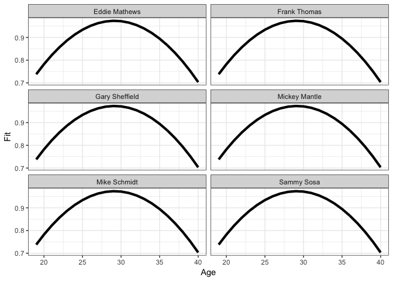
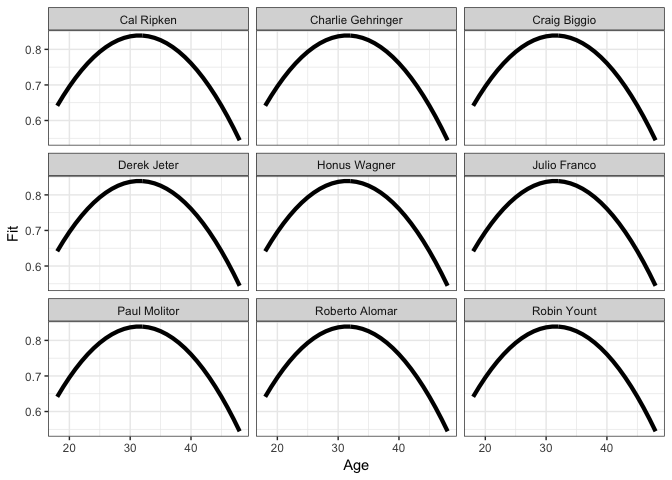

# tidy Baseball Chapter 8
Chris Hamm  
`r format(Sys.Date())`  


## Chapter 8 - *Career trajectories*


```r
library("Lahman")
library("tidyverse"); options(dplyr.width = Inf)
```

```
## Loading tidyverse: ggplot2
## Loading tidyverse: tibble
## Loading tidyverse: tidyr
## Loading tidyverse: readr
## Loading tidyverse: purrr
## Loading tidyverse: dplyr
```

```
## Conflicts with tidy packages ----------------------------------------------
```

```
## filter(): dplyr, stats
## lag():    dplyr, stats
```

```r
set.seed(8761825)
devtools::session_info()
```

```
## Session info -------------------------------------------------------------
```

```
##  setting  value                       
##  version  R version 3.4.1 (2017-06-30)
##  system   x86_64, darwin15.6.0        
##  ui       X11                         
##  language (EN)                        
##  collate  en_US.UTF-8                 
##  tz       America/Los_Angeles         
##  date     2017-08-14
```

```
## Packages -----------------------------------------------------------------
```

```
##  package    * version date       source        
##  assertthat   0.2.0   2017-04-11 CRAN (R 3.4.0)
##  backports    1.1.0   2017-05-22 CRAN (R 3.4.0)
##  base       * 3.4.1   2017-07-07 local         
##  bindr        0.1     2016-11-13 CRAN (R 3.4.0)
##  bindrcpp     0.2     2017-06-17 CRAN (R 3.4.0)
##  broom        0.4.2   2017-02-13 CRAN (R 3.4.0)
##  cellranger   1.1.0   2016-07-27 CRAN (R 3.4.0)
##  colorspace   1.3-2   2016-12-14 CRAN (R 3.4.0)
##  compiler     3.4.1   2017-07-07 local         
##  datasets   * 3.4.1   2017-07-07 local         
##  devtools     1.13.3  2017-08-02 CRAN (R 3.4.1)
##  digest       0.6.12  2017-01-27 CRAN (R 3.4.0)
##  dplyr      * 0.7.2   2017-07-20 CRAN (R 3.4.1)
##  evaluate     0.10.1  2017-06-24 CRAN (R 3.4.1)
##  forcats      0.2.0   2017-01-23 CRAN (R 3.4.0)
##  foreign      0.8-69  2017-06-22 CRAN (R 3.4.1)
##  ggplot2    * 2.2.1   2016-12-30 CRAN (R 3.4.0)
##  glue         1.1.1   2017-06-21 CRAN (R 3.4.1)
##  graphics   * 3.4.1   2017-07-07 local         
##  grDevices  * 3.4.1   2017-07-07 local         
##  grid         3.4.1   2017-07-07 local         
##  gtable       0.2.0   2016-02-26 CRAN (R 3.4.0)
##  haven        1.1.0   2017-07-09 CRAN (R 3.4.1)
##  hms          0.3     2016-11-22 CRAN (R 3.4.0)
##  htmltools    0.3.6   2017-04-28 CRAN (R 3.4.0)
##  httr         1.2.1   2016-07-03 CRAN (R 3.4.0)
##  jsonlite     1.5     2017-06-01 CRAN (R 3.4.0)
##  knitr        1.17    2017-08-10 CRAN (R 3.4.1)
##  Lahman     * 5.0-0   2016-08-27 CRAN (R 3.4.0)
##  lattice      0.20-35 2017-03-25 CRAN (R 3.4.1)
##  lazyeval     0.2.0   2016-06-12 CRAN (R 3.4.0)
##  lubridate    1.6.0   2016-09-13 CRAN (R 3.4.0)
##  magrittr     1.5     2014-11-22 CRAN (R 3.4.0)
##  memoise      1.1.0   2017-04-21 CRAN (R 3.4.0)
##  methods    * 3.4.1   2017-07-07 local         
##  mnormt       1.5-5   2016-10-15 CRAN (R 3.4.0)
##  modelr       0.1.1   2017-07-24 CRAN (R 3.4.1)
##  munsell      0.4.3   2016-02-13 CRAN (R 3.4.0)
##  nlme         3.1-131 2017-02-06 CRAN (R 3.4.1)
##  parallel     3.4.1   2017-07-07 local         
##  pkgconfig    2.0.1   2017-03-21 CRAN (R 3.4.0)
##  plyr         1.8.4   2016-06-08 CRAN (R 3.4.0)
##  psych        1.7.5   2017-05-03 CRAN (R 3.4.1)
##  purrr      * 0.2.3   2017-08-02 CRAN (R 3.4.1)
##  R6           2.2.2   2017-06-17 CRAN (R 3.4.0)
##  Rcpp         0.12.12 2017-07-15 CRAN (R 3.4.1)
##  readr      * 1.1.1   2017-05-16 CRAN (R 3.4.0)
##  readxl       1.0.0   2017-04-18 CRAN (R 3.4.0)
##  reshape2     1.4.2   2016-10-22 CRAN (R 3.4.0)
##  rlang        0.1.2   2017-08-09 CRAN (R 3.4.1)
##  rmarkdown    1.6     2017-06-15 CRAN (R 3.4.0)
##  rprojroot    1.2     2017-01-16 CRAN (R 3.4.0)
##  rvest        0.3.2   2016-06-17 CRAN (R 3.4.0)
##  scales       0.4.1   2016-11-09 CRAN (R 3.4.0)
##  stats      * 3.4.1   2017-07-07 local         
##  stringi      1.1.5   2017-04-07 CRAN (R 3.4.0)
##  stringr      1.2.0   2017-02-18 CRAN (R 3.4.0)
##  tibble     * 1.3.3   2017-05-28 CRAN (R 3.4.0)
##  tidyr      * 0.6.3   2017-05-15 CRAN (R 3.4.0)
##  tidyverse  * 1.1.1   2017-01-27 CRAN (R 3.4.0)
##  tools        3.4.1   2017-07-07 local         
##  utils      * 3.4.1   2017-07-07 local         
##  withr        2.0.0   2017-07-28 CRAN (R 3.4.1)
##  xml2         1.1.1   2017-01-24 CRAN (R 3.4.0)
##  yaml         2.1.14  2016-11-12 CRAN (R 3.4.0)
```

### Section 8.2 - *Mickey Mantel's Batting Trajectory*

```r
# The Batting and Master files are already loaded with the Lahman package. 
head(Batting) # using read.csv here rather than read_csv because it imports triples as X3B rather than 3B, which is not the best
```

```
##    playerID yearID stint teamID lgID  G  AB  R  H X2B X3B HR RBI SB CS BB
## 1 abercda01   1871     1    TRO   NA  1   4  0  0   0   0  0   0  0  0  0
## 2  addybo01   1871     1    RC1   NA 25 118 30 32   6   0  0  13  8  1  4
## 3 allisar01   1871     1    CL1   NA 29 137 28 40   4   5  0  19  3  1  2
## 4 allisdo01   1871     1    WS3   NA 27 133 28 44  10   2  2  27  1  1  0
## 5 ansonca01   1871     1    RC1   NA 25 120 29 39  11   3  0  16  6  2  2
## 6 armstbo01   1871     1    FW1   NA 12  49  9 11   2   1  0   5  0  1  0
##   SO IBB HBP SH SF GIDP
## 1  0  NA  NA NA NA   NA
## 2  0  NA  NA NA NA   NA
## 3  5  NA  NA NA NA   NA
## 4  2  NA  NA NA NA   NA
## 5  1  NA  NA NA NA   NA
## 6  1  NA  NA NA NA   NA
```

```r
# I don't know how to recode variables with dplyr so I will use recode from "car."
Batting$SF <- car::recode(Batting$SF, "NA = 0")
Batting$HBP <- car::recode(Batting$HBP, "NA = 0")
head(Batting)
```

```
##    playerID yearID stint teamID lgID  G  AB  R  H X2B X3B HR RBI SB CS BB
## 1 abercda01   1871     1    TRO   NA  1   4  0  0   0   0  0   0  0  0  0
## 2  addybo01   1871     1    RC1   NA 25 118 30 32   6   0  0  13  8  1  4
## 3 allisar01   1871     1    CL1   NA 29 137 28 40   4   5  0  19  3  1  2
## 4 allisdo01   1871     1    WS3   NA 27 133 28 44  10   2  2  27  1  1  0
## 5 ansonca01   1871     1    RC1   NA 25 120 29 39  11   3  0  16  6  2  2
## 6 armstbo01   1871     1    FW1   NA 12  49  9 11   2   1  0   5  0  1  0
##   SO IBB HBP SH SF GIDP
## 1  0  NA   0 NA  0   NA
## 2  0  NA   0 NA  0   NA
## 3  5  NA   0 NA  0   NA
## 4  2  NA   0 NA  0   NA
## 5  1  NA   0 NA  0   NA
## 6  1  NA   0 NA  0   NA
```

```r
dim(Batting)
```

```
## [1] 101332     22
```

```r
mantle.id <- Master %>% filter(nameFirst == "Mickey" & nameLast == "Mantle") %>% select(playerID)
mantle.id
```

```
##    playerID
## 1 mantlmi01
```

```r
get.birthyear <- function(player.id){
	playerline <- Master %>% 
	  filter(playerID == as.character(player.id))
	birthyear <- playerline$birthYear
	birthmonth <- playerline$birthMonth
	ifelse(birthmonth >= 7, birthyear + 1, birthyear)
}
get.birthyear(mantle.id)
```

```
## [1] 1932
```


#### Note that the book formula for OBP does not include HBP; if you exclude this you will get the incorrect result. The book inculdes hits in the denominator, which I have re-added as well.

```r
get.stats <- function(player.id){
	d <- Batting %>% filter(playerID == as.character(player.id))
	byear <- get.birthyear(as.character(player.id))
	d <- d %>% mutate(Age = yearID - byear, 
	             SLG = (((H - X2B - X3B - HR) + (2 * X2B) + (3 * X3B) + (4 * HR)) / AB), 
	             OBP = ((H + BB + HBP) / (AB + BB + SF + HBP)), 
	             OPS = SLG + OBP)
	return(d)
}
Mantle <- get.stats(mantle.id)
Mantle
```

```
##     playerID yearID stint teamID lgID   G  AB   R   H X2B X3B HR RBI SB CS
## 1  mantlmi01   1951     1    NYA   AL  96 341  61  91  11   5 13  65  8  7
## 2  mantlmi01   1952     1    NYA   AL 142 549  94 171  37   7 23  87  4  1
## 3  mantlmi01   1953     1    NYA   AL 127 461 105 136  24   3 21  92  8  4
## 4  mantlmi01   1954     1    NYA   AL 146 543 129 163  17  12 27 102  5  2
## 5  mantlmi01   1955     1    NYA   AL 147 517 121 158  25  11 37  99  8  1
## 6  mantlmi01   1956     1    NYA   AL 150 533 132 188  22   5 52 130 10  1
## 7  mantlmi01   1957     1    NYA   AL 144 474 121 173  28   6 34  94 16  3
## 8  mantlmi01   1958     1    NYA   AL 150 519 127 158  21   1 42  97 18  3
## 9  mantlmi01   1959     1    NYA   AL 144 541 104 154  23   4 31  75 21  3
## 10 mantlmi01   1960     1    NYA   AL 153 527 119 145  17   6 40  94 14  3
## 11 mantlmi01   1961     1    NYA   AL 153 514 132 163  16   6 54 128 12  1
## 12 mantlmi01   1962     1    NYA   AL 123 377  96 121  15   1 30  89  9  0
## 13 mantlmi01   1963     1    NYA   AL  65 172  40  54   8   0 15  35  2  1
## 14 mantlmi01   1964     1    NYA   AL 143 465  92 141  25   2 35 111  6  3
## 15 mantlmi01   1965     1    NYA   AL 122 361  44  92  12   1 19  46  4  1
## 16 mantlmi01   1966     1    NYA   AL 108 333  40  96  12   1 23  56  1  1
## 17 mantlmi01   1967     1    NYA   AL 144 440  63 108  17   0 22  55  1  1
## 18 mantlmi01   1968     1    NYA   AL 144 435  57 103  14   1 18  54  6  2
##     BB  SO IBB HBP SH SF GIDP Age       SLG       OBP       OPS
## 1   43  74  NA   0  2  0    3  19 0.4428152 0.3489583 0.7917736
## 2   75 111  NA   0  2  0    5  20 0.5300546 0.3942308 0.9242854
## 3   79  90  NA   0  0  0    2  21 0.4967462 0.3981481 0.8948944
## 4  102 107  NA   0  2  4    3  22 0.5248619 0.4083205 0.9331824
## 5  113  97   6   3  2  3    4  23 0.6112186 0.4308176 1.0420362
## 6  112  99   6   2  1  4    4  24 0.7054409 0.4639017 1.1693426
## 7  146  75  23   0  0  3    5  25 0.6645570 0.5120385 1.1765955
## 8  129 120  13   2  2  2   11  26 0.5915222 0.4432515 1.0347737
## 9   93 126   6   2  1  2    7  27 0.5138632 0.3902821 0.9041453
## 10 111 125   6   1  0  5   11  28 0.5578748 0.3990683 0.9569431
## 11 126 112   9   0  1  5    2  29 0.6867704 0.4480620 1.1348324
## 12 122  78   9   1  0  2    4  30 0.6047745 0.4860558 1.0908303
## 13  40  32   4   0  0  1    5  31 0.6220930 0.4413146 1.0634076
## 14  99 102  18   0  0  3    9  32 0.5913978 0.4232804 1.0146783
## 15  73  76   7   0  0  1   11  33 0.4515235 0.3793103 0.8308339
## 16  57  76   5   0  0  3    9  34 0.5375375 0.3893130 0.9268505
## 17 107 113   7   1  0  5    9  35 0.4340909 0.3905967 0.8246877
## 18 106  97   7   1  1  4    9  36 0.3977011 0.3846154 0.7823165
```

### Figure 8.1

```r
ggplot(Mantle, aes(x = Age, y = OPS)) + 
	theme_bw() + 
	geom_point(size = 3) +
	xlim(16, 39)
```

<div class="figure" style="text-align: center">

<p class="caption">Scatterplot of OPS against age for Mickey Mantle.</p>
</div>

Create a smooth curve of the quadratic:
$A + B(Age − 30) + C(Age − 30)^2$ where $A$, $B$, and $C$ are constants:

  1. The constant $A$ is predicted by the value of OPS when the player reaches 30 years of age. 
  1. The function reaches its highest value at
    $PEAK.AGE = 30 - \frac{B}{2C}$. This value is estiamted to be the player's peak batting performance. 
  1. The maximum value of the curve is: $Max = A - \frac{B^2}{4C}$. This is the estimate of the largest OPS of the player over his career. 
  1. The $C$ coefficient explains the curve of the quadratic function and usually takes a negative value. "Large" values represent stronger curves (rapid rise and delcline). We'll use the "lm" function to fit the quadratic curve formula: $OPS \sim I(Age - 30) + I((Age - 30)^2)$


```r
fit.model <- function(d){
	fit <- lm(OPS ~ I(Age - 30) + I((Age - 30)^2), data = d)
	b <- coef(fit)
	Age.max <- 30 - b[2] / b[3] / 2
	Max <- b[1] - b[2]^2 / b[3] / 4
	list(fit = fit, Age.max = Age.max, Max = Max)
}

F2 <- fit.model(Mantle)
F2
```

```
## $fit
## 
## Call:
## lm(formula = OPS ~ I(Age - 30) + I((Age - 30)^2), data = d)
## 
## Coefficients:
##     (Intercept)      I(Age - 30)  I((Age - 30)^2)  
##        1.043134        -0.022883        -0.003869  
## 
## 
## $Age.max
## I(Age - 30) 
##    27.04271 
## 
## $Max
## (Intercept) 
##     1.07697
```

```r
summary(F2$fit)
```

```
## 
## Call:
## lm(formula = OPS ~ I(Age - 30) + I((Age - 30)^2), data = d)
## 
## Residuals:
##      Min       1Q   Median       3Q      Max 
## -0.17282 -0.04010  0.02203  0.04507  0.12819 
## 
## Coefficients:
##                   Estimate Std. Error t value Pr(>|t|)    
## (Intercept)      1.0431342  0.0279009  37.387 3.19e-16 ***
## I(Age - 30)     -0.0228830  0.0056381  -4.059 0.001029 ** 
## I((Age - 30)^2) -0.0038689  0.0008283  -4.671 0.000302 ***
## ---
## Signif. codes:  0 '***' 0.001 '**' 0.01 '*' 0.05 '.' 0.1 ' ' 1
## 
## Residual standard error: 0.08421 on 15 degrees of freedom
## Multiple R-squared:  0.6018,	Adjusted R-squared:  0.5488 
## F-statistic: 11.34 on 2 and 15 DF,  p-value: 0.001001
```
This makes the model: 


```r
# I don't know how to add a function line in ggplot, so base R it is.
plot(x = Mantle$Age, y = Mantle$OPS, pch = 19, las = 1, cex = 1.5, ylab = "OPS", xlab = "Age", xlim = c(18, 37), ylim = c(0, 1.3))
lines(Mantle$Age, predict(F2$fit, Age = Mantle$Age), lwd = 3)
abline(v = F2$Age.max, lwd = 3, lty = 2, col = "grey")
abline(h = F2$Max, lwd = 3, lty = 2, col = "grey")
text(29.5, .72, "Peak.age" , cex = 2)
text(20, 1.175, "Max", cex = 2)
```

<div class="figure" style="text-align: center">

<p class="caption">Scatterplot of OPS against age for Mickey Mantle with a quadratic fit added. The location of the peak age and the maximum OPS fit are displayed.</p>
</div>

### In honor of A-Rod retiring this season.

```r
Arod.id <- Master %>% filter(nameFirst == "Alex" & nameLast == "Rodriguez") %>% select(playerID)
get.birthyear(Arod.id)
```

```
## [1] 1976
```

```r
Arod <- get.stats(Arod.id) #only through 2015
A2 <- fit.model(Arod)
A2 # Arod peaked at 28 for OPS but stayed OK
```

```
## $fit
## 
## Call:
## lm(formula = OPS ~ I(Age - 30) + I((Age - 30)^2), data = d)
## 
## Coefficients:
##     (Intercept)      I(Age - 30)  I((Age - 30)^2)  
##        1.001657        -0.008514        -0.002974  
## 
## 
## $Age.max
## I(Age - 30) 
##    28.56881 
## 
## $Max
## (Intercept) 
##    1.007749
```

```r
# ggplot(Arod, aes(x = Age, y = OPS)) + theme_bw() + geom_point(size = 2) 
plot(x = Arod$Age, y = Arod$OPS, las = 1, pch = 19, cex =1.5, ylab = "OPS", xlab = "Age", xlim = c(17, 40), ylim = c(0, 1.1))
lines(Arod$Age, predict(A2$fit, Age = Arod$Age), lwd = 3, lty = 2)
```


### Section 8.3 - *Comparing trajectories*

```r
head(Fielding)
```

```
##    playerID yearID stint teamID lgID POS  G GS InnOuts PO  A  E DP PB WP
## 1 abercda01   1871     1    TRO   NA  SS  1 NA      NA  1  3  2  0 NA NA
## 2  addybo01   1871     1    RC1   NA  2B 22 NA      NA 67 72 42  5 NA NA
## 3  addybo01   1871     1    RC1   NA  SS  3 NA      NA  8 14  7  0 NA NA
## 4 allisar01   1871     1    CL1   NA  2B  2 NA      NA  1  4  0  0 NA NA
## 5 allisar01   1871     1    CL1   NA  OF 29 NA      NA 51  3  7  1 NA NA
## 6 allisdo01   1871     1    WS3   NA   C 27 NA      NA 68 15 20  4  0 NA
##   SB CS ZR
## 1 NA NA NA
## 2 NA NA NA
## 3 NA NA NA
## 4 NA NA NA
## 5 NA NA NA
## 6 NA NA NA
```

```r
dim(Fielding)
```

```
## [1] 170526     18
```

```r
AB.totals <- Batting %>% group_by(playerID) %>%   
  summarize(Career.AB = sum(AB, na.rm = TRUE))
head(AB.totals)
```

```
## # A tibble: 6 x 2
##    playerID Career.AB
##       <chr>     <int>
## 1 aardsda01         4
## 2 aaronha01     12364
## 3 aaronto01       944
## 4  aasedo01         5
## 5  abadan01        21
## 6  abadfe01         8
```

```r
dim(AB.totals)
```

```
## [1] 18659     2
```

```r
Batting <- inner_join(Batting, AB.totals, by = "playerID")
head(Batting) # Adds the Career.AB column by player
```

```
##    playerID yearID stint teamID lgID  G  AB  R  H X2B X3B HR RBI SB CS BB
## 1 abercda01   1871     1    TRO   NA  1   4  0  0   0   0  0   0  0  0  0
## 2  addybo01   1871     1    RC1   NA 25 118 30 32   6   0  0  13  8  1  4
## 3 allisar01   1871     1    CL1   NA 29 137 28 40   4   5  0  19  3  1  2
## 4 allisdo01   1871     1    WS3   NA 27 133 28 44  10   2  2  27  1  1  0
## 5 ansonca01   1871     1    RC1   NA 25 120 29 39  11   3  0  16  6  2  2
## 6 armstbo01   1871     1    FW1   NA 12  49  9 11   2   1  0   5  0  1  0
##   SO IBB HBP SH SF GIDP Career.AB
## 1  0  NA   0 NA  0   NA         4
## 2  0  NA   0 NA  0   NA      1231
## 3  5  NA   0 NA  0   NA       740
## 4  2  NA   0 NA  0   NA      1407
## 5  1  NA   0 NA  0   NA     10277
## 6  1  NA   0 NA  0   NA        49
```

```r
dim(Batting)
```

```
## [1] 101332     23
```

```r
Batting.2000 <- Batting %>% filter(Career.AB >= 2000)
head(Batting.2000)
```

```
##    playerID yearID stint teamID lgID  G  AB  R  H X2B X3B HR RBI SB CS BB
## 1 ansonca01   1871     1    RC1   NA 25 120 29 39  11   3  0  16  6  2  2
## 2 barnero01   1871     1    BS1   NA 31 157 66 63  10   9  0  34 11  6 13
## 3 careyto01   1871     1    FW1   NA 19  87 16 20   2   0  0  10  5  0  2
## 4 cuthbne01   1871     1    PH1   NA 28 150 47 37   7   5  3  30 16  2 10
## 5 eggleda01   1871     1    NY2   NA 33 147 37 47   7   3  0  18 14  3  4
## 6 fergubo01   1871     1    NY2   NA 33 158 30 38   6   1  0  25  4  4  3
##   SO IBB HBP SH SF GIDP Career.AB
## 1  1  NA   0 NA  0   NA     10277
## 2  1  NA   0 NA  0   NA      2392
## 3  1  NA   0 NA  0   NA      2394
## 4  2  NA   0 NA  0   NA      2113
## 5  3  NA   0 NA  0   NA      2546
## 6  2  NA   0 NA  0   NA      3468
```

```r
dim(Batting.2000)
```

```
## [1] 31751    23
```

```r
find.position <- function(p){
	positions <- c("OF", "1B", "2B", "SS", "3B", "C", "P", "DH")
	d <- Fielding %>% filter(playerID == p)
	count.games <- function(po)
		sum(subset(d, POS == po)$G)
	FLD <- sapply(positions, count.games)
	positions[FLD == max(FLD)][1]
}


PLAYER <- as.character(unique(Batting.2000$playerID))
length(PLAYER)
```

```
## [1] 2375
```

```r
head(PLAYER)
```

```
## [1] "ansonca01" "barnero01" "careyto01" "cuthbne01" "eggleda01" "fergubo01"
```

```r
POSITIONS <- map_chr(.x = PLAYER, .f = find.position)
length(POSITIONS)
```

```
## [1] 2375
```

```r
head(POSITIONS)
```

```
## [1] "1B" "2B" "SS" "OF" "OF" "3B"
```

```r
Fielding.2000 <- as_data_frame(x = list(playerID = PLAYER, POS = POSITIONS))
head(Fielding.2000)
```

```
## # A tibble: 6 x 2
##    playerID   POS
##       <chr> <chr>
## 1 ansonca01    1B
## 2 barnero01    2B
## 3 careyto01    SS
## 4 cuthbne01    OF
## 5 eggleda01    OF
## 6 fergubo01    3B
```

```r
dim(Fielding.2000)
```

```
## [1] 2375    2
```

```r
Batting.2000 <- inner_join(Batting.2000, Fielding.2000, by = "playerID")
head(Batting.2000)
```

```
##    playerID yearID stint teamID lgID  G  AB  R  H X2B X3B HR RBI SB CS BB
## 1 ansonca01   1871     1    RC1   NA 25 120 29 39  11   3  0  16  6  2  2
## 2 barnero01   1871     1    BS1   NA 31 157 66 63  10   9  0  34 11  6 13
## 3 careyto01   1871     1    FW1   NA 19  87 16 20   2   0  0  10  5  0  2
## 4 cuthbne01   1871     1    PH1   NA 28 150 47 37   7   5  3  30 16  2 10
## 5 eggleda01   1871     1    NY2   NA 33 147 37 47   7   3  0  18 14  3  4
## 6 fergubo01   1871     1    NY2   NA 33 158 30 38   6   1  0  25  4  4  3
##   SO IBB HBP SH SF GIDP Career.AB POS
## 1  1  NA   0 NA  0   NA     10277  1B
## 2  1  NA   0 NA  0   NA      2392  2B
## 3  1  NA   0 NA  0   NA      2394  SS
## 4  2  NA   0 NA  0   NA      2113  OF
## 5  3  NA   0 NA  0   NA      2546  OF
## 6  2  NA   0 NA  0   NA      3468  3B
```

```r
dim(Batting.2000)
```

```
## [1] 31751    24
```

#### Calculating career statistics

```r
C.totals <- Batting.2000 %>% group_by(playerID) %>% summarize(
	C.G = sum(G, na.rm = TRUE), 
	C.AB = sum(AB, na.rm = TRUE), 
	C.R = sum(R, na.rm = TRUE), 
	C.H = sum(H, na.rm = TRUE), 
	C.2B = sum(X2B, na.rm = TRUE), 
	C.3B = sum(X3B, na.rm = TRUE), 
	C.HR = sum(HR, na.rm = TRUE), 
	C.RBI = sum(RBI, na.rm = TRUE), 
	C.BB = sum(BB, na.rm = TRUE), 
	C.SO = sum(SO, na.rm = TRUE), 
	C.SB = sum(SB, na.rm = TRUE)) %>% 
  mutate(C.AVG = (C.H / C.AB), 	C.SLG = (((C.H - C.2B - C.3B - C.HR) + (2 * C.2B) + (3 * C.3B) + (4 * C.HR)) / C.AB))
head(C.totals)
```

```
## # A tibble: 6 x 14
##    playerID   C.G  C.AB   C.R   C.H  C.2B  C.3B  C.HR C.RBI  C.BB  C.SO  C.SB     C.AVG     C.SLG
##       <chr> <int> <int> <int> <int> <int> <int> <int> <int> <int> <int> <int>     <dbl>     <dbl>
## 1 aaronha01  3298 12364  2174  3771   624    98   755  2297  1402  1383   240 0.3049984 0.5545131
## 2 abbated01   855  3044   355   772    99    43    11   324   289    16   142 0.2536137 0.3252300
## 3 abbotku01   702  2044   273   523   109    23    62   242   133   571    22 0.2558708 0.4227006
## 4 abreubo01  2425  8480  1453  2470   574    59   288  1363  1476  1840   400 0.2912736 0.4747642
## 5 ackledu01   607  2064   255   503    94    18    46   212   186   410    31 0.2437016 0.3735465
## 6 adairje01  1165  4019   378  1022   163    19    57   366   208   499    29 0.2542921 0.3468525
```

```r
C.totals <- inner_join(C.totals, Fielding.2000, by = "playerID")
head(C.totals) 
```

```
## # A tibble: 6 x 15
##    playerID   C.G  C.AB   C.R   C.H  C.2B  C.3B  C.HR C.RBI  C.BB  C.SO  C.SB     C.AVG     C.SLG   POS
##       <chr> <int> <int> <int> <int> <int> <int> <int> <int> <int> <int> <int>     <dbl>     <dbl> <chr>
## 1 aaronha01  3298 12364  2174  3771   624    98   755  2297  1402  1383   240 0.3049984 0.5545131    OF
## 2 abbated01   855  3044   355   772    99    43    11   324   289    16   142 0.2536137 0.3252300    2B
## 3 abbotku01   702  2044   273   523   109    23    62   242   133   571    22 0.2558708 0.4227006    SS
## 4 abreubo01  2425  8480  1453  2470   574    59   288  1363  1476  1840   400 0.2912736 0.4747642    OF
## 5 ackledu01   607  2064   255   503    94    18    46   212   186   410    31 0.2437016 0.3735465    2B
## 6 adairje01  1165  4019   378  1022   163    19    57   366   208   499    29 0.2542921 0.3468525    2B
```

```r
C.totals$Value.POS <- with(C.totals,
	ifelse(POS == "C", 240,
	ifelse(POS == "SS", 168,
	ifelse(POS == "2B", 132,
	ifelse(POS == "3B", 84,
	ifelse(POS == "OF", 48,
	ifelse(POS == "1B", 12, 0)))))))
head(C.totals)
```

```
## # A tibble: 6 x 16
##    playerID   C.G  C.AB   C.R   C.H  C.2B  C.3B  C.HR C.RBI  C.BB  C.SO  C.SB     C.AVG     C.SLG   POS Value.POS
##       <chr> <int> <int> <int> <int> <int> <int> <int> <int> <int> <int> <int>     <dbl>     <dbl> <chr>     <dbl>
## 1 aaronha01  3298 12364  2174  3771   624    98   755  2297  1402  1383   240 0.3049984 0.5545131    OF        48
## 2 abbated01   855  3044   355   772    99    43    11   324   289    16   142 0.2536137 0.3252300    2B       132
## 3 abbotku01   702  2044   273   523   109    23    62   242   133   571    22 0.2558708 0.4227006    SS       168
## 4 abreubo01  2425  8480  1453  2470   574    59   288  1363  1476  1840   400 0.2912736 0.4747642    OF        48
## 5 ackledu01   607  2064   255   503    94    18    46   212   186   410    31 0.2437016 0.3735465    2B       132
## 6 adairje01  1165  4019   378  1022   163    19    57   366   208   499    29 0.2542921 0.3468525    2B       132
```

#### Computing similarity scores

```r
similar <- function(p, number){
	P <- C.totals %>% filter(playerID == p)
	C.totals$SS <- with(C.totals,
	1000 -
	floor(abs(C.G - P$C.G) / 20) -
	floor(abs(C.AB - P$C.AB) / 75) -
	floor(abs(C.R - P$C.R) / 10) -
	floor(abs(C.H - P$C.H) / 15) -
	floor(abs(C.2B - P$C.2B) / 5) -
	floor(abs(C.3B - P$C.3B) / 4) -
	floor(abs(C.HR - P$C.HR) / 2) -
	floor(abs(C.RBI - P$C.RBI) / 10) -
	floor(abs(C.BB - P$C.BB) / 25) -
	floor(abs(C.SO - P$C.SO) / 150) -
	floor(abs(C.SB - P$C.SB) / 20) -
	floor(abs(C.AVG - P$C.AVG) / 0.001) -
	floor(abs(C.SLG - P$C.SLG) / 0.002) -
	abs(Value.POS - P$Value.POS))
C.totals <- C.totals[order(C.totals$SS, decreasing = TRUE), ]
C.totals[1:number, ]
}
similar(as.character(mantle.id), 6) # This is nice and all but I bet that hierarchical cluster analysis could do a great job at this. 
```

```
## # A tibble: 6 x 17
##    playerID   C.G  C.AB   C.R   C.H  C.2B  C.3B  C.HR C.RBI  C.BB  C.SO  C.SB     C.AVG     C.SLG   POS Value.POS    SS
##       <chr> <int> <int> <int> <int> <int> <int> <int> <int> <int> <int> <int>     <dbl>     <dbl> <chr>     <dbl> <dbl>
## 1 mantlmi01  2401  8102  1677  2415   344    72   536  1509  1733  1710   153 0.2980745 0.5567761    OF        48  1000
## 2 thomafr04  2322  8199  1494  2468   495    12   521  1704  1667  1397    32 0.3010123 0.5549457    1B        12   856
## 3 matheed01  2391  8537  1509  2315   354    72   512  1453  1444  1487    68 0.2711725 0.5094295    3B        84   853
## 4 schmimi01  2404  8352  1506  2234   408    59   548  1595  1507  1883   174 0.2674808 0.5272989    3B        84   848
## 5 sheffga01  2576  9217  1636  2689   467    27   509  1676  1475  1171   253 0.2917435 0.5139416    OF        48   847
## 6  sosasa01  2354  8813  1475  2408   379    45   609  1667   929  2306   234 0.2732327 0.5337569    OF        48   831
```

#### Defining age, OBP, SLG, and OPS variables

```r
collapse.stint <- function(d){
	d %>% group_by(playerID, yearID) %>% summarize(G = sum(G), AB = sum(AB), R = sum(R), H = sum(H), X2B = sum(X2B), X3B = sum(X3B), HR = sum(HR), RBI = sum(RBI), SB = sum(SB), CS = sum(CS), BB = sum(BB), SH = sum(SH), SF = sum(SF), HBP = sum(HBP), SLG = (((H - X2B - X3B - HR) + (2 * X2B) + (3 * X3B) + 4 * HR) / AB), OBP = ((H + BB + HBP) / (AB + BB + HBP + SF)), OPS = SLG + OBP, Career.AB = Career.AB[1], POS = POS[1]) # This is the correct OBP formula. Earlier it is incorrect.
} 
Batting.2000 <- Batting.2000 %>%
  group_by(playerID, yearID) %>%
  collapse.stint
head(Batting.2000)
```

```
## # A tibble: 6 x 21
## # Groups:   playerID [1]
##    playerID yearID     G    AB     R     H   X2B   X3B    HR   RBI    SB    CS    BB    SH    SF   HBP       SLG       OBP       OPS Career.AB   POS
##       <chr>  <int> <int> <int> <int> <int> <int> <int> <int> <int> <int> <int> <int> <int> <dbl> <dbl>     <dbl>     <dbl>     <dbl>     <int> <chr>
## 1 aaronha01   1954   122   468    58   131    27     6    13    69     2     2    28     6     4     3 0.4465812 0.3220676 0.7686488     12364    OF
## 2 aaronha01   1955   153   602   105   189    37     9    27   106     3     1    49     7     4     3 0.5398671 0.3662614 0.9061285     12364    OF
## 3 aaronha01   1956   153   609   106   200    34    14    26    92     2     4    37     5     7     2 0.5582923 0.3648855 0.9231778     12364    OF
## 4 aaronha01   1957   151   615   118   198    27     6    44   132     1     1    57     0     3     0 0.6000000 0.3777778 0.9777778     12364    OF
## 5 aaronha01   1958   153   601   109   196    34     4    30    95     4     1    59     0     3     1 0.5457571 0.3855422 0.9312992     12364    OF
## 6 aaronha01   1959   154   629   116   223    46     7    39   123     8     0    51     0     9     4 0.6359300 0.4011544 1.0370844     12364    OF
```

```r
dim(Batting.2000)
```

```
## [1] 29422    21
```

```r
player.list <- as.character(unique(Batting.2000$playerID))

birthyears <- map_dbl(.x = player.list, .f = get.birthyear)

#birthyears <- sapply(player.list, get.birthyear)
#setequal(birthyears, birthyears2)

# Batting.2000b <- merge(Batting.2000a, data.frame(playerID = player.list, Birthyear = birthyears))

Batting.2000 <- inner_join(Batting.2000, as_data_frame(x = list(playerID = player.list, Birthyear = birthyears)), by = "playerID")

# setequal(Batting.2000b, Batting.2000c)
  
Batting.2000 <- Batting.2000 %>%
  mutate(Age = yearID - Birthyear)
  
# Batting.2000a$Age <- with(Batting.2000a, yearID - Birthyear)
# Batting.2000a[complete.cases(Batting.2000a$Age), ]
# head(Batting.2000a)

Batting.2000[complete.cases(Batting.2000$Age), ]
```

```
## # A tibble: 29,401 x 23
## # Groups:   playerID [2,373]
##     playerID yearID     G    AB     R     H   X2B   X3B    HR   RBI    SB    CS    BB    SH    SF   HBP       SLG       OBP       OPS Career.AB   POS Birthyear   Age
##        <chr>  <int> <int> <int> <int> <int> <int> <int> <int> <int> <int> <int> <int> <int> <dbl> <dbl>     <dbl>     <dbl>     <dbl>     <int> <chr>     <dbl> <dbl>
##  1 aaronha01   1954   122   468    58   131    27     6    13    69     2     2    28     6     4     3 0.4465812 0.3220676 0.7686488     12364    OF      1934    20
##  2 aaronha01   1955   153   602   105   189    37     9    27   106     3     1    49     7     4     3 0.5398671 0.3662614 0.9061285     12364    OF      1934    21
##  3 aaronha01   1956   153   609   106   200    34    14    26    92     2     4    37     5     7     2 0.5582923 0.3648855 0.9231778     12364    OF      1934    22
##  4 aaronha01   1957   151   615   118   198    27     6    44   132     1     1    57     0     3     0 0.6000000 0.3777778 0.9777778     12364    OF      1934    23
##  5 aaronha01   1958   153   601   109   196    34     4    30    95     4     1    59     0     3     1 0.5457571 0.3855422 0.9312992     12364    OF      1934    24
##  6 aaronha01   1959   154   629   116   223    46     7    39   123     8     0    51     0     9     4 0.6359300 0.4011544 1.0370844     12364    OF      1934    25
##  7 aaronha01   1960   153   590   102   172    20    11    40   126    16     7    60     0    12     2 0.5661017 0.3524096 0.9185113     12364    OF      1934    26
##  8 aaronha01   1961   155   603   115   197    39    10    34   120    21     9    56     1     9     2 0.5936982 0.3805970 0.9742952     12364    OF      1934    27
##  9 aaronha01   1962   156   592   127   191    28     6    45   128    15     7    66     0     6     3 0.6182432 0.3898051 1.0080483     12364    OF      1934    28
## 10 aaronha01   1963   161   631   121   201    29     4    44   130    31     5    78     0     5     0 0.5863708 0.3907563 0.9771271     12364    OF      1934    29
## # ... with 29,391 more rows
```

#### Fitting and plotting trajectories

```r
fit.trajectory <- function(d){
  fit <- lm(OPS ~ I(Age - 30) + I((Age - 30)^2), data = d)
  data.frame(Age = d$Age, Fit = predict(fit, Age = d$Age))
}

plot.trajectories <- function(first, last, n.similar, ncol){
  
get.name <- function(playerid){
  d1 <- subset(Master, playerID == playerid)
  with(d1, paste(nameFirst, nameLast))
}

player.id <- subset(Master, nameFirst == first & nameLast == last)$playerID

# pid <- Master %>%
#   group_by(playerID) %>%
#   select(playerID)
# unique(pid)
# 
# player.id <- as.character(pid)

player.list <- as.character(similar(player.id, n.similar)$playerID)

Batting.new <- subset(Batting.2000, playerID %in% player.list)

F2 <- Batting.new %>%
  group_by(playerID) %>%
  fit.trajectory # note here the book calls for a function "plot.traj"
F2a <- merge(F2, data.frame(playerID = player.list, Name = sapply(as.character(player.list), get.name)))
print(ggplot(F2a, aes(x = Age, y = Fit)) +
  theme_bw() + 
  geom_line(size = 1.5) +
  facet_wrap(~ Name, ncol = ncol)) 
# return(Batting.new)
}

plot.trajectories("Mickey", "Mantle", n.similar = 6, ncol = 2)
```



```r
plot.trajectories("Derek", "Jeter", n.similar = 9, ncol = 3)
```




